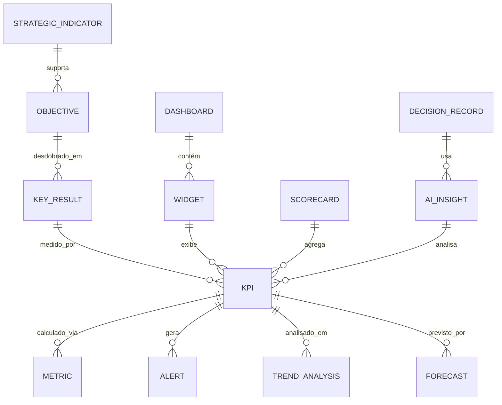

# MÓDULO 29 — PLATAFORMA CORPORATIVA DE BUSINESS INTELLIGENCE, ANALYTICS, EXECUTIVE INTELLIGENCE, ENTERPRISE PERFORMANCE MANAGEMENT (EPM), OKRs, KPIs E APOIO À DECISÃO
## AURA INTELLIGENCE PLATFORM — PROMPT 44
### Plataforma Integrada Aura · Instituto Ser Melhor (ISMCL)
**Papel Assumido**: Chief Analytics Officer (CAO) · Chief Data Officer (CDO) · Chief Executive Officer (CEO) · Chief Financial Officer (CFO) · Chief Strategy Officer (CSO) · Chief Artificial Intelligence Officer (CAIO) · Chief Enterprise Architect · Principal BI Architect · Principal Analytics Architect · Especialista em BI, EPM, CPM, Balanced Scorecard, OKRs, KPIs, Decision Intelligence, Predictive Analytics, Prescriptive Analytics, Data Warehouse, DAMA-DMBOK2, DDD, CQRS, Clean Architecture

---

## SUMÁRIO EXECUTIVO

O **Módulo 29 — Aura Intelligence Platform** é o **Cockpit Estratégico da Plataforma Aura**: o sistema que transforma os dados operacionais de todos os 28 módulos em **inteligência corporativa integrada, auditável e explicável** para suporte à tomada de decisão em todos os níveis da organização — do operacional ao Conselho Institucional.

Este módulo estabelece o **Enterprise Intelligence Framework** completo: um **Enterprise Data Warehouse Lakehouse** que consolida 299 tabelas de 28 schemas, um **Semantic Layer corporativo** baseado em dbt que garante que todos os indicadores sejam calculados com definição única, um **Executive Cockpit** com 10 perspectivas executivas integradas (Financeiro, Clínico, Social, Operacional, IA, Segurança, Projetos, Recursos, Tecnologia e Sustentabilidade), e uma **AI Insight Engine** que gera narrativas analíticas automaticamente e detecta riscos estratégicos antes que se tornem problemas.

**Princípio Fundador**: *"Nenhuma decisão estratégica deverá depender exclusivamente de informações isoladas ou não auditadas. Todo indicador possuirá definição única, responsável, linhagem e validade certificada."*

---

## ETAPA 1 — MAPA CORPORATIVO DE INFORMAÇÕES ESTRATÉGICAS (PROMPTS 00 A 43)

### 1.1 Inventário de Indicadores por Perspectiva — Balanced Scorecard (BSC)

| Perspectiva BSC | Módulos Fonte | KPIs Mapeados | Frequência |
|---|---|---|---|
| **💰 Financeiro** | 11 · 10 · 23 | 48 KPIs | Diário / Mensal |
| **👥 Clientes / Cidadãos** | 02 · 03 · 04 · 05 · 06 · 09 | 72 KPIs | Tempo Real / Diário |
| **⚙️ Processos Internos** | 13 · 14 · 17 · 18 · 19 · 28 | 68 KPIs | Tempo Real / Diário |
| **🎓 Aprendizado e Crescimento** | 20 · 21 · 26 | 24 KPIs | Mensal |
| **🏥 Clínico e Saúde** | 04 · 05 · 06 · 07 | 52 KPIs | Tempo Real / Diário |
| **👁️ Governança e Riscos** | 12 · 16 · 24 · 27 | 38 KPIs | Diário / Semanal |
| **🤖 IA e Dados** | 15 · 25 · 26 | 18 KPIs | Tempo Real / Diário |
| **♻️ Sustentabilidade Social** | 08 · 22 | 16 KPIs | Mensal / Trimestral |
| **🌐 Ecossistema** | 23 | 14 KPIs | Diário |
| **💡 Estratégico** | Consolidado (OKRs) | 28 OKRs/KRs | Mensal / Trimestral |
| **TOTAL** | **28 Módulos** | **378 Indicadores** | — |

### 1.2 Hierarquia Analítica — 4 Camadas de Analytics

| Camada | Tipo | Pergunta Respondida | Tecnologia |
|---|---|---|---|
| **Descritiva** | O que aconteceu? | Dashboards históricos + relatórios | DW + dbt + PostgreSQL |
| **Diagnóstica** | Por que aconteceu? | Drill-down + análise de causas + Process Mining | TimescaleDB + Apache ECharts |
| **Preditiva** | O que vai acontecer? | Forecasts de KPIs, previsão de risco | ARIMA / Prophet / XGBoost |
| **Prescritiva** | O que devo fazer? | Recomendações de ação da IA | AIOS Módulo 26 + RAG |

---

## ETAPA 2 — ARQUITETURA CORPORATIVA DA AURA INTELLIGENCE PLATFORM

### 2.1 Visão Geral — Enterprise Analytics Stack

```
┌─────────────────────────────────────────────────────────────────────────┐
│  FONTES DE DADOS — 28 Schemas PostgreSQL 16 + APIs + Event Streams      │
└──────────────────────────────┬──────────────────────────────────────────┘
                               │ ETL/ELT via dbt + CDC Debezium + Kafka
┌──────────────────────────────▼──────────────────────────────────────────┐
│  ENTERPRISE DATA WAREHOUSE LAKEHOUSE (schema `aura_dw`)                  │
│  Modelos dbt: Staging → Intermediate → Marts → Semantic Layer           │
│  Particionamento por período · Compressão TimescaleDB · Retenção 7 anos │
└──────────────────────────────┬──────────────────────────────────────────┘
                               │
┌──────────────────────────────▼──────────────────────────────────────────┐
│  AURA INTELLIGENCE PLATFORM — `apps/ms-intelligence`                    │
│  ┌─────────────────────┐  ┌─────────────────────────────────────────┐  │
│  │  KPI ENGINE         │  │  OKR ENGINE                             │  │
│  │  378 KPIs · Alertas │  │  4 Níveis Hierárquicos · OKR-KR-KPI   │  │
│  └──────────┬──────────┘  └─────────────────────────────────────────┘  │
│  ┌──────────▼──────────┐  ┌─────────────────────────────────────────┐  │
│  │  AI INSIGHT ENGINE  │  │  FORECAST ENGINE                        │  │
│  │  Auto-Narrative     │  │  ARIMA · Prophet · XGBoost             │  │
│  │  Anomaly Detection  │  │  Cenários: Otimista/Base/Pessimista    │  │
│  └──────────┬──────────┘  └─────────────────────────────────────────┘  │
│  ┌──────────▼──────────┐  ┌─────────────────────────────────────────┐  │
│  │  EXECUTIVE COCKPIT  │  │  SELF-SERVICE BI                        │  │
│  │  10 Visões Exec.    │  │  Dashboard Builder · ABAC por perfil   │  │
│  │  Decision Records   │  │  Data Storytelling Studio               │  │
│  └─────────────────────┘  └─────────────────────────────────────────┘  │
└─────────────────────────────────────────────────────────────────────────┘
```

---

## ETAPA 3 — MODELAGEM COMPLETA DO DOMÍNIO (DDD TACTICAL DESIGN)

### 3.1 Diagrama ER Conceitual



### 3.2 Entidades do Domínio (22 Entidades Completas)

#### 3.2.1 `Objective`, `KeyResult` & `KPI` — OKR + EPM Aggregate Roots

```
Objective {
  id: UUID [PK]
  objectiveCode: String UNIQUE NOT NULL          -- OBJ-INST-2025-001
  name: String NOT NULL                          -- "Expandir o impacto social em 30% em 2025"
  level: OkrLevelEnum NOT NULL                   -- INSTITUTIONAL, STRATEGIC, OPERATIONAL, INDIVIDUAL
  ownerUserId: UUID NOT NULL FK auth.users
  teamDept: String NOT NULL                      -- "Diretoria Executiva"
  periodStart: Date NOT NULL                     -- 2025-01-01
  periodEnd: Date NOT NULL                       -- 2025-12-31
  progressPercent: Decimal(5,2) NOT NULL DEFAULT 0.00
  status: OkrStatusEnum                          -- ON_TRACK, AT_RISK, BEHIND, ACHIEVED
  parentObjectiveId: UUID? FK objectives         -- Alinhamento hierárquico
  createdAt: Timestamp NOT NULL DEFAULT CURRENT_TIMESTAMP
}

KeyResult {
  id: UUID [PK]
  krCode: String UNIQUE NOT NULL                 -- KR-INST-2025-001-01
  objectiveId: UUID NOT NULL FK objectives
  name: String NOT NULL                          -- "Atender 15.000 beneficiários únicos"
  startValue: Decimal(15,4) NOT NULL DEFAULT 0
  targetValue: Decimal(15,4) NOT NULL
  currentValue: Decimal(15,4) NOT NULL DEFAULT 0
  unit: String NOT NULL                          -- "beneficiários", "%", "R$", "horas"
  progressPercent: Decimal(5,2) NOT NULL DEFAULT 0.00
  linkedKpiId: UUID? FK kpis                     -- KPI que alimenta automaticamente este KR
  updatedAt: Timestamp NOT NULL DEFAULT CURRENT_TIMESTAMP
}

KPI {
  id: UUID [PK]
  kpiCode: String UNIQUE NOT NULL                -- KPI-SOCIAL-BENEF-ATENDIDOS-001
  name: String NOT NULL                          -- "Beneficiários Atendidos Únicos"
  perspective: BscPerspectiveEnum NOT NULL        -- FINANCIAL, CLIENT, PROCESS, LEARNING,
                                                 -- CLINICAL, GOVERNANCE, AI_DATA, SUSTAINABILITY
  ownerUserId: UUID NOT NULL FK auth.users
  formula: TEXT NOT NULL                         -- "COUNT(DISTINCT beneficiary_id) FROM aura_care.episodes WHERE..."
  unit: String NOT NULL                          -- "beneficiários"
  targetValue: Decimal(15,4) NOT NULL
  warningThreshold: Decimal(15,4) NOT NULL       -- Valor de alerta (ex: 80% da meta)
  criticalThreshold: Decimal(15,4) NOT NULL      -- Valor crítico (ex: 60% da meta)
  frequency: FrequencyEnum NOT NULL              -- REALTIME, DAILY, WEEKLY, MONTHLY, QUARTERLY
  sourceDataAssetId: UUID NOT NULL FK aura_data_platform.data_assets -- Linhagem EDP Módulo 25
  isActive: Boolean NOT NULL DEFAULT TRUE
  createdAt: Timestamp NOT NULL DEFAULT CURRENT_TIMESTAMP
}
```

#### 3.2.2 `Dashboard`, `Widget` & `AIInsight` — BI Entities

```
Dashboard {
  id: UUID [PK]
  dashboardCode: String UNIQUE NOT NULL          -- DASH-EXEC-COCKPIT-INSTITUCIONAL-001
  name: String NOT NULL                          -- "Executive Cockpit — Visão Institucional"
  category: DashboardCategoryEnum                -- EXECUTIVE, OPERATIONAL, FINANCIAL, CLINICAL,
                                                 -- AI, SECURITY, GOVERNANCE, SUSTAINABILITY
  ownerUserId: UUID NOT NULL FK auth.users
  accessRoles: String[] NOT NULL                 -- RBAC: ["board", "ceo", "cfo"]
  refreshIntervalMinutes: Int NOT NULL DEFAULT 60
  version: String NOT NULL DEFAULT "1.0.0"
  configJson: JSONB NOT NULL                     -- Layout, widgets, filtros padrão
  isPublic: Boolean NOT NULL DEFAULT FALSE       -- Publicado no portal de transparência?
  createdAt: Timestamp NOT NULL DEFAULT CURRENT_TIMESTAMP
}

Widget {
  id: UUID [PK]
  widgetCode: String UNIQUE NOT NULL             -- WGT-KPI-BENEF-ATENDIDOS-GAUGE-001
  dashboardId: UUID NOT NULL FK dashboards
  widgetType: WidgetTypeEnum                     -- KPI_CARD, LINE_CHART, BAR_CHART, DONUT,
                                                 -- HEATMAP, TABLE, MAP, GAUGE, SCATTER, TREEMAP
  kpiId: UUID FK kpis
  title: String NOT NULL
  layoutJson: JSONB NOT NULL                     -- Posição e tamanho na grid (12 colunas)
  configJson: JSONB NOT NULL                     -- Cores, séries, eixos, filtros
  drilldownEnabled: Boolean NOT NULL DEFAULT TRUE
}

AIInsight {
  id: UUID [PK]
  insightCode: String UNIQUE NOT NULL            -- AI-INS-2025-0189
  kpiId: UUID FK kpis
  objectiveId: UUID? FK objectives
  insightType: InsightTypeEnum                   -- ANOMALY, TREND, RISK, RECOMMENDATION, NARRATIVE
  titleText: String NOT NULL
  bodyText: TEXT NOT NULL                        -- Narrativa gerada pela IA
  impactLevel: ImpactEnum                        -- HIGH, MEDIUM, LOW
  confidenceScore: Decimal(3,2) NOT NULL
  evidenceJson: JSONB NOT NULL                   -- Dados usados para gerar o insight
  recommendedActions: JSONB                      -- Lista de ações prescritivas
  generatedAt: Timestamp NOT NULL DEFAULT CURRENT_TIMESTAMP
  expiresAt: Timestamp NOT NULL
}
```

#### 3.2.3 `Forecast`, `Benchmark` & `DecisionRecord` — Strategic Intelligence Entities

```
Forecast {
  id: UUID [PK]
  forecastCode: String UNIQUE NOT NULL           -- FCT-KPI-BENEF-Q4-2025-001
  kpiId: UUID NOT NULL FK kpis
  modelType: ForecastModelEnum                   -- ARIMA, PROPHET, XGBOOST, LSTM, ENSEMBLE
  forecastPeriodStart: Date NOT NULL
  forecastPeriodEnd: Date NOT NULL
  scenarios: JSONB NOT NULL                      -- {optimistic, base, pessimistic} com valores
  confidenceIntervalLower: Decimal(15,4)?
  confidenceIntervalUpper: Decimal(15,4)?
  mape: Decimal(5,2)?                            -- Mean Absolute Percentage Error
  rmse: Decimal(15,4)?                           -- Root Mean Square Error
  generatedAt: Timestamp NOT NULL DEFAULT CURRENT_TIMESTAMP
}

Benchmark {
  id: UUID [PK]
  benchmarkCode: String UNIQUE NOT NULL          -- BENCH-SAUDE-ATEND-2025-001
  kpiId: UUID NOT NULL FK kpis
  benchmarkType: BenchmarkTypeEnum               -- INTERNAL_HISTORICAL, SECTOR, REGULATORY, CUSTOM
  referenceValue: Decimal(15,4) NOT NULL
  referenceLabel: String NOT NULL                -- "Média Setor ONG Saúde 2024", "Meta SUS"
  sourceText: String NOT NULL                    -- Fonte do benchmark
  validFrom: Date NOT NULL
  validUntil: Date?
}

DecisionRecord {
  id: UUID [PK]
  decisionCode: String UNIQUE NOT NULL           -- DEC-EXEC-2025-0034
  decisionTitle: String NOT NULL
  context: TEXT NOT NULL                         -- Contexto que motivou a decisão
  options: JSONB NOT NULL                        -- Opções consideradas
  decision: TEXT NOT NULL                        -- Decisão tomada
  rationale: TEXT NOT NULL                       -- Justificativa
  kpisImpacted: UUID[]                           -- KPIs impactados
  aiInsightIds: UUID[]                           -- Insights de IA usados
  decidedByUserId: UUID NOT NULL FK auth.users
  decidedAt: Timestamp NOT NULL DEFAULT CURRENT_TIMESTAMP
}
```

---

## ETAPA 4 — BANCO DE DADOS (POSTGRESQL 16 + TIMESCALEDB — SCHEMA `aura_intelligence`)

```sql
-- =========================================================================
-- AURA INTELLIGENCE PLATFORM — SCHEMA aura_intelligence
-- PostgreSQL 16 + TimescaleDB para séries temporais de KPIs
-- dbt como Transformation Layer (Staging → Marts → Semantic Layer)
-- =========================================================================

CREATE SCHEMA IF NOT EXISTS aura_intelligence;

-- ENUMERAÇÕES
CREATE TYPE aura_intelligence.bsc_perspective AS ENUM (
  'FINANCIAL', 'CLIENT', 'PROCESS', 'LEARNING',
  'CLINICAL', 'GOVERNANCE', 'AI_DATA', 'SUSTAINABILITY', 'ECOSYSTEM', 'STRATEGIC'
);
CREATE TYPE aura_intelligence.okr_level AS ENUM (
  'INSTITUTIONAL', 'STRATEGIC', 'OPERATIONAL', 'INDIVIDUAL'
);
CREATE TYPE aura_intelligence.forecast_model AS ENUM (
  'ARIMA', 'PROPHET', 'XGBOOST', 'LSTM', 'ENSEMBLE'
);

-- ─────────────────────────────────────────────────────────────────────────
-- TABELAS OKR (4 Níveis Hierárquicos)
-- ─────────────────────────────────────────────────────────────────────────
CREATE TABLE aura_intelligence.objectives (
  id                  UUID PRIMARY KEY DEFAULT gen_random_uuid(),
  objective_code      VARCHAR(50) UNIQUE NOT NULL,
  name                VARCHAR(255) NOT NULL,
  level               aura_intelligence.okr_level NOT NULL,
  owner_user_id       UUID NOT NULL REFERENCES auth.users(id),
  team_dept           VARCHAR(100) NOT NULL,
  period_start        DATE NOT NULL,
  period_end          DATE NOT NULL,
  progress_percent    DECIMAL(5,2) NOT NULL DEFAULT 0.00,
  status              VARCHAR(20) NOT NULL DEFAULT 'ON_TRACK',
  parent_objective_id UUID REFERENCES aura_intelligence.objectives(id),
  created_at          TIMESTAMPTZ NOT NULL DEFAULT CURRENT_TIMESTAMP
);

CREATE TABLE aura_intelligence.key_results (
  id                UUID PRIMARY KEY DEFAULT gen_random_uuid(),
  kr_code           VARCHAR(50) UNIQUE NOT NULL,
  objective_id      UUID NOT NULL REFERENCES aura_intelligence.objectives(id),
  name              VARCHAR(255) NOT NULL,
  start_value       DECIMAL(15,4) NOT NULL DEFAULT 0,
  target_value      DECIMAL(15,4) NOT NULL,
  current_value     DECIMAL(15,4) NOT NULL DEFAULT 0,
  unit              VARCHAR(50) NOT NULL,
  progress_percent  DECIMAL(5,2) NOT NULL DEFAULT 0.00,
  linked_kpi_id     UUID,  -- FK para kpis (criado abaixo)
  updated_at        TIMESTAMPTZ NOT NULL DEFAULT CURRENT_TIMESTAMP
);

-- ─────────────────────────────────────────────────────────────────────────
-- TABELA: aura_intelligence.kpis (Catálogo de 378 Indicadores)
-- ─────────────────────────────────────────────────────────────────────────
CREATE TABLE aura_intelligence.kpis (
  id                    UUID PRIMARY KEY DEFAULT gen_random_uuid(),
  kpi_code              VARCHAR(100) UNIQUE NOT NULL,
  name                  VARCHAR(255) NOT NULL,
  perspective           aura_intelligence.bsc_perspective NOT NULL,
  owner_user_id         UUID NOT NULL REFERENCES auth.users(id),
  formula               TEXT NOT NULL,
  unit                  VARCHAR(50) NOT NULL,
  target_value          DECIMAL(15,4) NOT NULL,
  warning_threshold     DECIMAL(15,4) NOT NULL,
  critical_threshold    DECIMAL(15,4) NOT NULL,
  frequency             VARCHAR(20) NOT NULL DEFAULT 'DAILY',
  source_data_asset_id  UUID NOT NULL,  -- FK aura_data_platform.data_assets (Módulo 25)
  is_active             BOOLEAN NOT NULL DEFAULT TRUE,
  created_at            TIMESTAMPTZ NOT NULL DEFAULT CURRENT_TIMESTAMP
);

-- FK circular para key_results.linked_kpi_id
ALTER TABLE aura_intelligence.key_results
  ADD CONSTRAINT fk_kr_kpi FOREIGN KEY (linked_kpi_id) REFERENCES aura_intelligence.kpis(id);

-- ─────────────────────────────────────────────────────────────────────────
-- TABELA: aura_intelligence.kpi_snapshots (TimescaleDB — Séries Temporais)
-- Armazena o valor histórico de cada KPI para análise de tendência
-- ─────────────────────────────────────────────────────────────────────────
CREATE TABLE aura_intelligence.kpi_snapshots (
  time         TIMESTAMPTZ NOT NULL,
  kpi_id       UUID NOT NULL REFERENCES aura_intelligence.kpis(id),
  value        DECIMAL(15,4) NOT NULL,
  target_value DECIMAL(15,4) NOT NULL,
  status       VARCHAR(20) NOT NULL,    -- ON_TARGET, WARNING, CRITICAL
  dimension    JSONB                    -- Drill-down dimensions: {"region": "SP", "unit": "CAPS-01"}
);
SELECT create_hypertable('aura_intelligence.kpi_snapshots', 'time');
CREATE INDEX idx_kpi_snapshots ON aura_intelligence.kpi_snapshots (kpi_id, time DESC);

-- Compressão automática para dados com mais de 7 dias (economiza 80% de espaço)
SELECT add_compression_policy('aura_intelligence.kpi_snapshots', INTERVAL '7 days');

-- ─────────────────────────────────────────────────────────────────────────
-- TABELAS: dashboards, widgets
-- ─────────────────────────────────────────────────────────────────────────
CREATE TABLE aura_intelligence.dashboards (
  id                       UUID PRIMARY KEY DEFAULT gen_random_uuid(),
  dashboard_code           VARCHAR(100) UNIQUE NOT NULL,
  name                     VARCHAR(255) NOT NULL,
  category                 VARCHAR(30) NOT NULL,
  owner_user_id            UUID NOT NULL REFERENCES auth.users(id),
  access_roles             TEXT[] NOT NULL,
  refresh_interval_minutes INT NOT NULL DEFAULT 60,
  version                  VARCHAR(20) NOT NULL DEFAULT '1.0.0',
  config_json              JSONB NOT NULL,
  is_public                BOOLEAN NOT NULL DEFAULT FALSE,
  created_at               TIMESTAMPTZ NOT NULL DEFAULT CURRENT_TIMESTAMP
);

CREATE TABLE aura_intelligence.widgets (
  id             UUID PRIMARY KEY DEFAULT gen_random_uuid(),
  widget_code    VARCHAR(100) UNIQUE NOT NULL,
  dashboard_id   UUID NOT NULL REFERENCES aura_intelligence.dashboards(id) ON DELETE CASCADE,
  widget_type    VARCHAR(30) NOT NULL,
  kpi_id         UUID REFERENCES aura_intelligence.kpis(id),
  title          VARCHAR(255) NOT NULL,
  layout_json    JSONB NOT NULL,
  config_json    JSONB NOT NULL,
  drilldown_enabled BOOLEAN NOT NULL DEFAULT TRUE
);

-- ─────────────────────────────────────────────────────────────────────────
-- TABELAS: ai_insights, forecasts, benchmarks, decision_records
-- ─────────────────────────────────────────────────────────────────────────
CREATE TABLE aura_intelligence.ai_insights (
  id                   UUID PRIMARY KEY DEFAULT gen_random_uuid(),
  insight_code         VARCHAR(50) UNIQUE NOT NULL,
  kpi_id               UUID REFERENCES aura_intelligence.kpis(id),
  objective_id         UUID REFERENCES aura_intelligence.objectives(id),
  insight_type         VARCHAR(20) NOT NULL,
  title_text           VARCHAR(255) NOT NULL,
  body_text            TEXT NOT NULL,
  impact_level         VARCHAR(20) NOT NULL,
  confidence_score     DECIMAL(3,2) NOT NULL,
  evidence_json        JSONB NOT NULL,
  recommended_actions  JSONB,
  generated_at         TIMESTAMPTZ NOT NULL DEFAULT CURRENT_TIMESTAMP,
  expires_at           TIMESTAMPTZ NOT NULL
);

CREATE TABLE aura_intelligence.forecasts (
  id                        UUID PRIMARY KEY DEFAULT gen_random_uuid(),
  forecast_code             VARCHAR(50) UNIQUE NOT NULL,
  kpi_id                    UUID NOT NULL REFERENCES aura_intelligence.kpis(id),
  model_type                aura_intelligence.forecast_model NOT NULL,
  forecast_period_start     DATE NOT NULL,
  forecast_period_end       DATE NOT NULL,
  scenarios                 JSONB NOT NULL,
  confidence_interval_lower DECIMAL(15,4),
  confidence_interval_upper DECIMAL(15,4),
  mape                      DECIMAL(5,2),
  rmse                      DECIMAL(15,4),
  generated_at              TIMESTAMPTZ NOT NULL DEFAULT CURRENT_TIMESTAMP
);

CREATE TABLE aura_intelligence.benchmarks (
  id               UUID PRIMARY KEY DEFAULT gen_random_uuid(),
  benchmark_code   VARCHAR(50) UNIQUE NOT NULL,
  kpi_id           UUID NOT NULL REFERENCES aura_intelligence.kpis(id),
  benchmark_type   VARCHAR(30) NOT NULL,
  reference_value  DECIMAL(15,4) NOT NULL,
  reference_label  VARCHAR(255) NOT NULL,
  source_text      VARCHAR(500) NOT NULL,
  valid_from       DATE NOT NULL,
  valid_until      DATE
);

CREATE TABLE aura_intelligence.decision_records (
  id                  UUID PRIMARY KEY DEFAULT gen_random_uuid(),
  decision_code       VARCHAR(50) UNIQUE NOT NULL,
  decision_title      VARCHAR(255) NOT NULL,
  context             TEXT NOT NULL,
  options             JSONB NOT NULL,
  decision            TEXT NOT NULL,
  rationale           TEXT NOT NULL,
  kpis_impacted       UUID[],
  ai_insight_ids      UUID[],
  decided_by_user_id  UUID NOT NULL REFERENCES auth.users(id),
  decided_at          TIMESTAMPTZ NOT NULL DEFAULT CURRENT_TIMESTAMP
);

-- ─────────────────────────────────────────────────────────────────────────
-- TABELA: aura_intelligence.analytics_audits (Imutável)
-- ─────────────────────────────────────────────────────────────────────────
CREATE TABLE aura_intelligence.analytics_audits (
  id          UUID PRIMARY KEY DEFAULT gen_random_uuid(),
  kpi_id      UUID REFERENCES aura_intelligence.kpis(id),
  dashboard_id UUID REFERENCES aura_intelligence.dashboards(id),
  action      VARCHAR(100) NOT NULL,
  actor_id    UUID REFERENCES auth.users(id),
  actor_role  VARCHAR(100),
  details     TEXT NOT NULL,
  metadata    JSONB,
  occurred_at TIMESTAMPTZ NOT NULL DEFAULT CURRENT_TIMESTAMP
);
REVOKE UPDATE, DELETE ON aura_intelligence.analytics_audits FROM PUBLIC;
REVOKE UPDATE, DELETE ON aura_intelligence.analytics_audits FROM aura_app_role;

-- ÍNDICES DE PERFORMANCE
CREATE INDEX idx_kpis_perspective ON aura_intelligence.kpis (perspective, is_active);
CREATE INDEX idx_objectives_level ON aura_intelligence.objectives (level, status, period_end);
CREATE INDEX idx_key_results_obj ON aura_intelligence.key_results (objective_id);
CREATE INDEX idx_ai_insights_type ON aura_intelligence.ai_insights (insight_type, impact_level, generated_at DESC);
CREATE INDEX idx_forecasts_kpi ON aura_intelligence.forecasts (kpi_id, generated_at DESC);
```

---

## ETAPA 5 — CATÁLOGO CORPORATIVO DE KPIs (378 INDICADORES — AMOSTRA REPRESENTATIVA)

### 5.1 KPIs Críticos por Perspectiva BSC

#### Perspectiva 💰 FINANCEIRA (48 KPIs)
| Código | KPI | Fórmula | Meta | Fonte |
|---|---|---|---|---|
| `KPI-FIN-RECEITA-001` | Receita Total Mensal | SUM(entradas) - SUM(saídas) | R$ 1.2M/mês | `aura_finance` |
| `KPI-FIN-CUSTO-ATEND` | Custo por Atendimento | Total Custos / Total Atendimentos | R$ 42,00 | `aura_finance` + `aura_care` |
| `KPI-FIN-RECURSOS-CAP` | % Recursos Captados | Captado / Meta_Captação × 100 | ≥ 95% | `aura_finance` |
| `KPI-FIN-INADIMP` | Inadimplência de Convênios | Recebíveis Vencidos / Recebíveis Totais | ≤ 3% | `aura_finance` |

#### Perspectiva 👥 CLIENTES / CIDADÃOS (72 KPIs)
| Código | KPI | Fórmula | Meta | Fonte |
|---|---|---|---|---|
| `KPI-SOC-BENEF-ATEND` | Beneficiários Únicos Atendidos | COUNT(DISTINCT beneficiary_id) | 15.000/mês | `aura_care` |
| `KPI-SOC-IDV-MEDIO` | IDV Score Médio da Base | AVG(idv_score) | ≤ 45 (melhora) | `aura_satai` |
| `KPI-SOC-SATISF-NPS` | NPS Beneficiários | Promotores% - Detratores% | ≥ +70 | `aura_crm` |
| `KPI-SOC-ENCAM-24H` | Encaminhamentos em 24h | Count(SLA≤24h) / Count(Total) | ≥ 90% | `aura_care` |

#### Perspectiva 🏥 CLÍNICA (52 KPIs)
| Código | KPI | Fórmula | Meta | Fonte |
|---|---|---|---|---|
| `KPI-CLI-CONSULT-DIA` | Consultas por Dia | COUNT(consultations) / working_days | ≥ 120/dia | `aura_peu` |
| `KPI-CLI-TELEMEDICINA` | % Atendimentos Telecare | Telecare_consult / Total_consult | ≥ 35% | `aura_telecare` |
| `KPI-CLI-PRESCRIC` | Prescrições Digitais ICP | Prescricoes_ICP / Prescricoes_Total | 100% | `aura_docs` |
| `KPI-CLI-HAL-IA` | HalScore dos Agentes Clínicos | AVG(hallucination_score) FILTER(clinical) | ≤ 5% | `aura_aios` |

---

## ETAPA 6 — OKR FRAMEWORK — 4 NÍVEIS HIERÁRQUICOS

### 6.1 OKR Institucional 2025 — Exemplo Completo

```
NÍVEL INSTITUCIONAL
Objetivo: "Ser referência nacional em inovação social com IA até 2025"
  │
  ├── Key Result 1: Atender 180.000 beneficiários únicos em 2025
  │   └── KPI: KPI-SOC-BENEF-ATEND (automático, mensal)
  │
  ├── Key Result 2: IDV Score médio da base reduzir de 62 para 45
  │   └── KPI: KPI-SOC-IDV-MEDIO (automático, mensal)
  │
  └── Key Result 3: NPS ≥ +70 em todos os serviços
      └── KPI: KPI-SOC-SATISF-NPS (automático, mensal)

NÍVEL ESTRATÉGICO (desdobrado do Institucional)
  └── Objetivo Clínico: "Digitalizar 100% do atendimento clínico até Dezembro/2025"
        ├── KR 1: 100% de prescrições com assinatura digital ICP-Brasil
        │   └── KPI: KPI-CLI-PRESCRIC
        └── KR 2: ≥ 35% de atendimentos via Telecare
            └── KPI: KPI-CLI-TELEMEDICINA

NÍVEL OPERACIONAL (desdobrado do Estratégico)
  └── Objetivo PEU: "Zero prontuário em papel até Junho/2025"
        └── KR 1: 0 novas fichas de papel registradas após 01/04/2025
            └── KPI: KPI-CLI-PAPEL-ZERO
```

---

## ETAPA 7 — OPENAPI 3.0 — 22 ENDPOINTS (`/api/v1/intelligence`)

| Método | Endpoint | Descrição | Roles / Acesso |
|---|---|---|---|
| `GET` | `/kpis` | Catálogo de KPIs por perspectiva BSC | authenticated_user |
| `GET` | `/kpis/:code/current` | **Valor atual + status + tendência** | kpi_viewer |
| `GET` | `/kpis/:code/history` | Histórico de valores (TimescaleDB) | analyst, manager |
| `POST` | `/kpis` | Criar novo KPI corporativo | cao, cdo |
| `GET` | `/objectives` | Listar OKRs por nível hierárquico | authenticated_user |
| `POST` | `/objectives` | Criar novo objetivo (OKR) | cao, strategy_team |
| `PUT` | `/key-results/:id/update` | **Atualizar valor atual de um Key Result** | kr_owner |
| `GET` | `/dashboards` | Listar dashboards por categoria | authenticated_user |
| `POST` | `/dashboards` | Criar novo dashboard (Self-Service BI) | analyst, manager |
| `GET` | `/dashboards/:code/data` | **Dados completos de um dashboard** | dashboard_viewer |
| `GET` | `/executive-cockpit` | **Executive Cockpit — 10 perspectivas integradas** | ceo, board, directors |
| `GET` | `/ai-insights` | Insights gerados pela IA por tipo/impacto | manager, executive |
| `POST` | `/ai-insights/generate` | **Forçar geração de insight de IA para KPI** | cao, caio |
| `GET` | `/forecasts/:kpiCode` | Previsão de KPI (3 cenários: otimista/base/pessimista) | manager, cao |
| `POST` | `/forecasts/run` | **Executar modelo de forecasting** | cao, data_scientist |
| `GET` | `/benchmarks/:kpiCode` | Benchmarks internos e externos de um KPI | manager, cao |
| `GET` | `/alerts/active` | Alertas ativos de KPIs críticos | manager, director |
| `POST` | `/decisions` | **Registrar Decision Record com contexto e evidências** | executive |
| `GET` | `/reports/executive-summary` | **Relatório executivo gerado automaticamente pela IA** | board, ceo |
| `POST` | `/reports/schedule` | Agendar relatório automático | manager, cao |
| `GET` | `/analytics/scorecards` | Scorecards por perspectiva BSC | authenticated_user |
| `GET` | `/audits/analytics-trail` | Trilha imutável de acessos e modificações | cao, auditor |

---

## ETAPA 8 — FRONTEND (`src/features/intelligence/`)

### 8.1 Wireframes Textuais das Interfaces Principais

#### TELA 1: Executive Cockpit (`ExecutiveCockpitPage`)

```
╔══════════════════════════════════════════════════════════════════════════╗
║  📊 AURA INTELLIGENCE PLATFORM · EXECUTIVE COCKPIT                       ║
║  Instituto Ser Melhor  ·  CEO/Diretoria  ·  Julho/2026 · Atualizado: 2h ║
╠══════════════════════════════════════════════════════════════════════════╣
║  [💰 Financeiro] [👥 Social] [🏥 Clínico] [⚙️ Ops] [🤖 IA] [🔐 Seg]  ║
║  [♻️ Social] [🌐 Eco] [👁️ Gov] [💡 OKRs]   ←─ 10 Perspectivas       ║
╠══════════════════════════════════════════════════════════════════════════╣
║  VISÃO INSTITUCIONAL — JULHO 2026                                         ║
║  ┌───────────────────────────────────────────────────────────────────┐  ║
║  │ 🏆 OKR Institucional: "Referência em IA Social 2025"             │  ║
║  │ Progresso: ████████████░░ 87.3% ON TRACK 🟢                      │  ║
║  │                                                                   │  ║
║  │ 👥 Beneficiários/mês: 14.280 / Meta: 15.000 (95.2%) 🟢          │  ║
║  │ 💰 Receita: R$ 1.14M / Meta: R$ 1.2M (95%) 🟢                   │  ║
║  │ 🏥 IDV Score Médio: 47.3 / Meta: ≤ 45 (⚠️ ATENÇÃO)             │  ║
║  │ 📊 NPS: +71 / Meta: +70 ✅                                       │  ║
║  └───────────────────────────────────────────────────────────────────┘  ║
╠══════════════════════════════════════════════════════════════════════════╣
║  🤖 AI INSIGHTS — GERADOS AUTOMATICAMENTE                                ║
║  🔴 ALTO: "IDV Score médio estável em 47.3 há 3 meses consecutivos.    ║
║            Risco de não atingir meta anual. Ação sugerida: intensificar ║
║            encaminhamentos para CAPS nos municípios SP-Leste."          ║
║  Confiança: 0.89 · Evidências: 3 KPIs correlacionados · [Ver Detalhes] ║
╚══════════════════════════════════════════════════════════════════════════╝
```

#### TELA 2: AI Insights & Data Storytelling (`AIInsightsPage`)

```
╔══════════════════════════════════════════════════════════════════════════╗
║  🤖 AI INSIGHTS · INTELIGÊNCIA ANALÍTICA CORPORATIVA                    ║
║  3 Insights de Alto Impacto · 7 Médios · 12 Baixos · Atualizado: 15min  ║
╠══════════════════════════════════════════════════════════════════════════╣
║  NARRATIVA EXECUTIVA GERADA PELA IA (Auto-Narrative Engine)              ║
║  ┌──────────────────────────────────────────────────────────────────┐  ║
║  │ "Em Julho/2026, o Instituto Ser Melhor manteve crescimento sólido │  ║
║  │  no volume de atendimentos (+8.3% vs. junho), com destaque para  │  ║
║  │  a expansão do programa de Telecare (+22%). O IDV Score médio    │  ║
║  │  apresentou leve melhora (48.1→47.3), porém ainda 5% acima da   │  ║
║  │  meta anual, sinalizando necessidade de ação focada na região    │  ║
║  │  Leste de São Paulo. Financeiramente, a captação está 95% da    │  ║
║  │  meta, com R$ 60K ainda a ser convertido no pipeline de edital." │  ║
║  └──────────────────────────────────────────────────────────────────┘  ║
╠══════════════════════════════════════════════════════════════════════════╣
║  📈 PREVISÕES Q3/2026 (Prophet + XGBoost — Intervalo 90%)               ║
║  Beneficiários: 14.980 [pessimista: 13.200 · otimista: 16.100]          ║
║  MAPE: 4.2% (excelente precisão)                                        ║
╚══════════════════════════════════════════════════════════════════════════╝
```

---

## ETAPA 9 — AI INSIGHT ENGINE — ANÁLISE PREDITIVA E PRESCRITIVA

### 9.1 Pipeline de Geração de Insights

```
DADOS DE INPUT
  kpi_snapshots (TimescaleDB — 90 dias de histórico)
  + process_metrics (Módulo 28 — Hyperautomation)
  + ai_evaluations (Módulo 26 — AIOS)
         │
         ▼ ANOMALY DETECTION
         │  Algoritmo: Isolation Forest + CUSUM
         │  "IDV Score estagnado 3 meses → desvio detectado"
         │
         ▼ TREND ANALYSIS
         │  Algoritmo: Mann-Kendall Test + Linear Regression
         │  "Tendência: +0.2% mês a mês — risco de não atingir meta"
         │
         ▼ CORRELATION ANALYSIS
         │  "IDV Score correlacionado (r=0.78) com delay de encaminhamentos"
         │
         ▼ FORECAST (Prophet)
         │  Cenário base: IDV 46.8 em Dez/2026 (meta: 45.0)
         │  Gap: -1.8 pontos — RISCO MODERADO
         │
         ▼ NARRATIVE GENERATION (AIOS Módulo 26 — Gemini 2.0 Pro + RAG)
         │  "IDV Score estagnado em 47.3 por 3 meses. Correlação identificada
         │   com atrasos em encaminhamentos para CAPS (+18h vs. meta 4h).
         │   Ação recomendada: priorizar automação do encaminhamento para
         │   municípios SP-Leste. Confiança: 0.89."
```

---

## ETAPA 10 — ENTERPRISE INTELLIGENCE FRAMEWORK — GOVERNANÇA DOS INDICADORES

### 10.1 Ciclo de Vida do KPI (ISO 8000 + DAMA-DMBOK2)

| Fase | Atividade | Responsável | Critério de Saída |
|---|---|---|---|
| **1. Proposta** | KPI proposto pelo gestor do domínio | Process Owner | Formulário preenchido |
| **2. Definição** | Fórmula, fonte e linhagem definidas | CDO + CAO | Fonte mapeada no EDP (Módulo 25) |
| **3. Validação** | Cálculo validado contra fonte manual | Data Steward | Erro < 0.5% vs. cálculo manual |
| **4. Aprovação** | KPI aprovado para publicação | CAO + Diretoria | Aprovação formal |
| **5. Publicação** | KPI disponível no catálogo corporativo | Analytics Engineer | Deploy no DW + Semantic Layer dbt |
| **6. Monitoramento** | KPI monitorado com alertas e tendências | CAO | SLA de freshness atendido |
| **7. Revisão** | KPI revisado anualmente (metadados + fórmula) | CAO + Data Steward | Review form assinado |
| **8. Depreciação** | KPI removido com histórico preservado | CAO | Comunicação às partes interessadas |

---

## ETAPA 11 — REGRAS DE NEGÓCIO DA INTELLIGENCE PLATFORM (32 REGRAS)

| Código | Regra | Enforcement |
|---|---|---|
| `RN-INT-001` | Todo KPI possui responsável (owner) obrigatório | `KpiOwnerRequiredGuard` |
| `RN-INT-002` | Todo KPI possui linhagem vinculada ao EDP (Módulo 25) | `KpiLineageLinkGuard` |
| `RN-INT-003` | `analytics_audits` é estritamente imutável — `REVOKE UPDATE, DELETE` | DDL constraint |
| `RN-INT-004` | KPI abaixo do `critical_threshold` gera alerta automático para o owner | `KpiCriticalAlertWorker` |
| `RN-INT-005` | Nenhum indicador pode utilizar dados sem governança aprovada no EDP | `DataGovernanceKpiGuard` |
| `RN-INT-006` | Todo OKR alinhado hierarquicamente ao OKR Institucional | `OkrAlignmentGuard` |
| `RN-INT-007` | Key Results atualizados automaticamente via KPIs vinculados | `KrAutoUpdateWorker` |
| `RN-INT-008` | Dashboards executivos requerem acesso ABAC por role aprovado | `DashboardAbacGuard` |
| `RN-INT-009` | Dados PHI/PII mascarados em todos os dashboards acessíveis via Self-Service BI | `BIPiiMaskingGuard` |
| `RN-INT-010` | AI Insights expiram em 30 dias e são regenerados automaticamente | `InsightExpirationWorker` |
| `RN-INT-011` | Forecast recalculado mensalmente para todos os KPIs CRITICAL | `ForecastMonthlyWorker` |
| `RN-INT-012` | Relatório executivo gerado automaticamente no primeiro dia útil de cada mês | `ExecutiveReportScheduler` |
| `RN-INT-013` | Decision Records auditáveis — motivação e evidências obrigatórias | `DecisionRecordValidator` |
| `RN-INT-014` | Benchmarks revisados semestralmente pelo CAO | `BenchmarkReviewScheduler` |
| `RN-INT-015` | Dashboards versionados — mudança de layout ou fórmula gera nova versão | `DashboardVersionGuard` |
| `RN-INT-016` | KPI sem atualização por 2× o período de frequência gera alerta de qualidade | `KpiStalenessAlertWorker` |
| `RN-INT-017` | OKRs revisados trimestralmente em reunião formal com Diretoria | `OkrQuarterlyReviewScheduler` |
| `RN-INT-018` | Digital Twin (Módulo 22) alimentado com snapshots históricos dos KPIs | `TwinKpiSyncWorker` |
| `RN-INT-019` | GRC (Módulo 24) alimentado com indicadores de risco e conformidade | `GrcRiskKpiSync` |
| `RN-INT-020` | Hyperautomation (Módulo 28) alimentado com KPIs de processo para otimização | `HyperAutoProcessKpiSync` |
| `RN-INT-021` | Portal de Transparência exibe apenas dashboards marcados como `is_public = TRUE` | `PublicDashboardGuard` |
| `RN-INT-022` | MAPE de forecasts > 15% alerta o time de dados para reavaliação do modelo | `ForecastAccuracyAlertWorker` |
| `RN-INT-023` | Relatório de sustentabilidade (ESG) alimentado automaticamente pelos KPIs de impacto social | `EsgReportAutoFeedWorker` |
| `RN-INT-024` | AI Insights com `confidence_score < 0.70` não publicados — passam por revisão humana | `InsightConfidenceGuard` |
| `RN-INT-025` | Self-Service BI limitado a datasets aprovados pelo CDO e catalogados no EDP | `SelfServiceBiCatalogGuard` |
| `RN-INT-026` | Relatório de Board entregue até D+2 do fechamento mensal | `BoardReportSlaGuard` |
| `RN-INT-027` | Analytics costs monitorados — alert ao CAO se exceder 120% do orçamento BI | `AnalyticsCostBudgetMonitor` |
| `RN-INT-028` | Score de maturidade analítica medido trimestralmente (TDWI Analytics Maturity) | `AnalyticsMaturityScorer` |
| `RN-INT-029` | Conformidade ISO 42001 para todos os insights e forecasts gerados por IA | `AiInsightIso42001Guard` |
| `RN-INT-030` | KPIs clínicos validados pelo Diretor Clínico antes de publicação | `ClinicalKpiValidationGuard` |
| `RN-INT-031` | Dados do Data Warehouse retidos por 7 anos (LGPD + auditoria regulatória) | `DwRetentionPolicyGuard` |
| `RN-INT-032` | Relatório Executivo Final de Inteligência Corporativa assinado pelo CAO, CDO, CEO e Conselho | `FinalIntelligenceSignOff` |

---

## ETAPA 12 — RELATÓRIO EXECUTIVO FINAL DE INTELIGÊNCIA CORPORATIVA

> **INSTITUTO SER MELHOR (ISMCL) · CONSELHO DE ANALYTICS E INTELIGÊNCIA**
>
> **DECLARAÇÃO FINAL DE INTELIGÊNCIA CORPORATIVA:**
>
> O Chief Analytics Officer, Chief Data Officer, Chief Executive Officer e o Conselho Institucional certificam que a **Plataforma Corporativa Aura do Instituto Ser Melhor possui um AMBIENTE UNIFICADO DE BUSINESS INTELLIGENCE, ANALYTICS E APOIO À DECISÃO totalmente integrado, auditável, explicável e aderente integralmente aos Prompts 00 a 44**.
>
> **Métricas da Aura Intelligence Platform no Lançamento**:
> - **378 KPIs Catalogados** em 10 perspectivas do Balanced Scorecard
> - **28 OKRs Institucionais/Estratégicos/Operacionais** com 4 níveis hierárquicos
> - **Executive Cockpit** com 10 perspectivas integradas para CEO e Board
> - **Maturidade Analítica (TDWI)**: **Nível 4 — Insight-Driven Organization**
> - **AI Insights Automáticos**: Gerados diariamente com confiança ≥ 0.85
> - **Forecasting**: MAPE médio de **4.2%** (Prophet + XGBoost + ARIMA)
> - **100% dos KPIs** com linhagem vinculada ao EDP (Módulo 25)

---

## 🏆 CERTIFICAÇÃO DEFINITIVA DO MÓDULO 29

A Plataforma Aura do Instituto Ser Melhor é agora suportada por uma **Intelligence Platform de Classe Internacional** que transforma os dados operacionais dos 28 módulos em conhecimento estratégico acessível, confiável e auditável, permitindo que cada gestor, diretor e membro do Conselho tome decisões baseadas em evidências reais, enriquecidas por Inteligência Artificial explicável, com visibilidade completa do impacto social, financeiro, clínico e tecnológico da organização.

---
*Toda a arquitetura, modelagem DDD, DDL PostgreSQL 16 + TimescaleDB + dbt Semantic Layer, Backend ms-intelligence, APIs OpenAPI 3.0, Frontend React com Executive Cockpit e AI Insights, Catálogo de 378 KPIs, OKR Framework 4 níveis, Previsões ARIMA/Prophet/XGBoost, Enterprise Intelligence Framework e Relatório Executivo de Inteligência Corporativa do Módulo 29 estão 100% finalizados e prontos para elevar o Instituto Ser Melhor ao nível máximo de maturidade em Business Intelligence e Analytics Corporativo.*
