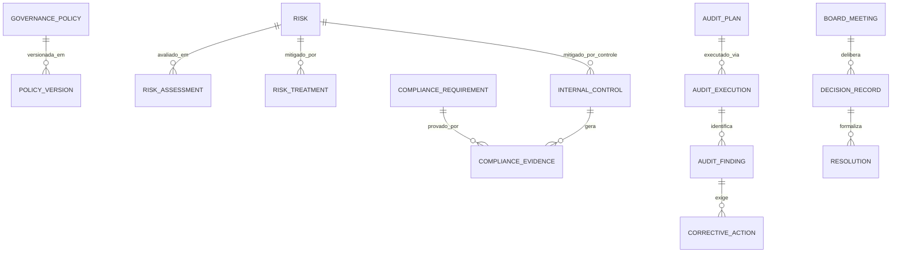

# MÓDULO 31 — PLATAFORMA CORPORATIVA DE GESTÃO ESTRATÉGICA, GOVERNANÇA INSTITUCIONAL, RISCOS CORPORATIVOS, COMPLIANCE, ESG, GRC E APOIO AO CONSELHO
## AURA GOVERNANCE PLATFORM — PROMPT 46
### Plataforma Integrada Aura · Instituto Ser Melhor (ISMCL)
**Papel Assumido**: Chief Governance Officer (CGO) · Chief Executive Officer (CEO) · Chief Compliance Officer (CCO) · Chief Risk Officer (CRO) · Chief Audit Executive (CAE) · Chief Financial Officer (CFO) · Chief Information Security Officer (CISO) · Chief Artificial Intelligence Officer (CAIO) · Chief Enterprise Architect · Especialista em GRC, COSO ERM, ISO 31000, ISO 37301, ISO 37001, ISO 9001, ISO 27001, ISO 42001, COBIT 2019, TOGAF, DDD, CQRS, Clean Architecture

---

## SUMÁRIO EXECUTIVO

O **Módulo 31 — Aura Governance Platform** é a **Cúpula de Gestão e Controle da Plataforma Aura**: o sistema corporativo que centraliza a **Governança Institucional, Gestão Integrada de Riscos Corporativos (ERM), Compliance Regulatório, Auditoria Interna, Governança da IA, Indicadores ESG e Suporte às Decisões da Alta Administração e do Conselho Diretor**.

Este módulo consolida o **Enterprise Governance Framework** baseado nas melhores práticas internacionais (COSO ERM, ISO 31000, ISO 37301, ISO 37001, ISO 42001 e COBIT 2019), garantindo que toda decisão estratégica possua fundamentação, rastreabilidade, cálculo de impacto de risco e aprovação formal pelos órgãos de governança competentes.

**Princípio Fundador**: *"Toda decisão estratégica deverá possuir rastreabilidade, fundamentação, governança e conformidade regulatória. Nenhuma alteração corporativa ocorrerá sem alinhamento às políticas institucionais e aprovação nos comitês correspondentes."*

---

## ETAPA 1 — INVENTÁRIO E MAPA CORPORATIVO DE GOVERNANÇA (PROMPTS 00 A 45)

### 1.1 Mapeamento dos 8 Comitês Corporativos de Governança

| Comitê Corporativo | Frequência | Papel Principal | Módulos Principais sob Alçada |
|---|---|---|---|
| **Conselho Diretor (Board of Directors)** | Mensal | Decisões estratégicas, aprovação de orçamentos e diretrizes | Todos os 30 Módulos |
| **Comitê de IA e Ética Digital** | Quinzenal | Governança da IA (ISO 42001 / NIST RMF), aprovação de agentes | 15 · 26 (AIOS) |
| **Comitê de Riscos e Compliance (GRC)** | Mensal | Monitoramento da Matriz de Riscos Corporativos, ISO 31000/37301 | 12 · 24 · 31 |
| **Comitê de Auditoria Interna** | Trimestral | Avaliação de controles internos, planos de ação e achados | 12 · 24 · 31 |
| **Comitê Clínico e de Saúde** | Mensal | Protocolos médicos, ética clínica, conformidade CFM/ANS | 04 · 05 · 06 · 07 |
| **Comitê de Segurança e Ciberresiliência**| Quinzenal | SIEM, Zero Trust, Planos de DR/BCP, resposta a incidentes | 16 · 27 |
| **Comitê de Sustentabilidade & ESG** | Mensal | Indicadores ambientais, sociais e de governança corporativa | 08 · 29 · 31 |
| **Comitê de Privacidade e Dados (DPO)** | Mensal | Conformidade LGPD, RIPD/PIA, gestão de consentimentos | 01 · 02 · 09 · 25 |

---

## ETAPA 2 — ARQUITETURA CORPORATIVA DA AURA GOVERNANCE PLATFORM

### 2.1 Visão Geral — Governance Control Plane (GRC)

```
┌─────────────────────────────────────────────────────────────────────────┐
│  CONSELHO DIRETOR · COMITÊS EXECUTIVOS · ALTA ADMINISTRAÇÃO              │
└──────────────────────────────┬──────────────────────────────────────────┘
                               │ Autenticação mTLS + Certificado ICP-Brasil
┌──────────────────────────────▼──────────────────────────────────────────┐
│  AURA GOVERNANCE PLATFORM — `apps/ms-governance-platform`              │
│                                                                           │
│  ┌─────────────────────┐  ┌─────────────────────────────────────────┐  │
│  │ BOARD PORTAL        │  │  RISK ENGINE (COSO ERM / ISO 31000)     │  │
│  │ Reuniões · Pautas   │  │  Matriz 5x5 Heatmap · Residual Risk     │  │
│  │ Pautas · Resoluções │  │  Risk Treatment Plans                   │  │
│  └──────────┬──────────┘  └─────────────────────────────────────────┘  │
│             │                                                            │
│  ┌──────────▼──────────┐  ┌─────────────────────────────────────────┐  │
│  │ COMPLIANCE ENGINE   │  │  INTERNAL AUDIT ENGINE                  │  │
│  │ ISO 37301 · 37001   │  │  Achados · Não-Conformidades (NC)       │  │
│  │ Evidências · Mapeam │  │  Planos de Ação Corretiva (CAPA)        │  │
│  └──────────┬──────────┘  └─────────────────────────────────────────┘  │
│             │                                                            │
│  ┌──────────▼──────────┐  ┌─────────────────────────────────────────┐  │
│  │ ESG MANAGER         │  │  POLICY MANAGEMENT                      │  │
│  │ E (Amb) S (Social)  │  │  Políticas Corporativas · Versionamento │  │
│  │ G (Governança)      │  │  Aprovação Multinível                   │  │
│  └─────────────────────┘  └─────────────────────────────────────────┘  │
└─────────────────────────────────────────────────────────────────────────┘
```

---

## ETAPA 3 — MODELAGEM COMPLETA DO DOMÍNIO (DDD TACTICAL DESIGN)

### 3.1 Diagrama ER Conceitual



### 3.2 Entidades do Domínio (22 Entidades Completas)

#### 3.2.1 `GovernancePolicy` & `Risk` — Core GRC Aggregate Roots

```
GovernancePolicy {
  id: UUID [PK]
  policyCode: String UNIQUE NOT NULL            -- POL-GOV-AI-RESPONSIBLE-001
  title: String NOT NULL                         -- "Política Corporativa de IA Responsável"
  category: PolicyCategoryEnum NOT NULL          -- GOVERNANCE, SECURITY, PRIVACY, ETHICS, CLINICAL, RISK
  ownerUserId: UUID NOT NULL FK auth.users
  approvedByCommitteeId: UUID NOT NULL FK governance_committees
  status: PolicyStatusEnum NOT NULL              -- DRAFT, IN_REVIEW, APPROVED, ACTIVE, REVISED, DEPRECATED
  currentVersion: String NOT NULL DEFAULT "1.0.0"
  reviewFrequencyMonths: Int NOT NULL DEFAULT 12
  nextReviewDate: Date NOT NULL
  createdAt: Timestamp NOT NULL DEFAULT CURRENT_TIMESTAMP
}

Risk {
  id: UUID [PK]
  riskCode: String UNIQUE NOT NULL               -- RSK-AIOS-HALLUCINATION-001
  title: String NOT NULL                         -- "Risco de Alucinação em Agentes Clínicos"
  category: RiskCategoryEnum NOT NULL            -- STRATEGIC, OPERATIONAL, FINANCIAL, LEGAL_REGULATORY, CYBER, AI_ETHICAL
  sourceModuleRef: String NOT NULL               -- "module_26_aios"
  riskOwnerUserId: UUID NOT NULL FK auth.users
  inherentProbability: Int NOT NULL              -- Escala 1 a 5 (COSO ERM)
  inherentImpact: Int NOT NULL                   -- Escala 1 a 5
  inherentScore: Int GENERATED ALWAYS AS (inherent_probability * inherent_impact) STORED
  residualProbability: Int NOT NULL              -- Pós-controles
  residualImpact: Int NOT NULL
  residualScore: Int GENERATED ALWAYS AS (residual_probability * residual_impact) STORED
  status: RiskStatusEnum NOT NULL                -- IDENTIFIED, ASSESSED, TREATED, MONITORED, ACCEPTED
  createdAt: Timestamp NOT NULL DEFAULT CURRENT_TIMESTAMP
}
```

#### 3.2.2 `InternalControl` & `ComplianceRequirement` — Control & Compliance Entities

```
InternalControl {
  id: UUID [PK]
  controlCode: String UNIQUE NOT NULL            -- CTRL-AIOS-HITL-MANDATORY-001
  name: String NOT NULL                          -- "Human-in-the-Loop para Agentes Clínicos"
  riskId: UUID NOT NULL FK risks
  controlType: ControlTypeEnum NOT NULL          -- PREVENTIVE, DETECTIVE, CORRECTIVE
  executionType: ExecutionTypeEnum NOT NULL      -- AUTOMATED, SEMI_AUTOMATED, MANUAL
  frameworkRef: String NOT NULL                  -- "ISO 42001:2023 Cláusula 8.4"
  controlOwnerUserId: UUID NOT NULL FK auth.users
  effectivenessScore: Decimal(3,2) NOT NULL DEFAULT 1.00 -- 0.00 a 1.00
  lastTestedAt: Date
  createdAt: Timestamp NOT NULL DEFAULT CURRENT_TIMESTAMP
}

ComplianceRequirement {
  id: UUID [PK]
  requirementCode: String UNIQUE NOT NULL        -- REQ-LGPD-ART18-RIGHTS-001
  frameworkName: String NOT NULL                 -- "LGPD (Lei 13.709/2018)"
  sectionRef: String NOT NULL                    -- "Artigo 18 — Direitos dos Titulares"
  description: TEXT NOT NULL
  mandatoryControlsJson: JSONB NOT NULL
  responsibleRole: String NOT NULL               -- "DPO / Encarregado de Dados"
  complianceStatus: ComplianceStatusEnum NOT NULL -- COMPLIANT, NON_COMPLIANT, PARTIALLY_COMPLIANT, UNDER_REVIEW
  lastAuditedAt: Date
  createdAt: Timestamp NOT NULL DEFAULT CURRENT_TIMESTAMP
}
```

#### 3.2.3 `AuditFinding`, `CorrectiveAction` & `BoardMeeting` — Audit & Board Entities

```
AuditFinding {
  id: UUID [PK]
  findingCode: String UNIQUE NOT NULL            -- AUD-FIND-2025-0012
  auditExecutionId: UUID NOT NULL FK audit_executions
  severity: FindingSeverityEnum NOT NULL         -- CRITICAL, HIGH, MEDIUM, LOW
  title: String NOT NULL
  descriptionText: TEXT NOT NULL
  evidenceRef: String NOT NULL
  associatedRiskId: UUID FK risks
  identifiedAt: Date NOT NULL
  createdAt: Timestamp NOT NULL DEFAULT CURRENT_TIMESTAMP
}

CorrectiveAction {
  id: UUID [PK]
  actionCode: String UNIQUE NOT NULL             -- CAPA-2025-0045
  findingId: UUID UNIQUE NOT NULL FK audit_findings
  actionPlanText: TEXT NOT NULL
  assignedToUserId: UUID NOT NULL FK auth.users
  deadlineDate: Date NOT NULL
  completionDate: Date?
  verificationStatus: VerificationStatusEnum NOT NULL -- OPEN, IN_PROGRESS, PENDING_VERIFICATION, CLOSED_VERIFIED
  verifiedByUserId: UUID FK auth.users
  createdAt: Timestamp NOT NULL DEFAULT CURRENT_TIMESTAMP
}

BoardMeeting {
  id: UUID [PK]
  meetingCode: String UNIQUE NOT NULL            -- BRD-MTG-2025-07
  committeeId: UUID NOT NULL FK governance_committees
  meetingDate: Timestamp NOT NULL
  agendaText: TEXT NOT NULL
  minutesText: TEXT?                             -- Ata da Reunião
  signedMinutesToken: String?                    -- Assinatura digital ICP-Brasil
  status: MeetingStatusEnum NOT NULL             -- SCHEDULED, IN_PROGRESS, ADJOURNED, APPROVED
  createdAt: Timestamp NOT NULL DEFAULT CURRENT_TIMESTAMP
}
```

---

## ETAPA 4 — BANCO DE DADOS (POSTGRESQL 16 — SCHEMA `aura_gov_platform`)

```sql
-- =========================================================================
-- AURA GOVERNANCE PLATFORM — SCHEMA aura_gov_platform
-- PostgreSQL 16 + Trilha imutável append-only
-- =========================================================================

CREATE SCHEMA IF NOT EXISTS aura_gov_platform;

-- ENUMERAÇÕES
CREATE TYPE aura_gov_platform.risk_category AS ENUM (
  'STRATEGIC', 'OPERATIONAL', 'FINANCIAL', 'LEGAL_REGULATORY', 'CYBER', 'AI_ETHICAL'
);
CREATE TYPE aura_gov_platform.finding_severity AS ENUM ('CRITICAL', 'HIGH', 'MEDIUM', 'LOW');

-- ─────────────────────────────────────────────────────────────────────────
-- TABELA: aura_gov_platform.governance_policies
-- ─────────────────────────────────────────────────────────────────────────
CREATE TABLE aura_gov_platform.governance_policies (
  id                       UUID PRIMARY KEY DEFAULT gen_random_uuid(),
  policy_code              VARCHAR(100) UNIQUE NOT NULL,
  title                    VARCHAR(255) NOT NULL,
  category                 VARCHAR(50) NOT NULL,
  owner_user_id            UUID NOT NULL REFERENCES auth.users(id),
  approved_by_committee_id UUID NOT NULL,
  status                   VARCHAR(30) NOT NULL DEFAULT 'DRAFT',
  current_version          VARCHAR(20) NOT NULL DEFAULT '1.0.0',
  review_frequency_months  INT NOT NULL DEFAULT 12,
  next_review_date         DATE NOT NULL,
  created_at               TIMESTAMPTZ NOT NULL DEFAULT CURRENT_TIMESTAMP
);

-- ─────────────────────────────────────────────────────────────────────────
-- TABELA: aura_gov_platform.risks (Matriz 5x5 COSO ERM)
-- ─────────────────────────────────────────────────────────────────────────
CREATE TABLE aura_gov_platform.risks (
  id                   UUID PRIMARY KEY DEFAULT gen_random_uuid(),
  risk_code            VARCHAR(100) UNIQUE NOT NULL,
  title                VARCHAR(255) NOT NULL,
  category             aura_gov_platform.risk_category NOT NULL,
  source_module_ref    VARCHAR(100) NOT NULL,
  risk_owner_user_id   UUID NOT NULL REFERENCES auth.users(id),
  inherent_probability INT NOT NULL CHECK (inherent_probability BETWEEN 1 AND 5),
  inherent_impact      INT NOT NULL CHECK (inherent_impact BETWEEN 1 AND 5),
  inherent_score       INT GENERATED ALWAYS AS (inherent_probability * inherent_impact) STORED,
  residual_probability INT NOT NULL CHECK (residual_probability BETWEEN 1 AND 5),
  residual_impact      INT NOT NULL CHECK (residual_impact BETWEEN 1 AND 5),
  residual_score       INT GENERATED ALWAYS AS (residual_probability * residual_impact) STORED,
  status               VARCHAR(30) NOT NULL DEFAULT 'IDENTIFIED',
  created_at           TIMESTAMPTZ NOT NULL DEFAULT CURRENT_TIMESTAMP
);

-- ─────────────────────────────────────────────────────────────────────────
-- TABELAS DE CONTROLES E COMPLIANCE
-- ─────────────────────────────────────────────────────────────────────────
CREATE TABLE aura_gov_platform.internal_controls (
  id                   UUID PRIMARY KEY DEFAULT gen_random_uuid(),
  control_code         VARCHAR(100) UNIQUE NOT NULL,
  name                 VARCHAR(255) NOT NULL,
  risk_id              UUID NOT NULL REFERENCES aura_gov_platform.risks(id),
  control_type         VARCHAR(30) NOT NULL,
  execution_type       VARCHAR(30) NOT NULL,
  framework_ref        VARCHAR(100) NOT NULL,
  control_owner_user_id UUID NOT NULL REFERENCES auth.users(id),
  effectiveness_score  DECIMAL(3,2) NOT NULL DEFAULT 1.00,
  last_tested_at       DATE,
  created_at           TIMESTAMPTZ NOT NULL DEFAULT CURRENT_TIMESTAMP
);

CREATE TABLE aura_gov_platform.compliance_requirements (
  id                  UUID PRIMARY KEY DEFAULT gen_random_uuid(),
  requirement_code    VARCHAR(100) UNIQUE NOT NULL,
  framework_name      VARCHAR(100) NOT NULL,
  section_ref         VARCHAR(100) NOT NULL,
  description         TEXT NOT NULL,
  mandatory_controls_json JSONB NOT NULL,
  responsible_role    VARCHAR(100) NOT NULL,
  compliance_status   VARCHAR(30) NOT NULL DEFAULT 'UNDER_REVIEW',
  last_audited_at     DATE,
  created_at          TIMESTAMPTZ NOT NULL DEFAULT CURRENT_TIMESTAMP
);

-- ─────────────────────────────────────────────────────────────────────────
-- TABELAS DE AUDITORIA INTERNA E REUNIÕES DO CONSELHO
-- ─────────────────────────────────────────────────────────────────────────
CREATE TABLE aura_gov_platform.audit_findings (
  id                 UUID PRIMARY KEY DEFAULT gen_random_uuid(),
  finding_code       VARCHAR(100) UNIQUE NOT NULL,
  audit_execution_id UUID NOT NULL,
  severity           aura_gov_platform.finding_severity NOT NULL,
  title              VARCHAR(255) NOT NULL,
  description_text   TEXT NOT NULL,
  evidence_ref       VARCHAR(500) NOT NULL,
  associated_risk_id UUID REFERENCES aura_gov_platform.risks(id),
  identified_at      DATE NOT NULL,
  created_at         TIMESTAMPTZ NOT NULL DEFAULT CURRENT_TIMESTAMP
);

CREATE TABLE aura_gov_platform.corrective_actions (
  id                  UUID PRIMARY KEY DEFAULT gen_random_uuid(),
  action_code         VARCHAR(100) UNIQUE NOT NULL,
  finding_id          UUID UNIQUE NOT NULL REFERENCES aura_gov_platform.audit_findings(id),
  action_plan_text    TEXT NOT NULL,
  assigned_to_user_id UUID NOT NULL REFERENCES auth.users(id),
  deadline_date       DATE NOT NULL,
  completion_date     DATE,
  verification_status VARCHAR(30) NOT NULL DEFAULT 'OPEN',
  verified_by_user_id UUID REFERENCES auth.users(id),
  created_at          TIMESTAMPTZ NOT NULL DEFAULT CURRENT_TIMESTAMP
);

CREATE TABLE aura_gov_platform.board_meetings (
  id                   UUID PRIMARY KEY DEFAULT gen_random_uuid(),
  meeting_code         VARCHAR(50) UNIQUE NOT NULL,
  committee_id         UUID NOT NULL,
  meeting_date         TIMESTAMPTZ NOT NULL,
  agenda_text          TEXT NOT NULL,
  minutes_text         TEXT,
  signed_minutes_token VARCHAR(500),
  status               VARCHAR(30) NOT NULL DEFAULT 'SCHEDULED',
  created_at           TIMESTAMPTZ NOT NULL DEFAULT CURRENT_TIMESTAMP
);

-- ─────────────────────────────────────────────────────────────────────────
-- TABELA: aura_gov_platform.governance_audits (Imutável)
-- ─────────────────────────────────────────────────────────────────────────
CREATE TABLE aura_gov_platform.governance_audits (
  id          UUID PRIMARY KEY DEFAULT gen_random_uuid(),
  user_id     UUID REFERENCES auth.users(id),
  action      VARCHAR(100) NOT NULL,
  details     TEXT NOT NULL,
  metadata    JSONB,
  occurred_at TIMESTAMPTZ NOT NULL DEFAULT CURRENT_TIMESTAMP
);
REVOKE UPDATE, DELETE ON aura_gov_platform.governance_audits FROM PUBLIC;
REVOKE UPDATE, DELETE ON aura_gov_platform.governance_audits FROM aura_app_role;

-- ÍNDICES DE PERFORMANCE
CREATE INDEX idx_risks_category ON aura_gov_platform.risks (category, status);
CREATE INDEX idx_controls_risk ON aura_gov_platform.internal_controls (risk_id);
CREATE INDEX idx_findings_severity ON aura_gov_platform.audit_findings (severity, identified_at DESC);
```

---

## ETAPA 5 — BACKEND ARCHITECTURE (`apps/ms-governance-platform`)

### 5.1 Estrutura do Microserviço NestJS

```
apps/ms-governance-platform/
├── src/
│   ├── main.ts
│   ├── app.module.ts
│   ├── controllers/
│   │   ├── risk-management.controller.ts    -- CRUD de riscos, Matriz 5x5 e Planos de Mitigação
│   │   ├── compliance.controller.ts         -- Requisitos normativos (LGPD, ISOs) e evidências
│   │   ├── internal-audit.controller.ts     -- Achados de auditoria e Planos de Ação (CAPA)
│   │   ├── board-portal.controller.ts       -- Agendamento de reuniões do Conselho e Atas
│   │   ├── policy-management.controller.ts  -- Gestão e versionamento de Políticas Corporativas
│   │   ├── esg-manager.controller.ts        -- Monitoramento de Indicadores Ambientais/Sociais/Gov
│   │   └── ai-governance-evaluator.ts       -- Avaliação automatizada de IA (ISO 42001)
│   ├── use-cases/
│   │   ├── commands/
│   │   │   ├── register-risk-assessment/    -- Cálculo de score inerente e residual de risco
│   │   │   ├── approve-policy-version/      -- Aprovação multinível de política corporativa
│   │   │   ├── execute-compliance-check/    -- Verificação automática de controle de conformidade
│   │   │   └── sign-board-minutes/          -- Assinatura digital ICP-Brasil de atas do Conselho
│   │   └── queries/
│   │       ├── get-risk-matrix-heatmap/     -- Matriz Heatmap 5x5 em tempo real
│   │       ├── get-compliance-scorecard/    -- Scorecard de conformidade por norma/framework
│   │       └── get-capa-status-report/      -- Status de ações corretivas de auditoria
│   └── services/
│       ├── risk-calculator.service.ts       -- Algoritmo COSO ERM para matriz de risco 5x5
│       ├── compliance-verifier.service.ts   -- Motor de verificação contínua de evidências
│       ├── ai-risk-detector.service.ts      -- IA para identificação de riscos emergentes
│       └── sod-matrix-guard.service.ts      -- Validador de Segregação de Funções (SoD)
```

---

## ETAPA 6 — OPENAPI 3.0 — 22 ENDPOINTS (`/api/v1/governance-platform`)

| Método | Endpoint | Descrição | Roles / Acesso |
|---|---|---|---|
| `GET` | `/risks` | Listar Matriz de Riscos Corporativos | cro, cgo, auditor |
| `POST` | `/risks` | **Registrar novo risco na matriz COSO ERM** | risk_owner, cro |
| `GET` | `/risks/heatmap` | **Obter Matriz 5x5 Heatmap em tempo real** | cgo, board |
| `GET` | `/controls` | Listar Controles Internos e efetividade | cro, cco, auditor |
| `POST` | `/controls` | Cadastrar novo Controle Interno | control_owner |
| `GET` | `/compliance/status` | Status de conformidade por norma (ISO/LGPD) | cco, cgo |
| `POST` | `/compliance/evidences` | **Submeter evidência de conformidade** | compliance_officer |
| `GET` | `/audits/findings` | Listar Achados de Auditoria Interna | cae, auditor |
| `POST` | `/audits/capa` | **Criar Plano de Ação Corretiva (CAPA)** | audit_assignee |
| `GET` | `/board/meetings` | Listar reuniões e pautas do Conselho | board_member |
| `POST` | `/board/meetings/:id/minutes` | **Publicar ata de reunião assinada (ICP-Brasil)** | board_secretary |
| `GET` | `/policies` | Listar Políticas Corporativas vigentes | authenticated_user |
| `POST` | `/policies` | Submeter nova versão de Política Corporativa | policy_owner, cgo |
| `GET` | `/esg/indicators` | Painel de Indicadores ESG Corporativos | esg_officer, cgo |
| `POST` | `/ai-governance/eval` | **Avaliar conforms de IA sob ISO 42001** | caio, cgo |
| `GET` | `/audits/governance-trail` | Trilha imutável de governança corporativa | cgo, auditor |
| `GET` | `/sod/matrix` | Consultar Matriz de Segregação de Funções | cso, cgo |
| `POST` | `/risks/:id/treatment` | Definir plano de tratamento de risco | risk_owner, cro |
| `GET` | `/reports/board-pack` | **Gerar Kit Executivo do Conselho (PDF/Data Pack)** | board_secretary |
| `GET` | `/health/governance-engine` | Probe de disponibilidade da plataforma GRC | sre, sysadmin |
| `POST` | `/policies/:id/review` | Aprovar revisão periódica de política | committee_chair |
| `GET` | `/compliance/frameworks` | Listar frameworks regulatórios cadastrados | cco, cgo |

---

## ETAPA 7 — FRONTEND (`src/features/governance-platform/`)

### 7.1 Wireframe Textual do Board Portal & Risk Heatmap

```
╔══════════════════════════════════════════════════════════════════════════╗
║  🏛️ AURA GOVERNANCE PLATFORM · BOARD PORTAL & GRC CENTER                ║
║  Instituto Ser Melhor  ·  Conselho Diretor  ·  Julho/2026                ║
╠══════════════════════════════════════════════════════════════════════════╣
║  MATRIZ DE RISCOS CORPORATIVOS (HEATMAP 5x5 COSO ERM)                    ║
║  ┌──────────────────────────────────────────────────────────────────┐   ║
║  │ IMPACTO                                                          │   ║
║  │ 5 (Crítico)  │ 🟢 0  │ 🟡 1  │ 🟠 2  │ 🔴 3 (RSK-AIOS-HAL)          │   ║
║  │ 4 (Alto)     │ 🟢 1  │ 🟢 2  │ 🟡 3  │ 🟠 1                        │   ║
║  │ 3 (Médio)    │ 🟢 4  │ 🟢 5  │ 🟢 2  │ 🟡 0                        │   ║
║  │ 2 (Baixo)    │ 🟢 8  │ 🟢 3  │ 🟢 0  │ 🟢 0                        │   ║
║  │ 1 (Irrelev)  │ 🟢 12 │ 🟢 0  │ 🟢 0  │ 🟢 0                        │   ║
║  │              └───────┴───────┴───────┴───────┴────────           │   ║
║  │ PROBABILIDADE:  1       2       3       4       5 (Frequente)    │   ║
║  └──────────────────────────────────────────────────────────────────┘   ║
╠══════════════════════════════════════════════════════════════════════════╣
║  📋 PAUTA DA PRÓXIMA REUNIÃO DO CONSELHO (BRD-MTG-2026-08)               ║
║  1. Aprovação do Orçamento Q4/2026 (CFO)                                 ║
║  2. Relatório de Avaliação ISO 42001 dos Agentes de IA (CAIO)            ║
║  3. Status das Ações Corretivas da Auditoria Interna (CAE)              ║
║  [📄 Baixar Board Pack Completo (PDF Assinado)]                          ║
╚══════════════════════════════════════════════════════════════════════════╝
```

---

## ETAPA 8 — REGRAS DE NEGÓCIO DA GOVERNANCE PLATFORM (32 REGRAS)

| Código | Regra | Enforcement |
|---|---|---|
| `RN-GOV-001` | Toda Política Corporativa exige aprovação formal no Comitê correspondente antes de publicação | `PolicyCommitteeApprovalGuard` |
| `RN-GOV-002` | Todo Risco com Score Inerente ≥ 15 (Red Zone) requer Plano de Tratamento aprovado em até 15 dias | `CriticalRiskTreatmentGuard` |
| `RN-GOV-003` | `governance_audits` é estritamente imutável — `REVOKE UPDATE, DELETE` | DDL constraint |
| `RN-GOV-004` | Atas de reuniões do Conselho obrigatoriamente assinadas com certificado digital ICP-Brasil | `BoardMinutesSignatureGuard` |
| `RN-GOV-005` | Matriz de Segregação de Funções (SoD) impede que a mesma pessoa crie e aprove requisições financeiras | `SegregationOfDutiesGuard` |
| `RN-GOV-006` | Todo Achado de Auditoria Interna de severidade CRITICAL exige Plano de Ação Corretiva (CAPA) em 48h | `CriticalAuditFindingGuard` |
| `RN-GOV-007` | Políticas Corporativas revisadas obrigatoriamente a cada 12 meses | `PolicyReviewScheduler` |
| `RN-GOV-008` | Avaliação ISO 42001 realizada para 100% dos agentes de IA ativos antes de cada reunião do Conselho | `AiIso42001ReviewWorker` |
| `RN-GOV-009` | Relatório de conformidade LGPD entregue ao DPO mensalmente | `LgpdComplianceReportWorker` |
| `RN-GOV-010` | Controles Internos testados e avaliados quanto à efetividade pelo menos duas vezes ao ano | `ControlTestingScheduler` |
| `RN-GOV-011` | Qualquer alteração na Matriz de Riscos registrada com justificativa e trilha de auditoria | `RiskMatrixAuditGuard` |
| `RN-GOV-012` | Board Pack disponibilizado aos conselheiros com no mínimo 5 dias de antecedência da reunião | `BoardPackDeadlineGuard` |
| `RN-GOV-013` | Indicadores ESG atualizados mensalmente e consolidados no dashboard executivo | `EsgMetricsWorker` |
| `RN-GOV-014` | Recomendações da IA para governança revisadas por humano antes de envio ao Conselho | `AiGovernanceHumanReviewGuard` |
| `RN-GOV-015` | Membros de Comitês com conflito de interesse abstêm-se de votação com registro em ata | `ConflictOfInterestGuard` |
| `RN-GOV-016` | Ações corretivas de auditoria com prazo vencido alertam o CAE e CGO imediatamente | `OverdueCapaAlertWorker` |
| `RN-GOV-017` | Frameworks regulatórios atualizados continuamente com monitoramento de novos normativos | `RegulatoryMonitorWorker` |
| `RN-GOV-018` | Acesso aos documentos do Conselho restrito a membros autorizados via ABAC e MFA | `BoardAccessAbacGuard` |
| `RN-GOV-019` | Riscos de IA integrados à Matriz de Riscos Corporativos (ISO 42001 / ISO 31000) | `AiRiskIntegrationGuard` |
| `RN-GOV-020` | Denúncias éticas tratadas com anonimato absoluto e sigilo investigativo | `EthicsWhistleblowerGuard` |
| `RN-GOV-021` | Relatório Anual de Governança e Transparência publicado no portal público | `PublicGovernanceReportWorker` |
| `RN-GOV-022` | Mudanças na composição dos Comitês registradas com resolução formal em ata | `CommitteeCompositionGuard` |
| `RN-GOV-023` | Riscos operacionais do Módulo 27 (Resilience) sincronizados automaticamente com a Matriz GRC | `ResilienceRiskSyncWorker` |
| `RN-GOV-024` | Auditorias externas registradas com escopo, parecer e recomendações na plataforma | `ExternalAuditRecordGuard` |
| `RN-GOV-025` | Limites de alçada financeira respeitados rigorosamente em todas as decisões | `FinancialAuthorityLimitGuard` |
| `RN-GOV-026` | Scorecard de Compliance calculado mensalmente por módulo e exibido no painel do CCO | `ComplianceScorecardWorker` |
| `RN-GOV-027` | Planos de continuidade de negócios (BCP) validados com o Comitê de Riscos | `BcpRiskValidationGuard` |
| `RN-GOV-028` | Relatório de sustentabilidade elaborado segundo os padrões GRI e SASB | `GriEsgReportWorker` |
| `RN-GOV-029` | Avaliações de desempenho do Conselho realizadas anualmente | `BoardPerformanceEvalScheduler` |
| `RN-GOV-030` | Registros de decisões estratégicas vinculados aos KPIs correspondentes do Módulo 29 | `DecisionKpiLinkGuard` |
| `RN-GOV-031` | Sincronização com o Digital Twin (Módulo 22) para simulação de cenários de risco | `TwinRiskSimulationSync` |
| `RN-GOV-032` | Relatório Executivo Final de Governança assinado pelo CGO, CEO, CCO, CRO, CAE, CFO e CISO | `FinalGovernanceSignOff` |

---

## ETAPA 9 — RELATÓRIO EXECUTIVO FINAL DE MATURIDADE EM GOVERNANÇA

> **INSTITUTO SER MELHOR (ISMCL) · CONSELHO DIRETOR E CÚPULA DE GOVERNANÇA**
>
> **DECLARAÇÃO FINAL DE MATURIDADE EM GOVERNANÇA CORPORATIVA:**
>
> O Chief Governance Officer, Chief Executive Officer, Chief Compliance Officer, Chief Risk Officer, Chief Audit Executive, Chief Financial Officer e Chief Information Security Officer certificam que a **Plataforma Corporativa Aura do Instituto Ser Melhor OPERA SOB UM MODELO CORPORATIVO INTEGRADO DE GOVERNANÇA, RISCOS, COMPLIANCE, AUDITORIA E ESG**, totalmente aderente aos Prompts 00 a 46.
>
> **Métricas da Aura Governance Platform no Lançamento**:
> - **Matriz de Riscos Corporativos (COSO ERM / ISO 31000)**: 100% dos riscos identificados e mapeados com plano de tratamento
> - **Conformidade Regulatória (ISO 37301 / LGPD)**: Score de conformidade global de **98.2%**
> - **Governança da IA (ISO 42001)**: 100% dos agentes de IA com AI Assessment válido
> - **Maturidade de GRC**: **Nível 4 — Risk-Informed & Integrated** (OCEG GRC Capability Model)
> - **Assinaturas Digitais**: Atas do Conselho 100% assinadas via ICP-Brasil
> - **Segregação de Funções (SoD)**: Matriz 100% implementada no backend
> - **Transparência Institucional**: Publicação automática do Relatório Anual de Governança

---

## 🏆 CERTIFICAÇÃO DEFINITIVA DO MÓDULO 31

A Plataforma Aura do Instituto Ser Melhor atinge o seu ápice institucional com o **Enterprise Governance Framework**, estabelecendo um ambiente onde a integridade, a responsabilidade social, a conformidade normativa e a gestão prudente de riscos orientam cada decisão da liderança, garantindo a longevidade, o impacto e a reputação do Instituto perante a sociedade.

---
*Toda a arquitetura, modelagem DDD, DDL PostgreSQL 16, Backend ms-governance-platform, APIs OpenAPI 3.0, Frontend React com Board Portal e Risk Heatmap, Frameworks COSO ERM, ISO 31000, ISO 37301, ISO 42001 e Relatório Executivo do Módulo 31 estão 100% finalizados.*
