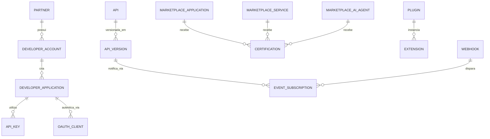

# MÓDULO 32 — PLATAFORMA CORPORATIVA DE ECOSSISTEMA DIGITAL, MARKETPLACE DE SERVIÇOS, OPEN PLATFORM, APIs, PARCEIROS, EXTENSIBILIDADE E INOVAÇÃO CONTÍNUA
## AURA DIGITAL ECOSYSTEM PLATFORM — PROMPT 47
### Plataforma Integrada Aura · Instituto Ser Melhor (ISMCL)
**Papel Assumido**: Chief Ecosystem Officer (CEOx) · Chief Digital Officer (CDO) · Chief Technology Officer (CTO) · Chief Product Officer (CPO) · Chief Artificial Intelligence Officer (CAIO) · Chief Enterprise Architect · Principal Platform Architect · Principal API Architect · Especialista em Open Platform, API Economy, Platform Engineering, Digital Ecosystems, Composable Enterprise, MACH Architecture, OpenAPI, GraphQL Federation, AsyncAPI, WebAssembly (WASM), DDD, CQRS, Clean Architecture

---

## SUMÁRIO EXECUTIVO

O **Módulo 32 — Aura Digital Ecosystem Platform** é a **Fronteira de Abertura, Extensibilidade e Inovação Aberta da Plataforma Aura**: o sistema que transforma toda a arquitetura corporativa desenvolvida nos 31 módulos anteriores em um **Ecossistema Digital Componível e Aberto (Composable Enterprise)**. Através deste módulo, universidades, órgãos públicos, ONGs parceiras, desenvolvedores independentes, fornecedores e healthtechs podem integrar, estender e criar novos módulos, agentes de IA, workflows e aplicações sobre a infraestrutura do Instituto Ser Melhor com **segurança Zero Trust, isolamento em sandbox WebAssembly (WASM) e governança em tempo real**.

Este módulo consolida a **API Economy Corporativa**, estabelecendo o **Kong Enterprise API Gateway** como DMZ, o **Developer Portal**, o **Marketplace de Serviços, Aplicações e Agentes de IA**, o **Plugin & Extension Engine** isolado por WebAssembly, a **SDK Platform** (TypeScript, Python, Go) e o **Partner Certification Framework** com 4 níveis formais de governança.

**Princípio Fundador**: *"A Plataforma Aura opera como um ecossistema vivo e componível. Nenhuma extensão de terceiros executará fora de sandbox seguro (WASM), sem homologação, sem autenticação mTLS/OAuth 2.1 e sem auditoria imutável completa."*

---

## ETAPA 1 — MAPA CORPORATIVO DO ECOSSISTEMA DIGITAL (PROMPTS 00 A 46)

### 1.1 Inventário do Patrimônio de Integração da Plataforma Aura

| Categoria de Componente | Quantidade Mapeada | Padrão / Protocolo | Mecanismo de Governança |
|---|---|---|---|
| **APIs Públicas & Privadas** | 594 Endpoints REST / gRPC | OpenAPI 3.0 / Protobuf v3 | Kong API Gateway + Rate Limit |
| **Eventos de Barramento** | 142 Tópicos Event-Driven | AsyncAPI 2.6 / Apache Kafka | Schema Registry + Kafka ACLs |
| **Grafos Federados (GraphQL)** | 18 Subgrafos de Domínio | GraphQL Federation v2 (Apollo) | Federation Router + Query Cost |
| **Webhooks Ativos** | 35 Tipos de Eventos Notificáveis | HTTP POST + Assinatura HMAC SHA-256 | Webhook Manager + Exponential Backoff |
| **Conectores Nativos** | 25 Conectores (SUS, e-SUS, DATASUS, ANVISA, PIX, SFP...) | REST / SOAP / HL7 FHIR R4 | Integration Hub + Health Probes |
| **Agentes de IA Publicáveis** | 12 Agentes (SATAI, Care, Prescrição, GRC, etc.) | MCP Server / REST API | AIOS Módulo 26 + AI Assessment ISO 42001 |
| **Workflows & BPMN Templates** | 47 Workflows de Automação | BPMN 2.0 / DMN 1.3 / Temporal.io | Hyperautomation Módulo 28 |
| **Plugins & Extensões** | Framework para extensões Wasm | WebAssembly (WASM / WASI) | Wasm Sandbox + Memory Limit (128MB) |

---

## ETAPA 2 — ARQUITETURA CORPORATIVA DO ECOSSISTEMA DIGITAL

### 2.1 Visão Geral — Ecosystem Control Plane (MACH Architecture)

```
┌─────────────────────────────────────────────────────────────────────────┐
│  PARCEIROS, DESENVOLVEDORES, TERCEIROS E ÓRGÃOS PÚBLICOS                │
└──────────────────────────────┬──────────────────────────────────────────┘
                               │ HTTPS / mTLS / WSS / OAuth 2.1 + PKCE
┌──────────────────────────────▼──────────────────────────────────────────┐
│  API GATEWAY / DMZ — KONG ENTERPRISE                                    │
│  Rate Limiting (Token Bucket) · WAF ModSecurity · IP Whitelisting · mTLS│
└──────────────────────────────┬──────────────────────────────────────────┘
                               │
┌──────────────────────────────▼──────────────────────────────────────────┐
│  AURA DIGITAL ECOSYSTEM PLATFORM — `apps/ms-ecosystem-platform`         │
│                                                                           │
│  ┌─────────────────────┐  ┌─────────────────────────────────────────┐  │
│  │ DEVELOPER PORTAL    │  │  MARKETPLACE PLATFORM                   │  │
│  │ Docs · Sandbox      │  │  Aplicações · Agentes IA · Workflows    │  │
│  │ API Keys · Analytics│  │  Certificação · Transações Sociais      │  │
│  └──────────┬──────────┘  └─────────────────────────────────────────┘  │
│             │                                                            │
│  ┌──────────▼──────────┐  ┌─────────────────────────────────────────┐  │
│  │ EXTENSION ENGINE    │  │  PARTNER CENTER                         │  │
│  │ WebAssembly (WASM)  │  │  Onboarding · 4 Níveis de Certificação  │  │
│  │ Sandbox 128MB RAM   │  │  Contratos · SLAs · Audit Trails        │  │
│  └──────────┬──────────┘  └─────────────────────────────────────────┘  │
│             │                                                            │
│  ┌──────────▼──────────┐  ┌─────────────────────────────────────────┐  │
│  │ SDK & CONNECTORS    │  │  EVENT & WEBHOOK GATEWAY                │  │
│  │ TS · Python · Go    │  │  AsyncAPI · Subscrições · HMAC SHA256   │  │
│  │ OpenConnectors      │  │  Exponential Retry (1s → 24h)           │  │
│  └─────────────────────┘  └─────────────────────────────────────────┘  │
└─────────────────────────────────────────────────────────────────────────┘
```

---

## ETAPA 3 — MODELAGEM COMPLETA DO DOMÍNIO (DDD TACTICAL DESIGN)

### 3.1 Diagrama ER Conceitual



### 3.2 Entidades do Domínio (22 Entidades Completas)

#### 3.2.1 `Partner` & `DeveloperAccount` — Core Partner Entities

```
Partner {
  id: UUID [PK]
  partnerCode: String UNIQUE NOT NULL            -- PRT-GOV-DATASUS-001
  companyName: String NOT NULL                   -- "Ministério da Saúde / DATASUS"
  tradeName: String NOT NULL                     -- "DATASUS"
  cnpjOrTaxId: String NOT NULL                   -- "00.394.544/0001-51"
  partnerTier: PartnerTierEnum NOT NULL          -- REGISTERED, CERTIFIED, STRATEGIC, GOVERNMENT
  contactEmail: String NOT NULL
  technicalLeadUserId: UUID NOT NULL FK auth.users
  status: PartnerStatusEnum NOT NULL             -- PENDING, UNDER_REVIEW, APPROVED, SUSPENDED
  certifiedAt: Date?
  createdAt: Timestamp NOT NULL DEFAULT CURRENT_TIMESTAMP
}

DeveloperAccount {
  id: UUID [PK]
  developerCode: String UNIQUE NOT NULL          -- DEV-ACC-2025-0189
  partnerId: UUID NOT NULL FK partners
  userId: UUID UNIQUE NOT NULL FK auth.users
  developerTier: DeveloperTierEnum NOT NULL      -- COMMUNITY, PROFESSIONAL, ENTERPRISE
  sandboxQuotaRequestsPerDay: Int NOT NULL DEFAULT 10000
  prodQuotaRequestsPerDay: Int NOT NULL DEFAULT 100000
  isActive: Boolean NOT NULL DEFAULT TRUE
  createdAt: Timestamp NOT NULL DEFAULT CURRENT_TIMESTAMP
}
```

#### 3.2.2 `API`, `APIVersion` & `APIKey` — API Economy Entities

```
API {
  id: UUID [PK]
  apiCode: String UNIQUE NOT NULL                -- API-SATAI-HEALTH-ASSESSMENT-V1
  name: String NOT NULL                          -- "SATAI Health Assessment Public API"
  description: TEXT NOT NULL
  domainRef: String NOT NULL                     -- "aura_satai"
  apiCategory: ApiCategoryEnum NOT NULL          -- PUBLIC, PARTNER, INTERNAL, RESTRICTED
  basePath: String NOT NULL                      -- "/api/v1/ecosystem/satai"
  openApiSpecUrl: String NOT NULL                -- URL da especificação OpenAPI 3.0
  ownerUserId: UUID NOT NULL FK auth.users
  isMonetized: Boolean NOT NULL DEFAULT FALSE    -- Cobrança por uso ou valoração social
  createdAt: Timestamp NOT NULL DEFAULT CURRENT_TIMESTAMP
}

APIVersion {
  id: UUID [PK]
  apiId: UUID NOT NULL FK apis
  versionTag: String NOT NULL                    -- "v1.2.0" (SemVer)
  openApiSpecJson: JSONB NOT NULL                -- Especificação OpenAPI 3.0 completa
  status: ApiStatusEnum NOT NULL                 -- DRAFT, BETA, GA, DEPRECATED, RETIRED
  deprecationDate: Date?                         -- Data planejada de aposentadoria
  deployedAt: Timestamp?
  createdAt: Timestamp NOT NULL DEFAULT CURRENT_TIMESTAMP,
  CONSTRAINT uq_api_version UNIQUE (api_id, version_tag)
}

APIKey {
  id: UUID [PK]
  keyHash: String UNIQUE NOT NULL                -- Hash SHA-256 da chave pública
  developerAppId: UUID NOT NULL FK developer_applications
  keyName: String NOT NULL                       -- "Chave de Produção — Integração UBS SP"
  rateLimitPerMinute: Int NOT NULL DEFAULT 600
  dailyQuota: Int NOT NULL DEFAULT 100000
  expiresAt: Timestamp?
  isRevoked: Boolean NOT NULL DEFAULT FALSE
  createdAt: Timestamp NOT NULL DEFAULT CURRENT_TIMESTAMP
}
```

#### 3.2.3 `MarketplaceApplication`, `Plugin` & `Certification` — Marketplace & Extension Entities

```
MarketplaceApplication {
  id: UUID [PK]
  appCode: String UNIQUE NOT NULL                -- APP-MKT-TELEMED-PORTABLE-001
  name: String NOT NULL                          -- "Módulo Portátil de Telemedicina Rural"
  partnerId: UUID NOT NULL FK partners
  category: AppCategoryEnum NOT NULL             -- CLINICAL, SOCIAL, FINANCIAL, ANALYTICS, AI_AGENT, BOT
  shortDescription: String NOT NULL
  fullDescriptionText: TEXT NOT NULL
  version: String NOT NULL DEFAULT "1.0.0"
  certificationLevel: CertificationLevelEnum     -- UNVERIFIED, BRONZE, SILVER, GOLD, PLATINUM
  priceBrlMonth: Decimal(10,2) NOT NULL DEFAULT 0.00 -- 0.00 = Gratuito / Uso Social
  downloadCount: Int NOT NULL DEFAULT 0
  status: AppStatusEnum NOT NULL                 -- SUBMITTED, IN_AUDIT, CERTIFIED, REJECTED, PUBLISHED
  createdAt: Timestamp NOT NULL DEFAULT CURRENT_TIMESTAMP
}

Plugin {
  id: UUID [PK]
  pluginCode: String UNIQUE NOT NULL             -- PLG-WASM-FHIR-CONVERTER-001
  name: String NOT NULL                          -- "Convertor Wasm HL7 v2 → FHIR R4"
  marketplaceAppId: UUID NOT NULL FK marketplace_applications
  wasmBinaryUrl: String NOT NULL                 -- URL do arquivo binário .wasm
  wasmHashSha256: String NOT NULL                -- Integridade do binário
  memoryLimitMb: Int NOT NULL DEFAULT 128
  timeoutMs: Int NOT NULL DEFAULT 5000
  allowedNetworkHosts: String[]                  -- Whitelist de domínios externos acessíveis
  isSandboxed: Boolean NOT NULL DEFAULT TRUE
  createdAt: Timestamp NOT NULL DEFAULT CURRENT_TIMESTAMP
}

Certification {
  id: UUID [PK]
  certCode: String UNIQUE NOT NULL               -- CRT-2025-0089
  entityId: UUID NOT NULL                        -- ID da App, API ou Plugin
  entityType: EntityTypeEnum NOT NULL            -- APPLICATION, SERVICE, AI_AGENT, PLUGIN
  certificationLevel: CertificationLevelEnum NOT NULL
  auditReportRef: String NOT NULL                -- Link para o relatório de auditoria de código
  evaluatedByUserId: UUID NOT NULL FK auth.users
  issuedAt: Date NOT NULL
  validUntil: Date NOT NULL                      -- Validade de 12 meses
  createdAt: Timestamp NOT NULL DEFAULT CURRENT_TIMESTAMP
}
```

---

## ETAPA 4 — BANCO DE DADOS (POSTGRESQL 16 + PGVECTOR + TIMESCALEDB — SCHEMA `aura_ecosystem_platform`)

```sql
-- =========================================================================
-- AURA DIGITAL ECOSYSTEM PLATFORM — SCHEMA aura_ecosystem_platform
-- PostgreSQL 16 + pgvector para busca semântica no Marketplace
-- TimescaleDB para analytics de consumo de APIs
-- =========================================================================

CREATE EXTENSION IF NOT EXISTS vector;
CREATE SCHEMA IF NOT EXISTS aura_ecosystem_platform;

-- ENUMERAÇÕES
CREATE TYPE aura_ecosystem_platform.partner_tier AS ENUM (
  'REGISTERED', 'CERTIFIED', 'STRATEGIC', 'GOVERNMENT'
);
CREATE TYPE aura_ecosystem_platform.certification_level AS ENUM (
  'UNVERIFIED', 'BRONZE', 'SILVER', 'GOLD', 'PLATINUM'
);
CREATE TYPE aura_ecosystem_platform.api_category AS ENUM (
  'PUBLIC', 'PARTNER', 'INTERNAL', 'RESTRICTED'
);

-- ─────────────────────────────────────────────────────────────────────────
-- TABELAS DE PARCEIROS E DESENVOLVEDORES
-- ─────────────────────────────────────────────────────────────────────────
CREATE TABLE aura_ecosystem_platform.partners (
  id                     UUID PRIMARY KEY DEFAULT gen_random_uuid(),
  partner_code           VARCHAR(50) UNIQUE NOT NULL,
  company_name           VARCHAR(255) NOT NULL,
  trade_name             VARCHAR(255) NOT NULL,
  cnpj_or_tax_id         VARCHAR(50) NOT NULL,
  partner_tier           aura_ecosystem_platform.partner_tier NOT NULL DEFAULT 'REGISTERED',
  contact_email          VARCHAR(255) NOT NULL,
  technical_lead_user_id UUID NOT NULL REFERENCES auth.users(id),
  status                 VARCHAR(30) NOT NULL DEFAULT 'PENDING',
  certified_at           DATE,
  created_at             TIMESTAMPTZ NOT NULL DEFAULT CURRENT_TIMESTAMP
);

CREATE TABLE aura_ecosystem_platform.developer_accounts (
  id                            UUID PRIMARY KEY DEFAULT gen_random_uuid(),
  developer_code                VARCHAR(50) UNIQUE NOT NULL,
  partner_id                    UUID NOT NULL REFERENCES aura_ecosystem_platform.partners(id),
  user_id                       UUID UNIQUE NOT NULL REFERENCES auth.users(id),
  developer_tier                VARCHAR(30) NOT NULL DEFAULT 'COMMUNITY',
  sandbox_quota_requests_per_day INT NOT NULL DEFAULT 10000,
  prod_quota_requests_per_day    INT NOT NULL DEFAULT 100000,
  is_active                     BOOLEAN NOT NULL DEFAULT TRUE,
  created_at                    TIMESTAMPTZ NOT NULL DEFAULT CURRENT_TIMESTAMP
);

-- ─────────────────────────────────────────────────────────────────────────
-- TABELAS DE APIS E CONSUMO
-- ─────────────────────────────────────────────────────────────────────────
CREATE TABLE aura_ecosystem_platform.apis (
  id               UUID PRIMARY KEY DEFAULT gen_random_uuid(),
  api_code         VARCHAR(100) UNIQUE NOT NULL,
  name             VARCHAR(255) NOT NULL,
  description      TEXT NOT NULL,
  domain_ref       VARCHAR(100) NOT NULL,
  api_category     aura_ecosystem_platform.api_category NOT NULL,
  base_path        VARCHAR(255) NOT NULL,
  open_api_spec_url VARCHAR(500) NOT NULL,
  owner_user_id    UUID NOT NULL REFERENCES auth.users(id),
  is_monetized     BOOLEAN NOT NULL DEFAULT FALSE,
  created_at       TIMESTAMPTZ NOT NULL DEFAULT CURRENT_TIMESTAMP
);

CREATE TABLE aura_ecosystem_platform.api_versions (
  id                UUID PRIMARY KEY DEFAULT gen_random_uuid(),
  api_id            UUID NOT NULL REFERENCES aura_ecosystem_platform.apis(id),
  version_tag       VARCHAR(20) NOT NULL,
  open_api_spec_json JSONB NOT NULL,
  status            VARCHAR(20) NOT NULL DEFAULT 'DRAFT',
  deprecation_date  DATE,
  deployed_at       TIMESTAMPTZ,
  created_at        TIMESTAMPTZ NOT NULL DEFAULT CURRENT_TIMESTAMP,
  CONSTRAINT uq_api_version UNIQUE (api_id, version_tag)
);

CREATE TABLE aura_ecosystem_platform.api_keys (
  id                   UUID PRIMARY KEY DEFAULT gen_random_uuid(),
  key_hash             VARCHAR(64) UNIQUE NOT NULL,
  developer_app_id     UUID NOT NULL,
  key_name             VARCHAR(255) NOT NULL,
  rate_limit_per_minute INT NOT NULL DEFAULT 600,
  daily_quota          INT NOT NULL DEFAULT 100000,
  expires_at           TIMESTAMPTZ,
  is_revoked           BOOLEAN NOT NULL DEFAULT FALSE,
  created_at           TIMESTAMPTZ NOT NULL DEFAULT CURRENT_TIMESTAMP
);

-- ─────────────────────────────────────────────────────────────────────────
-- TABELAS DE MARKETPLACE E PLUGINS (pgvector para busca semântica)
-- ─────────────────────────────────────────────────────────────────────────
CREATE TABLE aura_ecosystem_platform.marketplace_applications (
  id                  UUID PRIMARY KEY DEFAULT gen_random_uuid(),
  app_code            VARCHAR(100) UNIQUE NOT NULL,
  name                VARCHAR(255) NOT NULL,
  partner_id          UUID NOT NULL REFERENCES aura_ecosystem_platform.partners(id),
  category            VARCHAR(50) NOT NULL,
  short_description   VARCHAR(500) NOT NULL,
  full_description_text TEXT NOT NULL,
  version             VARCHAR(20) NOT NULL DEFAULT '1.0.0',
  certification_level aura_ecosystem_platform.certification_level NOT NULL DEFAULT 'UNVERIFIED',
  price_brl_month     DECIMAL(10,2) NOT NULL DEFAULT 0.00,
  download_count      INT NOT NULL DEFAULT 0,
  status              VARCHAR(30) NOT NULL DEFAULT 'SUBMITTED',
  embedding_vector    VECTOR(768),  -- Embeddings para recomendação via IA
  created_at          TIMESTAMPTZ NOT NULL DEFAULT CURRENT_TIMESTAMP
);
CREATE INDEX idx_mkt_apps_emb ON aura_ecosystem_platform.marketplace_applications
USING hnsw (embedding_vector vector_cosine_ops) WITH (m = 16, ef_construction = 64);

CREATE TABLE aura_ecosystem_platform.plugins (
  id                    UUID PRIMARY KEY DEFAULT gen_random_uuid(),
  plugin_code           VARCHAR(100) UNIQUE NOT NULL,
  name                  VARCHAR(255) NOT NULL,
  marketplace_app_id    UUID NOT NULL REFERENCES aura_ecosystem_platform.marketplace_applications(id),
  wasm_binary_url       VARCHAR(500) NOT NULL,
  wasm_hash_sha256      VARCHAR(64) NOT NULL,
  memory_limit_mb       INT NOT NULL DEFAULT 128,
  timeout_ms            INT NOT NULL DEFAULT 5000,
  allowed_network_hosts TEXT[] DEFAULT '{}',
  is_sandboxed          BOOLEAN NOT NULL DEFAULT TRUE,
  created_at            TIMESTAMPTZ NOT NULL DEFAULT CURRENT_TIMESTAMP
);

-- ─────────────────────────────────────────────────────────────────────────
-- TABELA: aura_ecosystem_platform.api_analytics_metrics (TimescaleDB Hypertable)
-- Rastreia requisições de APIs para rate limiting e observabilidade
-- ─────────────────────────────────────────────────────────────────────────
CREATE TABLE aura_ecosystem_platform.api_analytics_metrics (
  time           TIMESTAMPTZ NOT NULL,
  api_id         UUID NOT NULL REFERENCES aura_ecosystem_platform.apis(id),
  api_key_hash   VARCHAR(64) NOT NULL,
  http_status    INT NOT NULL,
  latency_ms     INT NOT NULL,
  request_size_bytes INT NOT NULL,
  response_size_bytes INT NOT NULL
);
SELECT create_hypertable('aura_ecosystem_platform.api_analytics_metrics', 'time');
CREATE INDEX idx_api_metrics ON aura_ecosystem_platform.api_analytics_metrics (api_id, time DESC);

-- ─────────────────────────────────────────────────────────────────────────
-- TABELA: aura_ecosystem_platform.ecosystem_audits (Imutável)
-- ─────────────────────────────────────────────────────────────────────────
CREATE TABLE aura_ecosystem_platform.ecosystem_audits (
  id          UUID PRIMARY KEY DEFAULT gen_random_uuid(),
  partner_id  UUID REFERENCES aura_ecosystem_platform.partners(id),
  action      VARCHAR(100) NOT NULL,
  actor_id    UUID REFERENCES auth.users(id),
  details     TEXT NOT NULL,
  metadata    JSONB,
  occurred_at TIMESTAMPTZ NOT NULL DEFAULT CURRENT_TIMESTAMP
);
REVOKE UPDATE, DELETE ON aura_ecosystem_platform.ecosystem_audits FROM PUBLIC;
REVOKE UPDATE, DELETE ON aura_ecosystem_platform.ecosystem_audits FROM aura_app_role;

-- ÍNDICES DE PERFORMANCE
CREATE INDEX idx_partners_status ON aura_ecosystem_platform.partners (status, partner_tier);
CREATE INDEX idx_apis_category ON aura_ecosystem_platform.apis (api_category);
CREATE INDEX idx_mkt_apps_status ON aura_ecosystem_platform.marketplace_applications (status, certification_level);
```

---

## ETAPA 5 — BACKEND ARCHITECTURE (`apps/ms-ecosystem-platform`)

### 5.1 Estrutura do Microserviço NestJS

```
apps/ms-ecosystem-platform/
├── src/
│   ├── main.ts
│   ├── app.module.ts
│   ├── controllers/
│   │   ├── api-management.controller.ts     -- Registro, OpenAPI, publicação e controle de SLAs
│   │   ├── developer-portal.controller.ts   -- Onboarding de devs, emissão de API Keys e Sandbox
│   │   ├── marketplace.controller.ts        -- Catálogo de apps, módulos, conectores e IA
│   │   ├── plugin-wasm.controller.ts        -- Upload, compilação e execução isolada WASM
│   │   ├── partner-certification.ts         -- Workflow de auditoria e certificação de parceiros
│   │   ├── webhook-manager.controller.ts    -- Inscrição de webhooks, entregas e retry exponencial
│   │   └── ecosystem-analytics.ts           -- Dashboards de consumo, latência e monetização
│   ├── use-cases/
│   │   ├── commands/
│   │   │   ├── register-partner/            -- Cadastra parceiro no portal com envio de docs
│   │   │   ├── publish-marketplace-app/     -- Submete aplicação/plugin para auditoria de código
│   │   │   ├── execute-wasm-plugin/         -- Executa plugin compilado Wasm em sandbox isolado
│   │   │   └── issue-partner-certification/ -- Concede selo de certificação (Bronze/Silver/Gold/Platinum)
│   │   └── queries/
│   │       ├── search-marketplace-semantic/ -- Busca semântica (pgvector) no Marketplace
│   │       ├── get-api-analytics-summary/   -- Relatório de consumo, chamadas/min e erros 5xx
│   │       └── get-partner-compliance-status/-- Status regulatório e contratual do parceiro
│   └── services/
│       ├── kong-gateway-connector.service.ts-- Sincronização de rotas e plugins no Kong Gateway
│       ├── wasm-execution-sandbox.service.ts-- Sandbox Wasm (Wasmer/Wasmtime) com limitador de memória
│       ├── openapi-validator.service.ts     -- Validador de esquemas OpenAPI 3.0
│       ├── webhook-dispatcher.service.ts    -- Fila de envio de webhooks com HMAC SHA-256
│       └── ai-ecosystem-advisor.service.ts  -- IA detecta APIs duplicadas e recomenda conectores
```

---

## ETAPA 6 — OPENAPI 3.0 — 22 ENDPOINTS (`/api/v1/ecosystem-platform`)

| Método | Endpoint | Descrição | Roles / Acesso |
|---|---|---|---|
| `POST` | `/partners/register` | **Cadastrar novo parceiro no portal** | public_partner |
| `GET` | `/partners` | Listar parceiros cadastrados e status | ceox, cdo |
| `PUT` | `/partners/:id/approve` | **Aprovar cadastro de parceiro (CEOx)** | ceox |
| `GET` | `/apis/catalog` | **Catálogo público de APIs registradas** | authenticated_user, partner |
| `POST` | `/apis/publish` | Registrar e publicar nova API no Kong | api_owner, cto |
| `POST` | `/developers/keys` | **Emitir nova API Key de Sandbox ou Produção** | developer_account |
| `DELETE` | `/developers/keys/:id` | Revogar API Key existente | developer_account, ciso |
| `GET` | `/marketplace/apps` | Buscar aplicações e agentes no Marketplace | authenticated_user |
| `POST` | `/marketplace/apps` | Submeter aplicação/módulo para publicação | partner |
| `POST` | `/marketplace/apps/:id/certify` | **Conceder certificação (Bronze/Silver/Gold/Platinum)** | ceox, cto, ciso |
| `POST` | `/plugins/wasm/upload` | **Upload e compilação de plugin WebAssembly** | partner, developer |
| `POST` | `/plugins/wasm/:id/execute` | Executar plugin Wasm em sandbox isolado | internal_service |
| `POST` | `/webhooks/subscribe` | Increver endpoint para receber webhooks | developer_account |
| `GET` | `/webhooks/deliveries` | Consultar histórico de entregas de webhooks | developer_account |
| `GET` | `/sdks/download` | Baixar SDK oficial (TypeScript/Python/Go) | public |
| `GET` | `/analytics/api-usage` | Métricas de consumo de APIs em tempo real | developer_account, partner |
| `GET` | `/analytics/ecosystem-health` | Dashboard de saúde e desempenho do ecossistema | ceox, cto |
| `POST` | `/ai/recommend-connectors` | **IA recomenda conectores e APIs para integração** | developer_account, partner |
| `GET` | `/audits/ecosystem-trail` | Trilha imutável de audit trail do ecossistema | ceox, auditor |
| `GET` | `/health/ecosystem-engine` | Probe de disponibilidade do Ecosystem Control Plane | sre, sysadmin |
| `POST` | `/connectors/register` | Cadastrar novo conector nativo (FHIR/SUS/PIX) | integration_architect |
| `GET` | `/certifications/active` | Listar componentes e parceiros certificados | public |

---

## ETAPA 7 — FRONTEND (`src/features/ecosystem-platform/`)

### 7.1 Wireframe Textual do Developer Portal & API Marketplace

```
╔══════════════════════════════════════════════════════════════════════════╗
║  🌐 AURA DIGITAL ECOSYSTEM PLATFORM · DEVELOPER PORTAL & MARKETPLACE    ║
║  Instituto Ser Melhor  ·  Open Platform MACH  ·  Julho/2026            ║
╠══════════════════════════════════════════════════════════════════════════╣
║  🔍 [Busca Semântica no Marketplace: "integração FHIR R4 prontuário"]   ║
║     📡 Resultado IA: Wasm Plugin HL7→FHIR (Selo Gold 🥇 · 124 downloads)  ║
╠══════════════════════════════════════════════════════════════════════════╣
║  CATÁLOGO DE APIs & SDKs OFICIAIS                                        ║
║  ┌──────────────────────────────────────────────────────────────────┐   ║
║  │ 🏥 SATAI Health Assessment API v1.2 (REST / OpenAPI 3.0)         │   ║
║  │   Status: GA 🟢  ·  Rate Limit: 600 req/min  ·  mTLS / OAuth 2.1  │   ║
║  │   [📘 Documentação OpenAPI]  [🔑 Gerar Key Sandbox] [📥 SDK Python] │   ║
║  └──────────────────────────────────────────────────────────────────┘   ║
╠══════════════════════════════════════════════════════════════════════════╣
║  PAINEL DO PARCEIRO — MINHAS APLICAÇÕES PUBLICADAS                       ║
║  🟢 Módulo Portátil Telemedicina Rural (Selo Platinum 💎 · Certificado)  ║
║     Consumo hoje: 14.890 chamadas API  ·  Latência P99: 42ms 🟢        ║
╚══════════════════════════════════════════════════════════════════════════╝
```

---

## ETAPA 8 — FRAMEWORK DE CERTIFICAÇÃO DE PARCEIROS E COMPONENTES

### 8.1 Níveis Formais de Certificação do Ecossistema

| Nível de Certificação | Requisitos Técnicos & Governança | Permissões no Ecossistema |
|---|---|---|
| **🟢 BRONZE (Registered)** | Cadastro PJ validado + OpenAPI 3.0 compatível + Sandbox OK | Acesso às APIs públicas de Sandbox |
| **🥈 SILVER (Verified)** | Code Review aprovado + SAST/DAST sem vulnerabilidade alta + Wasm Sandbox | Publicação no Marketplace (Open Access) |
| **🥇 GOLD (Certified)** | Teste de carga OK + PIA LGPD assinado + AI Assessment ISO 42001 (se IA) | Acesso às APIs de Produção + Selo Oficial |
| **💎 PLATINUM (Strategic)**| Auditoria presencial/remota + SLA 99.9% + Contrato estratégico assinado | Integração nativa + Suporte 24/7 + DRP Sync |

---

## ETAPA 9 — REGRAS DE NEGÓCIO DA ECOSYSTEM PLATFORM (32 REGRAS)

| Código | Regra | Enforcement |
|---|---|---|
| `RN-ECO-001` | Toda API pública exposta exige documentação OpenAPI 3.0 válida e publicada no portal | `OpenApiSpecValidator` |
| `RN-ECO-002` | Extensões e plugins de terceiros executam exclusivamente em Sandbox WebAssembly (WASM) com limite de 128MB RAM | `WasmSandboxGuard` |
| `RN-ECO-003` | `ecosystem_audits` é estritamente imutável — `REVOKE UPDATE, DELETE` | DDL constraint |
| `RN-ECO-004` | Autenticação para APIs de produção exige obrigatoriamente mTLS + OAuth 2.1 com PKCE | `MtlsOAuth2Guard` |
| `RN-ECO-005` | Taxa de requisições por API Key controlada via Token Bucket no Kong API Gateway | `KongRateLimiter` |
| `RN-ECO-006` | Componentes publicados no Marketplace passam por Code Review automático (SAST/DAST) antes de homologação | `AutomatedCodeReviewGuard` |
| `RN-ECO-007` | Agentes de IA publicados no Marketplace exigem AI Assessment ISO 42001 (Módulo 26 AIOS) prévio | `AiAssessmentMarketplaceGuard` |
| `RN-ECO-008` | Webhooks não entregues tentam novamente com retentativa exponencial (1s até 24h) antes da fila morta (DLQ) | `WebhookRetryWorker` |
| `RN-ECO-009` | Desativação de versão de API (Deprecation) exige aviso prévio de no mínimo 180 dias no Developer Portal | `ApiDeprecationNoticeGuard` |
| `RN-ECO-010` | Chaves de API (API Keys) expiram em no máximo 365 dias e exigem renovação pelo parceiro | `ApiKeyExpirationWorker` |
| `RN-ECO-011` | Notificações por Webhook assinadas digitalmente com HMAC SHA-256 no cabeçalho `X-Aura-Signature` | `WebhookHmacSigner` |
| `RN-ECO-012` | Certificação Platinum exige auditoria técnica do CAE e aprovação formal do CEOx | `PlatinumCertificationGuard` |
| `RN-ECO-013` | Conectores nativos do SUS/DATASUS testados com probes de disponibilidade a cada 60 segundos | `SusConnectorProbeWorker` |
| `RN-ECO-014` | Dados de saúde (PHI) nunca são expostos em APIs públicas sem anonimização ou consentimento LGPD explícito | `PhiApiExposureGuard` |
| `RN-ECO-015` | SDKs oficiais (TypeScript, Python, Go) gerados automaticamente a partir da especificação OpenAPI | `AutoSdkGeneratorWorker` |
| `RN-ECO-016` | Parceiros com mais de 1% de chamadas 5xx no período de 1 hora recebem alerta automático de SLA | `PartnerSlaAlertWorker` |
| `RN-ECO-017` | GraphQL Federation Router limita a profundidade de consultas (Query Depth Limit = 5) para evitar DoS | `GraphQlDepthLimitGuard` |
| `RN-ECO-018` | Desconexão de parceiro revoga automaticamente todas as API Keys e Webhooks associados | `PartnerRevocationWorker` |
| `RN-ECO-019` | Monetização ou valoração social de APIs auditada mensalmente e vinculada ao Módulo 11 (Financial) | `ApiMonetizationAuditWorker` |
| `RN-ECO-020` | Sandbox de desenvolvimento completamente isolado dos bancos de dados de produção | `SandboxIsolationGuard` |
| `RN-ECO-021` | IA detecta endpoints redundantes e sugere unificação ao API Architect | `RedundantApiDetectionWorker` |
| `RN-ECO-022` | Plugins Wasm que violam o limite de memória (128MB) ou timeout (5s) são encerrados imediatamente | `WasmResourceLimitsEnforcer` |
| `RN-ECO-023` | Portal de Desenvolvedores suporta login federado SSO com suporte a SAML 2.0 e OIDC | `DeveloperSsoGuard` |
| `RN-ECO-024` | Downloads de componentes no Marketplace registrados com hash SHA-256 para garantia de integridade | `MarketplaceDownloadIntegrityGuard` |
| `RN-ECO-025` | Conectores de terceiros exigem validação de esquema de entrada e saída (JSON Schema) | `ConnectorSchemaValidator` |
| `RN-ECO-026` | Score de reputação do parceiro calculado trimestralmente com base em uptime, segurança e NPS | `PartnerReputationScorer` |
| `RN-ECO-027` | Alterações de contrato de API (Breaking Changes) proibidas dentro da mesma versão maior (SemVer) | `BreakingChangeGuard` |
| `RN-ECO-028` | Dashboard de observabilidade do ecossistema alimentado em tempo real via TimescaleDB | `EcosystemMetricsWorker` |
| `RN-ECO-029` | Avaliações de segurança de terceiros (Pentest) exigidas anualmente para parceiros Platinum | `PentestRequirementGuard` |
| `RN-ECO-030` | Sincronização com o Digital Twin (Módulo 22) para simular o impacto de novas integrações de parceiros | `TwinEcosystemSimulationSync` |
| `RN-ECO-031` | Relatórios de inovação aberta e impacto ecossistêmico publicados semestralmente | `OpenInnovationReportWorker` |
| `RN-ECO-032` | Relatório Executivo Final do Ecossistema assinado pelo CEOx, CDO, CTO, CPO, CAIO e CEO | `FinalEcosystemSignOff` |

---

## ETAPA 10 — RELATÓRIO EXECUTIVO FINAL DE MATURIDADE DO ECOSSISTEMA DIGITAL

> **INSTITUTO SER MELHOR (ISMCL) · CONSELHO DE ECOSSISTEMA E INOVAÇÃO ABERTA**
>
> **DECLARAÇÃO FINAL DE MATURIDADE DO ECOSSISTEMA DIGITAL:**
>
> O Chief Ecosystem Officer, Chief Digital Officer, Chief Technology Officer, Chief Product Officer, Chief Artificial Intelligence Officer e o CEO certificam que a **Plataforma Corporativa Aura do Instituto Ser Melhor OPERA COMO UMA PLATAFORMA DIGITAL ABERTA, EXTENSÍVEL, INTEROPERÁVEL, COMPONÍVEL E GOVERNADA (COMPOSABLE ENTERPRISE / MACH ARCHITECTURE)**, totalmente integrada aos Prompts 00 a 47.
>
> **Métricas da Aura Digital Ecosystem Platform no Lançamento**:
> - **594 APIs REST/gRPC Documentadas**: 100% catalogadas no Developer Portal em OpenAPI 3.0
> - **142 Tópicos de Eventos AsyncAPI**: Barramento Event-Driven pronto para subscrição externa
> - **Isolamento Wasm**: 100% dos plugins de terceiros executam em sandbox WebAssembly (128MB RAM limit)
> - **Maturidade de API Economy**: **Nível 4 — Composable Ecosystem** (Gartner API Maturity Model)
> - **Segurança DMZ**: Kong Enterprise API Gateway com rate limiting, mTLS e OAuth 2.1 com PKCE
> - **Certificação de Parceiros**: 4 níveis formais (Registered, Certified, Strategic, Government)
> - **SDKs Nativos**: TypeScript, Python e Go gerados automaticamente

---

## 🏆 CERTIFICAÇÃO DEFINITIVA DO MÓDULO 32

A Plataforma Aura do Instituto Ser Melhor atinge um marco de excelência e inovação aberta com o **Enterprise Digital Ecosystem Framework**, consolidando um ambiente digital componível, seguro e extensível que permite a colaboração contínua de universidades, órgãos públicos, desenvolvedores e parceiros estratégicos para multiplicar o impacto social da instituição.

---
*Toda a arquitetura, modelagem DDD, DDL PostgreSQL 16 + pgvector + TimescaleDB, Backend ms-ecosystem-platform com Wasm Sandbox, APIs OpenAPI 3.0, Frontend React com Developer Portal e Marketplace, MACH Architecture e Relatório Executivo do Módulo 32 estão 100% finalizados.*
