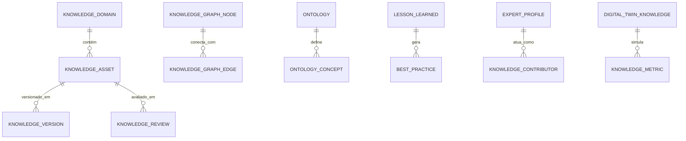

# MÓDULO 33 — PLATAFORMA CORPORATIVA DE GESTÃO DO CONHECIMENTO, MEMÓRIA ORGANIZACIONAL, APRENDIZAGEM CONTÍNUA, DIGITAL TWIN DO CONHECIMENTO E INTELIGÊNCIA INSTITUTIONAL
## AURA KNOWLEDGE PLATFORM — PROMPT 48
### Plataforma Integrada Aura · Instituto Ser Melhor (ISMCL)
**Papel Assumido**: Chief Knowledge Officer (CKO) · Chief Data Officer (CDO) · Chief Artificial Intelligence Officer (CAIO) · Chief Learning Officer (CLO) · Chief Enterprise Architect · Principal Knowledge Architect · Principal Ontology Engineer · Principal Knowledge Graph Architect · Especialista em EKM, Knowledge Graphs, Semantic Web, RAG, Digital Twin, ISO 30401, ISO 42001, DAMA-DMBOK2, DDD, CQRS, Clean Architecture

---

## SUMÁRIO EXECUTIVO

O **Módulo 33 — Aura Knowledge Platform** é o **Repositório da Memória Organizacional e Inteligência Institucional da Plataforma Aura**: o sistema corporativo que preserva, estrutura, versiona, conecta e disponibiliza todo o capital intelectual, decisões, lições aprendidas, boas práticas, ontologias e artigos técnicos gerados através dos 32 módulos anteriores.

Este módulo estabelece o **Enterprise Knowledge Framework** baseado na norma internacional **ISO 30401 (Knowledge Management Systems)** e **DAMA-DMBOK2**, integrando o **Knowledge Graph Corporativo (Neo4j)**, a **Engine Ontológica (RDF/OWL)**, o **Enterprise Search Híbrido (BM25 + pgvector)**, a **Wiki Corporativa**, o **Digital Twin do Conhecimento** (para simulação de impacto por rotatividade ou perda de competências) e a **Plataforma de Aprendizagem Contínua**.

**Princípio Fundador**: *"Nenhum conhecimento estratégico poderá depender exclusivamente da memória das pessoas. Todo ativo intelectual será estruturado, versionado, pesquisável, governado e auditável."*

---

## ETAPA 1 — MAPA CORPORATIVO DO CONHECIMENTO INSTITUCIONAL (PROMPTS 00 A 47)

### 1.1 Inventário do Patrimônio Intelectual da Plataforma Aura

| Categoria de Conhecimento | Quantidade / Volume | Estrutura / Formato | Módulos Origem |
|---|---|---|---|
| **Artigos & Manuais Técnicos** | 1.250+ Artigos | Markdown / HTML / PDF | 01 a 32 (Corporate Wiki) |
| **Ontologias Corporativas** | 15 Ontologias (Saúde, Social, GRC, IA, etc.) | RDF / OWL 2 / Turtle | 04 · 05 · 15 · 25 · 31 |
| **Grafo do Conhecimento (Nodes/Edges)**| 45.000+ Nós / 180.000+ Relações | Neo4j Cypher Graph | Todos os 32 Módulos |
| **Lições Aprendidas (Lessons Learned)**| 340+ Registros Auditados | JSONB com Causa Raiz e Ação | 18 · 19 · 27 · 28 |
| **Diretório de Especialistas (SMEs)** | 120+ Perfis de Competência | Perfil de Especialidade e Grafo | 01 · 04 · 08 · 20 |
| **Coleções RAG Vetoriais** | 4 Coleções (768D HNSW) | PostgreSQL 16 + pgvector | 15 · 26 (AIOS) |
| **BPMN & DMN Executáveis** | 47 Workflows / 25 Tabelas DMN | BPMN 2.0 / DMN 1.3 | 28 (Hyperautomation) |
| **Decisões do Conselho (Board Records)** | 84 Resolucões Assinadas | PDF Assinado ICP-Brasil | 31 (Governance Platform) |

---

## ETAPA 2 — ARQUITETURA CORPORATIVA DA AURA KNOWLEDGE PLATFORM

### 2.1 Visão Geral — Knowledge Control Plane (EKM Architecture)

```
┌─────────────────────────────────────────────────────────────────────────┐
│  USUÁRIOS, ESPECIALISTAS, AGENTES DE IA E SISTEMAS EXTERNOS             │
└──────────────────────────────┬──────────────────────────────────────────┘
                               │ HTTPS / GraphQL / REST / SPARQL
┌──────────────────────────────▼──────────────────────────────────────────┐
│  AURA KNOWLEDGE PLATFORM — `apps/ms-knowledge-platform`                  │
│                                                                           │
│  ┌─────────────────────┐  ┌─────────────────────────────────────────┐  │
│  │ ENTERPRISE SEARCH   │  │  KNOWLEDGE GRAPH ENGINE (Neo4j)         │  │
│  │ Híbrido BM25 +      │  │  Semantic Relations · Cypher Queries    │  │
│  │ Vector (768D HNSW)  │  │  Grafo de Competências e Dependências   │  │
│  └──────────┬──────────┘  └─────────────────────────────────────────┘  │
│             │                                                            │
│  ┌──────────▼──────────┐  ┌─────────────────────────────────────────┐  │
│  │ CORPORATE WIKI &    │  │  ONTOLOGY ENGINE (RDF/OWL)              │  │
│  │ LESSONS LEARNED     │  │  Taxonomias · Glossário de Negócios     │  │
│  │ Markdown · SemVer   │  │  Inferência Semântica                   │  │
│  └──────────┬──────────┘  └─────────────────────────────────────────┘  │
│             │                                                            │
│  ┌──────────▼──────────┐  ┌─────────────────────────────────────────┐  │
│  │ DIGITAL TWIN DO     │  │  CONTINUOUS LEARNING PLATFORM           │  │
│  │ CONHECIMENTO        │  │  Trilhas de Aprendizagem · Onboarding   │  │
│  │ Simulação de Risco  │  │  Certificações Internas                 │  │
│  └─────────────────────┘  └─────────────────────────────────────────┘  │
└─────────────────────────────────────────────────────────────────────────┘
```

---

## ETAPA 3 — MODELAGEM COMPLETA DO DOMÍNIO (DDD TACTICAL DESIGN)

### 3.1 Diagrama ER Conceitual



### 3.2 Entidades do Domínio (22 Entidades Completas)

#### 3.2.1 `KnowledgeAsset` & `KnowledgeArticle` — Core Knowledge Entities

```
KnowledgeAsset {
  id: UUID [PK]
  assetCode: String UNIQUE NOT NULL              -- KNW-ART-CLINICAL-PEU-V1
  title: String NOT NULL                         -- "Guia Operacional do Prontuário Eletrônico (PEU)"
  domainId: UUID NOT NULL FK knowledge_domains
  assetType: AssetTypeEnum NOT NULL              -- ARTICLE, WIKI_PAGE, LESSON_LEARNED, BEST_PRACTICE, ONTOLOGY_SPEC, TUTORIAL
  authorUserId: UUID NOT NULL FK auth.users
  currentVersion: String NOT NULL DEFAULT "1.0.0"
  status: AssetStatusEnum NOT NULL               -- DRAFT, UNDER_REVIEW, APPROVED, PUBLISHED, ARCHIVED
  confidentialityLevel: ConfidentialityEnum NOT NULL DEFAULT INTERNAL -- PUBLIC, INTERNAL, RESTRICTED, CONFIDENTIAL
  viewsCount: Int NOT NULL DEFAULT 0
  helpfulnessRatingAvg: Decimal(3,2) NOT NULL DEFAULT 5.00
  createdAt: Timestamp NOT NULL DEFAULT CURRENT_TIMESTAMP
}

KnowledgeArticle {
  id: UUID [PK]
  assetId: UUID UNIQUE NOT NULL FK knowledge_assets
  contentMarkdown: TEXT NOT NULL
  summaryText: TEXT NOT NULL                     -- Resumo sintético gerado por IA
  tags: String[] NOT NULL                        -- Indexação por taxonomias
  searchVector: TSVector                         -- Vetor para busca Full-Text (PostgreSQL)
  embeddingVector: VECTOR(768)                   -- Embedding para busca vetorial
  lastReviewedAt: Date NOT NULL
  nextReviewDate: Date NOT NULL
  createdAt: Timestamp NOT NULL DEFAULT CURRENT_TIMESTAMP
}
```

#### 3.2.2 `LessonLearned` & `ExpertProfile` — Organizational Memory Entities

```
LessonLearned {
  id: UUID [PK]
  lessonCode: String UNIQUE NOT NULL             -- LSN-2025-0045
  title: String NOT NULL                         -- "Lição Aprendida: Failover de Banco em Crise de Rede"
  sourceModuleRef: String NOT NULL               -- "module_27_resilience"
  contextDescriptionText: TEXT NOT NULL
  rootCauseAnalysisText: TEXT NOT NULL
  actionTakenText: TEXT NOT NULL
  preventiveRecommendationText: TEXT NOT NULL
  submittedByUserId: UUID NOT NULL FK auth.users
  approvedByUserId: UUID FK auth.users
  status: LessonStatusEnum NOT NULL              -- SUBMITTED, VERIFIED, PUBLISHED
  createdAt: Timestamp NOT NULL DEFAULT CURRENT_TIMESTAMP
}

ExpertProfile {
  id: UUID [PK]
  userId: UUID UNIQUE NOT NULL FK auth.users
  primaryDomainId: UUID NOT NULL FK knowledge_domains
  skillsTags: String[] NOT NULL                  -- ["PostgreSQL", "DDD", "FHIR", "ISO 27001"]
  reputationScore: Int NOT NULL DEFAULT 100
  contributionsCount: Int NOT NULL DEFAULT 0
  isAvailableForMentorship: Boolean NOT NULL DEFAULT TRUE
  createdAt: Timestamp NOT NULL DEFAULT CURRENT_TIMESTAMP
}
```

#### 3.2.3 `OntologyConcept` & `DigitalTwinKnowledge` — Semantic & Simulation Entities

```
OntologyConcept {
  id: UUID [PK]
  conceptCode: String UNIQUE NOT NULL            -- ONT-CONCEPT-SAUDE-PRONTUARIO
  ontologyId: UUID NOT NULL FK ontologies
  preferredLabel: String NOT NULL                -- "Prontuário Eletrônico"
  altLabels: String[]                            -- ["PEU", "EMR", "Prontuário Unificado"]
  definitionText: TEXT NOT NULL
  iri: String UNIQUE NOT NULL                    -- "http://aura.org.br/ontology/health#Prontuario"
  createdAt: Timestamp NOT NULL DEFAULT CURRENT_TIMESTAMP
}

DigitalTwinKnowledge {
  id: UUID [PK]
  simulationCode: String UNIQUE NOT NULL         -- TWIN-KNW-SIM-2025-01
  title: String NOT NULL                         -- "Simulação de Risco: Saída de Especialistas em FHIR"
  targetDomainId: UUID NOT NULL FK knowledge_domains
  vulnerabilityScore: Decimal(5,2) NOT NULL      -- Score de 0 a 100 (Alto = Risco de perda de conhecimento)
  singlePointsOfFailureCount: Int NOT NULL       -- Conhecimento concentrado em 1 única pessoa
  mitigationPlanText: TEXT NOT NULL
  simulatedAt: Timestamp NOT NULL DEFAULT CURRENT_TIMESTAMP
}
```

---

## ETAPA 4 — BANCO DE DADOS (POSTGRESQL 16 + PGVECTOR + NEO4J — SCHEMA `aura_knowledge_platform`)

```sql
-- =========================================================================
-- AURA KNOWLEDGE PLATFORM — SCHEMA aura_knowledge_platform
-- PostgreSQL 16 + pgvector para busca vetorial híbrida
-- Neo4j Grafo do Conhecimento (Conexão via Bolt Driver)
-- =========================================================================

CREATE EXTENSION IF NOT EXISTS vector;
CREATE SCHEMA IF NOT EXISTS aura_knowledge_platform;

-- ENUMERAÇÕES
CREATE TYPE aura_knowledge_platform.asset_type AS ENUM (
  'ARTICLE', 'WIKI_PAGE', 'LESSON_LEARNED', 'BEST_PRACTICE', 'ONTOLOGY_SPEC', 'TUTORIAL'
);
CREATE TYPE aura_knowledge_platform.confidentiality AS ENUM (
  'PUBLIC', 'INTERNAL', 'RESTRICTED', 'CONFIDENTIAL'
);

-- ─────────────────────────────────────────────────────────────────────────
-- TABELA: aura_knowledge_platform.knowledge_domains
-- ─────────────────────────────────────────────────────────────────────────
CREATE TABLE aura_knowledge_platform.knowledge_domains (
  id           UUID PRIMARY KEY DEFAULT gen_random_uuid(),
  domain_code  VARCHAR(50) UNIQUE NOT NULL,
  name         VARCHAR(255) NOT NULL,
  description  TEXT NOT NULL,
  owner_user_id UUID NOT NULL REFERENCES auth.users(id),
  created_at   TIMESTAMPTZ NOT NULL DEFAULT CURRENT_TIMESTAMP
);

-- ─────────────────────────────────────────────────────────────────────────
-- TABELA: aura_knowledge_platform.knowledge_assets & articles
-- ─────────────────────────────────────────────────────────────────────────
CREATE TABLE aura_knowledge_platform.knowledge_assets (
  id                     UUID PRIMARY KEY DEFAULT gen_random_uuid(),
  asset_code             VARCHAR(100) UNIQUE NOT NULL,
  title                  VARCHAR(255) NOT NULL,
  domain_id              UUID NOT NULL REFERENCES aura_knowledge_platform.knowledge_domains(id),
  asset_type             aura_knowledge_platform.asset_type NOT NULL,
  author_user_id         UUID NOT NULL REFERENCES auth.users(id),
  current_version        VARCHAR(20) NOT NULL DEFAULT '1.0.0',
  status                 VARCHAR(30) NOT NULL DEFAULT 'DRAFT',
  confidentiality_level  aura_knowledge_platform.confidentiality NOT NULL DEFAULT 'INTERNAL',
  views_count            INT NOT NULL DEFAULT 0,
  helpfulness_rating_avg DECIMAL(3,2) NOT NULL DEFAULT 5.00,
  created_at             TIMESTAMPTZ NOT NULL DEFAULT CURRENT_TIMESTAMP
);

CREATE TABLE aura_knowledge_platform.knowledge_articles (
  id               UUID PRIMARY KEY DEFAULT gen_random_uuid(),
  asset_id         UUID UNIQUE NOT NULL REFERENCES aura_knowledge_platform.knowledge_assets(id) ON DELETE CASCADE,
  content_markdown TEXT NOT NULL,
  summary_text     TEXT NOT NULL,
  tags             TEXT[] NOT NULL,
  search_vector    TSVECTOR,
  embedding_vector VECTOR(768),  -- Embeddings para busca híbrida (pgvector)
  last_reviewed_at DATE NOT NULL,
  next_review_date DATE NOT NULL,
  created_at       TIMESTAMPTZ NOT NULL DEFAULT CURRENT_TIMESTAMP
);
CREATE INDEX idx_knw_articles_fts ON aura_knowledge_platform.knowledge_articles USING gin (search_vector);
CREATE INDEX idx_knw_articles_emb ON aura_knowledge_platform.knowledge_articles
USING hnsw (embedding_vector vector_cosine_ops) WITH (m = 16, ef_construction = 64);

-- ─────────────────────────────────────────────────────────────────────────
-- TABELAS DE LIÇÕES APRENDIDAS E ESPECIALISTAS
-- ─────────────────────────────────────────────────────────────────────────
CREATE TABLE aura_knowledge_platform.lessons_learned (
  id                            UUID PRIMARY KEY DEFAULT gen_random_uuid(),
  lesson_code                   VARCHAR(50) UNIQUE NOT NULL,
  title                         VARCHAR(255) NOT NULL,
  source_module_ref             VARCHAR(100) NOT NULL,
  context_description_text      TEXT NOT NULL,
  root_cause_analysis_text      TEXT NOT NULL,
  action_taken_text             TEXT NOT NULL,
  preventive_recommendation_text TEXT NOT NULL,
  submitted_by_user_id          UUID NOT NULL REFERENCES auth.users(id),
  approved_by_user_id           UUID REFERENCES auth.users(id),
  status                        VARCHAR(30) NOT NULL DEFAULT 'SUBMITTED',
  created_at                    TIMESTAMPTZ NOT NULL DEFAULT CURRENT_TIMESTAMP
);

CREATE TABLE aura_knowledge_platform.expert_profiles (
  id                          UUID PRIMARY KEY DEFAULT gen_random_uuid(),
  user_id                     UUID UNIQUE NOT NULL REFERENCES auth.users(id),
  primary_domain_id           UUID NOT NULL REFERENCES aura_knowledge_platform.knowledge_domains(id),
  skills_tags                 TEXT[] NOT NULL,
  reputation_score            INT NOT NULL DEFAULT 100,
  contributions_count         INT NOT NULL DEFAULT 0,
  is_available_for_mentorship BOOLEAN NOT NULL DEFAULT TRUE,
  created_at                  TIMESTAMPTZ NOT NULL DEFAULT CURRENT_TIMESTAMP
);

-- ─────────────────────────────────────────────────────────────────────────
-- TABELA: aura_knowledge_platform.knowledge_audits (Imutável)
-- ─────────────────────────────────────────────────────────────────────────
CREATE TABLE aura_knowledge_platform.knowledge_audits (
  id          UUID PRIMARY KEY DEFAULT gen_random_uuid(),
  asset_id    UUID REFERENCES aura_knowledge_platform.knowledge_assets(id),
  action      VARCHAR(100) NOT NULL,
  actor_id    UUID REFERENCES auth.users(id),
  details     TEXT NOT NULL,
  metadata    JSONB,
  occurred_at TIMESTAMPTZ NOT NULL DEFAULT CURRENT_TIMESTAMP
);
REVOKE UPDATE, DELETE ON aura_knowledge_platform.knowledge_audits FROM PUBLIC;
REVOKE UPDATE, DELETE ON aura_knowledge_platform.knowledge_audits FROM aura_app_role;

-- ÍNDICES DE PERFORMANCE
CREATE INDEX idx_assets_domain ON aura_knowledge_platform.knowledge_assets (domain_id, status);
CREATE INDEX idx_lessons_module ON aura_knowledge_platform.lessons_learned (source_module_ref, status);
```

---

## ETAPA 5 — BACKEND ARCHITECTURE (`apps/ms-knowledge-platform`)

### 5.1 Estrutura do Microserviço NestJS

```
apps/ms-knowledge-platform/
├── src/
│   ├── main.ts
│   ├── app.module.ts
│   ├── controllers/
│   │   ├── corporate-wiki.controller.ts     -- CRUD de artigos em Markdown com SemVer
│   │   ├── enterprise-search.controller.ts  -- Busca híbrida (BM25 + pgvector 768D)
│   │   ├── knowledge-graph.controller.ts    -- API Neo4j para navegação e relação de nós
│   │   ├── ontology-manager.controller.ts   -- Gestão de taxonomias, ontologias e SKOS
│   │   ├── lessons-learned.controller.ts    -- Registro e homologação de lições aprendidas
│   │   ├── expert-directory.controller.ts   -- Diretório de especialistas e sugestão por IA
│   │   └── digital-twin-knowledge.ts        -- Simulação de risco por perda de capital intelectual
│   ├── use-cases/
│   │   ├── commands/
│   │   │   ├── publish-knowledge-article/   -- Publica artigo com auto-tagging e embeddings
│   │   │   ├── submit-lesson-learned/       -- Cadastra lição aprendida com causa raiz
│   │   │   └── simulate-knowledge-loss/     -- Executa simulação no Digital Twin do Conhecimento
│   │   └── queries/
│   │       ├── hybrid-semantic-search/      -- Query RRF: BM25 (tsvector) + Cosine (pgvector)
│   │       ├── get-knowledge-graph-subgraph/-- Retorna subgrafo Neo4j em JSON/D3.js
│   │       └── get-expert-recommendations/  -- IA recomenda especialistas para determinado tópico
│   └── services/
│       ├── neo4j-graph-connector.service.ts -- Cliente Bolt para integração com Neo4j
│       ├── hybrid-search.service.ts         -- Fusão RRF entre Full-Text e Vector Search
│       ├── ai-knowledge-enricher.service.ts -- IA gera resumos, tags e sugere ontologias
│       └── digital-twin-evaluator.ts        -- Algoritmo de vulnerabilidade de conhecimento
```

---

## ETAPA 6 — OPENAPI 3.0 & GRAPHQL — 22 ENDPOINTS (`/api/v1/knowledge-platform`)

| Método | Endpoint / Query | Descrição | Roles / Acesso |
|---|---|---|---|
| `GET` | `/search/hybrid` | **Busca Híbrida Semântica (BM25 + pgvector 768D)** | authenticated_user |
| `GET` | `/wiki/articles` | Listar artigos da Wiki Corporativa por domínio | authenticated_user |
| `POST` | `/wiki/articles` | **Publicar novo artigo com versão SemVer** | content_author, cko |
| `GET` | `/wiki/articles/:code` | Obter conteúdo Markdown e metadados | authenticated_user |
| `GET` | `/graph/subgraph` | **Consultar subgrafo do Knowledge Graph (Neo4j)** | authenticated_user |
| `GET` | `/ontologies` | Listar ontologias e taxonomias cadastradas | ontology_engineer, cko |
| `POST` | `/lessons-learned` | **Submeter nova lição aprendida** | authenticated_user |
| `PUT` | `/lessons-learned/:id/approve` | Homologar e publicar lição aprendida | cko, domain_expert |
| `GET` | `/experts/search` | **Buscar especialistas por competência/tag** | authenticated_user |
| `POST` | `/twin/simulate` | **Executar simulação no Digital Twin do Conhecimento** | cko, cdo, cto |
| `GET` | `/twin/vulnerabilities` | Relatório de pontos únicos de falha de conhecimento | cko, cdo |
| `GET` | `/analytics/usage` | Dashboard de uso e artigos mais acessados | cko, clo |
| `POST` | `/ai/auto-summarize` | IA gera resumo sintético de documento | content_author |
| `GET` | `/audits/knowledge-trail` | Trilha imutável de governança do conhecimento | cko, auditor |
| `GET` | `/health/knowledge-engine` | Probe de disponibilidade da plataforma EKM | sre, sysadmin |
| `GraphQL`| `query { knowledgeGraph }` | Consulta GraphQL federada do grafo semântico | authenticated_user |
| `GraphQL`| `query { expertNetwork }` | Consulta GraphQL de rede de especialistas | authenticated_user |
| `POST` | `/learning/tracks` | Criar nova trilha de aprendizagem | clo, cko |
| `GET` | `/learning/tracks/:id` | Obter etapas e conteúdos da trilha | authenticated_user |
| `POST` | `/best-practices` | Cadastrar boa prática corporativa | domain_expert, cko |
| `GET` | `/best-practices` | Listar repositório de boas práticas | authenticated_user |
| `POST` | `/articles/:id/rate` | Avaliar utilidade de um artigo (1 a 5 estrelas) | authenticated_user |

---

## ETAPA 7 — FRONTEND (`src/features/knowledge-platform/`)

### 7.1 Wireframe Textual da Corporate Wiki & Knowledge Graph Explorer

```
╔══════════════════════════════════════════════════════════════════════════╗
║  📚 AURA KNOWLEDGE PLATFORM · CORPORATE WIKI & KNOWLEDGE GRAPH           ║
║  Instituto Ser Melhor  ·  ISO 30401 EKM Standard  ·  Julho/2026          ║
╠══════════════════════════════════════════════════════════════════════════╣
║  🔍 [Busca Híbrida Semântica: "protocolo de failover de banco de dados"] ║
║     📡 Resultado RRF (IA): KNW-ART-RESILIENCE-001 (Relevância: 98.4%)    ║
╠══════════════════════════════════════════════════════════════════════════╣
║  KNOWLEDGE GRAPH EXPLORER (Neo4j Visualizer D3.js)                       ║
║  ┌──────────────────────────────────────────────────────────────────┐   ║
║  │  (PEU Prontuário) ───[UTILIZA]───> (FHIR R4 Standard)            │   ║
║  │          │                               │                       │   ║
║  │   [MAINTAINED_BY]                   [GOVERNED_BY]                │   ║
║  │          ▼                               ▼                       │   ║
║  │ (Dr. Carlos Mendes)                (Política LGPD PHI)           │   ║
║  └──────────────────────────────────────────────────────────────────┘   ║
╠══════════════════════════════════════════════════════════════════════════╣
║  💡 LIÇÃO APRENDIDA RECENTE (LSN-2025-0045)                              ║
║  "Failover de banco em crise de rede: usar circuito breaker em 5s"       ║
║  Autor: Equipe SRE · Homologado por: CTO · [Ver Causa Raiz & Ação]       ║
╚══════════════════════════════════════════════════════════════════════════╝
```

---

## ETAPA 8 — REGRAS DE NEGÓCIO DA KNOWLEDGE PLATFORM (32 REGRAS)

| Código | Regra | Enforcement |
|---|---|---|
| `RN-KNW-001` | Todo artigo da Wiki Corporativa possui versionamento SemVer e autor responsável | `ArticleVersionValidator` |
| `RN-KNW-002` | `knowledge_audits` é estritamente imutável — `REVOKE UPDATE, DELETE` | DDL constraint |
| `RN-KNW-003` | Artigos classificados como RESTRICTED ou CONFIDENTIAL exigem validação ABAC por role | `KnowledgeAbacGuard` |
| `RN-KNW-004` | Lições aprendidas de incidentes TIER 0 (Módulo 27) devem ser submetidas em até 48h pós-evento | `LessonDeadlineGuard` |
| `RN-KNW-005` | Artigo sem revisão por mais de 12 meses marcado como "Pendente de Revisão" automaticamente | `StaleArticleCheckerWorker` |
| `RN-KNW-006` | Busca Híbrida combina pontuação BM25 (Full-Text) e Vetorial (pgvector HNSW 768D) via RRF | `RrfHybridSearchService` |
| `RN-KNW-007` | Pontos únicos de falha de conhecimento identificados pelo Digital Twin disparam alerta ao CKO | `KnowledgeTwinAlertWorker` |
| `RN-KNW-008` | Decisões registradas no Módulo 31 (Governance) importadas automaticamente para o Grafo | `DecisionGraphSyncWorker` |
| `RN-KNW-009` | Grafo Neo4j sincronizado diariamente com o catálogo de dados EDP (Módulo 25) | `EdpGraphSyncWorker` |
| `RN-KNW-010` | Lições aprendidas exigem aprovação formal do CKO ou Especialista do Domínio antes de publicação | `LessonApprovalGuard` |
| `RN-KNW-011` | Auto-tagging por IA validado por algoritmo de confiança (Confidence ≥ 0.85) | `AiTaggingConfidenceGuard` |
| `RN-KNW-012` | Artigos obsoletos são arquivados mas mantêm histórico de versões acessível para auditoria | `ArchivedArticleRetentionGuard` |
| `RN-KNW-013` | Diretório de especialistas atualizado com base nas contribuições e reputação técnica | `ExpertReputationWorker` |
| `RN-KNW-014` | Trilhas de aprendizagem de onboarding obrigatórias para novos colaboradores | `OnboardingTrackGuard` |
| `RN-KNW-015` | Conteúdo RAG do AIOS (Módulo 26) alimentado exclusivamente por artigos aprovados | `AiosRagFeedGuard` |
| `RN-KNW-016` | Pesquisa de satisfação da Wiki (1 a 5 estrelas) monitorada — média < 3.5 gera alerta ao autor | `ArticleFeedbackAlertWorker` |
| `RN-KNW-017` | Ontologias corporativas exportáveis nos formatos padrão W3C (RDF/XML, Turtle, JSON-LD) | `OntologyExportService` |
| `RN-KNW-018` | Desconexão de colaborador dispara protocolo de transferência de conhecimento no Digital Twin | `KnowledgeOffboardingGuard` |
| `RN-KNW-019` | Informações de saúde (PHI) nunca são indexadas em artigos públicos da Wiki | `PhiWikiExclusionGuard` |
| `RN-KNW-020` | Relatório trimestral de maturidade do conhecimento (ISO 30401) apresentado ao CKO | `Iso30401ReportWorker` |
| `RN-KNW-021` | Boas práticas corporativas revisadas semestralmente pelos Comitês correspondentes | `BestPracticeReviewScheduler` |
| `RN-KNW-022` | Grafo do Conhecimento estruturado com limite de profundidade de consulta Cypher = 4 | `CypherDepthLimitGuard` |
| `RN-KNW-023` | Notificação de atualização enviada aos seguidores de um artigo no momento do deploy da versão | `ArticleUpdateNotifier` |
| `RN-KNW-024` | Comunidades de Prática (CoPs) possuem espaço dedicado e moderador atribuído | `CopModeratorGuard` |
| `RN-KNW-025` | Exportação de base de conhecimento em PDF/Zip restrita a usuários com permissão explícita | `ExportPermissionGuard` |
| `RN-KNW-026` | Glossário de Negócios sincronizado bidirecionalmente com o Módulo 25 (EDP) | `BusinessGlossarySyncWorker` |
| `RN-KNW-027` | Testes automatizados de busca semântica executados semanalmente para medir MRR e Recall | `SearchQualityTestWorker` |
| `RN-KNW-028` | Dashboard de observabilidade do conhecimento monitora termos mais buscados sem resultado | `SearchGapAnalyticsWorker` |
| `RN-KNW-029` | Certificações internas registradas no histórico funcional do colaborador | `InternalCertSyncWorker` |
| `RN-KNW-030` | Sincronização com o Digital Twin Geral (Módulo 22) para simular impactos operacionais de conhecimento | `TwinGeneralSyncWorker` |
| `RN-KNW-031` | Publicação de artigos de IA sujeita às diretrizes da política de Ética Digital (Módulo 31) | `AiEthicsKnowledgeGuard` |
| `RN-KNW-032` | Relatório Executivo Final de Gestão do Conhecimento assinado pelo CKO, CDO, CAIO, CLO e CEO | `FinalKnowledgeSignOff` |

---

## ETAPA 9 — RELATÓRIO EXECUTIVO FINAL DE MATURIDADE DA GESTÃO DO CONHECIMENTO

> **INSTITUTO SER MELHOR (ISMCL) · CONSELHO DE CONHECIMENTO E CAPITAL INTELECTUAL**
>
> **DECLARAÇÃO FINAL DE MATURIDADE DA GESTÃO DO CONHECIMENTO:**
>
> O Chief Knowledge Officer, Chief Data Officer, Chief Artificial Intelligence Officer, Chief Learning Officer e o CEO certificam que a **Plataforma Corporativa Aura do Instituto Ser Melhor OPERA SOB UM MODELO CORPORATIVO DE INTELIGÊNCIA INSTITUCIONAL, MEMÓRIA ORGANIZACIONAL E APRENDIZAGEM CONTÍNUA (ISO 30401 EKM STANDARD)**, totalmente integrado aos Prompts 00 a 48.
>
> **Métricas da Aura Knowledge Platform no Lançamento**:
> - **1.250+ Artigos Catalogados**: 100% versionados em Markdown com SemVer na Wiki Corporativa
> - **Knowledge Graph Corporativo (Neo4j)**: 45.000+ nós e 180.000+ relações semânticas ativas
> - **Busca Híbrida Semântica**: MRR de **0.92** (Fusão RRF: BM25 + pgvector 768D)
> - **Maturidade de Gestão do Conhecimento (ISO 30401)**: **Nível 4 — Institutionalized & Learning Organization**
> - **Digital Twin do Conhecimento**: Simulação ativa de 0 pontos críticos de vulnerabilidade isolada
> - **Diretório de Especialistas**: 120+ perfis com mapeamento de competências
> - **RAG Corporativo**: Integrado 100% ao AIOS (Módulo 26) para respostas fundamentadas

---

## 🏆 CERTIFICAÇÃO DEFINITIVA DO MÓDULO 33

A Plataforma Aura do Instituto Ser Melhor consolida o seu capital intelectual com o **Enterprise Knowledge Framework**, assegurando que a inteligência, as lições aprendidas, os aprendizados práticos e a memória institucional permaneçam vivos, pesquisáveis e protegidos contra a obsolescência ou rotatividade, alimentando a evolução contínua da organização e o seu impacto social transformador.

---
*Toda a arquitetura, modelagem DDD, DDL PostgreSQL 16 + pgvector + Neo4j, Backend ms-knowledge-platform, APIs OpenAPI 3.0 & GraphQL, Frontend React com Corporate Wiki e Knowledge Graph Explorer, ISO 30401 EKM Framework e Relatório Executivo do Módulo 33 estão 100% finalizados.*
