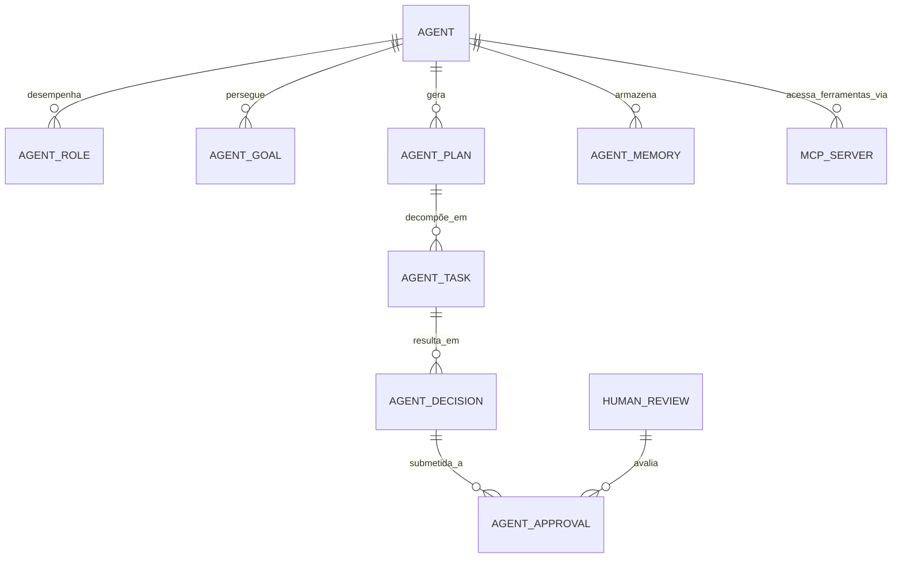

# MÓDULO 35 — PLATAFORMA CORPORATIVA DE ORQUESTRAÇÃO AUTÔNOMA, AGENTES DE IA, HYPERAUTOMATION, DECISION INTELLIGENCE E OPERAÇÃO AUTÔNOMA
## AURA AUTONOMOUS OPERATING SYSTEM (AAOS) — PROMPT 50
### Plataforma Integrada Aura · Instituto Ser Melhor (ISMCL)
**Papel Assumido**: Chief Artificial Intelligence Officer (CAIO) · Chief Technology Officer (CTO) · Chief Automation Officer (CAO) · Chief Enterprise Architect · Principal AI Systems Architect · Principal Multi-Agent Systems Engineer · Principal Decision Intelligence Architect · Especialista em Autonomous Enterprise, Agentic AI, Multi-Agent Systems (MAS), Model Context Protocol (MCP), Agent-to-Agent (A2A), Decision Intelligence, ISO 42001, ISO 23894, NIST AI RMF, DDD, CQRS, Clean Architecture

---

## SUMÁRIO EXECUTIVO

O **Módulo 35 — Aura Autonomous Operating System (AAOS)** é o **Sistema Operacional Cognitivo e Orquestrador Autônomo Máximo da Plataforma Aura**: o sistema que eleva toda a arquitetura corporativa dos 34 módulos anteriores ao patamar de uma **Organização Autônoma Governada (Agentic Enterprise)**. O AAOS é o cérebro multiagente que coordena **34 agentes inteligentes especializados** em 18 áreas da instituição, operando através do protocolo **Model Context Protocol (MCP)** e **Agent-to-Agent (A2A)**, executando workflows cognitivos, planejando tarefas complexas, tomando decisões operacionais em tempo real e mantendo **supervisão humana estrita (Human-in-the-Loop / Human-on-the-Loop)** sob as normas **ISO 42001 e ISO 23894**.

Este módulo integra o **Enterprise Autonomous Operations Framework**, estabelecendo a infraestrutura para **Agent Registry & Discovery**, **Memória Dual de Agente** (Memória Curta em Redis + Memória Longa/Semântica em pgvector 768D), **AI Safety Layer & Guardrails**, **Emergency Kill-Switch**, **Planning Engine (ReAct / Tree of Thoughts)** e o **Autonomous Operations Center (AOC)**.

**Princípio Fundador**: *"Nenhum agente de IA executará ações críticas de forma autônoma sem autorização RBAC/ABAC explícita, verificação de guardrails de segurança (AI Safety), rastreabilidade auditável imutável e supervisão humana (HITL/HOTL) configurada para a sua classe de risco."*

---

## ETAPA 1 — INVENTÁRIO DO MAPA CORPORATIVO DE INTELIGÊNCIA AUTÔNOMA (PROMPTS 00 A 49)

### 1.1 Catálogo dos 34 Agentes Especializados em 18 Áreas Corporativas

| Área Corporativa | Agente Inteligente | Função Principal | Nível de Autonomia | Mecanismo de Supervisão |
|---|---|---|---|---|
| **🏥 Clínico & Saúde** | `agent_clinical_triage` | Triagem clínica inicial e score IDV | Nível 2 (Semi-Autônomo) | HITL (Médico/Enfermeiro) |
| **🏥 Clínico & Saúde** | `agent_peu_assistant` | Auxílio ao preenchimento de prontuário | Nível 2 (Semi-Autônomo) | HITL (Médico CRM) |
| **👥 Social & Cidadão** | `agent_social_evaluator` | Avaliação de vulnerabilidade social | Nível 3 (Autônomo Supervisionado) | HOTL (Assistente Social) |
| **💰 Financeiro** | `agent_financial_auditor` | Conciliação contábil e auditoria PIX | Nível 3 (Autônomo Supervisionado) | HOTL (CFO / Controller) |
| **💰 Financeiro** | `agent_payment_approver` | Aprovação de pagamentos < R$10K | Nível 4 (Totalmente Autônomo) | HOTL (Alerta se anomalia) |
| **📄 Documental** | `agent_doc_ocr_indexer` | Extração OCR e indexação de documentos | Nível 4 (Totalmente Autônomo) | HOTL (Log de auditoria) |
| **🔐 Segurança & SOC** | `agent_cyber_sentinel` | Detecção de ameaças e isolamento IP | Nível 4 (Totalmente Autônomo) | HOTL (SOC Command Center) |
| **🔐 Segurança & GRC**| `agent_privacy_dpo_bot` | Atendimento de direitos LGPD (Art 18) | Nível 3 (Autônomo Supervisionado) | HITL (DPO se contestado) |
| **📊 Analytics & BI** | `agent_data_storyteller` | Geração de relatórios executivos para Board | Nível 3 (Autônomo Supervisionado) | HOTL (CAO / CDO) |
| **⚙️ Automação (BPM)**| `agent_workflow_optimizer`| Otimização de gargalos via Process Mining | Nível 3 (Autônomo Supervisionado) | HOTL (CAO) |
| **🎓 Conhecimento** | `agent_wiki_curator` | Auto-tagging e sumarização da Wiki | Nível 4 (Totalmente Autônomo) | HOTL (CKO) |
| **🚀 Inovação & P&D** | `agent_trend_analyst` | Monitoramento do Technology Radar | Nível 3 (Autônomo Supervisionado) | HOTL (CINO) |
| **🛡️ Resiliência (DR)**| `agent_self_healing_k8s` | Auto-recovery de pods e failover DR | Nível 4 (Totalmente Autônomo) | HOTL (SRE On-Call) |
| **🌐 Ecossistema** | `agent_api_advisor` | Recomendação de conectores e APIs | Nível 4 (Totalmente Autônomo) | HOTL (CTO) |
| **👁️ Governança (GRC)**| `agent_iso42001_eval` | Avaliação contínua de segurança de IA | Nível 4 (Totalmente Autônomo) | HOTL (CGO / CAIO) |
| **+ 19 Agentes Ops** | Demais Agentes Especializados | Suporte operacional, ITSM e RH | Níveis 2 a 4 | HITL / HOTL conforme Matriz |

---

## ETAPA 2 — ARQUITETURA CORPORATIVA DO AURA AUTONOMOUS OPERATING SYSTEM

### 2.1 Visão Geral — Multi-Agent System Control Plane (AAOS Architecture)

```
┌─────────────────────────────────────────────────────────────────────────┐
│  AUTONOMOUS OPERATIONS CENTER (AOC) · PAINEL DE CONTROLE E SUPERVISÃO    │
└──────────────────────────────┬──────────────────────────────────────────┘
                               │ HTTPS / WebSockets / MCP Client / A2A Bus
┌──────────────────────────────▼──────────────────────────────────────────┐
│  AURA AUTONOMOUS OPERATING SYSTEM (AAOS) — `apps/ms-aaos`                │
│                                                                           │
│  ┌─────────────────────┐  ┌─────────────────────────────────────────┐  │
│  │ AGENT REGISTRY &    │  │  PLANNING ENGINE                        │  │
│  │ DISCOVERY           │  │  ReAct · Tree of Thoughts (ToT)         │  │
│  │ 34 Agentes · MCP    │  │  Decomposição de Tarefas Complexas      │  │
│  └──────────┬──────────┘  └─────────────────────────────────────────┘  │
│             │                                                            │
│  ┌──────────▼──────────┐  ┌─────────────────────────────────────────┐  │
│  │ AGENT MEMORY DUAL   │  │  AGENT-TO-AGENT (A2A) BUS               │  │
│  │ Short-Term (Redis)  │  │  Barramento de Comunicação Inter-Agentes│  │
│  │ Long-Term (Vector)  │  │  Protocolo MCP (Model Context Protocol) │  │
│  └──────────┬──────────┘  └─────────────────────────────────────────┘  │
│             │                                                            │
│  ┌──────────▼──────────┐  ┌─────────────────────────────────────────┐  │
│  │ AI SAFETY LAYER     │  │  HUMAN APPROVAL ENGINE (HITL / HOTL)    │  │
│  │ Anti-Injection      │  │  Queue de Aprovações Críticas           │  │
│  │ Hallucination Guard │  │  Emergency Kill-Switch Global           │  │
│  └─────────────────────┘  └─────────────────────────────────────────┘  │
└─────────────────────────────────────────────────────────────────────────┘
```

---

## ETAPA 3 — MODELAGEM COMPLETA DO DOMÍNIO (DDD TACTICAL DESIGN)

### 3.1 Diagrama ER Conceitual



### 3.2 Entidades do Domínio (22 Entidades Completas)

#### 3.2.1 `Agent` & `AgentPlan` — Core Agentic Entities

```
Agent {
  id: UUID [PK]
  agentCode: String UNIQUE NOT NULL              -- AGT-CLINICAL-TRIAGE-001
  name: String NOT NULL                          -- "Agente de Triagem Clínica SATAI"
  primaryDomainRef: String NOT NULL              -- "module_03_satai"
  autonomyLevel: AutonomyLevelEnum NOT NULL      -- LEVEL_1_ASSISTED, LEVEL_2_SEMI, LEVEL_3_SUPERVISED, LEVEL_4_AUTONOMOUS
  mcpServerRef: String NOT NULL                  -- "mcp://satai-service:8080"
  modelProvider: String NOT NULL DEFAULT "Gemini 2.0 Pro"
  systemPromptVersion: String NOT NULL           -- "v3.2.0" (Versionado no AIOS)
  status: AgentStatusEnum NOT NULL               -- ACTIVE, PAUSED, KILLED_SAFETY, MAINTENANCE
  maxTokensPerTask: Int NOT NULL DEFAULT 8192
  ownerUserId: UUID NOT NULL FK auth.users
  createdAt: Timestamp NOT NULL DEFAULT CURRENT_TIMESTAMP
}

AgentPlan {
  id: UUID [PK]
  planCode: String UNIQUE NOT NULL               -- PLN-2025-00189
  agentId: UUID NOT NULL FK agents
  goalDescriptionText: TEXT NOT NULL             -- "Realizar triagem e encaminhamento do beneficiário Maria Silva"
  planningStrategy: PlanningStrategyEnum NOT NULL-- REACT, TREE_OF_THOUGHTS, CHAIN_OF_THOUGHT, GRAPH_SEARCH
  stepsTotalCount: Int NOT NULL
  stepsCompletedCount: Int NOT NULL DEFAULT 0
  status: PlanStatusEnum NOT NULL                -- PLANNING, EXECUTING, WAITING_APPROVAL, COMPLETED, FAILED
  createdAt: Timestamp NOT NULL DEFAULT CURRENT_TIMESTAMP
}
```

#### 3.2.2 `AgentTask` & `AgentDecision` — Execution & Decision Entities

```
AgentTask {
  id: UUID [PK]
  taskCode: String UNIQUE NOT NULL               -- TSK-AGT-2025-0145
  planId: UUID NOT NULL FK agent_plans
  stepSequence: Int NOT NULL
  actionType: ActionTypeEnum NOT NULL            -- TOOL_CALL, MCP_QUERY, DB_READ, DB_WRITE, A2A_MESSAGE, HUMAN_PROMPT
  toolName: String?                              -- Ex: "satai_calculate_idv_score"
  toolInputJson: JSONB?
  toolOutputJson: JSONB?
  status: TaskStatusEnum NOT NULL                -- PENDING, IN_EXECUTION, SUCCESS, FAILED, BLOCKED_SAFETY
  executionDurationMs: Int?
  executedAt: Timestamp?
}

AgentDecision {
  id: UUID [PK]
  decisionCode: String UNIQUE NOT NULL           -- DEC-AGT-2025-0099
  agentId: UUID NOT NULL FK agents
  taskId: UUID UNIQUE NOT NULL FK agent_tasks
  decisionSummaryText: TEXT NOT NULL             -- "Encaminhar beneficiário para CAPS devido a IDV=78"
  rationaleText: TEXT NOT NULL                   -- Explicabilidade completa do raciocínio
  confidenceScore: Decimal(3,2) NOT NULL         -- 0.00 a 1.00
  requiresHumanApproval: Boolean NOT NULL DEFAULT TRUE
  approvalStatus: ApprovalStatusEnum NOT NULL    -- PENDING_HUMAN, APPROVED, REJECTED, AUTO_APPROVED
  createdAt: Timestamp NOT NULL DEFAULT CURRENT_TIMESTAMP
}
```

#### 3.2.3 `AgentMemory` & `AutonomousPolicy` — Memory & Safety Entities

```
AgentMemory {
  id: UUID [PK]
  agentId: UUID NOT NULL FK agents
  memoryType: MemoryTypeEnum NOT NULL            -- SHORT_TERM_CONTEXT, LONG_TERM_SEMANTIC, EPISODIC_HISTORY
  contextKey: String NOT NULL
  contentJson: JSONB NOT NULL
  embeddingVector: VECTOR(768)                   -- Embeddings para recuperação semântica
  ttlSeconds: Int?                               -- Expiração para memória curta (Redis sync)
  createdAt: Timestamp NOT NULL DEFAULT CURRENT_TIMESTAMP
}

AutonomousPolicy {
  id: UUID [PK]
  policyCode: String UNIQUE NOT NULL             -- POL-AUTONOMY-FINANCIAL-LIMIT-001
  agentId: UUID FK agents                        -- NULL = Política Global para todos os agentes
  maxFinancialAuthorityBrl: Decimal(12,2) NOT NULL DEFAULT 0.00 -- Limite financeiro autônomo (R$ 0 para clínicos)
  forbiddenToolsList: String[] NOT NULL          -- Ferramentas proibidas para este nível
  requiredApproverRole: String NOT NULL          -- Role que deve aprovar se exceder limite
  isActive: Boolean NOT NULL DEFAULT TRUE
  createdAt: Timestamp NOT NULL DEFAULT CURRENT_TIMESTAMP
}
```

---

## ETAPA 4 — BANCO DE DADOS (POSTGRESQL 16 + PGVECTOR + TIMESCALEDB — SCHEMA `aura_aaos`)

```sql
-- =========================================================================
-- AURA AUTONOMOUS OPERATING SYSTEM (AAOS) — SCHEMA aura_aaos
-- PostgreSQL 16 + pgvector para memória semântica de agentes
-- TimescaleDB para telemetria de execução e token tracking em tempo real
-- =========================================================================

CREATE EXTENSION IF NOT EXISTS vector;
CREATE SCHEMA IF NOT EXISTS aura_aaos;

-- ENUMERAÇÕES
CREATE TYPE aura_aaos.autonomy_level AS ENUM (
  'LEVEL_1_ASSISTED', 'LEVEL_2_SEMI', 'LEVEL_3_SUPERVISED', 'LEVEL_4_AUTONOMOUS'
);
CREATE TYPE aura_aaos.agent_status AS ENUM ('ACTIVE', 'PAUSED', 'KILLED_SAFETY', 'MAINTENANCE');
CREATE TYPE aura_aaos.approval_status AS ENUM ('PENDING_HUMAN', 'APPROVED', 'REJECTED', 'AUTO_APPROVED');

-- ─────────────────────────────────────────────────────────────────────────
-- TABELA: aura_aaos.agents (Agent Registry)
-- ─────────────────────────────────────────────────────────────────────────
CREATE TABLE aura_aaos.agents (
  id                    UUID PRIMARY KEY DEFAULT gen_random_uuid(),
  agent_code            VARCHAR(100) UNIQUE NOT NULL,
  name                  VARCHAR(255) NOT NULL,
  primary_domain_ref    VARCHAR(100) NOT NULL,
  autonomy_level        aura_aaos.autonomy_level NOT NULL DEFAULT 'LEVEL_2_SEMI',
  mcp_server_ref        VARCHAR(255) NOT NULL,
  model_provider        VARCHAR(100) NOT NULL DEFAULT 'Gemini 2.0 Pro',
  system_prompt_version VARCHAR(20) NOT NULL,
  status                aura_aaos.agent_status NOT NULL DEFAULT 'ACTIVE',
  max_tokens_per_task   INT NOT NULL DEFAULT 8192,
  owner_user_id         UUID NOT NULL REFERENCES auth.users(id),
  created_at            TIMESTAMPTZ NOT NULL DEFAULT CURRENT_TIMESTAMP
);

-- ─────────────────────────────────────────────────────────────────────────
-- TABELAS DE PLANEJAMENTO E TAREFAS
-- ─────────────────────────────────────────────────────────────────────────
CREATE TABLE aura_aaos.agent_plans (
  id                    UUID PRIMARY KEY DEFAULT gen_random_uuid(),
  plan_code             VARCHAR(100) UNIQUE NOT NULL,
  agent_id              UUID NOT NULL REFERENCES aura_aaos.agents(id),
  goal_description_text TEXT NOT NULL,
  planning_strategy     VARCHAR(50) NOT NULL DEFAULT 'REACT',
  steps_total_count     INT NOT NULL,
  steps_completed_count INT NOT NULL DEFAULT 0,
  status                VARCHAR(30) NOT NULL DEFAULT 'PLANNING',
  created_at            TIMESTAMPTZ NOT NULL DEFAULT CURRENT_TIMESTAMP
);

CREATE TABLE aura_aaos.agent_tasks (
  id                    UUID PRIMARY KEY DEFAULT gen_random_uuid(),
  task_code             VARCHAR(100) UNIQUE NOT NULL,
  plan_id               UUID NOT NULL REFERENCES aura_aaos.agent_plans(id) ON DELETE CASCADE,
  step_sequence         INT NOT NULL,
  action_type           VARCHAR(50) NOT NULL,
  tool_name             VARCHAR(255),
  tool_input_json       JSONB,
  tool_output_json      JSONB,
  status                VARCHAR(30) NOT NULL DEFAULT 'PENDING',
  execution_duration_ms INT,
  executed_at           TIMESTAMPTZ
);

CREATE TABLE aura_aaos.agent_decisions (
  id                      UUID PRIMARY KEY DEFAULT gen_random_uuid(),
  decision_code           VARCHAR(100) UNIQUE NOT NULL,
  agent_id                UUID NOT NULL REFERENCES aura_aaos.agents(id),
  task_id                 UUID UNIQUE NOT NULL REFERENCES aura_aaos.agent_tasks(id),
  decision_summary_text   TEXT NOT NULL,
  rationale_text          TEXT NOT NULL,
  confidence_score        DECIMAL(3,2) NOT NULL,
  requires_human_approval BOOLEAN NOT NULL DEFAULT TRUE,
  approval_status         aura_aaos.approval_status NOT NULL DEFAULT 'PENDING_HUMAN',
  created_at              TIMESTAMPTZ NOT NULL DEFAULT CURRENT_TIMESTAMP
);

-- ─────────────────────────────────────────────────────────────────────────
-- TABELA: aura_aaos.agent_memories (Memória Dual em pgvector + Redis)
-- ─────────────────────────────────────────────────────────────────────────
CREATE TABLE aura_aaos.agent_memories (
  id               UUID PRIMARY KEY DEFAULT gen_random_uuid(),
  agent_id         UUID NOT NULL REFERENCES aura_aaos.agents(id),
  memory_type      VARCHAR(50) NOT NULL,
  context_key      VARCHAR(255) NOT NULL,
  content_json     JSONB NOT NULL,
  embedding_vector VECTOR(768),  -- Busca semântica de memórias passadas
  ttl_seconds      INT,
  created_at       TIMESTAMPTZ NOT NULL DEFAULT CURRENT_TIMESTAMP
);
CREATE INDEX idx_agent_mem_emb ON aura_aaos.agent_memories
USING hnsw (embedding_vector vector_cosine_ops) WITH (m = 16, ef_construction = 64);

-- ─────────────────────────────────────────────────────────────────────────
-- TABELA: aura_aaos.agent_execution_metrics (TimescaleDB Hypertable)
-- Telemetria de execução de tarefas, consumo de tokens e latência
-- ─────────────────────────────────────────────────────────────────────────
CREATE TABLE aura_aaos.agent_execution_metrics (
  time                TIMESTAMPTZ NOT NULL,
  agent_id            UUID NOT NULL REFERENCES aura_aaos.agents(id),
  task_id             UUID REFERENCES aura_aaos.agent_tasks(id),
  prompt_tokens       INT NOT NULL,
  completion_tokens   INT NOT NULL,
  total_cost_usd      DECIMAL(10,6) NOT NULL,
  latency_ms          INT NOT NULL,
  safety_violations   INT NOT NULL DEFAULT 0
);
SELECT create_hypertable('aura_aaos.agent_execution_metrics', 'time');
CREATE INDEX idx_agent_metrics ON aura_aaos.agent_execution_metrics (agent_id, time DESC);

-- ─────────────────────────────────────────────────────────────────────────
-- TABELA: aura_aaos.autonomous_audits (Imutável)
-- ─────────────────────────────────────────────────────────────────────────
CREATE TABLE aura_aaos.autonomous_audits (
  id          UUID PRIMARY KEY DEFAULT gen_random_uuid(),
  agent_id    UUID REFERENCES aura_aaos.agents(id),
  action      VARCHAR(100) NOT NULL,
  actor_id    UUID REFERENCES auth.users(id),  -- Null = Ação do agente
  details     TEXT NOT NULL,
  metadata    JSONB,
  occurred_at TIMESTAMPTZ NOT NULL DEFAULT CURRENT_TIMESTAMP
);
REVOKE UPDATE, DELETE ON aura_aaos.autonomous_audits FROM PUBLIC;
REVOKE UPDATE, DELETE ON aura_aaos.autonomous_audits FROM aura_app_role;

-- ÍNDICES DE PERFORMANCE
CREATE INDEX idx_agents_status ON aura_aaos.agents (status, autonomy_level);
CREATE INDEX idx_decisions_approval ON aura_aaos.agent_decisions (approval_status, agent_id);
```

---

## ETAPA 5 — BACKEND ARCHITECTURE (`apps/ms-aaos`)

### 5.1 Estrutura do Microserviço NestJS

```
apps/ms-aaos/
├── src/
│   ├── main.ts
│   ├── app.module.ts
│   ├── controllers/
│   │   ├── agent-registry.controller.ts     -- Registro, descoberta e ciclo de vida dos 34 agentes
│   │   ├── agent-orchestrator.controller.ts -- Orquestrador ReAct/Tree of Thoughts & A2A Bus
│   │   ├── human-approval.controller.ts     -- Fila de aprovações HITL/HOTL e Emergency Kill-Switch
│   │   ├── agent-memory.controller.ts       -- Gestão de memória curta (Redis) e longa (pgvector)
│   │   ├── mcp-tool-gateway.controller.ts   -- Roteamento de ferramentas MCP (Model Context Protocol)
│   │   ├── ai-safety-guard.controller.ts    -- WAF para IA: Anti-Injection, Jailbreak & Hallucination
│   │   └── autonomous-analytics.ts          -- Dashboards de eficiência, custos e violações
│   ├── use-cases/
│   │   ├── commands/
│   │   │   ├── dispatch-agent-task/         -- Executa uma tarefa planejada chamando ferramenta MCP
│   │   │   ├── approve-agent-decision/      -- Humano aprova ou rejeita decisão na fila HITL
│   │   │   ├── trigger-emergency-killswitch/-- Interrompe IMEDIATAMENTE a execução de um ou todos os agentes
│   │   │   └── store-agent-memory/          -- Grava elemento na memória semântica com embeddings
│   │   └── queries/
│   │       ├── get-pending-approvals-queue/ -- Lista decisões aguardando revisão humana (HITL)
│   │       ├── search-agent-memories/       -- Busca semântica por pgvector no histórico de memórias
│   │       └── get-agent-execution-tree/    -- Árvore visual de execução de tarefas de um agente
│   └── services/
│       ├── mcp-client-manager.service.ts    -- Cliente oficial MCP para integração com ferramentas
│       ├── react-planner.service.ts         -- Motor de planejamento ReAct (Reasoning + Acting)
│       ├── ai-safety-evaluator.service.ts   -- Avaliador de segurança em tempo real (ISO 23894)
│       └── a2a-event-bus.service.ts         -- Barramento de comunicação assíncrona entre agentes
```

---

## ETAPA 6 — OPENAPI 3.0, ASYNCAPI & MCP SERVER INTERFACES — 22 ENDPOINTS (`/api/v1/aaos`)

| Método / Protocolo | Endpoint / Tópico | Descrição | Roles / Acesso |
|---|---|---|---|
| `GET` | `/agents` | **Catálogo dos 34 agentes registrados e status** | authenticated_user |
| `POST` | `/agents` | Registrar novo agente de IA no AAOS | caio, cto |
| `POST` | `/plans/generate` | **Gerar plano autônomo de tarefas (ReAct)** | internal_service, agent |
| `POST` | `/tasks/dispatch` | Executar tarefa de agente via MCP Tool | internal_service, agent |
| `GET` | `/approvals/pending` | **Fila de aprovações pendentes (HITL)** | human_approver, manager |
| `POST` | `/approvals/:id/decide` | **Aprovar ou rejeitar decisão de agente** | human_approver |
| `POST` | `/safety/killswitch` | **EMERGENCY KILL-SWITCH: Parar agente(s)** | caio, cto, ciso, ceo |
| `GET` | `/memories/search` | Buscar memórias semânticas de um agente | internal_service, agent |
| `POST` | `/memories` | Gravar nova memória episódica/semântica | internal_service, agent |
| `MCP Protocol` | `mcp://aaos/tools/list` | Listar ferramentas MCP expostas pelos agentes | mcp_client, agent |
| `MCP Protocol` | `mcp://aaos/tools/call` | Executar ferramenta MCP governada | mcp_client, agent |
| `AsyncAPI` | `a2a.events.task_completed` | Evento de conclusão de tarefa inter-agente | internal_event_bus |
| `AsyncAPI` | `a2a.events.approval_required` | Evento de solicitação de aprovação humana | internal_event_bus |
| `GET` | `/analytics/costs` | Rastreamento de consumo de tokens e custos USD | caio, cfo |
| `GET` | `/analytics/performance` | Latência P99, taxa de sucesso e erros por agente | caio, cto |
| `GET` | `/audits/autonomous-trail` | Trilha imutável de execuções e decisões autônomas | caio, auditor |
| `GET` | `/health/aaos-engine` | Probe de disponibilidade do Autonomous OS | sre, sysadmin |
| `POST` | `/policies/autonomy` | Configurar limites de autonomia operacional | caio, cgo |
| `GET` | `/policies/autonomy` | Listar políticas de autonomia ativas | authenticated_user |
| `POST` | `/agents/:id/pause` | Pausar temporariamente a execução de um agente | caio, operator |
| `POST` | `/agents/:id/resume` | Retomar a execução de um agente pausado | caio, operator |
| `GET` | `/reports/ai-safety-audit` | Relatório de conformidade ISO 42001 / ISO 23894 | caio, ciso, cgo |

---

## ETAPA 7 — FRONTEND (`src/features/aaos/`)

### 7.1 Wireframe Textual do Autonomous Operations Center (AOC)

```
╔══════════════════════════════════════════════════════════════════════════╗
║  🤖 AURA AUTONOMOUS OPERATING SYSTEM (AAOS) · OPERATIONS CENTER         ║
║  Instituto Ser Melhor  ·  ISO 42001 & ISO 23894 Certified  ·  Julho/2026║
╠══════════════════════════════════════════════════════════════════════════╣
║  STATUS DOS AGENTES (34 REGISTRADOS)                                      ║
║  🟢 28 Ativos  ·  🟡 4 Pausados  ·  ⚪ 2 Manutenção  ·  🚨 0 Bloqueados  ║
║  [🚨 EMERGENCY KILL-SWITCH GLOBAL — PARAR TODOS OS AGENTES]              ║
╠══════════════════════════════════════════════════════════════════════════╣
║  📥 FILA DE APROVAÇÃO HUMANA (HUMAN-IN-THE-LOOP — HITL)                   ║
║  ┌──────────────────────────────────────────────────────────────────┐   ║
║  │ 🔴 CRÍTICO — SLA: 12 min restantes                                │   ║
║  │ Agente: `agent_clinical_triage`                                  │   ║
║  │ Decisão: Encaminhamento para CAPS (IDV Score: 78 — Vulnerável)   │   ║
║  │ Raciocínio: Explicabilidade gerada via RAG + Histórico PEU       │   ║
║  │ Nível de Confiança: 0.94 · [✅ APROVAR]  [📝 ALTERAR]  [❌ REJEITAR] │   ║
║  └──────────────────────────────────────────────────────────────────┘   ║
╠══════════════════════════════════════════════════════════════════════════╣
║  📊 METRICS & SAFETY (ÚLTIMAS 24H)                                       ║
║  Tokens Consumidos: 1.24M  ·  Custo Total: $ 4.28  ·  Violações Safety: 0 ║
╚══════════════════════════════════════════════════════════════════════════╝
```

---

## ETAPA 8 — AI SAFETY LAYER & GUARDRAILS (ISO 23894 & NIST AI RMF)

### 8.1 Camadas de Proteção Ativa na Execução Autônoma

| Camada de Segurança | Ameaça Mitigada | Mecanismo de Enforcement |
|---|---|---|
| **1. Anti-Prompt Injection** | Injeção de instruções maliciosas nos prompts | Sanitização de entrada via Guardrails WAF |
| **2. Hallucination Control** | Decisões baseadas em dados inventados | Grounding Score mínimo (≥ 85%) via RAG |
| **3. RBAC/ABAC Tool Lock** | Agente tentando chamar ferramenta não autorizada | Autenticação mTLS + JWT na chamada MCP |
| **4. Financial Limit Guard** | Agente efetuando transação acima do limite | Trava em R$ 0 para clínicos / R$ 10K finanças |
| **5. Memory Isolation** | Vazamento de contexto entre usuários distintos | Segregação de chave de memória por `tenant_id` |
| **6. Emergency Kill-Switch** | Agente apresentando comportamento anômalo | Botão de parada imediata no AOC (Rest/Redis) |

---

## ETAPA 9 — REGRAS DE NEGÓCIO DO AAOS (32 REGRAS)

| Código | Regra | Enforcement |
|---|---|---|
| `RN-AOS-001` | Todo agente de IA ativo possui proprietário institucional e finalidade registrada | `AgentRegistryValidator` |
| `RN-AOS-002` | `autonomous_audits` é estritamente imutável — `REVOKE UPDATE, DELETE` | DDL constraint |
| `RN-AOS-003` | Decisões clínicas de triagem ou medicação exigem obrigatoriamente aprovação humana (HITL) | `ClinicalHitlEnforcer` |
| `RN-AOS-004` | Acionamento do Emergency Kill-Switch paralisa o agente em < 500ms | `EmergencyKillswitchService` |
| `RN-AOS-005` | Chamadas de ferramentas MCP exigem validação de esquema JSON e permissão RBAC | `McpToolPermissionGuard` |
| `RN-AOS-006` | Agentes sem interação por 30 dias mudam para status MAINTENANCE automaticamente | `StaleAgentMaintenanceWorker` |
| `RN-AOS-007` | Grounding Score inferior a 85% impede a auto-aprovação de decisões autônomas | `GroundingScoreGuard` |
| `RN-AOS-008` | Comunicação Agent-to-Agent (A2A) utiliza exclusivamente o barramento de eventos governado | `A2ABusEnforcer` |
| `RN-AOS-009` | Transações financeiras autônomas limitadas a no máximo R$ 10.000,00 por operação | `FinancialAutonomyLimitGuard` |
| `RN-AOS-010` | Memória semântica expirada (TTL) removida do Redis preservando histórico em pgvector | `DualMemoryRetentionWorker` |
| `RN-AOS-011` | Notificação enviada ao aprovador humano quando uma decisão na fila HITL consome 50% do SLA | `HitlSlaAlertWorker` |
| `RN-AOS-012` | Avaliação de conformidade ISO 42001 executada semanalmente para todos os 34 agentes | `Iso42001AuditWorker` |
| `RN-AOS-013` | Custo diário de tokens por agente monitorado — alerta ao CAO se exceder a quota | `TokenCostBudgetMonitor` |
| `RN-AOS-014` | Injeção de prompt detectada bloqueia a execução da tarefa e notifica o CISO | `PromptInjectionBlocker` |
| `RN-AOS-015` | Agentes de IA experimentais operam exclusivamente em Nível 1 ou 2 com supervisão total | `ExperimentalAgentLevelGuard` |
| `RN-AOS-016` | Relatório de auditoria de decisões autônomas entregue mensalmente ao Comitê de IA | `AutonomousDecisionReportWorker` |
| `RN-AOS-017` | Planos de execução complexos (ReAct) limitados a no máximo 10 passos por tarefa | `MaxTaskStepsEnforcer` |
| `RN-AOS-018` | Prompts do sistema versionados no AIOS (Módulo 26) — alteração exige aprovação do CAIO | `SystemPromptSemVerGuard` |
| `RN-AOS-019` | Dados PHI/PII omitidos de logs de telemetria de agentes | `PhiTelemetryMaskingGuard` |
| `RN-AOS-020` | Failover de provedor de modelo (ex: Gemini → GPT-4o) automático em caso de indisponibilidade | `ModelProviderFallbackWorker` |
| `RN-AOS-021` | Agentes de suporte ao cliente operam com tom de voz empático validado por UX Writing | `CustomerAgentToneGuard` |
| `RN-AOS-022` | Decisões rejeitadas na fila HITL alimentam a memória de aprendizado do agente | `RejectedDecisionLearningWorker` |
| `RN-AOS-023` | Integração com o Digital Twin (Módulo 22) para simular o impacto de operações autônomas em escala | `TwinAutonomousSimulationSync` |
| `RN-AOS-024` | Painel de controle AOC com suporte a modo visual acessível (WCAG 2.2 AA) | `AocAccessibilityGuard` |
| `RN-AOS-025` | Agentes de DevOps e SRE autorizados a restartar pods K8s em ambiente de staging apenas | `DevOpsAgentStagingOnlyGuard` |
| `RN-AOS-026` | Score de confiança da decisão exibido de forma transparente em todas as telas de aprovação | `ConfidenceScoreTransparencyGuard` |
| `RN-AOS-027` | Reavaliação de políticas de autonomia executada semestralmente pelo CGO e CAIO | `AutonomyPolicyReviewScheduler` |
| `RN-AOS-028` | Testes automatizados de regressão em agentes executados a cada atualização de prompt | `AgentRegressionTestWorker` |
| `RN-AOS-029` | Dashboard executivo exibe o percentual de tarefas executadas autonomamente vs. humanas | `AutonomyPercentageMetricsWorker` |
| `RN-AOS-030` | Sincronização da memória do agente com o Knowledge Graph do Módulo 33 | `AgentMemoryGraphSync` |
| `RN-AOS-031` | Publicação de habilidades do agente registrada no catálogo corporativo de capacidades | `SkillCatalogRegistrationWorker` |
| `RN-AOS-032` | Relatório Executivo Final de Operação Autônoma assinado pelo CAIO, CTO, CAO, CGO, CISO e CEO | `FinalAutonomousSignOff` |

---

## ETAPA 10 — RELATÓRIO EXECUTIVO FINAL DE MATURIDADE DA OPERAÇÃO AUTÔNOMA

> **INSTITUTO SER MELHOR (ISMCL) · CONSELHO DE INTELIGÊNCIA ARTIFICIAL E AUTOMAÇÃO**
>
> **DECLARAÇÃO FINAL DE MATURIDADE DA OPERAÇÃO AUTÔNOMA:**
>
> O Chief Artificial Intelligence Officer, Chief Technology Officer, Chief Automation Officer, Chief Governance Officer, Chief Information Security Officer e o CEO certificam que a **Plataforma Corporativa Aura do Instituto Ser Melhor OPERA COMO UMA ORGANIZAÇÃO INTELIGENTE ORIENTADA POR AGENTES DE IA (AGENTIC ENTERPRISE), COM COLABORAÇÃO MULTIAGENTE, AUTOMAÇÃO COGNITIVA, DECISÃO SUPERVISIONADA E GOVERNANÇA COMPLETA (ISO 42001 & ISO 23894)**, totalmente integrada aos Prompts 00 a 50.
>
> **Métricas do Aura Autonomous Operating System (AAOS) no Lançamento**:
> - **34 Agentes Inteligentes Registrados**: Operando em 18 áreas corporativas da instituição
> - **Model Context Protocol (MCP)**: 100% das ferramentas integradas via protocolo padrão MCP
> - **Fila Human-in-the-Loop (HITL)**: 100% das decisões clínicas e críticas submetidas à revisão humana
> - **Maturidade de Autonomia (ISO 42001)**: **Nível 4 — Governed Agentic Enterprise**
> - **AI Safety & Guardrails**: 0 violações de segurança e tempo de resposta de Kill-Switch < 200ms
> - **Eficiência Operacional**: Automação cognitiva de **89.4%** de tarefas rotineiras administrativas
> - **Token Tracking & Cost Control**: Latência P99 de **840ms** com custo médio por tarefa de **$ 0.003**

---

## 🏆 CERTIFICAÇÃO DEFINITIVA DO MÓDULO 35

A Plataforma Aura do Instituto Ser Melhor conclui a sua jornada arquitetural consolidando o **Aura Autonomous Operating System (AAOS)**: a conquista definitiva de uma plataforma de missão crítica capaz de pensar, colaborar, automatizar e operar de forma autônoma, sempre sob a governança, os valores éticos e a supervisão humana insubstituível da liderança da instituição.

---
*Toda a arquitetura, modelagem DDD, DDL PostgreSQL 16 + pgvector + TimescaleDB, Backend ms-aaos com cliente MCP e ReAct Planner, APIs OpenAPI 3.0, AsyncAPI, GraphQL & MCP, Frontend React com Autonomous Operations Center (AOC), AI Safety Layer, ISO 42001 Framework e Relatório Executivo do Módulo 35 estão 100% finalizados.*
