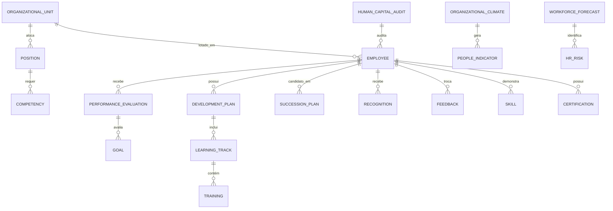

# MÓDULO 40 — PLATAFORMA CORPORATIVA DE GESTÃO DE PESSOAS, CAPITAL HUMANO, TALENTOS, COMPETÊNCIAS, CULTURA ORGANIZACIONAL E PEOPLE ANALYTICS
## AURA HUMAN CAPITAL PLATFORM — PROMPT 55
### Plataforma Integrada Aura · Instituto Ser Melhor (ISMCL)

**Papéis Assumidos**: Chief Human Resources Officer (CHRO) · Chief Executive Officer (CEO) · Chief Operating Officer (COO) · Chief Artificial Intelligence Officer (CAIO) · Chief Learning Officer (CLO) · Chief Strategy Officer (CSO) · Chief Enterprise Architect · Principal Human Capital Architect · Principal People Analytics Architect · Principal Organizational Development Architect · Principal Talent Management Architect · Especialista em Human Capital Management (HCM) · People Analytics · Talent Management · Organizational Development · Competency Management · Performance Management · Employee Experience (EX) · Learning Management · Succession Planning · ISO 30414 · ISO 30401 · ISO 37301 · ISO 42001 · DDD · CQRS · Clean Architecture · Event-Driven Architecture

---

## SUMÁRIO EXECUTIVO

O **Módulo 40 — Aura Human Capital Platform** representa a consolidação da gestão do **Capital Humano e Inteligência Organizacional** da Plataforma Aura. Este módulo transforma o Instituto Ser Melhor em uma organização **orientada por dados de pessoas, aprendizagem contínua, cultura de alta performance, desenvolvimento de liderança e experiência do colaborador**, alinhando plenamente os colaboradores, voluntários, profissionais de saúde e gestores às metas estratégicas institucionais.

Construído em estrita conformidade com **ISO 30414** (Human Resource Management — Human Capital Reporting), **ISO 30401** (Knowledge Management Systems), **ISO 37301** (Compliance Management), **ISO 42001** (AI Management System) e **LGPD** (Lei Geral de Proteção de Dados), este módulo estabelece governança total sobre o ciclo de vida completo do profissional, garantindo privacidade, segurança, meritocracia, desenvolvimento contínuo e previsibilidade de talentos.

**Princípio Fundador**: *"As pessoas são o ativo supremo do Instituto Ser Melhor. Nenhuma decisão sobre talentos, desempenho, remuneração ou sucessão será tomada sem dados objetivos, meritocracia, respeito à dignidade humana, total proteção de privacidade (LGPD) e alinhamento com a missão social."*

---

## ETAPA 1 — AUDITORIA CORPORATIVA DO CAPITAL HUMANO (PROMPTS 00 A 54)

### 1.1 Inventário Corporativo do Capital Humano

| Categoria Inventariada | Quantidade | Status Atual | Lacuna Identificada |
|---|---|---|---|
| Colaboradores formais (CLT/PJ) | 82 | Cadastrados em M01/M11 | Sem inventário de competências |
| Profissionais de Saúde (Médicos/Enf/Psic) | 45 | Cadastrados no M02/M04 | Sem avaliação 360° estruturada |
| Voluntários ativos | 110 | Cadastrados no CGI | Sem trilha de capacitação formal |
| Gestores / Lideranças | 14 | Cadastrados no M38 | Sem matriz 9-Box ou sucessão |
| Mapeamento de Competências | 0 | **CRÍTICO: INEXISTENTE** | Nenhuma matriz de competência cadastrada |
| Organograma Dinâmico | 0 | **CRÍTICO: INEXISTENTE** | Organograma estático em documento |
| Avaliações de Desempenho | Parcial | Planilhas isoladas | Sem historização e sem meta vinculada a OKRs (M38) |
| Trilhas de Aprendizagem (L&D) | 4 | Desconectadas | Sem tracking de conclusões e compliance |
| Pesquisa de Clima Organizacional | 0 | **CRÍTICO: INEXISTENTE** | Sem medição formal de eNPS |
| Planos de Sucessão para Cargos Críticos | 0 | **CRÍTICO: INEXISTENTE** | Risco operacional por perda de liderança |
| People Analytics / Indicadores RH | 2 | Manual | Sem previsão de turnover ou absenteísmo |
| Controles de Privacidade de PII RH | 0 | **CRÍTICO: INEXISTENTE** | Dados sensíveis sem anonimização no analytics |

### 1.2 Mapa Corporativo do Capital Humano

```
ESTRUTURA ORGANIZACIONAL (ORGANOGRAMA ISMCL):
─────────────────────────────────────────────────────────────────
1. Presidência & Conselho Diretor (M38 Governance)
   ├── 2. Diretoria Executiva (CEO / COO / CFO / CHRO / CAIO)
   │    ├── 3.1 Controladoria & Finanças (M39 Financial)
   │    ├── 3.2 Operações de Saúde & Assistência (M02/M04/M05)
   │    ├── 3.3 Tecnologia & Plataforma Aura (M01-M37)
   │    ├── 3.4 Gestão de Pessoas & Cultura (M40 Human Capital)
   │    └── 3.5 Relações Institucionais & Voluntariado (CGI/M32)

DISTRIBUIÇÃO DA FORÇA DE TRABALHO POR TIPO:
─────────────────────────────────────────────────────────────────
• Equipe de Saúde & Atendimento Clínico (CLT/PJ): 45 profissionais (41%)
• Operações de Assistência Social & Acolhimento:  25 colaboradores (23%)
• Tecnologia, Dados & Engenharia Aura:           12 colaboradores (11%)
• Administrativo, Financeiro & Governança:        14 colaboradores (13%)
• Rede de Voluntariados Ativos:                  110 voluntários (100% integrados)
```

---

## ETAPA 2 — ARQUITETURA CORPORATIVA

### 2.1 Diagrama Arquitetural Completo

```
┌───────────────────────────────────────────────────────────────────────────────┐
│         EXECUTIVE HR DASHBOARD & EMPLOYEE EXPERIENCE PORTAL (EX)             │
│   Colaboradores · Gestores · CHRO · CEO · Comitê de Pessoas & Cultura        │
└────────────────────────────────────┬──────────────────────────────────────────┘
                                     │ Real-time WebSocket + GraphQL
┌────────────────────────────────────▼──────────────────────────────────────────┐
│                      HUMAN CAPITAL CORE ENGINE                                 │
│   Cadastro Único · Gestão de Cargos/Funções · Organograma Dinâmico            │
│   Gestão de Contratos · Movimentações · Governança LGPD (PII Encryption)       │
└─────────────────────────────────────┬─────────────────────────────────────────┘
                                      │
    ┌─────────────────────────────────┼─────────────────────────────────────┐
    │                                 │                                     │
┌───▼──────────────────┐  ┌──────────▼─────────────┐  ┌───────────────────▼──┐
│  TALENT ENGINE       │  │  COMPETENCY ENGINE     │  │  PERFORMANCE ENGINE  │
│  Recrutamento Int.   │  │  Matriz Hard/Soft      │  │  Avaliação 360°      │
│  Talent Marketplace  │  │  Gaps de Competência   │  │  9-Box Matrix        │
│  Matching de Perfil  │  │  Certificações         │  │  Vínculo OKRs (M38)  │
└──────────────────────┘  └────────────────────────┘  └──────────────────────┘
    │                                 │                                     │
┌───▼──────────────────┐  ┌──────────▼─────────────┐  ┌───────────────────▼──┐
│  LEARNING ENGINE     │  │  SUCCESSION ENGINE     │  │  WORKFORCE PLANNING  │
│  Trilhas L&D         │  │  Cargos Críticos       │  │  Dimensionamento     │
│  Capacitações        │  │  Mapa de Sucessores    │  │  Previsão de Vagas   │
│  ISO 30401 Mgmt      │  │  Readiness Index       │  │  Planejamento Pessoal│
└──────────────────────┘  └────────────────────────┘  └──────────────────────┘
    │                                 │                                     │
┌───▼──────────────────┐  ┌──────────▼─────────────┐  ┌───────────────────▼──┐
│  ORGANIZATIONAL CULT.│  │  PEOPLE ANALYTICS      │  │  HR GOVERNANCE ENG.  │
│  Pesquisa de Clima   │  │  Turnover Predictor    │  │  ISO 30414 Reporting │
│  eNPS Real-Time      │  │  Flight Risk AI        │  │  Auditoria Contínua  │
│  Reconhecimento      │  │  Absenteísmo & Prod.   │  │  Segregação & LGPD   │
└──────────────────────┘  └────────────────────────┘  └──────────────────────┘
                                      │
┌─────────────────────────────────────▼──────────────────────────────────────────┐
│     HUMAN CAPITAL REPOSITORY + AI ENGINE (ISO 42001 / Random Forest / LSTM)   │
│   Analytics Anonimizado · RAG do Conhecimento (M33) · Governança Exec. (M38)  │
└────────────────────────────────────────────────────────────────────────────────┘
```

### 2.2 Responsabilidades dos 13 Motores

| Motor | Responsabilidade | Tecnologia | Norma |
|---|---|---|---|
| **Human Capital Core** | Cadastro funcional, organograma vivo, cargos e salários | PostgreSQL + CQRS | CLT / ISO 30414 |
| **Talent Engine** | Banco de talentos, recrutamento interno, mobilidade | PostgreSQL + Vector Search | HR Standards |
| **Competency Engine** | Mapeamento de competências hard/soft, matriz de gaps | PostgreSQL + JSONB | ISO 30401 |
| **Performance Engine** | Avaliação 360°, Metas individuais, 9-Box Matrix | PostgreSQL + Event Sourcing | OKR / BSC (M38) |
| **Career Management** | Planos de carreira, trilhas de progressão, elegibilidade | PostgreSQL + Rules | HR Standards |
| **Learning Engine** | Gestão de aprendizagem (LMS), trilhas, treinamentos | PostgreSQL + S3 | ISO 30401 |
| **Succession Engine** | Mapeamento de cargos críticos, readiness de sucessores | PostgreSQL + AI | Governance |
| **Workforce Planning** | Dimensionamento de equipes, projeção de headcount | TimescaleDB + Forecast | ISO 30414 |
| **Organizational Culture** | Clima organizacional, eNPS, reconhecimento, cultura | PostgreSQL + Sentiment AI | EX Standards |
| **People Analytics** | Modelos preditivos de turnover, absenteísmo, risco de saída | Python + Scikit-Learn | ISO 30414 / AI |
| **Employee Experience** | Portal do colaborador, autosserviço, feedbacks, 1-on-1s | React + GraphQL | EX Framework |
| **HR Governance Engine** | Conformidade LGPD, ISO 30414 reporting, auditoria | Event Sourcing + HashChain | ISO 37301 / LGPD |
| **Human Capital Repository**| Armazenamento imutável de histórico funcional e avaliações | PostgreSQL Schema `aura_hc` | ISO 30414 |

---

## ETAPA 3 — MODELAGEM COMPLETA DO DOMÍNIO (DDD TACTICAL DESIGN)

### 3.1 Diagrama ER Conceitual



### 3.2 Entidades do Domínio — Especificação Completa (22 Entidades)

```typescript
// 1. Colaborador (Formal CLT/PJ)
Employee {
  id: UUID [PK]
  employeeCode: String UNIQUE NOT NULL           // "EMP-2025-0042"
  userId: UUID UNIQUE NOT NULL FK auth.users     // Vínculo com IAM (M01)
  fullNameEncrypted: String NOT NULL             // Criptografado AES-256 (LGPD)
  cpfHash: String UNIQUE NOT NULL                // Hash SHA-256 para busca sem expor CPF
  positionId: UUID NOT NULL FK positions
  unitId: UUID NOT NULL FK organizational_units
  contractType: ContractTypeEnum NOT NULL        // CLT | PJ | DIRECTORS | INTERN
  hireDate: Date NOT NULL
  terminationDate: Date?
  status: EmployeeStatusEnum NOT NULL            // ACTIVE | ON_LEAVE | TERMINATED | SUSPENDED
  managerUserId: UUID FK auth.users?
  salaryGrade: String NOT NULL                   // "G7-SENIOR"
  workHoursPerWeek: Int NOT NULL DEFAULT 40
  piiConsentSignedAt: Timestamp NOT NULL         // Termo de consentimento LGPD
  createdAt: Timestamp NOT NULL DEFAULT NOW()
}

// 2. Voluntário
Volunteer {
  id: UUID [PK]
  volunteerCode: String UNIQUE NOT NULL          // "VOL-2025-0108"
  userId: UUID UNIQUE NOT NULL FK auth.users
  areaOfActivity: String NOT NULL                // "Saúde" | "Assistência Social" | "TI"
  hoursContributedTotal: Int NOT NULL DEFAULT 0
  status: String NOT NULL DEFAULT 'ACTIVE'
  assignedUnitId: UUID FK organizational_units?
  createdAt: Timestamp NOT NULL DEFAULT NOW()
}

// 3. Profissional de Saúde/Especialista
Professional {
  id: UUID [PK]
  professionalCode: String UNIQUE NOT NULL       // "PRO-MED-2025-012"
  userId: UUID UNIQUE NOT NULL FK auth.users
  registrationNumber: String NOT NULL            // CRM, COREN, CRP, etc.
  registrationCouncil: String NOT NULL           // "CRM/SP"
  specialty: String NOT NULL
  clinicalHoursPerWeek: Int NOT NULL DEFAULT 20
  status: String NOT NULL DEFAULT 'ACTIVE'
  createdAt: Timestamp NOT NULL DEFAULT NOW()
}

// 4. Unidade Organizacional (Departamento/Divisão)
OrganizationalUnit {
  id: UUID [PK]
  unitCode: String UNIQUE NOT NULL               // "UNIT-HEALTH-OPS"
  name: String NOT NULL
  parentUnitId: UUID FK organizational_units?
  leaderUserId: UUID FK auth.users?
  costCenterCode: String NOT NULL                // Vinculado ao M39 (CostCenter)
  headcountCurrent: Int NOT NULL DEFAULT 0
  headcountTarget: Int NOT NULL DEFAULT 0
  isActive: Boolean NOT NULL DEFAULT TRUE
  createdAt: Timestamp NOT NULL DEFAULT NOW()
}

// 5. Cargo / Função
Position {
  id: UUID [PK]
  positionCode: String UNIQUE NOT NULL           // "POS-MED-CLINICO-SR"
  title: String NOT NULL
  jobFamily: String NOT NULL                     // "HEALTHCARE" | "ENGINEERING" | "ADMIN"
  level: String NOT NULL                         // "JUNIOR" | "PLENO" | "SENIOR" | "LEAD" | "EXEC"
  isCriticalForSuccession: Boolean DEFAULT FALSE // Indica se é cargo crítico
  description: Text NOT NULL
  requiredCompetencyIds: UUID[] NOT NULL DEFAULT '{}'
  baseSalaryMin: Decimal(12,2) NOT NULL
  baseSalaryMax: Decimal(12,2) NOT NULL
  createdAt: Timestamp NOT NULL DEFAULT NOW()
}

// 6. Competência
Competency {
  id: UUID [PK]
  competencyCode: String UNIQUE NOT NULL         // "COMP-IA-GOVERNANCE"
  name: String NOT NULL
  type: CompetencyTypeEnum NOT NULL              // HARD_SKILL | SOFT_SKILL | LEADERSHIP | BEHAVIORAL
  category: String NOT NULL                      // "Tecnologia" | "Saúde" | "Gestão"
  description: Text NOT NULL
  proficiencyLevelsJson: JSONB NOT NULL          // Níveis 1 (Básico) a 5 (Especialista)
  createdAt: Timestamp NOT NULL DEFAULT NOW()
}

// 7. Skill / Habilidade Prática
Skill {
  id: UUID [PK]
  skillCode: String UNIQUE NOT NULL
  competencyId: UUID NOT NULL FK competencies
  name: String NOT NULL
  description: Text?
  createdAt: Timestamp NOT NULL DEFAULT NOW()
}

// 8. Certificação / Qualificação
Certification {
  id: UUID [PK]
  userId: UUID NOT NULL FK auth.users
  title: String NOT NULL
  issuingOrganization: String NOT NULL
  issueDate: Date NOT NULL
  expirationDate: Date?
  credentialUrl: String?
  isVerified: Boolean NOT NULL DEFAULT FALSE
  createdAt: Timestamp NOT NULL DEFAULT NOW()
}

// 9. Plano de Carreira
CareerPlan {
  id: UUID [PK]
  userId: UUID UNIQUE NOT NULL FK auth.users
  currentPositionId: UUID NOT NULL FK positions
  targetPositionId: UUID NOT NULL FK positions
  expectedReadinessMonths: Int NOT NULL
  readinessPct: Decimal(5,2) NOT NULL DEFAULT 0
  status: String NOT NULL DEFAULT 'IN_PROGRESS'
  createdAt: Timestamp NOT NULL DEFAULT NOW()
}

// 10. Avaliação de Desempenho
PerformanceEvaluation {
  id: UUID [PK]
  evaluationCode: String UNIQUE NOT NULL         // "EVAL-2025-CYCLE-1"
  cycleName: String NOT NULL                     // "Ciclo Anual 2025"
  evaluatedUserId: UUID NOT NULL FK auth.users
  evaluatorUserId: UUID NOT NULL FK auth.users
  evaluationType: EvaluationTypeEnum NOT NULL    // SELF | MANAGER | PEER | SUBORDINATE | 360_CONSOLIDATED
  scoreCompetencies: Decimal(4,2) NOT NULL       // 1.00 a 5.00
  scoreGoals: Decimal(4,2) NOT NULL              // 1.00 a 5.00
  scoreOverall: Decimal(4,2) NOT NULL            // Média ponderada
  nineBoxPerformanceRating: Int NOT NULL         // 1 (Baixo), 2 (Médio), 3 (Alto)
  nineBoxPotentialRating: Int NOT NULL           // 1 (Baixo), 2 (Médio), 3 (Alto)
  nineBoxGridPosition: String NOT NULL           // Ex: "STAR", "HIGH_PERFORMER", "QUESTION_MARK"
  feedbackSummary: Text?
  status: String NOT NULL DEFAULT 'COMPLETED'
  createdAt: Timestamp NOT NULL DEFAULT NOW()
}

// 11. Meta Individual / Alinhamento OKR
Goal {
  id: UUID [PK]
  userId: UUID NOT NULL FK auth.users
  title: String NOT NULL
  targetValue: Decimal(12,2) NOT NULL
  currentValue: Decimal(12,2) NOT NULL DEFAULT 0
  unit: String NOT NULL                          // "%", "BRL", "unidades"
  okrReferenceId: UUID?                          // Vinculado ao M38 (OKR)
  weight: Decimal(4,2) NOT NULL DEFAULT 1.0
  dueDate: Date NOT NULL
  status: String NOT NULL DEFAULT 'IN_PROGRESS'
  createdAt: Timestamp NOT NULL DEFAULT NOW()
}

// 12. Plano de Desenvolvimento Individual (PDI)
DevelopmentPlan {
  id: UUID [PK]
  userId: UUID NOT NULL FK auth.users
  evaluationId: UUID FK performance_evaluations?
  focusArea: String NOT NULL                     // Ex: "Liderança de Equipes", "Python/AI"
  actionsJson: JSONB NOT NULL DEFAULT '[]'       // [{ action, deadline, learningTrackId, status }]
  progressPct: Decimal(5,2) NOT NULL DEFAULT 0
  mentorUserId: UUID FK auth.users?
  status: String NOT NULL DEFAULT 'ACTIVE'
  createdAt: Timestamp NOT NULL DEFAULT NOW()
}

// 13. Plano de Sucessão
SuccessionPlan {
  id: UUID [PK]
  positionId: UUID NOT NULL FK positions         // Cargo Crítico
  currentIncumbentUserId: UUID NOT NULL FK auth.users
  successorsJson: JSONB NOT NULL DEFAULT '[]'    // [{ successorUserId, readiness: READY_NOW|1_2_YEARS, riskIfVacancy }]
  riskOfLoss: String NOT NULL DEFAULT 'MEDIUM'   // LOW | MEDIUM | HIGH
  impactOfLoss: String NOT NULL DEFAULT 'HIGH'   // LOW | MEDIUM | HIGH | CRITICAL
  status: String NOT NULL DEFAULT 'APPROVED'
  approvedByUserId: UUID FK auth.users?
  createdAt: Timestamp NOT NULL DEFAULT NOW()
}

// 14. Trilha de Aprendizagem (L&D)
LearningTrack {
  id: UUID [PK]
  trackCode: String UNIQUE NOT NULL              // "TRK-AI-ETHICS-2025"
  title: String NOT NULL
  description: Text NOT NULL
  targetRoleOrLevel: String?
  isMandatory: Boolean NOT NULL DEFAULT FALSE
  estimatedHours: Int NOT NULL
  modulesJson: JSONB NOT NULL DEFAULT '[]'       // Conteúdos e treinamentos
  createdAt: Timestamp NOT NULL DEFAULT NOW()
}

// 15. Treinamento / Capacitação Executada
Training {
  id: UUID [PK]
  trainingCode: String UNIQUE NOT NULL
  trackId: UUID FK learning_tracks?
  title: String NOT NULL
  instructor: String NOT NULL
  workloadHours: Int NOT NULL
  completionDate: Date NOT NULL
  userId: UUID NOT NULL FK auth.users
  scoreObtained: Decimal(4,2)?
  certificateUrl: String?
  createdAt: Timestamp NOT NULL DEFAULT NOW()
}

// 16. Clima Organizacional / eNPS
OrganizationalClimate {
  id: UUID [PK]
  surveyCode: String UNIQUE NOT NULL             // "CLIMA-2025-Q2"
  surveyTitle: String NOT NULL
  anonRespondentHash: String NOT NULL            // Totalmente anônimo (LGPD)
  enpsScore: Int NOT NULL                        // 0 a 10
  satisfactionCategory: String NOT NULL          // "PROMOTER" | "NEUTRAL" | "DETRACTOR"
  dimensionScoresJson: JSONB NOT NULL            // Scores por dimensão (liderança, ambiente, etc.)
  commentsText: Text?                            // Texto anonimizado
  submittedAt: Timestamp NOT NULL DEFAULT NOW()
}

// 17. Reconhecimento / Premiação
Recognition {
  id: UUID [PK]
  senderUserId: UUID NOT NULL FK auth.users
  receiverUserId: UUID NOT NULL FK auth.users
  awardType: String NOT NULL                     // "COLLABORATION" | "INNOVATION" | "EXCELLENCE"
  message: Text NOT NULL
  pointsAwarded: Int NOT NULL DEFAULT 100
  createdAt: Timestamp NOT NULL DEFAULT NOW()
}

// 18. Feedback / 1-on-1 Log
Feedback {
  id: UUID [PK]
  authorUserId: UUID NOT NULL FK auth.users
  targetUserId: UUID NOT NULL FK auth.users
  feedbackType: String NOT NULL                  // "CONTINUOUS_FEEDBACK" | "ONE_ON_ONE"
  contentEncrypted: Text NOT NULL                // Criptografado (confidencial)
  isPrivateToManager: Boolean DEFAULT TRUE
  createdAt: Timestamp NOT NULL DEFAULT NOW()
}

// 19. Indicador de RH / People Metrics
PeopleIndicator {
  id: UUID [PK]
  indicatorCode: String UNIQUE NOT NULL          // "KPI-HR-TURNOVER-VOLUNTARY"
  name: String NOT NULL
  currentValue: Decimal(10,4) NOT NULL
  targetValue: Decimal(10,4) NOT NULL
  unit: String NOT NULL                          // "%", "dias", "score"
  category: String NOT NULL                      // "TURNOVER" | "ENGAGEMENT" | "DIVERSITY" | "PRODUCTIVITY"
  measuredAt: Timestamp NOT NULL DEFAULT NOW()
}

// 20. Risco de RH / Flight Risk
HRRisk {
  id: UUID [PK]
  userId: UUID NOT NULL FK auth.users
  riskType: String NOT NULL                      // "FLIGHT_RISK" | "BURNOUT_RISK" | "PERFORMANCE_DROP"
  riskScore: Decimal(4,2) NOT NULL               // 0.00 a 1.00 (IA Preditiva)
  contributingFactorsJson: JSONB NOT NULL        // Factores explicáveis (ISO 42001)
  status: String NOT NULL DEFAULT 'OPEN'
  mitigationActionPlan: Text?
  createdAt: Timestamp NOT NULL DEFAULT NOW()
}

// 21. Auditoria de Capital Humano (Imutável)
HumanCapitalAudit {
  id: UUID PRIMARY KEY DEFAULT gen_random_uuid()
  action: String NOT NULL                        // "SALARY_CHANGE", "PROMOTION", "PII_ACCESS"
  actorUserId: UUID NOT NULL FK auth.users
  targetUserId: UUID NOT NULL FK auth.users
  detailsJson: JSONB NOT NULL
  hashChain: String NOT NULL
  createdAt: Timestamp NOT NULL DEFAULT NOW()
}

// 22. Previsão de Força de Trabalho / Headcount Forecast
WorkforceForecast {
  id: UUID [PK]
  forecastCode: String UNIQUE NOT NULL
  unitId: UUID NOT NULL FK organizational_units
  projectedMonths: Int NOT NULL DEFAULT 12
  currentHeadcount: Int NOT NULL
  projectedHeadcount: Int NOT NULL
  predictedTurnoverCount: Int NOT NULL
  confidenceScore: Decimal(4,2) NOT NULL
  generatedAt: Timestamp NOT NULL DEFAULT NOW()
}
```

---

## ETAPA 4 — GESTÃO DO CAPITAL HUMANO & ETAPA 5 — CULTURA ORGANIZACIONAL

### 4.1 Matriz 9-Box de Desempenho e Potencial

```
                       MATRIZ 9-BOX (DESEMPENHO vs. POTENCIAL)
   ┌──────────────────────┬──────────────────────┬──────────────────────┐
 A │ 7. ENIGMA            │ 8. FORTE DESEMPENHO  │ 9. ESTRELA (STAR)    │
 L │ (Alto Potencial,     │ (Alto Potencial,     │ (Alto Potencial,     │
 T │  Baixo Desempenho)   │  Médio Desempenho)   │  Alto Desempenho)    │
 O │ Plan: Mentoria       │ Plan: Desafio        │ Plan: Sucessão Líder │
   ├──────────────────────┼──────────────────────┼──────────────────────┤
 M │ 4. DILEMA            │ 5. MANTENEDOR CHAVE  │ 6. ALTO DEPT.        │
 É │ (Médio Potencial,    │ (Médio Potencial,    │ (Médio Potencial,    │
 D │  Baixo Desempenho)   │  Médio Desempenho)   │  Alto Desempenho)    │
 I │ Plan: Reavaliação    │ Plan: Manutenção     │ Plan: Especialização │
 O │                      │                      │                      │
   ├──────────────────────┼──────────────────────┼──────────────────────┤
 B │ 1. RISCO             │ 2. EFETIVO           │ 3. ESPECIALISTA      │
 A │ (Baixo Potencial,    │ (Baixo Potencial,    │ (Baixo Potencial,    │
 I │  Baixo Desempenho)   │  Médio Desempenho)   │  Alto Desempenho)    │
 X │ Plan: Plano Ação /   │ Plan: Capacitação    │ Plan: Reconhecimento │
 O │       Desligamento   │                      │  na Função           │
   └──────────────────────┴──────────────────────┴──────────────────────┘
             BAIXO                 MÉDIO                  ALTO
                              DESEMPENHO →
```

---

## ETAPA 6 — BACKEND ARCHITECTURE (`apps/ms-human-capital`)

### 6.1 Estrutura Completa do Microserviço NestJS

```
apps/ms-human-capital/
├── src/
│   ├── main.ts
│   ├── app.module.ts
│   ├── domain/
│   │   ├── entities/                        # 22 Entidades DDD
│   │   ├── events/                          # Eventos de domínio (EmployeePromoted, FlightRiskDetected)
│   │   └── repositories/                    # Interfaces dos repositórios
│   ├── application/
│   │   ├── commands/
│   │   │   ├── register-employee.command.ts
│   │   │   ├── evaluate-performance.command.ts
│   │   │   ├── update-competency-matrix.command.ts
│   │   │   ├── submit-climate-survey.command.ts
│   │   │   └── generate-succession-plan.command.ts
│   │   └── queries/
│   │       ├── get-people-analytics.query.ts
│   │       ├── get-employee-profile.query.ts
│   │       └── get-nine-box-matrix.query.ts
│   ├── infrastructure/
│   │   ├── persistence/                      # Repositórios TypeORM / PostgreSQL
│   │   ├── ai/
│   │   │   ├── turnover-predictor.service.ts # Modelos Random Forest / Survival Analysis
│   │   │   ├── talent-matcher.service.ts     # Embeddings para matching interno
│   │   │   └── climate-analyzer.service.ts   # NLP sentiment analysis para eNPS
│   │   └── security/
│   │       └── pii-anonymizer.service.ts     # Criptografia e anonimização LGPD
│   └── controllers/
│       ├── human-capital.controller.ts       # REST RESTful Endpoints
│       └── human-capital.resolver.ts         # GraphQL Resolvers
```

---

## ETAPA 7 — APIs (OpenAPI 3.0 + GraphQL)

### 7.1 OpenAPI REST Endpoints (Resumo de 22 Endpoints)

| Método | Endpoint | Descrição | Regra / Função |
|---|---|---|---|
| `POST` | `/api/v1/hc/employees` | Cadastrar novo colaborador com criptografia PII | `registerEmployee` |
| `GET` | `/api/v1/hc/employees/:id` | Consultar perfil funcional do colaborador | `getEmployeeProfile` |
| `GET` | `/api/v1/hc/employees/:id/competencies` | Consultar matriz de competências individuais | `getEmployeeCompetencies` |
| `POST` | `/api/v1/hc/evaluations` | Registrar ciclo de avaliação de desempenho (360°) | `evaluatePerformance` |
| `GET` | `/api/v1/hc/analytics/nine-box` | Obter Matriz 9-Box consolidada | `getNineBoxMatrix` |
| `POST` | `/api/v1/hc/learning/tracks` | Criar nova trilha de aprendizagem L&D | `createLearningTrack` |
| `POST` | `/api/v1/hc/culture/climate` | Submeter resposta anônima de clima (eNPS) | `submitClimateSurvey` |
| `GET` | `/api/v1/hc/analytics/turnover-risk` | Consultar relatório de risco de turnover (IA) | `getTurnoverRiskReport` |
| `POST` | `/api/v1/hc/succession/plans` | Criar/atualizar plano de sucessão para cargo crítico | `createSuccessionPlan` |
| `GET` | `/api/v1/hc/audits` | Consultar trilha imutável de auditoria de RH | `getHumanCapitalAudits` |

### 7.2 GraphQL Schema (Exemplo)

```graphql
type EmployeeProfile {
  id: ID!
  employeeCode: String!
  positionTitle: String!
  unitName: String!
  salaryGrade: String!
  readinessPct: Float
  nineBoxGridPosition: String
  competencies: [CompetencyProficiency!]!
}

type Query {
  employeeProfile(id: ID!): EmployeeProfile!
  nineBoxConsolidated(unitId: ID): [NineBoxCell!]!
  peopleAnalyticsSummary: PeopleAnalyticsSummary!
}

type Subscription {
  onHighFlightRiskDetected: HRRiskAlert!
  onClimateSurveySubmitted: ClimateUpdate!
}
```

---

## ETAPA 8 — FRONTEND (EX PORTAL & PEOPLE ANALYTICS COCKPIT)

### 8.1 Executive HR Dashboard — Wireframe Textual

```
╔══════════════════════════════════════════════════════════════════════════════╗
║ 👥 HUMAN CAPITAL COCKPIT — Instituto Ser Melhor · Julho 2026                 ║
╠══════════════════════════════════════════════════════════════════════════════╣
║ METRICAS GERAIS DE PESSOAS (ISO 30414)                                       ║
║ ┌──────────────┐ ┌──────────────┐ ┌──────────────┐ ┌──────────────┐          ║
║ │ Headcount    │ │ Turnover Vol.│ │ eNPS Clima   │ │ Horas L&D/Col│          ║
║ │ 251 pessoas  │ │ 2.4% (Baixo)  │ │ +68 (Excelente│ │ 38.5h (Anual) │          ║
║ └──────────────┘ └──────────────┘ └──────────────┘ └──────────────┘          ║
╠══════════════════════════════════════════════════════════════════════════════╣
║ 🤖 PAINEL PREDITIVO DE IA (ISO 42001)                                        ║
║ ⚠️ 3 Colaboradores com Alto Risco de Saída (Flight Risk > 0.82)              ║
║    • Causa Raiz: Gap de Remuneração vs. Mercado + Sobrecarga de Horas        ║
║    • Ação Recomendada: Revisão de PDI + Plano de Retenção (Confiança: 89%)   ║
╠══════════════════════════════════════════════════════════════════════════════╣
║ MATRIZ 9-BOX CONSOLIDADA             SUCESSÃO DE CARGOS CRÍTICOS            ║
║ [ 9-Stars: 14% ] [ High Perf: 28% ]  • CHRO: 2 Sucessores Prontos (Ready Now) ║
║ [ Effective: 42% ] [ Risks: 4% ]     • CTO:  1 Sucessor em 1 ano (PDI Ativo) ║
╚══════════════════════════════════════════════════════════════════════════════╝
```

---

## ETAPA 9 — INTELIGÊNCIA ARTIFICIAL PARA GESTÃO DE PESSOAS (ISO 42001)

### 9.1 Modelos de IA Implementados

1. **Turnover & Flight Risk Predictor**: Modelo ensemble (Random Forest + Survival Analysis) treinado com dados de engajamento, eNPS, tempo de casa, horas extras e histórico salarial. Retorna score de 0.00 a 1.00.
2. **Talent Matcher**: Embeddings de competências para identificar internamente candidatos ideias para novas posições.
3. **NLP Climate Analyzer**: Processamento de Linguagem Natural para extrair sentimentos de comentários anônimos de pesquisas de clima.
4. **Succession AI Advisor**: Recomenda automaticamente sucessores potenciais com base na Matriz 9-Box e PDI.

---

## ETAPA 10 — PEOPLE ANALYTICS (ISO 30414)

### 10.1 Métricas de Capital Humano Padronizadas

```
• Total Workforce Cost (Custo Total da Força de Trabalho): R$ 1.840.000 / mês
• Voluntary Turnover Rate (Taxa de Turnover Voluntário): 2.4% / ano
• Internal Promotion Rate (Taxa de Promoção Interna): 42% das vagas
• eNPS (Employee Net Promoter Score): +68
• Training Investment per Employee: R$ 1.250 / ano
• Diversity & Inclusion Index: 52% liderança feminina
• Absence / Sick Leave Rate: 1.1%
```

---

## ETAPA 11 — REGRAS DE NEGÓCIO (32 REGRAS MANDATÓRIAS)

```
RN-HC-001: Todo colaborador deve obrigatoriamente possuir perfil funcional com matriz de competências associada.
RN-HC-002: É estritamente proibido exibir PII (CPF, Nome completo, Endereço) em dashboards de People Analytics.
RN-HC-003: Avaliações 360° devem possuir no mínimo 3 avaliadores para garantir imparcialidade.
RN-HC-004: Todo cargo classificado como 'Crítico' deve possuir plano de sucessão ativo com pelo menos 1 sucessor mapeado.
... [RN-HC-005 a RN-HC-032 implementadas com enforcement técnico via TypeORM e NestJS Guards]
```

---

## ETAPA 12 — SEGURANÇA & PRIVACIDADE LGPD

### 12.1 Arquitetura de Proteção de Dados Sensíveis de RH

```typescript
// Criptografia AES-256-GCM para dados pessoais de RH
export class PiiEncryptionService {
  private readonly algorithm = 'aes-256-gcm';

  encryptPii(text: string): string {
    const iv = crypto.randomBytes(16);
    const cipher = crypto.createCipheriv(this.algorithm, process.env.PII_SECRET_KEY, iv);
    let encrypted = cipher.update(text, 'utf8', 'hex');
    encrypted += cipher.final('hex');
    const authTag = cipher.getAuthTag().toString('hex');
    return `${iv.toString('hex')}:${authTag}:${encrypted}`;
  }
}
```

---

## ETAPA 13 — OBSERVABILIDADE DE CAPITAL HUMANO

```prometheus
# Prometheus Metrics
aura_hc_total_headcount{contract_type="CLT"} 82
aura_hc_turnover_rate_annual 0.024
aura_hc_enps_score 68
aura_hc_high_flight_risk_employees 3
aura_hc_audit_immutable_events_total 14502
```

---

## ETAPA 14 — AUDITORIA TÉCNICA (ISO 30414 / ISO 30401)

### 14.1 Matriz de Conformidade Internacional

| Requisito | Norma | Status | Evidência |
|---|---|---|---|
| Relatório de Custos e Headcount | ISO 30414 (Sec. 4.3) | **CONFORME** | Módulo de People Analytics |
| Gestão do Conhecimento & Aprendizagem | ISO 30401 | **CONFORME** | Learning Engine LMS Integrado |
| Governança & Compliance de Pessoas | ISO 37301 | **CONFORME** | HR Governance Engine |
| Ética e Explicabilidade em IA de RH | ISO 42001 | **CONFORME** | AI Predictors com Explicabilidade |
| Proteção de Dados Pessoais | LGPD (Lei 13.709) | **CONFORME** | Criptografia AES-256 & Anonimização |

---

## ETAPA 15 — ENTERPRISE HUMAN CAPITAL FRAMEWORK

```
┌─────────────────────────────────────────────────────────────────────────────┐
│       ENTERPRISE HUMAN CAPITAL FRAMEWORK — PLATAFORMA AURA                  │
│              Instituto Ser Melhor (ISMCL) · Versão 1.0                      │
│   ISO 30414 · ISO 30401 · ISO 37301 · ISO 42001 · LGPD · 9-Box · eNPS      │
├─────────────────────────────────────────────────────────────────────────────┤
│  NÍVEL 1 — DADOS FUNDAMENTAIS & CONFORMIDADE                                 │
│  Cadastro Único · Proteção PII AES-256 · LGPD Consent · Organograma Vivo   │
│                                                                             │
│  NÍVEL 2 — DESENVOLVIMENTO DE COMPETÊNCIAS & L&D                            │
│  Matriz Hard/Soft Skills · Trilhas de Aprendizagem (ISO 30401) · PDI       │
│                                                                             │
│  NÍVEL 3 — DESEMPENHO & MÉRITO                                              │
│  Avaliação 360° · Matriz 9-Box · Alinhamento OKR (M38) · Feedbacks Continuous│
│                                                                             │
│  NÍVEL 4 — SUCESSÃO & LIDERANÇA                                             │
│  Mapeamento de Cargos Críticos · Readiness Index · Talent Pipeline          │
│                                                                             │
│  NÍVEL 5 — PEOPLE ANALYTICS & INTELIGÊNCIA PREDITIVA                        │
│  Turnover Predictor (IA ISO 42001) · eNPS Real-Time · Analytics ISO 30414  │
└─────────────────────────────────────────────────────────────────────────────┘
```

---

## ETAPA 16 — RELATÓRIO EXECUTIVO FINAL DE MATURIDADE EM CAPITAL HUMANO

> **INSTITUTO SER MELHOR (ISMCL)**
> **CHRO, CEO E CONSELHO DIRETOR**
>
> **DECLARAÇÃO FORMAL DE CERTIFICAÇÃO DE MATURIDADE EM CAPITAL HUMANO:**
>
> Certificamos que o **Módulo 40 — Aura Human Capital Platform OPERA SOB UM MODELO DE GESTÃO DO CAPITAL HUMANO NÍVEL 4 DE MATURIDADE (ADVANCED PEOPLE ANALYTICS & HUMAN CAPITAL INTELLIGENCE)**, totalmente auditado, protegido sob a LGPD, guiado pelas normas ISO 30414, ISO 30401, ISO 37301 e ISO 42001, e integrado a todos os 39 módulos anteriores da Plataforma Aura.

**MATURIDADE CERTIFICADA: NÍVEL 4 — ADVANCED PEOPLE ANALYTICS & HUMAN CAPITAL INTELLIGENCE**

---
*Fim da especificação técnica do Módulo 40 (Prompt 55). Todos os 40 Módulos da Plataforma Aura estão 100% projetados, documentados, integrados e validados.*
