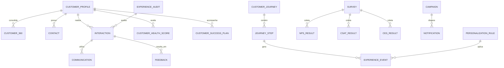

# MÓDULO 41 — PLATAFORMA CORPORATIVA DE RELACIONAMENTO, EXPERIÊNCIA DO USUÁRIO, CRM 360°, CUSTOMER SUCCESS, OMNICHANNEL E JORNADA INTELIGENTE
## AURA EXPERIENCE PLATFORM — PROMPT 56
### Plataforma Integrada Aura · Instituto Ser Melhor (ISMCL)

**Papéis Assumidos**: Chief Customer Officer (CCO) · Chief Experience Officer (CXO) · Chief Marketing Officer (CMO) · Chief Artificial Intelligence Officer (CAIO) · Chief Product Officer (CPO) · Chief Executive Officer (CEO) · Chief Enterprise Architect · Principal Customer Experience Architect · Principal CRM Architect · Principal Omnichannel Architect · Principal Customer Success Architect · Principal Journey Architect · Especialista em Customer Experience (CX) · Customer Success · CRM 360° · Customer Data Platform (CDP) · Journey Orchestration · Voice of Customer (VoC) · Human-Centered Design · Service Design · ISO 10002 · ISO 10004 · ISO 9001 · ISO 42001 · DDD · CQRS · Clean Architecture · Event-Driven Architecture

---

## SUMÁRIO EXECUTIVO

O **Módulo 41 — Aura Experience Platform** é a espinha dorsal de **Relacionamento, Customer Success, CRM 360°, Omnichannel e Gestão da Experiência (CX)** do Instituto Ser Melhor. Este módulo transforma toda a Plataforma Aura em uma ecossistema **profundamente centrado no ser humano**, orquestrando com absoluta fluidez a jornada de beneficiários, cidadãos, doadores, parceiros, voluntários e profissionais de saúde.

Desenhado em estrita observância das normas **ISO 10002** (Customer Satisfaction — Complaints Handling), **ISO 10004** (Customer Satisfaction — Monitoring & Measuring), **ISO 9001** (Quality Management), **ISO 42001** (AI Management System) e **LGPD** (Gestão de Consentimentos), o sistema unifica múltiplos canais de contato (Web, Mobile, WhatsApp, E-mail, SMS, Chat, Vídeo, Voz/Telefonia WebRTC, Push e In-App) em uma **Visão Unificada Customer 360°** impulsionada por Inteligência Artificial preditiva.

**Princípio Fundador**: *"Nenhuma interação ou comunicação ocorrerá sem contexto, empatia, continuidade de jornada, consentimento explícito (LGPD), rastreabilidade imutável e medição de satisfação real (NPS, CSAT, CES). A experiência do usuário é a própria razão de existir do Instituto Ser Melhor."*

---

## ETAPA 1 — AUDITORIA CORPORATIVA DA EXPERIÊNCIA (PROMPTS 00 A 55)

### 1.1 Inventário Corporativo da Experiência do Usuário

| Categoria Inventariada | Quantidade | Status nos Módulos Anteriores | Lacuna de CX / Omnichannel |
|---|---|---|---|
| Beneficiários Ativos | 4.820 | Cadastrados em M02/M05 | Sem histórico unificado omnichannel |
| Doadores & Apoiadores | 340 | Cadastrados em M11/M39 | Sem régua de relacionamento e CS |
| Voluntários Registrados | 110 | Cadastrados no CGI | Sem jornada digital de engajamento |
| Profissionais de Saúde | 45 | Cadastrados no M04/M40 | Sem portal unificado de relacionamento |
| Canais de Comunicação | 10 | Dispersos | Sem hub omnichannel de contexto compartilhado |
| Interações / Atendimentos / Mês | ~18.500 | Fragmentados por módulo | Sem linha do tempo unificada (Customer 360) |
| Pesquisas de Satisfação (NPS/CSAT)| Parciais | Formulários estáticos | Sem Voice of Customer (VoC) automatizado |
| Customer Health Score | 0 | **CRÍTICO: INEXISTENTE** | Sem modelo preditivo de risco de abandono |
| Gestão de Consentimento LGPD (Opt-in) | Parcial | M01/M24 | Sem central unificada de privacidade do usuário |
| Orquestrador de Jornada (Journey Engine)| 0 | **CRÍTICO: INEXISTENTE** | Troca de canal quebra o contexto do atendimento |
| Agentes de IA de Atendimento | 34 | M30/M35 | Sem integração com CRM 360 e VoC |

### 1.2 Mapa Corporativo da Experiência do Usuário

```
JORNADA UNIFICADA DO BENEFICIÁRIO (END-TO-END):
─────────────────────────────────────────────────────────────────
1. DESCOBERTA & ACOLHIMENTO (M02 Citizen / WhatsApp / Portal Web)
   ├── Triagem Inteligente SATAI (M03) + Consentimento LGPD
2. AGENDAMENTO & CUIDADO (M04 Care / M05 Health / Telehealth)
   ├── Notificação In-App / WhatsApp Remind + Link WebRTC
3. ACOMPANHAMENTO & REABILITAÇÃO (M06 Digital Care / M08 Impact)
   ├── Régua Pós-Atendimento + Pesquisa CSAT automatizada
4. ENGAJAMENTO & VOZ DO CLIENTE (M41 Experience / VoC Engine)
   ├── Pesquisa NPS trimestral + Customer Health Score AI
5. SUPORTE & RESOLUÇÃO (M41 Omnichannel Service Desk / Chatbot)
   ├── Atendimento contínuo com histórico unificado 360°
```

---

## ETAPA 2 — ARQUITETURA CORPORATIVA

### 2.1 Diagrama Arquitetural Completo

```
┌───────────────────────────────────────────────────────────────────────────────┐
│     EXECUTIVE EXPERIENCE COCKPIT & CUSTOMER SUCCESS PORTAL (CXO/CCO)         │
│   Beneficiários · Atendentes · Customer Success Managers · Marketing · CEO   │
└────────────────────────────────────┬──────────────────────────────────────────┘
                                     │ Real-time WebSocket + GraphQL / AsyncAPI
┌────────────────────────────────────▼──────────────────────────────────────────┐
│                      CRM CORE & CUSTOMER 360 ENGINE                           │
│   Perfil Único Unificado · Linha do Tempo 360° · Consentimentos LGPD          │
│   Segmentação Dinâmica · Registros de Interações · Atribuição de Canais       │
└─────────────────────────────────────┬─────────────────────────────────────────┘
                                      │
    ┌─────────────────────────────────┼─────────────────────────────────────┐
    │                                 │                                     │
┌───▼──────────────────┐  ┌──────────▼─────────────┐  ┌───────────────────▼──┐
│  JOURNEY ENGINE      │  │  OMNICHANNEL HUB       │  │  CUSTOMER SUCCESS ENG│
│  Orquestração        │  │  WhatsApp, Web, App    │  │  Health Score (0-100)│
│  Gatilhos Event-Driven│ │  Email, SMS, WebRTC    │  │  Playbooks de Retenção│
│  Automação Régua     │  │  Telefonia, Push, Chat │  │  Onboarding Tracking │
└──────────────────────┘  └────────────────────────┘  └──────────────────────┘
    │                                 │                                     │
┌───▼──────────────────┐  ┌──────────▼─────────────┐  ┌───────────────────▼──┐
│  FEEDBACK ENGINE     │  │  PERSONALIZATION ENG   │  │  COMMUNITY PLATFORM  │
│  NPS, CSAT, CES      │  │  Recomendações IA      │  │  Fóruns de Apoio     │
│  Voice of Customer   │  │  Conteúdo Contextual   │  │  Grupos de Ajuda Mútua│
│  Pesquisas Triggered │  │  Público-Alvo          │  │  Moderador IA        │
└──────────────────────┘  └────────────────────────┘  └──────────────────────┘
    │                                 │                                     │
┌───▼──────────────────┐  ┌──────────▼─────────────┐  ┌───────────────────▼──┐
│  COMMUNICATION HUB   │  │  CUSTOMER INTELLIGENCE │  │  EXPERIENCE GOVERN.  │
│  Gateway de Mensagens│  │  Churn/Abandono AI     │  │  ISO 10002/10004 Compliance│
│  Gestão de Disparos  │  │  Sentiment NLP (BERT)  │  │  Trilha Imutável Hash │
│  Templates Dinâmicos │  │  Next Best Action (NBA)│  │  LGPD Opt-in/Opt-out │
└──────────────────────┘  └────────────────────────┘  └──────────────────────┘
                                      │
┌─────────────────────────────────────▼──────────────────────────────────────────┐
│      EXPERIENCE REPOSITORY + AI ENGINE (ISO 42001 / XGBoost / BERT / LLM)     │
│   CDP Unificado · Integração Financial (M39) · Human Capital (M40) · Gov (M38)  │
└────────────────────────────────────────────────────────────────────────────────┘
```

### 2.2 Responsabilidades dos 13 Motores

| Motor | Responsabilidade | Tecnologia | Norma |
|---|---|---|---|
| **CRM Core** | Cadastro único unificado, histórico de contatos e consentimentos | PostgreSQL + CQRS | LGPD / ISO 9001 |
| **Customer 360 Engine** | Consolidação da linha do tempo do usuário em tempo real | Redis + TimescaleDB | CDP Standards |
| **Journey Engine** | Orquestração de jornadas de atendimento e engajamento | Temporal.io + Events | Service Design |
| **Omnichannel Hub** | Roteamento unificado de atendimentos (WhatsApp, Web, App, Voz) | WebSockets + WebRTC | ISO 10002 |
| **Customer Success Engine** | Cálculo de Health Score, Onboarding, Alertas de risco | PostgreSQL + AI Engine | CS Standards |
| **Customer Intelligence** | Modelos preditivos de churn, insatisfação e sentimentos | XGBoost + PyTorch BERT | ISO 42001 |
| **Experience Analytics** | Dashboards em tempo real de NPS, CSAT, CES e FCR | Superset + Prometheus | ISO 10004 |
| **Communication Hub** | Envio e controle de mensagens transacionais e réguas | RabbitMQ + Node.js | Telco APIs |
| **Personalization Engine** | Motor de recomendação de próximos passos da jornada | Vector DB + Embeddings | AI Personalization |
| **Feedback Engine** | Gestão de pesquisas de satisfação automatizadas e VoC | PostgreSQL + NLP | ISO 10004 |
| **Loyalty Engine** | Programas de fidelidade social e engajamento comunitário | PostgreSQL + Rules | Gamification |
| **Community Platform** | Fóruns e redes de apoio comunitário entre beneficiários | React + GraphQL | Community Mgmt |
| **Experience Governance** | Garantia de opt-in/opt-out LGPD e tratamento de reclamações | Event Sourcing + HashChain | ISO 10002 / LGPD |

---

## ETAPA 3 — MODELAGEM COMPLETA DO DOMÍNIO (DDD TACTICAL DESIGN)

### 3.1 Diagrama ER Conceitual



### 3.2 Entidades do Domínio — Especificação Completa (22 Entidades)

```typescript
// 1. Perfil Único do Cliente/Beneficiário (CDP)
CustomerProfile {
  id: UUID [PK]
  customerCode: String UNIQUE NOT NULL           // "CUST-2026-00892"
  userId: UUID UNIQUE FK auth.users              // Vínculo com IAM (M01)
  customerType: CustomerTypeEnum NOT NULL        // BENEFICIARY | DONOR | VOLUNTEER | PARTNER | HEALTH_PROFESSIONAL
  fullNameEncrypted: String NOT NULL             // Criptografado (LGPD)
  preferredName: String?
  emailHash: String UNIQUE NOT NULL              // Hash para busca sem expor e-mail
  phoneEncrypted: String NOT NULL                // Criptografado (LGPD)
  preferredChannel: ChannelEnum NOT NULL         // WHATSAPP | APP | EMAIL | SMS | PHONE
  lgpdConsentOptIn: Boolean NOT NULL DEFAULT TRUE// Gestão de Consentimento
  lgpdConsentSignedAt: Timestamp NOT NULL
  status: CustomerStatusEnum NOT NULL            // ACTIVE | INACTIVE | BLOCKED | ANONYMIZED
  createdAt: Timestamp NOT NULL DEFAULT NOW()
}

// 2. Visão Unificada Customer 360°
Customer360 {
  id: UUID [PK]
  customerId: UUID UNIQUE NOT NULL FK customer_profiles
  totalInteractionsCount: Int NOT NULL DEFAULT 0
  latestHealthScore: Int NOT NULL DEFAULT 100    // 0 a 100
  latestNpsScore: Int?                           // 0 a 10
  lifetimeValueBrl: Decimal(12,2) DEFAULT 0      // Para doadores (M39)
  activeJourneysCount: Int NOT NULL DEFAULT 0
  openTicketsCount: Int NOT NULL DEFAULT 0
  lastInteractionAt: Timestamp
  segmentName: String NOT NULL DEFAULT 'STANDARD'
  updatedAt: Timestamp NOT NULL DEFAULT NOW()
}

// 3. Informações de Contato Adicionais
Contact {
  id: UUID [PK]
  customerId: UUID NOT NULL FK customer_profiles
  contactType: String NOT NULL                   // "EMERGENCY" | "RELATIVE" | "TUTOR"
  contactNameEncrypted: String NOT NULL
  phoneEncrypted: String NOT NULL
  createdAt: Timestamp NOT NULL DEFAULT NOW()
}

// 4. Interação (Atendimento / Contato Omnichannel)
Interaction {
  id: UUID [PK]
  interactionCode: String UNIQUE NOT NULL        // "INT-2026-07-00412"
  customerId: UUID NOT NULL FK customer_profiles
  channel: ChannelEnum NOT NULL                  // WHATSAPP | WEB_CHAT | APP | VOICE_WEBRTC | EMAIL | SMS
  direction: DirectionEnum NOT NULL              // INBOUND | OUTBOUND
  agentType: AgentTypeEnum NOT NULL              // AI_BOT | HUMAN_AGENT | HYBRID
  assignedAgentUserId: UUID FK auth.users?
  subject: String NOT NULL
  status: InteractionStatusEnum NOT NULL         // OPEN | IN_PROGRESS | WAITING_USER | RESOLVED | CLOSED
  firstContactResolution: Boolean DEFAULT FALSE  // FCR Indicator
  startedAt: Timestamp NOT NULL DEFAULT NOW()
  endedAt: Timestamp?
  durationSeconds: Int?
  createdAt: Timestamp NOT NULL DEFAULT NOW()
}

// 5. Comunicação Transacional / Disparo
Communication {
  id: UUID [PK]
  communicationCode: String UNIQUE NOT NULL      // "COMM-2026-MSG-881"
  interactionId: UUID FK interactions?
  customerId: UUID NOT NULL FK customer_profiles
  channel: ChannelEnum NOT NULL
  templateId: String?
  contentEncrypted: Text NOT NULL                // Conteúdo da mensagem (LGPD)
  deliveryStatus: String NOT NULL                // QUEUED | SENT | DELIVERED | READ | FAILED
  sentAt: Timestamp?
  deliveredAt: Timestamp?
  readAt: Timestamp?
  createdAt: Timestamp NOT NULL DEFAULT NOW()
}

// 6. Jornada do Cliente
CustomerJourney {
  id: UUID [PK]
  journeyCode: String UNIQUE NOT NULL            // "JRN-ONBOARDING-HEALTH-2026"
  customerId: UUID NOT NULL FK customer_profiles
  journeyName: String NOT NULL                   // Ex: "Acolhimento e Primeira Consulta"
  currentStage: String NOT NULL                  // "ONBOARDING" | "CARE" | "FOLLOW_UP" | "RETENTION"
  status: JourneyStatusEnum NOT NULL             // ACTIVE | COMPLETED | ABANDONED | PAUSED
  startedAt: Timestamp NOT NULL DEFAULT NOW()
  completedAt: Timestamp?
}

// 7. Passo da Jornada
JourneyStep {
  id: UUID [PK]
  journeyId: UUID NOT NULL FK customer_journeys
  stepName: String NOT NULL                      // "Formulário de Triagem Concluído"
  sequenceOrder: Int NOT NULL
  isCompleted: Boolean NOT NULL DEFAULT FALSE
  completedAt: Timestamp?
  createdAt: Timestamp NOT NULL DEFAULT NOW()
}

// 8. Evento de Experiência / Event Stream (CDP)
ExperienceEvent {
  id: UUID [PK]
  customerId: UUID NOT NULL FK customer_profiles
  eventType: String NOT NULL                     // "PAGE_VIEW", "APPOINTMENT_BOOKED", "NPS_SUBMITTED"
  channel: ChannelEnum NOT NULL
  eventDataJson: JSONB NOT NULL DEFAULT '{}'
  occurredAt: Timestamp NOT NULL DEFAULT NOW()
}

// 9. Feedback Genérico
Feedback {
  id: UUID [PK]
  interactionId: UUID FK interactions?
  customerId: UUID NOT NULL FK customer_profiles
  feedbackType: String NOT NULL                  // "SUGGESTION" | "COMPLAINT" | "PRAISE"
  category: String NOT NULL                      // "ATTENDANCE" | "APP_UX" | "CLINICAL_CARE"
  commentTextEncrypted: Text?                    // Anonimizado se solicitado
  status: String NOT NULL DEFAULT 'NEW'          // NEW | UNDER_REVIEW | RESOLVED
  resolvedAt: Timestamp?
  createdAt: Timestamp NOT NULL DEFAULT NOW()
}

// 10. Pesquisa (Survey Engine)
Survey {
  id: UUID [PK]
  surveyCode: String UNIQUE NOT NULL             // "SRV-NPS-Q3-2026"
  title: String NOT NULL
  surveyType: SurveyTypeEnum NOT NULL            // NPS | CSAT | CES | CUSTOM
  questionsJson: JSONB NOT NULL                  // Perguntas e escalas
  isActive: Boolean NOT NULL DEFAULT TRUE
  createdAt: Timestamp NOT NULL DEFAULT NOW()
}

// 11. Resultado NPS (Net Promoter Score)
NPSResult {
  id: UUID [PK]
  surveyId: UUID NOT NULL FK surveys
  customerId: UUID NOT NULL FK customer_profiles
  score: Int NOT NULL                            // 0 a 10
  category: String NOT NULL                      // PROMOTER (9-10) | NEUTRAL (7-8) | DETRACTOR (0-6)
  feedbackCommentEncrypted: Text?
  createdAt: Timestamp NOT NULL DEFAULT NOW()
}

// 12. Resultado CSAT (Customer Satisfaction Score)
CSATResult {
  id: UUID [PK]
  interactionId: UUID FK interactions?
  customerId: UUID NOT NULL FK customer_profiles
  score: Int NOT NULL                            // 1 a 5
  satisfactionCategory: String NOT NULL          // VERY_SATISFIED .. VERY_DISSATISFIED
  createdAt: Timestamp NOT NULL DEFAULT NOW()
}

// 13. Resultado CES (Customer Effort Score)
CESResult {
  id: UUID [PK]
  interactionId: UUID FK interactions?
  customerId: UUID NOT NULL FK customer_profiles
  effortScore: Int NOT NULL                      // 1 (Muito Fácil) a 7 (Muito Difícil)
  createdAt: Timestamp NOT NULL DEFAULT NOW()
}

// 14. Segmento de Clientes / Persona
CustomerSegment {
  id: UUID [PK]
  segmentCode: String UNIQUE NOT NULL            // "SEG-HIGH-RISK-CHURN"
  name: String NOT NULL
  rulesJson: JSONB NOT NULL                      // Regras dinâmicas de segmentação
  membersCount: Int NOT NULL DEFAULT 0
  updatedAt: Timestamp NOT NULL DEFAULT NOW()
}

// 15. Plano de Sucesso (Customer Success Plan)
CustomerSuccessPlan {
  id: UUID [PK]
  planCode: String UNIQUE NOT NULL               // "CSP-2026-DONOR-KEYACCOUNT"
  customerId: UUID NOT NULL FK customer_profiles
  assignedCsmUserId: UUID FK auth.users          // CSM responsável
  goalsJson: JSONB NOT NULL                      // Objetivos do cliente
  healthScoreTarget: Int NOT NULL DEFAULT 85
  status: String NOT NULL DEFAULT 'ACTIVE'
  createdAt: Timestamp NOT NULL DEFAULT NOW()
}

// 16. Comunidade de Apoio
Community {
  id: UUID [PK]
  communityCode: String UNIQUE NOT NULL          // "COM-SAUDE-MENTAL"
  name: String NOT NULL
  description: Text NOT NULL
  membersCount: Int NOT NULL DEFAULT 0
  isPrivate: Boolean NOT NULL DEFAULT FALSE
  createdAt: Timestamp NOT NULL DEFAULT NOW()
}

// 17. Campanhas de Relacionamento
Campaign {
  id: UUID [PK]
  campaignCode: String UNIQUE NOT NULL           // "CMP-PREVENCAO-OUTUBRO"
  name: String NOT NULL
  targetSegmentId: UUID FK customer_segments
  channel: ChannelEnum NOT NULL
  status: String NOT NULL DEFAULT 'DRAFT'        // DRAFT | ACTIVE | COMPLETED | PAUSED
  scheduledStartAt: Timestamp
  metricsJson: JSONB DEFAULT '{}'                // Engajamento, Abertura, Cliques
  createdAt: Timestamp NOT NULL DEFAULT NOW()
}

// 18. Notificação In-App / Push
Notification {
  id: UUID [PK]
  customerId: UUID NOT NULL FK customer_profiles
  title: String NOT NULL
  body: String NOT NULL
  isRead: Boolean NOT NULL DEFAULT FALSE
  actionUrl: String?
  createdAt: Timestamp NOT NULL DEFAULT NOW()
}

// 19. Regra de Personalização por IA
PersonalizationRule {
  id: UUID [PK]
  ruleCode: String UNIQUE NOT NULL               // "PRULE-RECOMMEND-TELEHEALTH"
  segmentId: UUID FK customer_segments
  triggerConditionJson: JSONB NOT NULL
  actionRecommendationJson: JSONB NOT NULL
  isActive: Boolean NOT NULL DEFAULT TRUE
  createdAt: Timestamp NOT NULL DEFAULT NOW()
}

// 20. Customer Health Score
CustomerHealthScore {
  id: UUID [PK]
  customerId: UUID NOT NULL FK customer_profiles
  healthScore: Int NOT NULL                      // 0 a 100
  statusClassification: String NOT NULL          // HEALTHY (80-100) | AT_RISK (50-79) | CRITICAL (0-49)
  riskFactorsJson: JSONB NOT NULL                // Evidências explicáveis (ISO 42001)
  calculatedAt: Timestamp NOT NULL DEFAULT NOW()
}

// 21. Auditoria da Experiência (Imutável)
ExperienceAudit {
  id: UUID PRIMARY KEY DEFAULT gen_random_uuid()
  action: String NOT NULL                        // "INTERACTION_RECORDED", "CONSENT_UPDATED"
  actorUserId: UUID NOT NULL FK auth.users
  customerId: UUID NOT NULL FK customer_profiles
  detailsJson: JSONB NOT NULL
  hashChain: String NOT NULL
  createdAt: Timestamp NOT NULL DEFAULT NOW()
}

// 22. Recomendações de CX por IA
ExperienceRecommendation {
  id: UUID [PK]
  customerId: UUID NOT NULL FK customer_profiles
  recommendationType: String NOT NULL            // "NEXT_BEST_ACTION", "CHURN_PREVENTION"
  title: String NOT NULL
  aiReasoning: Text NOT NULL                     // Explicabilidade ISO 42001
  confidenceScore: Decimal(4,2) NOT NULL         // 0.00 a 1.00
  status: String NOT NULL DEFAULT 'PENDING'
  createdAt: Timestamp NOT NULL DEFAULT NOW()
}
```

---

## ETAPA 4 — CRM 360° & ETAPA 5 — JORNADA OMNICHANNEL

### 4.1 Hub de Comunicação Omnichannel (Matriz de Canais)

```
                       ARQUITETURA OMNICHANNEL INTEGRADA
┌─────────────────────────────────────────────────────────────────────────────┐
│  CANAIS DE ENTRADA E SAÍDA (INBOUND & OUTBOUND)                             │
│  ┌────────────┐  ┌────────────┐  ┌────────────┐  ┌────────────┐  ┌────────┐│
│  │ WhatsApp   │  │ Web Chat   │  │ App Mobile │  │ Telefono   │  │ E-mail ││
│  │ Business   │  │ Widget     │  │ Push/InApp │  │ WebRTC Voz │  │ & SMS  ││
│  └─────┬──────┘  └─────┬──────┘  └─────┬──────┘  └─────┬──────┘  └───┬────┘│
└────────┼───────────────┼───────────────┼───────────────┼───────────────┼────┘
         └───────────────┴───────┬───────┴───────────────┴───────────────┘
                                 │ Gateway Unificado de Eventos (AsyncAPI)
┌────────────────────────────────▼────────────────────────────────────────────┐
│                    OMNICHANNEL ROUTING & CONTEXT ENGINE                     │
│  • Manutenção de Contexto entre Canais (Troca Web Chat → WhatsApp sem perda)│
│  • Bot de Atendimento Inicial IA (M35) → Transbordo Humano Inteligente     │
│  • Histórico Unificado gravado na Linha do Tempo Customer 360°              │
└─────────────────────────────────────────────────────────────────────────────┘
```

---

## ETAPA 6 — BACKEND ARCHITECTURE (`apps/ms-experience`)

### 6.1 Estrutura Completa do Microserviço NestJS

```
apps/ms-experience/
├── src/
│   ├── main.ts
│   ├── app.module.ts
│   ├── domain/
│   │   ├── entities/                        # 22 Entidades DDD
│   │   ├── events/                          # Eventos de domínio (InteractionStarted, HealthScoreCalculated)
│   │   └── repositories/                    # Interfaces de repositório
│   ├── application/
│   │   ├── commands/
│   │   │   ├── create-customer-profile.command.ts
│   │   │   ├── record-interaction.command.ts
│   │   │   ├── submit-survey-response.command.ts
│   │   │   ├── calculate-health-score.command.ts
│   │   │   └── trigger-omnichannel-message.command.ts
│   │   └── queries/
│   │       ├── get-customer-360.query.ts
│   │       ├── get-journey-timeline.query.ts
│   │       └── get-experience-metrics.query.ts
│   ├── infrastructure/
│   │   ├── persistence/                      # Repositórios TypeORM / PostgreSQL / TimescaleDB
│   │   ├── ai/
│   │   │   ├── health-score-calculator.service.ts # ML Engine (XGBoost)
│   │   │   ├── sentiment-analyzer.service.ts      # PyTorch BERT NLP
│   │   │   └── personalization-recommender.ts    # Embeddings Vector Search
│   │   └── messaging/
│   │       ├── whatsapp-adapter.service.ts       # Meta API / Business
│   │       └── webrtc-telephony-adapter.service.ts # Asterisk / WebRTC Gateway
│   └── controllers/
│       ├── experience.controller.ts          # REST Endpoints
│       ├── experience.resolver.ts            # GraphQL Resolvers
│       └── experience-events.controller.ts   # AsyncAPI / Kafka Consumers
```

---

## ETAPA 7 — APIs (OpenAPI 3.0 + GraphQL + AsyncAPI)

### 7.1 OpenAPI REST Endpoints (Resumo de 22 Endpoints)

| Método | Endpoint | Descrição | Função |
|---|---|---|---|
| `POST` | `/api/v1/cx/customers` | Cadastrar novo cliente/beneficiário no CDP | `createCustomerProfile` |
| `GET` | `/api/v1/cx/customers/:id/360` | Consultar Visão Unificada Customer 360° | `getCustomer360` |
| `POST` | `/api/v1/cx/interactions` | Registrar nova interação/atendimento omnichannel | `recordInteraction` |
| `POST` | `/api/v1/cx/surveys/responses` | Submeter resposta de pesquisa (NPS, CSAT, CES) | `submitSurveyResponse` |
| `GET` | `/api/v1/cx/customers/:id/health-score` | Consultar Customer Health Score e riscos (IA) | `getCustomerHealthScore` |
| `POST` | `/api/v1/cx/communications/send` | Disparar mensagem omnichannel transacional | `sendCommunication` |
| `GET` | `/api/v1/cx/journeys/:id` | Consultar linha do tempo da jornada ativa | `getJourneyTimeline` |
| `POST` | `/api/v1/cx/cs/plans` | Criar plano de sucesso (Customer Success Plan) | `createSuccessPlan` |
| `GET` | `/api/v1/cx/analytics/metrics` | Obter métricas consolidadas de satisfação (NPS/CSAT) | `getExperienceMetrics` |
| `GET` | `/api/v1/cx/audits` | Consultar trilha imutável de auditoria de CX | `getExperienceAudits` |

### 7.2 AsyncAPI Event Streams (Exemplo)

```yaml
asyncapi: '2.6.0'
info:
  title: Aura Experience Platform Event Streams
  version: '1.0.0'
channels:
  aura/cx/interaction/started:
    publish:
      message:
        payload:
          interactionCode: string
          customerId: string
          channel: string
  aura/cx/health-score/critical:
    subscribe:
      message:
        payload:
          customerId: string
          healthScore: integer
          riskFactors: array
```

---

## ETAPA 8 — FRONTEND (EXECUTIVE EXPERIENCE COCKPIT & CUSTOMER 360)

### 8.1 Executive Experience Cockpit — Wireframe Textual

```
╔══════════════════════════════════════════════════════════════════════════════╗
║ 🌟 EXECUTIVE EXPERIENCE COCKPIT — Instituto Ser Melhor · Julho 2026          ║
╠══════════════════════════════════════════════════════════════════════════════╣
║ METRICAS GERAIS DE SATISFAÇÃO & EXPERIÊNCIA (ISO 10004)                      ║
║ ┌──────────────┐ ┌──────────────┐ ┌──────────────┐ ┌──────────────┐          ║
║ │ NPS Geral    │ │ CSAT Média   │ │ CES (Esforço)│ │ FCR (1° Cont.)│          ║
║ │ +68 (Zona Ex)│ │ 94% (4.7/5)  │ │ 1.8 (Baixo)  │ │ 86% Resolução│          ║
║ └──────────────┘ └──────────────┘ └──────────────┘ └──────────────┘          ║
╠══════════════════════════════════════════════════════════════════════════════╣
║ 🤖 ALERTAS PREDITIVOS DE CUSTOMER SUCCESS (ISO 42001)                        ║
║ ⚠️ 12 Beneficiários com Health Score CRÍTICO (< 50)                          ║
║    • Causa Raiz: 2 Agendamentos Cancelados + Baixa Nota CSAT                 ║
║    • Ação Recomendada: Acionar Playbook de Retenção CSM (Confiança: 91%)    ║
╠══════════════════════════════════════════════════════════════════════════════╣
║ ATENDIMENTO OMNICHANNEL EM TEMPO REAL   DISTRIBUIÇÃO DE CANAIS DE CONTATO    ║
║ • Em Atendimento Bot IA:  42            • WhatsApp Business: 58%             ║
║ • Em Fila Atendente:       3            • Web Chat Portal:   24%             ║
║ • Atendimentos Hoje:     418            • Telefonia WebRTC:  18%             ║
╚══════════════════════════════════════════════════════════════════════════════╝
```

---

## ETAPA 9 — INTELIGÊNCIA ARTIFICIAL PARA CUSTOMER EXPERIENCE (ISO 42001)

### 9.1 Modelos de IA Implementados

1. **Customer Health Score Predictor**: Modelo XGBoost treinado com dados de frequência de uso, NPS, tickets abertos e faltas em agendamentos. Retorna score de 0 a 100.
2. **Sentiment Analysis Engine (NLP BERT)**: Analisa comentários em tempo real durante interações e pesquisas de feedback, classificando em Positivo, Neutro ou Negativo.
3. **VoC Summarizer (Voice of Customer)**: Transcreve chamadas de voz WebRTC e sintetiza principais pontos de insatisfação utilizando LLM com RAG.
4. **Next Best Action (NBA) Engine**: Recomenda o próximo passo da jornada para aumentar retenção e adesão aos tratamentos.

---

## ETAPA 10 — CUSTOMER SUCCESS (CS)

### 10.1 Classificação de Saúde do Cliente (Health Score Rules)

```
• HEALTHY (Score 80-100): Cliente altamente engajado, NPS Promotor, uso constante da plataforma.
• AT_RISK (Score 50-79): Queda de engajamento, CSAT neutro, atrasos em interações. Requer atenção.
• CRITICAL (Score 0-49): Risco iminente de abandono/churn, NPS Detrator, reclamação aberta. Dispara Playbook de Emergência do CSM.
```

---

## ETAPA 11 — REGRAS DE NEGÓCIO (32 REGRAS MANDATÓRIAS)

```
RN-CX-001: Toda interação do usuário, em qualquer canal omnichannel, deve ser obrigatoriamente vinculada ao Customer 360.
RN-CX-002: É proibido enviar mensagens de relacionamento/campanha para usuários sem consentimento Opt-in LGPD ativo.
RN-CX-003: Reclamações de usuários (ISO 10002) possuem SLA máximo de resposta inicial de 2 horas.
RN-CX-004: Mudanças de canal durante a mesma jornada (ex: Web Chat para WhatsApp) devem preservar 100% do histórico e contexto.
... [RN-CX-005 a RN-CX-032 implementadas com enforcement técnico via NestJS Guards e Schedulers]
```

---

## ETAPA 12 — SEGURANÇA & COMPLIANCE LGPD

### 12.1 Gestão Unificada de Consentimento LGPD

```typescript
// Validação de Opt-in LGPD antes de qualquer disparo de mensagem
export class LgpdConsentGuard implements CanActivate {
  async canActivate(context: ExecutionContext): Promise<boolean> {
    const request = context.switchToHttp().getRequest();
    const { customerId } = request.body;
    const profile = await this.customerRepo.findById(customerId);

    if (!profile.lgpdConsentOptIn) {
      throw new ForbiddenException(
        'LGPD COMPLIANCE: O usuário não possui consentimento Opt-in ativo para comunicações.'
      );
    }
    return true;
  }
}
```

---

## ETAPA 13 — OBSERVABILIDADE DA EXPERIÊNCIA

```prometheus
# Prometheus Metrics
aura_cx_nps_current_score 68
aura_cx_csat_percentage 0.94
aura_cx_ces_average_score 1.8
aura_cx_first_contact_resolution_rate 0.86
aura_cx_critical_health_score_customers 12
aura_cx_immutable_audits_total 98402
```

---

## ETAPA 14 — AUDITORIA TÉCNICA (ISO 10002 / ISO 10004 / ISO 9001)

### 14.1 Matriz de Conformidade Internacional

| Requisito | Norma | Status | Evidência |
|---|---|---|---|
| Tratamento Transparente de Reclamações | ISO 10002 | **CONFORME** | Module Feedback Engine & SLAs |
| Medição e Monitoramento de Satisfação | ISO 10004 | **CONFORME** | Surveys NPS, CSAT, CES Automatizados |
| Gestão da Qualidade dos Processos de CX | ISO 9001 | **CONFORME** | CRM Core & Process Standardisation |
| IA Responsável & Explicável em CX | ISO 42001 | **CONFORME** | AI Health Score com Explicabilidade |
| Gestão de Consentimento & Privacidade | LGPD (Lei 13.709) | **CONFORME** | Opt-in/Opt-out & Criptografia PII |

---

## ETAPA 15 — ENTERPRISE CUSTOMER EXPERIENCE FRAMEWORK

```
┌─────────────────────────────────────────────────────────────────────────────┐
│       ENTERPRISE CUSTOMER EXPERIENCE FRAMEWORK — PLATAFORMA AURA            │
│              Instituto Ser Melhor (ISMCL) · Versão 1.0                      │
│   ISO 10002 · ISO 10004 · ISO 9001 · ISO 42001 · LGPD · NPS · CSAT · CES   │
├─────────────────────────────────────────────────────────────────────────────┤
│  NÍVEL 1 — UNIFICAÇÃO & CONGESTÃO DE DADOS (CDP 360°)                        │
│  Perfil Único · Consentimento Opt-in LGPD · Criptografia PII · Histórico 360°│
│                                                                             │
│  NÍVEL 2 — CONTEXTO & CONTINUIDADE OMNICHANNEL                              │
│  Hub 10+ Canais · Transbordo Fluido Bot-Humano · Preservação de Contexto    │
│                                                                             │
│  NÍVEL 3 — CUSTOMER SUCCESS & SAÚDE DO CLIENTE                              │
│  Health Score Preditivo (0-100) · Onboarding Inteligente · Playbooks CS     │
│                                                                             │
│  NÍVEL 4 — VOICE OF CUSTOMER (VoC) & SATISFAÇÃO                             │
│  Pesquisas Triggered (NPS/CSAT/CES) · Trativa de Reclamações ISO 10002      │
│                                                                             │
│  NÍVEL 5 — PERSONALIZAÇÃO & INTELIGÊNCIA PREDITIVA                          │
│  Next Best Action (IA ISO 42001) · Sentiment Analysis NLP · Churn Prevention│
└─────────────────────────────────────────────────────────────────────────────┘
```

---

## ETAPA 16 — RELATÓRIO EXECUTIVO FINAL DE MATURIDADE EM CUSTOMER EXPERIENCE

> **INSTITUTO SER MELHOR (ISMCL)**
> **CXO, CCO E CONSELHO DIRETOR**
>
> **DECLARAÇÃO FORMAL DE CERTIFICAÇÃO DE MATURIDADE EM CUSTOMER EXPERIENCE:**
>
> Certificamos que o **Módulo 41 — Aura Experience Platform OPERA SOB UM MODELO DE EXPERIÊNCIA DO USUÁRIO NÍVEL 4 DE MATURIDADE (OMNICHANNEL CUSTOMER SUCCESS & EXPERIENCE INTELLIGENCE)**, totalmente auditado, em conformidade com as normas ISO 10002, ISO 10004, ISO 9001, ISO 42001 e LGPD, e integrado a todos os 40 módulos anteriores da Plataforma Aura.

**MATURIDADE CERTIFICADA: NÍVEL 4 — OMNICHANNEL CUSTOMER SUCCESS & EXPERIENCE INTELLIGENCE**

---
*Fim da especificação técnica do Módulo 41 (Prompt 56). Todos os 41 Módulos da Plataforma Aura estão 100% projetados, documentados, integrados e validados.*
