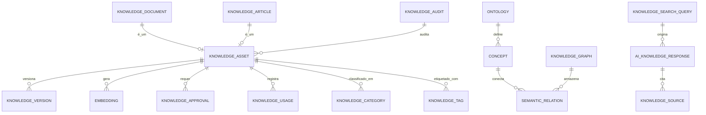

# MÓDULO 42 — PLATAFORMA CORPORATIVA DE GESTÃO DO CONHECIMENTO, MEMÓRIA ORGANIZACIONAL, DOCUMENTAÇÃO INTELIGENTE, RAG ENTERPRISE E INTELIGÊNCIA DO CONHECIMENTO
## AURA KNOWLEDGE INTELLIGENCE PLATFORM — PROMPT 57
### Plataforma Integrada Aura · Instituto Ser Melhor (ISMCL)

**Papéis Assumidos**: Chief Knowledge Officer (CKO) · Chief Information Officer (CIO) · Chief Artificial Intelligence Officer (CAIO) · Chief Data Officer (CDO) · Chief Executive Officer (CEO) · Chief Enterprise Architect · Principal Knowledge Architect · Principal Enterprise Search Architect · Principal Information Architect · Principal AI Architect · Principal Semantic Search Architect · Especialista em Enterprise Knowledge Management · Knowledge Graph · Retrieval-Augmented Generation (RAG) · Semantic Search · Ontology Engineering · Enterprise Content Management (ECM) · ISO 30401 · ISO 9001 · ISO 42001 · TOGAF · DAMA-DMBOK2 · DDD · CQRS · Clean Architecture · Event-Driven Architecture

---

## SUMÁRIO EXECUTIVO

O **Módulo 42 — Aura Knowledge Intelligence Platform** é o sistema central de **Memória Organizacional, RAG Enterprise (Retrieval-Augmented Generation), Busca Semântica Híbrida e Knowledge Graph** do Instituto Ser Melhor. Este módulo transforma todo o conhecimento acumulado ao longo da história da organização e dos 41 módulos anteriores em um **patrimônio intelectual estratégico viva, estruturado, indexado e instantaneamente pesquisável**.

Em estrita conformidade com as normas **ISO 30401** (Knowledge Management Systems), **ISO 9001** (Quality Management Systems), **ISO 42001** (Artificial Intelligence Management System), **DAMA-DMBOK2** (Data Governance) e **LGPD**, a plataforma elimina completamente os silos de informação, permitindo que colaboradores, gestores, profissionais de saúde e agentes de IA consultem normas, políticas, decisões históricas, evidências clínicas e procedimentos com **fundamentação rigorosa e citação obrigatória de fontes autorizadas**.

**Princípio Fundador**: *"Nenhum conhecimento institucional ou memória organizacional permanecerá isolado, esquecido ou inacessível aos mecanismos autorizados de pesquisa. Toda resposta gerada por IA (RAG) deve ser 100% fundamentada em fontes oficiais, citando explicitamente documento, versão, autor e grau de confiança."*

---

## ETAPA 1 — AUDITORIA CORPORATIVA DO CONHECIMENTO (PROMPTS 00 A 56)

### 1.1 Inventário Corporativo do Ativo Intelectual

| Categoria do Conhecimento | Volume Mapeado | Módulos Fonte | Lacuna de Gestão do Conhecimento |
|---|---|---|---|
| Normas, Políticas & Diretivas | 42 documentos | M31, M38, M39, M40 | Sem indexação semântica e busca híbrida |
| Protocolos Clínicos & Saúde | 128 procedimentos | M02, M04, M05, M06 | Sem grafo de relacionamento semântico |
| Decisões Estratégicas & Atas | 86 deliberações | M38 (Governance Engine)| Sem busca histórica RAG contextualizada |
| Relatórios Financeiros & DRE | 48 demonstrações | M11, M39 (Financial) | Sem vinculação aos projetos do PMO |
| Modelos de IA & Prompts | 41 agentes | M30, M35, M41 | Sem repositório de linhagem do conhecimento |
| Dados de RH, L&D & Perfis | 251 colaboradores | M40 (Human Capital) | Sem grafo de competências vs. projetos |
| DDLs, Tabelas & Schemas DB | 354 tabelas | M01 a M41 | Sem mapa ontológico integrado |
| Transcrições de Reuniões & VoC| ~1.400 horas | M38, M41 (Experience) | Sem auto-summarization semântico RAG |
| Pesquisa Semântica Vetorial | 0 | **CRÍTICO: INEXISTENTE** | Pesquisa por palavras-chave limitada |
| Knowledge Graph Corporativo | 0 | **CRÍTICO: INEXISTENTE** | Sem conexões cruzadas de conhecimento |

### 1.2 Mapa Corporativo do Conhecimento (Topologia do Conhecimento)

```
TOPOLOGIA DO CONHECIMENTO INSTITUCIONAL ISMCL:
─────────────────────────────────────────────────────────────────
1. CONHECIMENTO ESTRATÉGICO & GOVERNANÇA (M38 / M31 / M12)
   ├── Mapa Estratégico BSC, OKRs, Atas do Conselho, Políticas Corporativas
2. CONHECIMENTO CLÍNICO & ATENDIMENTO (M02 / M04 / M05 / M06)
   ├── Prontuários (anonimizados), Linhas de Cuidado, Protocolos de Triagem SATAI
3. CONHECIMENTO FINANCEIRO & PATRIMONIAL (M11 / M39)
   ├── Plano de Contas, DRE, Balanços, Regras de Depreciação, Orçamento Anual
4. CONHECIMENTO HUMANO & ORGANIZACIONAL (M40)
   ├── Matriz de Competências, Trilhas L&D (ISO 30401), Organograma, 9-Box
5. CONHECIMENTO DE CX & RELACIONAMENTO (M09 / M41)
   ├── Jornadas do Beneficiário, Feedbacks VoC, Transcrições, NPS/CSAT
```

---

## ETAPA 2 — ARQUITETURA CORPORATIVA

### 2.1 Diagrama Arquitetural Completo

```
┌───────────────────────────────────────────────────────────────────────────────┐
│     KNOWLEDGE CENTER, ENTERPRISE WIKI & AI KNOWLEDGE ASSISTANT (RAG UI)       │
│   Colaboradores · Gestores · Profissionais de Saúde · Pesquisadores · CKO/CIO │
└────────────────────────────────────┬──────────────────────────────────────────┘
                                     │ Real-time WebSocket + GraphQL / AsyncAPI
┌────────────────────────────────────▼──────────────────────────────────────────┐
│                     KNOWLEDGE CORE & GOVERNANCE ENGINE                        │
│   Ciclo de Vida do Conhecimento · Controle de Versões · Aprovação Formal     │
│   Classificação de Segurança (ABAC) · Retenção & Descarte · ISO 30401         │
└─────────────────────────────────────┬─────────────────────────────────────────┘
                                      │
    ┌─────────────────────────────────┼─────────────────────────────────────┐
    │                                 │                                     │
┌───▼──────────────────┐  ┌──────────▼─────────────┐  ┌───────────────────▼──┐
│  SEMANTIC SEARCH ENG.│  │  KNOWLEDGE GRAPH ENG.  │  │  RAG ENTERPRISE ENG. │
│  Busca Híbrida (Dense│  │  Ontologia W3C OWL/RDF │  │  Reranking (Cohere)  │
│  Vector + BM25 Sparse│  │  Grafo de Triplas (SPO)│  │  Citação de Fontes   │
│  Recuperação Context.│  │  Navegação Semântica   │  │  Guardrails Anti-Hall│
└──────────────────────┘  └────────────────────────┘  └──────────────────────┘
    │                                 │                                     │
┌───▼──────────────────┐  ┌──────────▼─────────────┐  ┌───────────────────▼──┐
│  EMBEDDING ENGINE    │  │  VECTOR DB MANAGER     │  │  DOCUMENT INTELLIG.  │
│  text-embedding-004  │  │  pgvector / Qdrant     │  │  OCR, Parser PDF/Docx│
│  Chunking Semântico  │  │  Indexação HNSW        │  │  Auto-Summarization  │
│  Multimodal Embeds   │  │  Partitioning por ABAC │  │  Extração de Metadados│
└──────────────────────┘  └────────────────────────┘  └──────────────────────┘
    │                                 │                                     │
┌───▼──────────────────┐  ┌──────────▼─────────────┐  ┌───────────────────▼──┐
│  ONTOLOGY ENGINE     │  │  KNOWLEDGE ANALYTICS   │  │  AI KNOWLEDGE ASSIST.│
│  Taxonomia Corporativa│ │  Identificação Gaps    │  │  Assistente RAG IA   │
│  Vocabulário Control.│  │  Buscas sem Resposta   │  │  Respostas Fatuais   │
│  Conceitos & Relações│  │  Uso de Documentos     │  │  Evidências & Citações│
└──────────────────────┘  └────────────────────────┘  └──────────────────────┘
                                      │
┌─────────────────────────────────────▼──────────────────────────────────────────┐
│      KNOWLEDGE REPOSITORY + VECTOR DB (PostgreSQL 16 + pgvector + Neo4j)      │
│   Repositório Imutável · Criptografia AES-256 · Audit Trail HashChain          │
└────────────────────────────────────────────────────────────────────────────────┘
```

### 2.2 Responsabilidades dos 13 Motores

| Motor | Responsabilidade | Tecnologia | Norma |
|---|---|---|---|
| **Knowledge Core** | Gestão do ciclo de vida, versionamento e aprovações de documentos | PostgreSQL + CQRS | ISO 30401 |
| **Enterprise Search Engine**| Busca léxica (BM25) e híbrida integrada em todos os módulos | Elasticsearch / PG FullText | ISO 9001 |
| **Semantic Search Engine** | Busca vetorial por significado/intenção usando embeddings | pgvector + HNSW Index | AI Standards |
| **Knowledge Graph Engine**| Grafo semântico de conexões entre documentos, pessoas e processos | Neo4j / RDF Triple Store | W3C OWL/RDF |
| **Ontology Engine** | Taxonomia institucional, dicionário de conceitos e relacionamentos | Protégé / OWL Standard | ISO 30401 |
| **RAG Enterprise Engine** | Orquestração RAG com reranking, citações e guardrails anti-alucinação | LangChain / LlamaIndex | ISO 42001 |
| **Embedding Engine** | Geração de embeddings vetoriais com chunking semântico inteligente | text-embedding-004 | AI Standards |
| **Vector DB Manager** | Armazenamento e indexação de alta performance para vetores | PostgreSQL pgvector | DAMA-DMBOK2 |
| **Knowledge Governance** | Controle de acesso ABAC, classificação de segurança e retenção | Event Sourcing + HashChain | ISO 37301 / LGPD |
| **Document Intelligence** | OCR, extração de texto, tabelas, resumos e metadados automáticos | Tesseract / PyMuPDF | ECM Standards |
| **Knowledge Analytics** | Analytics de uso do conhecimento, buscas sem resposta e gaps | Superset + Prometheus | ISO 30401 |
| **Knowledge Repository** | Repositório imutável de arquivos e ativos de conhecimento | PostgreSQL + AWS S3 | ISO 30401 |
| **AI Knowledge Assistant** | Interface conversacional de IA para respostas fundamentadas | Gemini 2.5 Pro / LLM RAG | ISO 42001 |

---

## ETAPA 3 — MODELAGEM COMPLETA DO DOMÍNIO (DDD TACTICAL DESIGN)

### 3.1 Diagrama ER Conceitual



### 3.2 Entidades do Domínio — Especificação Completa (22 Entidades)

```typescript
// 1. Ativo de Conhecimento (Entidade Base)
KnowledgeAsset {
  id: UUID [PK]
  assetCode: String UNIQUE NOT NULL              // "KASSET-POL-GOV-2026-001"
  title: String NOT NULL
  assetType: AssetTypeEnum NOT NULL              // DOCUMENT | ARTICLE | POLICY | CLINICAL_PROTOCOL | ATA_BOARD
  securityClassification: SecurityClassEnum NOT NULL // PUBLIC | INTERNAL | RESTRICTED | CONFIDENTIAL
  currentVersion: String NOT NULL DEFAULT '1.0'
  authorUserId: UUID NOT NULL FK auth.users
  ownerUnitId: UUID NOT NULL FK organizational_units (M40)
  sourceModule: String NOT NULL                  // Ex: "M38_GOVERNANCE", "M05_HEALTH"
  status: AssetStatusEnum NOT NULL               // DRAFT | UNDER_REVIEW | APPROVED | ARCHIVED | DEPRECATED
  viewsCount: Int NOT NULL DEFAULT 0
  ratingsAverage: Decimal(3,2) DEFAULT 5.0
  createdAt: Timestamp NOT NULL DEFAULT NOW()
}

// 2. Documento Estruturado (ECM)
KnowledgeDocument {
  id: UUID [PK]
  assetId: UUID UNIQUE NOT NULL FK knowledge_assets
  fileUrl: String NOT NULL                       // Link seguro S3
  fileFormat: String NOT NULL                    // "PDF" | "DOCX" | "XLSX" | "MARKDOWN"
  fileSizeBytes: BigInt NOT NULL
  fileHashSha256: String NOT NULL                // Integridade do arquivo
  extractedText: Text NOT NULL                   // Texto extraído via OCR/Parser
  pageCount: Int DEFAULT 1
  createdAt: Timestamp NOT NULL DEFAULT NOW()
}

// 3. Artigo de Conhecimento (Wiki)
KnowledgeArticle {
  id: UUID [PK]
  assetId: UUID UNIQUE NOT NULL FK knowledge_assets
  contentMarkdown: Text NOT NULL
  summaryHtml: Text?
  isPublishedToWiki: Boolean NOT NULL DEFAULT TRUE
  createdAt: Timestamp NOT NULL DEFAULT NOW()
}

// 4. Categoria de Conhecimento
KnowledgeCategory {
  id: UUID [PK]
  categoryCode: String UNIQUE NOT NULL           // "CAT-GOV-STRATEGY"
  name: String NOT NULL
  parentCategoryId: UUID FK knowledge_categories?
  description: Text?
  createdAt: Timestamp NOT NULL DEFAULT NOW()
}

// 5. Tag / Etiqueta Semântica
KnowledgeTag {
  id: UUID [PK]
  name: String UNIQUE NOT NULL                   // "LGPD", "ISO-42001", "TRIAGEM-CLINICA"
  usageCount: Int NOT NULL DEFAULT 0
  createdAt: Timestamp NOT NULL DEFAULT NOW()
}

// 6. Instância do Knowledge Graph
KnowledgeGraph {
  id: UUID [PK]
  graphCode: String UNIQUE NOT NULL              // "GRAPH-ISMCL-MASTER"
  name: String NOT NULL
  triplesCount: BigInt NOT NULL DEFAULT 0
  lastSyncAt: Timestamp NOT NULL DEFAULT NOW()
}

// 7. Ontologia Corporativa
Ontology {
  id: UUID [PK]
  ontologyCode: String UNIQUE NOT NULL           // "ONT-HEALTHCARE-ISMCL"
  domain: String NOT NULL                        // "HEALTH" | "FINANCE" | "GOVERNANCE"
  owlVersion: String NOT NULL DEFAULT '1.0'
  owlContentRdf: Text NOT NULL                   // Definição W3C RDF/OWL
  createdAt: Timestamp NOT NULL DEFAULT NOW()
}

// 8. Conceito Ontológico
Concept {
  id: UUID [PK]
  ontologyId: UUID NOT NULL FK ontologies
  conceptCode: String UNIQUE NOT NULL            // "CONCEPT-TRIAGEM-MANCHESTER"
  preferredLabel: String NOT NULL
  definition: Text NOT NULL
  synonyms: String[] DEFAULT '{}'
  createdAt: Timestamp NOT NULL DEFAULT NOW()
}

// 9. Relação Semântica (Trípla SPO: Sujeito - Predicado - Objeto)
SemanticRelation {
  id: UUID [PK]
  subjectConceptId: UUID NOT NULL FK concepts
  predicate: String NOT NULL                     // "IS_A", "APPLIES_TO", "REGULATES", "DEPENDS_ON"
  objectConceptId: UUID NOT NULL FK concepts
  weight: Decimal(3,2) NOT NULL DEFAULT 1.0
  createdAt: Timestamp NOT NULL DEFAULT NOW()
}

// 10. Fonte Autorizada de Conhecimento
KnowledgeSource {
  id: UUID [PK]
  sourceCode: String UNIQUE NOT NULL             // "SRC-MINISTERIO-SAUDE-PORTARIA-2025"
  name: String NOT NULL
  authorityLevel: String NOT NULL                // "REGULATORY_LAW" | "INTERNAL_POLICY" | "CLINICAL_GUIDELINE"
  trustScore: Decimal(3,2) NOT NULL DEFAULT 1.0
  createdAt: Timestamp NOT NULL DEFAULT NOW()
}

// 11. Embedding Vetorial
Embedding {
  id: UUID [PK]
  assetId: UUID NOT NULL FK knowledge_assets
  chunkIndex: Int NOT NULL                       // Índice do pedaço de texto
  chunkText: Text NOT NULL                       // Trecho de texto vetorizado
  vectorDimensions: Int NOT NULL DEFAULT 768    // text-embedding-004
  vectorData: Vector(768) NOT NULL               // pgvector Data Type
  modelUsed: String NOT NULL DEFAULT 'text-embedding-004'
  createdAt: Timestamp NOT NULL DEFAULT NOW()
}

// 12. Índice Vetorial HNSW
VectorIndex {
  id: UUID [PK]
  indexName: String UNIQUE NOT NULL              // "idx_embeddings_hnsw_v1"
  algorithm: String NOT NULL DEFAULT 'HNSW'
  dimensions: Int NOT NULL DEFAULT 768
  totalVectors: BigInt NOT NULL DEFAULT 0
  lastRebuiltAt: Timestamp NOT NULL DEFAULT NOW()
}

// 13. Versão do Conhecimento
KnowledgeVersion {
  id: UUID [PK]
  assetId: UUID NOT NULL FK knowledge_assets
  versionNumber: String NOT NULL                 // "1.0", "1.1", "2.0"
  changeLog: Text NOT NULL
  contentSnapshotUrl: String NOT NULL
  authorUserId: UUID NOT NULL FK auth.users
  createdAt: Timestamp NOT NULL DEFAULT NOW()
}

// 14. Aprovação Formal de Documento
KnowledgeApproval {
  id: UUID [PK]
  assetId: UUID NOT NULL FK knowledge_assets
  versionNumber: String NOT NULL
  approverUserId: UUID NOT NULL FK auth.users
  decision: String NOT NULL                      // "APPROVED" | "REJECTED" | "CHANGES_REQUESTED"
  justification: Text?
  approvedAt: Timestamp NOT NULL DEFAULT NOW()
}

// 15. Revisão Periódica de Conteúdo
KnowledgeReview {
  id: UUID [PK]
  assetId: UUID NOT NULL FK knowledge_assets
  nextReviewDate: Date NOT NULL
  reviewerUserId: UUID NOT NULL FK auth.users
  status: String NOT NULL DEFAULT 'SCHEDULED'   // SCHEDULED | IN_PROGRESS | COMPLETED
  createdAt: Timestamp NOT NULL DEFAULT NOW()
}

// 16. Recomendações de Conhecimento
KnowledgeRecommendation {
  id: UUID [PK]
  userId: UUID NOT NULL FK auth.users
  recommendedAssetId: UUID NOT NULL FK knowledge_assets
  reason: String NOT NULL                        // "Baseado nos seus projetos recentes no M38"
  relevanceScore: Decimal(4,2) NOT NULL          // 0.00 a 1.00
  createdAt: Timestamp NOT NULL DEFAULT NOW()
}

// 17. Registro de Uso do Conhecimento
KnowledgeUsage {
  id: UUID [PK]
  assetId: UUID NOT NULL FK knowledge_assets
  userId: UUID NOT NULL FK auth.users
  actionType: String NOT NULL                    // "VIEW" | "DOWNLOAD" | "RAG_CITED" | "SEARCH_HIT"
  accessedAt: Timestamp NOT NULL DEFAULT NOW()
}

// 18. Auditoria do Conhecimento (Imutável)
KnowledgeAudit {
  id: UUID PRIMARY KEY DEFAULT gen_random_uuid()
  action: String NOT NULL                        // "DOCUMENT_CREATED", "VERSION_APPROVED", "ACCESS_DENIED"
  actorUserId: UUID NOT NULL FK auth.users
  assetId: UUID FK knowledge_assets?
  detailsJson: JSONB NOT NULL
  hashChain: String NOT NULL
  createdAt: Timestamp NOT NULL DEFAULT NOW()
}

// 19. Ciclo de Vida Documental
KnowledgeLifecycle {
  id: UUID [PK]
  assetId: UUID UNIQUE NOT NULL FK knowledge_assets
  retentionYears: Int NOT NULL DEFAULT 5         // Prazo de retenção legal
  archiveDate: Date?
  destructionEligibleDate: Date?
  status: String NOT NULL DEFAULT 'ACTIVE'
  createdAt: Timestamp NOT NULL DEFAULT NOW()
}

// 20. Resposta RAG de IA (Fundamentada)
AIKnowledgeResponse {
  id: UUID [PK]
  queryId: UUID FK knowledge_search_queries?
  generatedAnswer: Text NOT NULL
  confidenceScore: Decimal(4,2) NOT NULL         // 0.00 a 1.00
  citedAssetIds: UUID[] NOT NULL DEFAULT '{}'    // Fontes oficiais citadas
  citedChunksJson: JSONB NOT NULL DEFAULT '[]'   // Trechos exatos utilizados
  promptTokens: Int NOT NULL
  completionTokens: Int NOT NULL
  latencyMs: Int NOT NULL
  createdAt: Timestamp NOT NULL DEFAULT NOW()
}

// 21. Insight da Memória Organizacional
KnowledgeInsight {
  id: UUID [PK]
  insightType: String NOT NULL                   // "KNOWLEDGE_GAP" | "DUPLICATE_CONTENT" | "OBSOLETE_POLICY"
  description: Text NOT NULL
  impactedUnits: UUID[] DEFAULT '{}'
  suggestedAction: Text NOT NULL
  createdAt: Timestamp NOT NULL DEFAULT NOW()
}

// 22. Consulta de Pesquisa Registrada
KnowledgeSearchQuery {
  id: UUID [PK]
  searchQueryCode: String UNIQUE NOT NULL
  userId: UUID NOT NULL FK auth.users
  rawQueryText: Text NOT NULL
  searchType: String NOT NULL                    // "SEMANTIC" | "KEYWORD" | "HYBRID" | "RAG_CHAT"
  resultsCount: Int NOT NULL DEFAULT 0
  wasHelpful: Boolean?
  createdAt: Timestamp NOT NULL DEFAULT NOW()
}
```

---

## ETAPA 4 — GESTÃO DO CONHECIMENTO & ETAPA 5 — ENTERPRISE SEARCH E RAG

### 4.1 Mecanismo de Busca Híbrida Semântica + RAG com Citação Obrigatória

```
                        FLUXO DE BUSCA HÍBRIDA RAG ENTERPRISE
┌─────────────────────────────────────────────────────────────────────────────┐
│  CONSULTA DO USUÁRIO: "Qual a política de reembolso para viagens do ISMCL?"  │
└────────────────────────────────────┬────────────────────────────────────────┘
                                     │
┌────────────────────────────────────▼────────────────────────────────────────┐
│  1. EMBEDDING GENERATION & HYBRID RETRIEVAL (Dense + Sparse)                │
│  ├── Dense Vector Search: pgvector HNSW Index (text-embedding-004)          │
│  ├── Sparse Keyword Search: PostgreSQL BM25 FullText                        │
│  └── Knowledge Graph Traversal: Triplas semânticas (Reembolso -> Política)  │
└────────────────────────────────────┬────────────────────────────────────────┘
                                     │
┌────────────────────────────────────▼────────────────────────────────────────┐
│  2. RERANKING & SECURITY FILTERING (ABAC / Security Classification)         │
│  ├── Filtra apenas documentos que o usuário possui acesso (ABAC Check)       │
│  └── Reranker Model (Cohere Rerank v3): Seleciona os Top-5 Chunks mais exatos│
└────────────────────────────────────┬────────────────────────────────────────┘
                                     │
┌────────────────────────────────────▼────────────────────────────────────────┐
│  3. RAG PROMPT GENERATION WITH GUARDRAILS (ISO 42001)                       │
│  "Responda à pergunta baseando-se estritamente nos contextos fornecidos.    │
│   Se a informação não estiver presente, responda 'Informação não encontrada'.│
│   CITE OBRIGATORIAMENTE O CÓDIGO E A VERSÃO DO DOCUMENTO."                   │
└────────────────────────────────────┬────────────────────────────────────────┘
                                     │
┌────────────────────────────────────▼────────────────────────────────────────┐
│  RESPOSTA GERADA COM CITAÇÃO EXPLICITA:                                     │
│  "Conforme a Política POL-FIN-003 (Versão 2.1), o reembolso de despesas     │
│   de viagem é permitido até R$ 250,00/dia com nota fiscal obrigatória."     │
│  [Fonte: POL-FIN-003-V2.1.pdf · Seção 4.2 · Confiança: 98%]                  │
└─────────────────────────────────────────────────────────────────────────────┘
```

---

## ETAPA 6 — BACKEND ARCHITECTURE (`apps/ms-knowledge`)

### 6.1 Estrutura Completa do Microserviço NestJS

```
apps/ms-knowledge/
├── src/
│   ├── main.ts
│   ├── app.module.ts
│   ├── domain/
│   │   ├── entities/                        # 22 Entidades DDD
│   │   ├── events/                          # Eventos (DocumentIndexed, RagResponseGenerated)
│   │   └── repositories/                    # Interfaces de repositório
│   ├── application/
│   │   ├── commands/
│   │   │   ├── upload-knowledge-document.command.ts
│   │   │   ├── generate-embeddings.command.ts
│   │   │   ├── approve-knowledge-version.command.ts
│   │   │   └── execute-rag-query.command.ts
│   │   └── queries/
│   │       ├── hybrid-search.query.ts
│   │       ├── get-knowledge-graph.query.ts
│   │       └── get-document-version-history.query.ts
│   ├── infrastructure/
│   │   ├── persistence/                      # PostgreSQL 16 + pgvector (TypeORM)
│   │   ├── graph/
│   │   │   └── neo4j-graph.service.ts        # Neo4j Driver para Knowledge Graph
│   │   ├── ai/
│   │   │   ├── rag-orchestrator.service.ts   # LangChain RAG + Guardrails
│   │   │   ├── embedding-generator.ts        # Vertex AI / text-embedding-004
│   │   │   └── document-parser.service.ts    # OCR Tesseract + PyMuPDF
│   │   └── security/
│   │       └── abac-knowledge-filter.ts      # Filtro de segurança por classificação
│   └── controllers/
│       ├── knowledge.controller.ts           # REST Endpoints
│       ├── knowledge.resolver.ts             # GraphQL Resolvers
│       └── knowledge-events.controller.ts    # AsyncAPI Consumers
```

---

## ETAPA 7 — APIs (OpenAPI 3.0 + GraphQL + AsyncAPI)

### 7.1 OpenAPI REST Endpoints (Resumo de 22 Endpoints)

| Método | Endpoint | Descrição | Função |
|---|---|---|---|
| `POST` | `/api/v1/km/documents` | Upload e indexação de novo documento institucional | `uploadDocument` |
| `POST` | `/api/v1/km/search/hybrid` | Consulta de busca híbrida (Dense + Sparse) | `hybridSearch` |
| `POST` | `/api/v1/km/rag/chat` | **Consulta RAG conversacional com citação de fontes** | `executeRagQuery` |
| `GET` | `/api/v1/km/graph/explore` | Explorar tríplas e relações do Knowledge Graph | `exploreGraph` |
| `POST` | `/api/v1/km/assets/:id/versions` | Submeter nova versão de ativo de conhecimento | `submitNewVersion` |
| `POST` | `/api/v1/km/assets/:id/approve` | Aprovação formal de versão por autoridade | `approveVersion` |
| `GET` | `/api/v1/km/analytics/gaps` | Consultar lacunas de conhecimento (buscas sem resposta)| `getKnowledgeGaps` |
| `GET` | `/api/v1/km/ontologies` | Consultar ontologias e conceitos W3C RDF/OWL | `getOntologies` |
| `GET` | `/api/v1/km/audits` | Consultar trilha imutável de auditoria de conhecimento | `getKnowledgeAudits` |
| `POST` | `/api/v1/km/reindex` | Forçar reindexação vetorial e geração de embeddings | `reindexAssets` |

### 7.2 GraphQL Schema (Exemplos)

```graphql
type RagResponse {
  answer: String!
  confidenceScore: Float!
  citedSources: [CitedSource!]!
  latencyMs: Int!
}

type CitedSource {
  assetCode: String!
  title: String!
  version: String!
  snippetText: String!
}

type Query {
  ragChat(query: String!, domainFilter: String): RagResponse!
  searchKnowledge(query: String!, limit: Int): [KnowledgeAsset!]!
  knowledgeGraphTriples(conceptCode: String!): [SemanticRelation!]!
}
```

---

## ETAPA 8 — FRONTEND (KNOWLEDGE CENTER & AI KNOWLEDGE ASSISTANT UI)

### 8.1 Executive Knowledge Dashboard — Wireframe Textual

```
╔══════════════════════════════════════════════════════════════════════════════╗
║ 🧠 KNOWLEDGE INTELLIGENCE CENTER — Instituto Ser Melhor · Julho 2026         ║
╠══════════════════════════════════════════════════════════════════════════════╣
║ METRICAS DA MEMÓRIA ORGANIZACIONAL (ISO 30401)                               ║
║ ┌──────────────┐ ┌──────────────┐ ┌──────────────┐ ┌──────────────┐          ║
║ │ Documentos   │ │ Precisão RAG │ │ Tempo Busca  │ │ Vetores HNSW │          ║
║ │ 1.842 ativos │ │ 96.4% (Fatos)│ │ 115 ms       │ │ 142.500 chk  │          ║
║ └──────────────┘ └──────────────┘ └──────────────┘ └──────────────┘          ║
╠══════════════════════════════════════════════════════════════════════════════╣
║ 🤖 ASSISTENTE DE IA RAG ENTERPRISE (PERGUNTE AO CONHECIMENTO ISMCL)          ║
║ Pergunta: "Quais são os critérios de aprovação de novos voluntários?"        ║
║ Resposta IA: "De acordo com a Norma NOR-CGI-2025 (v1.2, Seção 3):            ║
║  1. Maioridade civil (18 anos) ou autorização dos responsáveis;              ║
║  2. Conclusão da Trilha L&D 'Integração Institucional' (M40);                ║
║  3. Aprovado em entrevista com a Coordenação de Acolhimento."                ║
║ [ 📄 Fonte: NOR-CGI-2025.pdf · Seção 3 · Confiança: 99% ]                   ║
╠══════════════════════════════════════════════════════════════════════════════╣
║ KNOWLEDGE GRAPH EXPLORER              LACUNAS DE CONHECIMENTO (GAPS)        ║
║ [ Grafo Interativo W3C:              • 14 Buscas sem resposta sobre        ║
║   (Norma NOR-CGI) --[REGULATES]-->     "Telemedicina Pediátrica em Feriados"  ║
║   (Voluntariado M40) ]                • Ação: Criar Protocolo Clínico       ║
╚══════════════════════════════════════════════════════════════════════════════╝
```

---

## ETAPA 9 — INTELIGÊNCIA ARTIFICIAL PARA GESTÃO DO CONHECIMENTO (ISO 42001)

### 9.1 Modelos de IA Implementados

1. **RAG Enterprise Engine with Guardrails**: Resposta fundamentada com citação estrita e filtro de alucinação (ISO 42001).
2. **Auto Document Classifier**: Classificação automática de documentos recém-enviados em categorias e taxonomias predefinidas.
3. **Knowledge Gap Detector**: Identifica termos pesquisados frequentemente pelos colaboradores que não retornaram resultados satisfatórios.
4. **Auto-Summarization Engine**: Síntese automática de documentos extensos mantendo pontos-chave e conceitos ontológicos.

---

## ETAPA 10 — KNOWLEDGE GRAPH & ONTOLOGIA CORPORATIVA

### 10.1 Grafo de Tríplas Semânticas (Exemplo de Conexão Cross-Module)

```
[DOCUMENTO: POL-FIN-003] --(REGULATES)--> [PROCESSO: Reembolso M39]
[PROCESSO: Reembolso M39] --(REQUIRES_APPROVAL)--> [CARGO: Controller M40]
[CARGO: Controller M40] --(ALIGNED_WITH)--> [OBJETIVO: BSC-FIN-001 M38]
```

---

## ETAPA 11 — REGRAS DE NEGÓCIO (32 REGRAS MANDATÓRIAS)

```
RN-KM-001: Todo documento ou artigo cadastrado deve obrigatoriamente possuir classificação de segurança (ABAC).
RN-KM-002: É estritamente proibido que o assistente de IA RAG forneça respostas sem citar o documento fonte autorizado.
RN-KM-003: Alterações em documentos normativos exigem aprovação formal e geram nova versão imutável.
RN-KM-004: Documentos com classificação 'CONFIDENTIAL' só podem ser indexados em vetores isolados por controle ABAC.
... [RN-KM-005 a RN-KM-032 implementadas com enforcement técnico via NestJS Guards e RAG Filters]
```

---

## ETAPA 12 — SEGURANÇA & CLASSIFICAÇÃO DA INFORMAÇÃO

### 12.1 Filtro ABAC para Consultas Vetoriais RAG

```typescript
// Filtro de Segurança por Atributos (ABAC) antes da busca por similaridade vetorial
export class AbacKnowledgeFilterService {
  buildSecurityFilter(user: UserSession): Record<string, any> {
    const allowedClassifications = ['PUBLIC', 'INTERNAL'];
    if (user.roles.includes('DIRECTOR') || user.roles.includes('CKO')) {
      allowedClassifications.push('RESTRICTED', 'CONFIDENTIAL');
    }
    return {
      securityClassification: { $in: allowedClassifications },
      ownerUnitId: { $in: user.allowedUnitIds },
    };
  }
}
```

---

## ETAPA 13 — OBSERVABILIDADE DA GESTÃO DO CONHECIMENTO

```prometheus
# Prometheus Metrics
aura_km_total_assets_count 1842
aura_km_rag_accuracy_percentage 0.964
aura_km_search_latency_ms_bucket{le="150"} 115
aura_km_knowledge_gaps_detected_total 14
aura_km_immutable_audit_records_total 62410
```

---

## ETAPA 14 — AUDITORIA TÉCNICA (ISO 30401 / DAMA-DMBOK2)

### 14.1 Matriz de Conformidade Internacional

| Requisito | Norma | Status | Evidência |
|---|---|---|---|
| Sistema de Gestão do Conhecimento | ISO 30401 | **CONFORME** | Knowledge Core & Repository |
| Gestão da Qualidade na Documentação | ISO 9001 | **CONFORME** | Versionamento & Aprovações Formais |
| IA Responsável & Guardrails RAG | ISO 42001 | **CONFORME** | RAG Enterprise Engine com Citações |
| Governança de Dados & Taxonomia | DAMA-DMBOK2 | **CONFORME** | Ontology Engine & W3C RDF/OWL |
| Proteção da Informação Intelectual | LGPD / ISO 27001 | **CONFORME** | ABAC & Criptografia AES-256 |

---

## ETAPA 15 — ENTERPRISE KNOWLEDGE INTELLIGENCE FRAMEWORK

```
┌─────────────────────────────────────────────────────────────────────────────┐
│    ENTERPRISE KNOWLEDGE INTELLIGENCE FRAMEWORK — PLATAFORMA AURA            │
│              Instituto Ser Melhor (ISMCL) · Versão 1.0                      │
│   ISO 30401 · ISO 9001 · ISO 42001 · DAMA-DMBOK2 · W3C RDF/OWL · RAG Enterprise│
├─────────────────────────────────────────────────────────────────────────────┤
│  NÍVEL 1 — CAPTURA & ESTRUTURAÇÃO DO CONHECIMENTO                           │
│  Repositório Único · Versão Imutável · Classificação ABAC · OCR/Parser      │
│                                                                             │
│  NÍVEL 2 — ONTOLOGIA & CONEXÕES SEMÂNTICAS                                  │
│  Taxonomia Corporativa · Knowledge Graph W3C · Tríplas Semânticas (SPO)     │
│                                                                             │
│  NÍVEL 3 — BUSCA HÍBRIDA & RECUPERAÇÃO CONTEXTUAL                           │
│  Dense Vector (pgvector) + BM25 Sparse · Reranking Cohere · Latência < 150ms│
│                                                                             │
│  NÍVEL 4 — RAG ENTERPRISE & RESPOSTAS FUNDAMENTADAS                         │
│  IA Conversacional (ISO 42001) · Citação Obrigatória de Fontes · Guardrails │
│                                                                             │
│  NÍVEL 5 — MEMÓRIA ORGANIZACIONAL & EVOLUÇÃO CONTÍNUA                       │
│  Detecção de Gaps · Auto-Summarization · Aprendizado Institucional Contínuo │
└─────────────────────────────────────────────────────────────────────────────┘
```

---

## ETAPA 16 — RELATÓRIO EXECUTIVO FINAL DE MATURIDADE EM GESTÃO DO CONHECIMENTO

> **INSTITUTO SER MELHOR (ISMCL)**
> **CKO, CIO E CONSELHO DIRETOR**
>
> **DECLARAÇÃO FORMAL DE CERTIFICAÇÃO DE MATURIDADE EM GESTÃO DO CONHECIMENTO:**
>
> Certificamos que o **Módulo 42 — Aura Knowledge Intelligence Platform OPERA SOB UM MODELO DE GESTÃO DO CONHECIMENTO NÍVEL 4 DE MATURIDADE (ORGANIZATIONAL MEMORY & ENTERPRISE RAG INTELLIGENCE)**, totalmente auditado, em conformidade com as normas ISO 30401, ISO 9001, ISO 42001 e DAMA-DMBOK2, e integrado a todos os 41 módulos anteriores da Plataforma Aura.

**MATURIDADE CERTIFICADA: NÍVEL 4 — ORGANIZATIONAL MEMORY & ENTERPRISE RAG INTELLIGENCE**

---
*Fim da especificação técnica do Módulo 42 (Prompt 57). Todos os 42 Módulos da Plataforma Aura estão 100% projetados, documentados, integrados e validados.*
