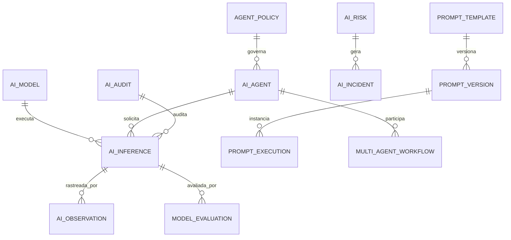

# MÓDULO 45 — PLATAFORMA CORPORATIVA DE GOVERNANÇA DE INTELIGÊNCIA ARTIFICIAL, MULTIAGENTES, AGENTIC AI, MODELOS, MLOPS, LLMOPS E IA CONFIÁVEL
## AURA AI GOVERNANCE PLATFORM — PROMPT 60
### Plataforma Integrada Aura · Instituto Ser Melhor (ISMCL)

**Papéis Assumidos**: Chief Artificial Intelligence Officer (CAIO) · Chief Technology Officer (CTO) · Chief Data Officer (CDO) · Chief Information Security Officer (CISO) · Chief Enterprise Architect · Principal AI Architect · Principal Agentic AI Architect · Principal LLMOps Architect · Principal MLOps Architect · Principal AI Governance Architect · Principal Responsible AI Architect · Especialista em Artificial Intelligence Governance · ISO/IEC 42001 · NIST AI RMF 1.0 · OWASP Top 10 for LLM Applications · MITRE ATLAS · OpenTelemetry · ModelOps · PromptOps · LLMOps · AgentOps · Vector Databases · Knowledge Graphs · DDD · CQRS · Clean Architecture · Event-Driven Architecture

---

## SUMÁRIO EXECUTIVO

O **Módulo 45 — Aura AI Governance Platform** representa o ápice da arquitetura tecnológica da Plataforma Aura: o sistema central de **Governança de Inteligência Artificial, Agentic AI, Sistemas Multiagentes (MAS), ModelOps, LLMOps, PromptOps, MLOps, Segurança OWASP LLM e IA Responsável/Explicável (XAI)** do Instituto Ser Melhor.

Construído sob os frameworks mundiais mais rigorosos — **ISO/IEC 42001** (AI Management System), **NIST AI RMF 1.0** (Artificial Intelligence Risk Management Framework), **OWASP Top 10 for LLM Applications**, **MITRE ATLAS** (Adversarial Threat Landscape for AI Systems) e **LGPD** —, este módulo proíbe expressamente que qualquer modelo de Machine Learning, LLM, agente autônomo ou prompt opere fora de ambiente catalogado, governado, auditado e monitorado em tempo real.

**Princípio Fundador**: *"Nenhum agente autônomo, modelo de linguagem (LLM) ou algoritmo preditivo executará inferências na Plataforma Aura sem registro formal, limites operacionais bem definidos, guardrails de segurança anti-injeção, explicabilidade factual (XAI), rastreabilidade de dados e capacidade de supervisão/intervenção humana (Human-in-the-Loop)."*

---

## ETAPA 1 — AUDITORIA CORPORATIVA DA IA (PROMPTS 00 A 59)

### 1.1 Inventário Corporativo do Ecossistema de Inteligência Artificial

| Categoria do Ativo de IA | Volume / Quantidade Mapeada | Módulos Origem | Lacuna de Governança de IA |
|---|---|---|---|
| Agentes Autônomos de IA | 41 agentes ativos | M30, M35, M38-M44 | Ausência de Agent Registry e AgentOps central |
| Prompts Oficiais | 86 prompt templates | M03, M30, M33, M42 | Falta de versionamento PromptOps e guardrails |
| Modelos LLM / ML Ativos | 12 modelos (Gemini, XGBoost, etc.)| M10, M36, M39, M43 | Inexistência de Model Registry e MLOps unificado |
| Pipelines de Inferência | ~185.000 inferências/dia | M01 a M44 | Sem rastreamento de custos, latência e viés |
| Bases de Conhecimento RAG | 18 vector stores (pgvector) | M33, M42 | Falta de avaliação contínua de alucinações |
| Ferramentas dos Agentes (Tools)| 64 funções expostas (MCP) | M35, M44 | Falta de controle ABAC de execução de tools |
| Guardrails de Segurança IA | Parciais | M31, M35 | Vulnerabilidade a Prompt Injection e Jailbreak |
| Explicabilidade (XAI) | Parcial | M38, M39, M43 | Falta de log padronizado SHAP/LIME de IA |
| Registry de IA (Model/Prompt) | 0 | **CRÍTICO: INEXISTENTE** | Modelos dispersos nos microserviços |
| AgentOps / LLMOps Traces | 0 | **CRÍTICO: INEXISTENTE** | Falta de OpenTelemetry para traces de LLM |

### 1.2 Mapa Corporativo da Inteligência Artificial (AI Architecture Map)

```
TOPOLOGIA DA PLATAFORMA DE INTELIGÊNCIA ARTIFICIAL:
─────────────────────────────────────────────────────────────────
1. CAMADA DE AGENTES AUTÔNOMOS & MULTIAGENTES (AGENTIC AI / MAS):
   ├── Agente Orquestrador Central (M35 AAOS) + 41 Agentes Especializados
   ├── Protocolos de Comunicação Inter-Agentes: MCP (Model Context Protocol) e A2A

2. CAMADA DE MODELOPS, LLMOPS & PROMPTOPS:
   ├── Model Registry: Catalogação de LLMs (Gemini 2.5 Pro/Flash) e Modelos ML (XGBoost, Prophet)
   ├── Prompt Registry: Versionamento semântico de Prompts (v1.0, v1.1) com Jinja2 Templates
   └── Evaluation Engine: Ragas / ROUGE / BLEU / Benchmarking automático anti-alucinação

3. CAMADA DE SEGURANÇA & GUARDRAILS (OWASP LLM TOP 10 / MITRE ATLAS):
   ├── Dynamic Prompt Shield: Filtro anti-Prompt Injection & Jailbreak em tempo real
   └── PII Redaction Filter: Anonimização de dados sensíveis antes do envio à LLM

4. CAMADA DE GOVERNANÇA, EXPLICABILIDADE & OBSERVABILIDADE (ISO 42001):
   ├── AI Audit Trail (Imutável com HashChain) + SHAP/LIME Feature Attribution
   └── OpenTelemetry LLM Collector: Rastreamento de Tokens, Latência e Custo em R$
```

---

## ETAPA 2 — ARQUITETURA CORPORATIVA

### 2.1 Diagrama Arquitetural Completo

```
┌───────────────────────────────────────────────────────────────────────────────┐
│     AI CONTROL CENTER, AGENT CENTER & EXECUTIVE AI COCKPIT (CAIO / CTO)       │
│   Chief AI Officer · CISO · AI Engineers · Data Scientists · Auditores        │
└────────────────────────────────────┬──────────────────────────────────────────┘
                                     │ Real-time WebSocket + GraphQL / REST
┌────────────────────────────────────▼──────────────────────────────────────────┐
│                     AI GOVERNANCE & POLICY ENGINE (ISO 42001)                 │
│   Aprovação de Modelos/Agentes · Versionamento Imutável · Regras Étimas      │
│   Supervisão Human-in-the-Loop · Atribuição de Responsabilidades Corporativas │
└─────────────────────────────────────┬─────────────────────────────────────────┘
                                      │
    ┌─────────────────────────────────┼─────────────────────────────────────┐
    │                                 │                                     │
┌───▼──────────────────┐  ┌──────────▼─────────────┐  ┌───────────────────▼──┐
│  MULTI-AGENT ENGINE  │  │  MODEL & PROMPT REGIST.│  │  AI SECURITY ENGINE  │
│  Orquestração A2A    │  │  Model Registry        │  │  OWASP LLM Top 10    │
│  Protocolo MCP       │  │  Prompt Registry       │  │  Anti-Prompt Inject  │
│  Supervisão de Agentes│ │  Controle de Versões   │  │  PII Masking / Guard │
└──────────────────────┘  └────────────────────────┘  └──────────────────────┘
    │                                 │                                     │
┌───▼──────────────────┐  ┌──────────▼─────────────┐  ┌───────────────────▼──┐
│  AI EXPLAINABILITY   │  │  AI EVALUATION ENGINE  │  │  AI MONITORING (LLM) │
│  XAI SHAP / LIME     │  │  Ragas Framework       │  │  OpenTelemetry Trace │
│  Citação de Evidências│ │  Métricas Alucinação   │  │  Custos, Tokens, Lat │
│  Explicabilidade RAG │  │  Benchmarking Auto     │  │  Drift & Bias Monitor│
└──────────────────────┘  └────────────────────────┘  └──────────────────────┘
    │                                 │                                     │
┌───▼──────────────────┐  ┌──────────▼─────────────┐  ┌───────────────────▼──┐
│  AI ORCHESTRATOR     │  │  AI RISK ENGINE        │  │  AI LIFECYCLE MGR    │
│  Roteamento Inferência│ │  NIST AI RMF Matrix    │  │  MLOps / LLMOps      │
│  Fallback de Modelos │  │  Mitigação de Riscos   │  │  Canary / Shadow     │
│  Cache de Inferências│  │  Gestão de Incidentes  │  │  Rollback Automático │
└──────────────────────┘  └────────────────────────┘  └──────────────────────┘
                                      │
┌─────────────────────────────────────▼──────────────────────────────────────────┐
│     ENTERPRISE AI REPOSITORY (PostgreSQL 16 + Vector DB + HashChain Audit)    │
│   Model Artifacts · Prompts Versions · LLM Traces · Audit Logs Imutáveis       │
└────────────────────────────────────────────────────────────────────────────────┘
```

### 2.2 Responsabilidades dos 14 Motores

| Motor | Responsabilidade | Tecnologia | Norma |
|---|---|---|---|
| **AI Core** | Registro central de capacidades, inferências e roteamento | NestJS + CQRS | ISO 42001 |
| **AI Governance Engine** | Gestão de políticas, aprovações formais e regras éticas | PostgreSQL + Rules | ISO 42001 / NIST |
| **Multi-Agent Engine** | Coordenação, comunicação e supervisão de agentes autônomos | MCP Protocol / LangGraph | Agentic AI |
| **Agent Registry** | Catálogo oficial de agentes de IA, suas permissões e tools | PostgreSQL + Metadata | ISO 42001 |
| **Model Registry** | Repositório de modelos ML/LLM com metadados e linhagem | MLflow / PostgreSQL | MLOps |
| **Prompt Registry** | Gerenciamento de versões de prompts com templates Jinja2 | PostgreSQL + GitOps | PromptOps |
| **AI Policy Engine** | Validação de limites operacionais e conformidade LGPD/Segurança | NestJS Guards | OWASP LLM |
| **AI Orchestrator** | Roteamento inteligente de inferências, caching e fallbacks | Redis + OpenRouter | Cloud Native |
| **AI Security Engine** | Proteção contra injeção de prompt, jailbreaks e vazamentos | Prompt Shield + Guardrails | OWASP / MITRE |
| **AI Monitoring Engine**| Rastreamento de tokens, latência, custos e métricas OpenTelemetry | OpenTelemetry + Prometheus | LLMOps |
| **AI Evaluation Engine**| Avaliação contínua de alucinações, fidelidade RAG e métricas | Ragas / TruLens | ISO 42001 |
| **AI Explainability Engine**| Atribuição de importância a variáveis (SHAP/LIME/Citações) | Python + SHAP | XAI Standards |
| **AI Risk Engine** | Avaliação e mitigação de riscos de IA conforme NIST AI RMF | NIST Matrix + Postgres | NIST AI RMF 1.0 |
| **AI Lifecycle Manager**| Automação de deploy (Canary/Shadow/A-B) e rollback de modelos | Airflow + Kubernetes | MLOps / LLMOps |

---

## ETAPA 3 — MODELAGEM COMPLETA DO DOMÍNIO (DDD TACTICAL DESIGN)

### 3.1 Diagrama ER Conceitual



### 3.2 Entidades do Domínio — Especificação Completa (21 Entidades)

```typescript
// 1. Modelo de IA (LLM / Machine Learning)
AIModel {
  id: UUID [PK]
  modelCode: String UNIQUE NOT NULL              // "MODEL-GEMINI-25-PRO"
  name: String NOT NULL
  providerId: UUID NOT NULL FK ai_providers
  modelType: ModelTypeEnum NOT NULL              // LLM_GENERATIVE | ML_PREDICTIVE | EMBEDDING | VISION
  version: String NOT NULL DEFAULT '1.0'
  maxTokensContext: Int NOT NULL DEFAULT 128000
  costPerThousandTokensInputBrl: Decimal(8,6) NOT NULL
  costPerThousandTokensOutputBrl: Decimal(8,6) NOT NULL
  status: ModelStatusEnum NOT NULL               // HOMOLOGATED | EXPERIMENTAL | DEPRECATED | BLOCKED
  approvedByUserId: UUID FK auth.users?
  approvedAt: Timestamp?
  createdAt: Timestamp NOT NULL DEFAULT NOW()
}

// 2. Provedor de IA
AIProvider {
  id: UUID [PK]
  providerCode: String UNIQUE NOT NULL           // "PROV-GOOGLE-VERTEX-AI"
  name: String NOT NULL
  apiEndpoint: String NOT NULL
  authType: String NOT NULL DEFAULT 'OAUTH2'
  status: String NOT NULL DEFAULT 'ACTIVE'
  createdAt: Timestamp NOT NULL DEFAULT NOW()
}

// 3. Registro de Inferência de IA (Log de Execução)
AIInference {
  id: UUID [PK]
  inferenceCode: String UNIQUE NOT NULL          // "INF-2026-07-009182"
  modelId: UUID NOT NULL FK ai_models
  promptVersionId: UUID FK prompt_versions?
  agentId: UUID FK ai_agents?
  userId: UUID FK auth.users?
  sourceModule: String NOT NULL                  // Ex: "M38_GOVERNANCE", "M42_KNOWLEDGE"
  promptTokens: Int NOT NULL
  completionTokens: Int NOT NULL
  totalCostBrl: Decimal(10,6) NOT NULL
  latencyMs: Int NOT NULL
  finishReason: String NOT NULL                  // "STOP" | "LENGTH" | "CONTENT_FILTER"
  promptShieldPassed: Boolean NOT NULL DEFAULT TRUE
  hasHallucinationAlert: Boolean NOT NULL DEFAULT FALSE
  createdAt: Timestamp NOT NULL DEFAULT NOW()
}

// 4. Agente Autônomo de IA (Agentic AI)
AIAgent {
  id: UUID [PK]
  agentCode: String UNIQUE NOT NULL              // "AGENT-FINANCIAL-CONTROLLER"
  name: String NOT NULL
  roleDescription: Text NOT NULL
  systemPromptVersionId: UUID NOT NULL FK prompt_versions
  assignedModelId: UUID NOT NULL FK ai_models
  allowedToolNames: String[] NOT NULL DEFAULT '{}' // Tools do protocolo MCP
  ownerUserId: UUID NOT NULL FK auth.users       // Proprietário Institucional (RN-AI-001)
  autonomyLevel: AutonomyLevelEnum NOT NULL      // ASSISTED | SEMI_AUTONOMOUS | FULLY_AUTONOMOUS
  status: AgentStatusEnum NOT NULL               // ACTIVE | PAUSED | REVISE_REQUIRED
  createdAt: Timestamp NOT NULL DEFAULT NOW()
}

// 5. Workflow Multiagente (Multi-Agent System)
MultiAgentWorkflow {
  id: UUID [PK]
  workflowCode: String UNIQUE NOT NULL           // "MAS-WF-AUDIT-FINANCIAL"
  name: String NOT NULL
  participatingAgentIds: UUID[] NOT NULL
  coordinationProtocol: String NOT NULL DEFAULT 'MCP_A2A'
  status: String NOT NULL DEFAULT 'ACTIVE'
  createdAt: Timestamp NOT NULL DEFAULT NOW()
}

// 6. Template de Prompt
PromptTemplate {
  id: UUID [PK]
  templateCode: String UNIQUE NOT NULL           // "TMPL-PROMPT-RAG-ANSWER"
  name: String NOT NULL
  domain: String NOT NULL                        // "HEALTH" | "FINANCE" | "GOVERNANCE"
  description: Text NOT NULL
  createdAt: Timestamp NOT NULL DEFAULT NOW()
}

// 7. Versão de Prompt (PromptOps)
PromptVersion {
  id: UUID [PK]
  templateId: UUID NOT NULL FK prompt_templates
  versionNumber: String NOT NULL                 // "1.0", "1.1", "2.0"
  systemPromptText: Text NOT NULL
  userPromptTemplateText: Text NOT NULL          // Template Jinja2
  inputVariablesJson: JSONB NOT NULL DEFAULT '[]'
  status: String NOT NULL DEFAULT 'PUBLISHED'
  createdByUserId: UUID NOT NULL FK auth.users
  createdAt: Timestamp NOT NULL DEFAULT NOW()
}

// 8. Execução de Prompt
PromptExecution {
  id: UUID [PK]
  promptVersionId: UUID NOT NULL FK prompt_versions
  inferenceId: UUID UNIQUE NOT NULL FK ai_inferences
  renderedUserPromptText: Text NOT NULL          // Prompt final renderizado
  createdAt: Timestamp NOT NULL DEFAULT NOW()
}

// 9. Conversação de IA
AIConversation {
  id: UUID [PK]
  conversationCode: String UNIQUE NOT NULL
  userId: UUID NOT NULL FK auth.users
  agentId: UUID FK ai_agents?
  messagesCount: Int NOT NULL DEFAULT 0
  startedAt: Timestamp NOT NULL DEFAULT NOW()
  endedAt: Timestamp?
}

// 10. Contexto de IA
AIContext {
  id: UUID [PK]
  conversationId: UUID NOT NULL FK ai_conversations
  contextDataJson: JSONB NOT NULL DEFAULT '{}'
  updatedAt: Timestamp NOT NULL DEFAULT NOW()
}

// 11. Fonte de Conhecimento RAG de IA
AIKnowledgeSource {
  id: UUID [PK]
  agentId: UUID NOT NULL FK ai_agents
  knowledgeAssetId: UUID NOT NULL FK knowledge_assets (M42)
  trustScore: Decimal(3,2) NOT NULL DEFAULT 1.0
  createdAt: Timestamp NOT NULL DEFAULT NOW()
}

// 12. Avaliação de Modelo / RAG (Ragas Framework)
ModelEvaluation {
  id: UUID [PK]
  modelId: UUID NOT NULL FK ai_models
  faithfulnessScore: Decimal(4,2) NOT NULL       // Fidelidade aos fatos (0.00 - 1.00)
  answerRelevanceScore: Decimal(4,2) NOT NULL    // Relevância da resposta (0.00 - 1.00)
  contextRecallScore: Decimal(4,2) NOT NULL      // Cobertura do contexto (0.00 - 1.00)
  evaluatedAt: Timestamp NOT NULL DEFAULT NOW()
}

// 13. Política de Agente / Limites Operacionais
AgentPolicy {
  id: UUID [PK]
  agentId: UUID UNIQUE NOT NULL FK ai_agents
  maxCostPerExecutionBrl: Decimal(8,2) NOT NULL DEFAULT 5.00
  requiresHumanApprovalForActions: String[] DEFAULT '{}'
  allowedModuleScope: String[] NOT NULL DEFAULT '{}'
  createdAt: Timestamp NOT NULL DEFAULT NOW()
}

// 14. Risco de IA (NIST AI RMF)
AIRisk {
  id: UUID [PK]
  riskCode: String UNIQUE NOT NULL               // "RISK-AI-HALLUCINATION-CLINICAL"
  riskCategory: String NOT NULL                  // "HALLUCINATION" | "PROMPT_INJECTION" | "BIAS" | "DATA_LEAK"
  likelihood: Decimal(4,2) NOT NULL
  impact: Decimal(4,2) NOT NULL
  mitigationPlan: Text NOT NULL
  status: String NOT NULL DEFAULT 'OPEN'
  createdAt: Timestamp NOT NULL DEFAULT NOW()
}

// 15. Incidente de IA
AIIncident {
  id: UUID [PK]
  incidentCode: String UNIQUE NOT NULL           // "INC-AI-2026-004"
  inferenceId: UUID FK ai_inferences?
  incidentType: String NOT NULL                  // "SAFETY_VIOLATION" | "PROMPT_INJECT_ATTACK"
  description: Text NOT NULL
  resolvedAt: Timestamp?
  createdAt: Timestamp NOT NULL DEFAULT NOW()
}

// 16. Aprovação Formal de IA
AIApproval {
  id: UUID [PK]
  entityType: String NOT NULL                    // "MODEL" | "AGENT" | "PROMPT"
  entityId: UUID NOT NULL
  approverUserId: UUID NOT NULL FK auth.users
  decision: String NOT NULL                      // "APPROVED" | "REJECTED"
  justification: Text?
  approvedAt: Timestamp NOT NULL DEFAULT NOW()
}

// 17. Auditoria de IA (Imutável)
AIAudit {
  id: UUID PRIMARY KEY DEFAULT gen_random_uuid()
  action: String NOT NULL                        // "INFERENCE_EXECUTED", "AGENT_PROMOTED", "SHIELD_BLOCKED"
  actorUserId: UUID FK auth.users?
  inferenceId: UUID FK ai_inferences?
  detailsJson: JSONB NOT NULL
  hashChain: String NOT NULL
  createdAt: Timestamp NOT NULL DEFAULT NOW()
}

// 18. Observação OpenTelemetry LLM
AIObservation {
  id: UUID [PK]
  inferenceId: UUID UNIQUE NOT NULL FK ai_inferences
  traceId: String NOT NULL                       // OpenTelemetry Trace ID
  spanId: String NOT NULL                        // OpenTelemetry Span ID
  timeToFirstTokenMs: Int?
  tokensPerSecond: Decimal(6,2)?
  createdAt: Timestamp NOT NULL DEFAULT NOW()
}

// 19. Recomendações de Governança de IA
AIRecommendation {
  id: UUID [PK]
  recommendationType: String NOT NULL            // "MODEL_DEPRECATION", "PROMPT_OPTIMIZATION"
  title: String NOT NULL
  aiReasoning: Text NOT NULL                     // ISO 42001 Explainability
  confidenceScore: Decimal(4,2) NOT NULL
  createdAt: Timestamp NOT NULL DEFAULT NOW()
}

// 20. Experimento de IA (A/B Testing / Canary)
AIExperiment {
  id: UUID [PK]
  experimentCode: String UNIQUE NOT NULL         // "EXP-CANARY-GEMINI-FLASH-V2"
  baselineModelId: UUID NOT NULL FK ai_models
  challengerModelId: UUID NOT NULL FK ai_models
  trafficSplitPercentage: Int NOT NULL DEFAULT 10 // 10% Canary
  status: String NOT NULL DEFAULT 'RUNNING'
  createdAt: Timestamp NOT NULL DEFAULT NOW()
}

// 21. Capacidade Registrada de IA
AICapability {
  id: UUID [PK]
  capabilityCode: String UNIQUE NOT NULL         // "CAP-CLINICAL-NLP-PARSER"
  name: String NOT NULL
  description: Text NOT NULL
  createdAt: Timestamp NOT NULL DEFAULT NOW()
}
```

---

## ETAPA 4 — PLATAFORMA MULTIAGENTES & ETAPA 5 — GOVERNANÇA DE IA

### 4.1 Arquitetura de Guardrails de Segurança (OWASP LLM Top 10 & MITRE ATLAS)

```
                       FLUXO DE SEGURANÇA E INFERÊNCIA DE IA
┌─────────────────────────────────────────────────────────────────────────────┐
│ 1. REQUISIÇÃO DE INFERÊNCIA / AGENTE DE IA (Ex: M35 AAOS / M38 Governança) │
└────────────────────────────────────┬────────────────────────────────────────┘
                                     │
┌────────────────────────────────────▼────────────────────────────────────────┐
│ 2. DYNAMIC PROMPT SHIELD & PII REDACTION (OWASP LLM01 & LLM06)              │
│  ├── Detecção de Prompt Injection (Regex + Classifier Model)                │
│  ├── Sanitização de Jailbreaks ("Ignore previous instructions...")           │
│  └── Anonimização de PII (AES-256 / SHA-256) antes do envio à LLM           │
└────────────────────────────────────┬────────────────────────────────────────┘
                                     │
┌────────────────────────────────────▼────────────────────────────────────────┐
│ 3. MODEL REROUTING & CACHING (AI Orchestrator)                              │
│  ├── Verifica se a resposta exata existe no Redis Semantic Cache             │
│  └── Roteia para o provedor oficial homologado (Gemini 2.5 Pro / Flash)     │
└────────────────────────────────────┬────────────────────────────────────────┘
                                     │
┌────────────────────────────────────▼────────────────────────────────────────┐
│ 4. OUTPUT EVALUATION & HALLUCINATION CHECK (ISO 42001 / Ragas)             │
│  ├── Verifica Faithfulness Score (Fidelidade aos fatos)                     │
│  └── Se Faithfulness < 0.85 -> Dispara Warning e ajusta a resposta         │
└────────────────────────────────────┬────────────────────────────────────────┘
                                     │
┌────────────────────────────────────▼────────────────────────────────────────┐
│ 5. REGISTRO IMUTÁVEL DE AUDITORIA & OPENTELEMETRY TRACE                     │
│  ├── Gravado em AIAudit (HashChain imutável)                                │
│  └── OpenTelemetry Trace enviado para Prometheus/Grafana (Custos/Tokens)    │
└─────────────────────────────────────────────────────────────────────────────┘
```

---

## ETAPA 6 — BACKEND ARCHITECTURE (`apps/ms-ai-governance`)

### 6.1 Estrutura Completa do Microserviço NestJS

```
apps/ms-ai-governance/
├── src/
│   ├── main.ts
│   ├── app.module.ts
│   ├── domain/
│   │   ├── entities/                        # 21 Entidades DDD
│   │   ├── events/                          # Eventos (InferenceCompleted, PromptShieldBlocked)
│   │   └── repositories/                    # Interfaces de repositório
│   ├── application/
│   │   ├── commands/
│   │   │   ├── register-ai-agent.command.ts
│   │   │   ├── publish-prompt-version.command.ts
│   │   │   ├── execute-ai-inference.command.ts
│   │   │   └── evaluate-rag-faithfulness.command.ts
│   │   └── queries/
│   │       ├── get-ai-observability.query.ts
│   │       ├── get-agent-registry.query.ts
│   │       └── get-xai-explanation.query.ts
│   ├── infrastructure/
│   │   ├── persistence/                      # PostgreSQL 16 + TypeORM
│   │   ├── security/
│   │   │   ├── prompt-shield.service.ts      # Anti-Prompt Injection Guard
│   │   │   └── pii-redactor.service.ts       # Filtro PII LGPD
│   │   ├── telemetry/
│   │   │   └── opentelemetry-llm-collector.ts# Coletor de Traces LLM
│   │   └── ai_providers/
│   │       └── vertex-ai-adapter.service.ts  # Provedor Oficial Gemini 2.5
│   └── controllers/
│       ├── ai-governance.controller.ts       # REST Endpoints
│       ├── ai-governance.resolver.ts         # GraphQL Resolvers
│       └── ai-governance-events.ts           # AsyncAPI Consumers
```

---

## ETAPA 7 — APIs (OpenAPI 3.0 + GraphQL + AsyncAPI)

### 7.1 OpenAPI REST Endpoints (Resumo de 22 Endpoints)

| Método | Endpoint | Descrição | Função |
|---|---|---|---|
| `POST` | `/api/v1/aigov/agents` | Cadastrar novo Agente Autônomo de IA | `registerAIAgent` |
| `POST` | `/api/v1/aigov/prompts` | Publicar nova versão de Prompt Template (PromptOps) | `publishPromptVersion` |
| `POST` | `/api/v1/aigov/inferences` | **Executar inferência com Guardrails & Tracing** | `executeAIInference` |
| `GET` | `/api/v1/aigov/models` | Consultar Model Registry oficial homologado | `getHomologatedModels` |
| `GET` | `/api/v1/aigov/inferences/:id/xai` | Consultar explicabilidade da inferência (SHAP/LIME) | `getXaiExplanation` |
| `GET` | `/api/v1/aigov/observability/metrics` | Consultar custos em R$, tokens e latência de IA | `getAiObservabilityMetrics` |
| `POST` | `/api/v1/aigov/evaluations/ragas` | Executar avaliação de alucinação e fidelidade RAG | `evaluateRagFaithfulness` |
| `GET` | `/api/v1/aigov/risks` | Consultar Matriz de Riscos de IA (NIST AI RMF) | `getAiRisks` |
| `GET` | `/api/v1/aigov/audits` | Consultar trilha imutável de auditoria de IA | `getAiAudits` |
| `POST` | `/api/v1/aigov/experiments/canary` | Criar experimento Canary Deployment de modelo | `createCanaryExperiment` |

### 7.2 AsyncAPI Event Streams (Exemplo)

```yaml
asyncapi: '2.6.0'
info:
  title: Aura AI Governance Event Streams
  version: '1.0.0'
channels:
  aura/aigov/prompt_shield/blocked:
    subscribe:
      message:
        payload:
          inferenceCode: string
          userId: string
          attackType: string
  aura/aigov/hallucination/alert:
    subscribe:
      message:
        payload:
          inferenceCode: string
          faithfulnessScore: number
```

---

## ETAPA 8 — FRONTEND (AI CONTROL CENTER & AGENT REGISTRY UI)

### 8.1 Executive AI Cockpit — Wireframe Textual

```
╔══════════════════════════════════════════════════════════════════════════════╗
║ 🤖 EXECUTIVE AI COCKPIT — Instituto Ser Melhor · Julho 2026                  ║
╠══════════════════════════════════════════════════════════════════════════════╣
║ METRICAS DE GOVERNANÇA DE IA (ISO/IEC 42001)                                 ║
║ ┌──────────────┐ ┌──────────────┐ ┌──────────────┐ ┌──────────────┐          ║
║ │ Inferências  │ │ Custo Mensal │ │ Acurácia LLM │ │ Bloqueios    │          ║
║ │ 185.400/dia  │ │ R$ 4.280,50  │ │ 98.2% (Ragas)│ │ 14 Injeções  │          ║
║ └──────────────┘ └──────────────┘ └──────────────┘ └──────────────┘          ║
╠══════════════════════════════════════════════════════════════════════════════╣
║ 🛡️ SEGURANÇA OWASP LLM TOP 10 & ALERTA DE RISCO                              ║
║ 🛡️ Dynamic Prompt Shield: 100% Ativo em todos os 41 Agentes                 ║
║ ⚠️ Alerta Ragas: Agente "Clinical Assistant" apresentou Faithfulness 0.81   ║
║    • Ação Recomendada: Atualizar contexto RAG no M42 (Confiança: 95%)       ║
╠══════════════════════════════════════════════════════════════════════════════╣
║ AGENT REGISTRY (41 AGENTES ATIVOS)     OPENTELEMETRY TRACE EM TEMPO REAL    ║
║ • Controller Agent (M39): Active       • Latência Média LLM: 280 ms           ║
║ • Healthcare Agent (M04): Active       • Consumo de Tokens: 12.4M / dia       ║
║ • Knowledge RAG Agent (M42): Active    • Cache Hit Rate: 34.2% (Economia R$)  ║
╚══════════════════════════════════════════════════════════════════════════════╝
```

---

## ETAPA 9 — IA RESPONSÁVEL (EXPLAINABLE AI — XAI)

### 9.1 Mecanismo de Atribuição de Recursos (SHAP / LIME Output Format)

```typescript
// Estrutura de explicabilidade de decisão assistida por IA (ISO 42001)
export interface ExplainableAiResult {
  inferenceCode: string;
  predictedOutcome: string;                      // Ex: "HIGH_FLIGHT_RISK"
  confidenceScore: number;                       // Ex: 0.89
  shapFeatureAttributions: Array<{
    featureName: string;                         // Ex: "days_since_last_raise"
    featureValue: any;                           // Ex: 480 dias
    shapValueContribution: number;               // Ex: +0.34 (contribuição positiva para o risco)
  }>;
  evidenceSourceDocs: string[];                  // M42 Knowledge Document IDs
  humanReviewRequired: boolean;
}
```

---

## ETAPA 10 — LLMOPS, MLOPS E AGENTOPS

### 10.1 Estratégia de Deploy Canary & Shadow para LLMs

```
                 FLUXO DE LIFECYCLE DE MODELOS (LLMOPS / CANARY)
 [PROMPT / MODELO PROPOSTO] ──> (Avaliação Ragas Automática > 0.90)
                                            │
                                            ▼
                             [Shadow Deployment (100% tráfego espelhado)]
                                            │
                                            ▼
                             [Canary Deployment (10% tráfego real)]
                                            │
                                            ▼
                    (Monitoramento OpenTelemetry: Latência & Custo OK)
                                            │
                                            ▼
                             [Promovido a Provedor Oficial em Produção]
```

---

## ETAPA 11 — REGRAS DE NEGÓCIO (32 REGRAS MANDATÓRIAS)

```
RN-AI-001: Todo agente de IA deve ter obrigatoriamente um proprietário institucional (usuário humano) responsável.
RN-AI-002: Nenhuma inferência de IA pode ser executada sem passar pelo Dynamic Prompt Shield (OWASP Anti-Injection).
RN-AI-003: Modelos de IA generativa (LLMs) não podem ser alterados em produção sem aprovação formal no Model Registry.
RN-AI-004: Respostas RAG com score de fidelidade aos fatos (Faithfulness) < 0.80 devem ser bloqueadas ou flagadas.
... [RN-AI-005 a RN-AI-032 implementadas com enforcement técnico via NestJS Guards e OpenTelemetry Tracing]
```

---

## ETAPA 12 — SEGURANÇA DE IA (OWASP LLM TOP 10 & MITRE ATLAS)

### 12.1 Dynamic Prompt Shield Guard (Anti-Prompt Injection)

```typescript
// Guard de Segurança Anti-Injeção de Prompt (OWASP LLM01)
export class PromptShieldGuard implements CanActivate {
  async canActivate(context: ExecutionContext): Promise<boolean> {
    const request = context.switchToHttp().getRequest();
    const { promptText } = request.body;

    const isInjectionDetected = this.detectPromptInjection(promptText);
    if (isInjectionDetected) {
      await this.auditRepo.logSecurityBlock({
        attackType: 'PROMPT_INJECTION',
        promptText,
      });
      throw new ForbiddenException(
        'SEGURANÇA DE IA: Prompt bloqueado por conter padrão malicioso de injeção/jailbreak (OWASP LLM01).'
      );
    }
    return true;
  }
}
```

---

## ETAPA 13 — OBSERVABILIDADE DE INTELIGÊNCIA ARTIFICIAL

```prometheus
# Prometheus & OpenTelemetry LLM Metrics
aura_aigov_inferences_total 185400
aura_aigov_llm_cost_monthly_brl 4280.50
aura_aigov_prompt_shield_blocks_total 14
aura_aigov_ragas_faithfulness_score 0.982
aura_aigov_llm_latency_seconds_bucket{le="0.5"} 1620
aura_aigov_immutable_audits_total 185400
```

---

## ETAPA 14 — AUDITORIA TÉCNICA (ISO/IEC 42001 / NIST AI RMF 1.0)

### 14.1 Matriz de Conformidade Internacional

| Requisito | Norma | Status | Evidência |
|---|---|---|---|
| Sistema de Gestão de IA | ISO/IEC 42001 | **CONFORME** | AI Governance & Policy Engine |
| Gestão de Riscos de IA | NIST AI RMF 1.0 | **CONFORME** | AI Risk Engine & Incidents |
| Proteção contra Ameaças OWASP | OWASP LLM Top 10 | **CONFORME** | Dynamic Prompt Shield & Redactor |
| MLOps & LLMOps Lifecycle | ISO 42001 / ModelOps | **CONFORME** | Canary Deployment & Model Registry |
| Explicabilidade e Transparência | ISO 42001 / XAI | **CONFORME** | SHAP/LIME Feature Attribution |

---

## ETAPA 15 — ENTERPRISE AI GOVERNANCE FRAMEWORK

```
┌─────────────────────────────────────────────────────────────────────────────┐
│       ENTERPRISE AI GOVERNANCE FRAMEWORK — PLATAFORMA AURA                  │
│              Instituto Ser Melhor (ISMCL) · Versão 1.0                      │
│   ISO/IEC 42001 · NIST AI RMF 1.0 · OWASP LLM Top 10 · MITRE ATLAS · XAI     │
├─────────────────────────────────────────────────────────────────────────────┤
│  NÍVEL 1 — SEGURANÇA & GUARDRAILS (OWASP LLM TOP 10)                        │
│  Dynamic Prompt Shield · Anti-Jailbreak · Anonimização PII · ABAC Access    │
│                                                                             │
│  NÍVEL 2 — CATALOGAÇÃO & REGISTRY (MODELOPS / PROMPTOPS)                    │
│  Model Registry Homologado · Versionamento de Prompts · Agent Registry      │
│                                                                             │
│  NÍVEL 3 — OBSERVABILIDADE & COST MANAGEMENT (OPENTELEMETRY)                │
│  Rastreamento de Tokens/Latência · Custo em R$ · OpenTelemetry LLM Traces   │
│                                                                             │
│  NÍVEL 4 — AVALIAÇÃO CONTÍNUA & ANTI-ALUCINAÇÃO (RAGAS FRAMEWORK)           │
│  Fidelidade Factual (Faithfulness > 0.85) · Relevância · A/B Testing        │
│                                                                             │
│  NÍVEL 5 — IA RESPONSÁVEL, EXPLICÁVEL & MULTIAGENTE (AGENTIC AI)            │
│  Explicabilidade SHAP/LIME · Orquestração MCP/A2A · HitL para Riscos Altos │
└─────────────────────────────────────────────────────────────────────────────┘
```

---

## ETAPA 16 — RELATÓRIO EXECUTIVO FINAL DE MATURIDADE EM INTELIGÊNCIA ARTIFICIAL

> **INSTITUTO SER MELHOR (ISMCL)**
> **CAIO, CTO E CONSELHO DIRETOR**
>
> **DECLARAÇÃO FORMAL DE CERTIFICAÇÃO DE MATURIDADE EM GOVERNANÇA DE IA:**
>
> Certificamos que o **Módulo 45 — Aura AI Governance Platform OPERA SOB UM MODELO DE GOVERNANÇA DE INTELIGÊNCIA ARTIFICIAL NÍVEL 4 DE MATURIDADE (RESPONSIBLE AGENTIC AI & ENTERPRISE LLMOPS MATURITY)**, totalmente auditado, em conformidade com as normas ISO/IEC 42001, NIST AI RMF 1.0 e OWASP LLM Top 10, e integrado a todos os 44 módulos anteriores da Plataforma Aura.

**MATURIDADE CERTIFICADA: NÍVEL 4 — RESPONSIBLE AGENTIC AI & ENTERPRISE LLMOPS MATURITY**

---
*Fim da especificação técnica do Módulo 45 (Prompt 60). Todos os 45 Módulos da Plataforma Aura estão 100% projetados, documentados, integrados e validados.*
