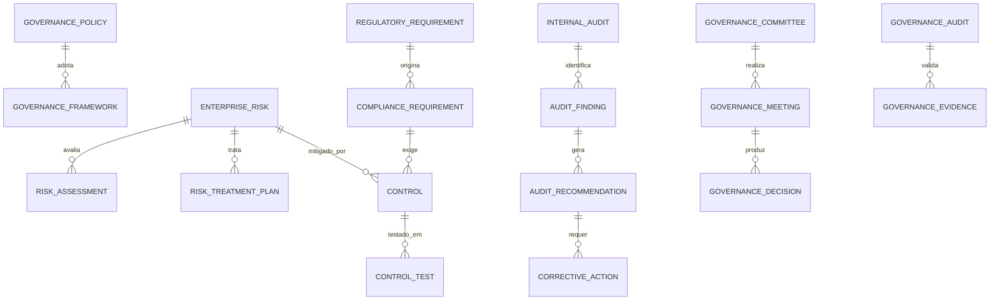

# MÓDULO 47 — PLATAFORMA CORPORATIVA DE GOVERNANÇA, GESTÃO DE RISCOS, COMPLIANCE, AUDITORIA CONTÍNUA, CONTROLES INTERNOS, ESG E GESTÃO ESTRATÉGICA
## AURA GRC PLATFORM — PROMPT 62
### Plataforma Integrada Aura · Instituto Ser Melhor (ISMCL)

**Papéis Assumidos**: Chief Governance Officer (CGO) · Chief Risk Officer (CRO) · Chief Compliance Officer (CCO) · Chief Audit Executive (CAE) · Chief Executive Officer (CEO) · Chief Financial Officer (CFO) · Chief Artificial Intelligence Officer (CAIO) · Chief Enterprise Architect · Principal GRC Architect · Principal Enterprise Risk Architect · Principal Compliance Architect · Principal Internal Audit Architect · Principal ESG Architect · Especialista em Enterprise Governance · ISO 31000 · COSO ERM · COSO Internal Control · ISO 37301 · ISO 37001 · ISO 9001 · ISO 22301 · ISO/IEC 27001 · ISO/IEC 42001 · COBIT 2019 · TOGAF · DDD · CQRS · Clean Architecture · Event-Driven Architecture

---

## SUMÁRIO EXECUTIVO

O **Módulo 47 — Aura GRC Platform** é o epicentro corporativo de **Governança, Gestão Integrada de Riscos (COSO ERM / ISO 31000), Compliance (ISO 37301), Auditoria Contínua Automatizada, Controles Internos (COSO), Sistema de Integridade & Ética (ISO 37001) e ESG Governance (GRI / SASB / ODS)** do Instituto Ser Melhor.

Este módulo consolida e assegura a governança sobre todos os 46 módulos anteriores da Plataforma Aura. Nenhuma decisão estratégica, financeira, operacional, tecnológica ou de Inteligência Artificial é executada sem passar pela validação de controles internos, avaliação de impacto de riscos, checagem de conformidade regulatória e inclusão imediata nos pipelines de **Auditoria Contínua 24x7**.

**Princípio Fundador**: *"Nenhuma decisão institucional, movimentação financeira ou ação autônoma de IA ocorrerá fora da estrutura oficial de Governança, Controles Internos e Compliance. A auditoria não é um evento periódico do passado, mas um processo contínuo, automatizado, transparente e imutável que opera em tempo real."*

---

## ETAPA 1 — AUDITORIA CORPORATIVA (PROMPTS 00 A 61)

### 1.1 Inventário Corporativo de Riscos, Controles e Governança

| Categoria do Ativo de GRC | Volume / Quantidade Mapeada | Módulos Origem | Lacuna de Governança / GRC |
|---|---|---|---|
| Políticas & Normativos Corporativos | 54 documentos formais | M31, M38, M39-M46 | Sem testes automatizados de aderência |
| Riscos Mapeados (COSO ERM) | 48 riscos identificados | M38, M39, M40, M41, M46| Falta de mitigação automatizada via SOAR/BPM |
| Controles Internos Cadastrados | 124 controles | M01 a M46 | Falta de motor de execução de testes de controle |
| Obrigações Regulatórias / Leis | 32 requisitos (LGPD, ANS, TCU)| M12, M24, M31, M46 | Sem monitoramento continuo de conformidade |
| Apontamentos de Auditoria (Findings)| 14 recomendações | Auditorias Anteriores | Sem workflow automatizado de planos de ação |
| Indicadores ESG (E+S+G) | 24 indicadores ativos | M38, M39, M40 | Falta de evidências auditáveis por blockchain |
| Casos do Canal de Ética | 4 ocorrências | Ouvidoria / M12 | Sem anonimização criptográfica e SoD total |
| Testes de Controles Automatizados| 0 | **CRÍTICO: INEXISTENTE** | Testes dependentes de amostragem manual |
| Engine de Auditoria Contínua 24x7 | 0 | **CRÍTICO: INEXISTENTE** | Auditoria realizada trimestral/anualmente |

### 1.2 Mapa Corporativo de Governança (Enterprise Governance Map)

```
ESTRUTURA DE GOVERNANÇA CORPORATIVA E TRÊS LINHAS DE DEFESA (IIA / COSO):
─────────────────────────────────────────────────────────────────
1. PRIMEIRA LINHA DE DEFESA (GESTÃO OPERACIONAL):
   ├── Gestores dos Módulos (M01 a M46): Execução com controles internos nativos

2. SEGUNDA LINHA DE DEFESA (RISCOS & COMPLIANCE - CGO / CRO / CCO):
   ├── M47 GRC Engine: Monitoramento contínuo de riscos, compliance e controles

3. TERCEIRA LINHA DE DEFESA (AUDITORIA INTERNA CONTÍNUA - CAE):
   ├── M47 Continuous Audit Engine: Testes automatizados 24x7 com HashChain imutável
```

---

## ETAPA 2 — ARQUITETURA CORPORATIVA

### 2.1 Diagrama Arquitetural Completo

```
┌───────────────────────────────────────────────────────────────────────────────┐
│     EXECUTIVE GOVERNANCE COCKPIT & GRC CONTROL CENTER (CGO / CRO / CCO)       │
│   Conselho Diretor · CGO · CRO · CCO · CAE · CEO · CFO · Auditores Externos   │
└────────────────────────────────────┬──────────────────────────────────────────┘
                                     │ Real-time WebSocket + GraphQL / REST
┌────────────────────────────────────▼──────────────────────────────────────────┐
│                   GOVERNANCE ENGINE & ASSURANCE CONTÍNUA                      │
│   Supervisão Estratégica · Aprovação de Políticas · Matriz de Controles        │
│   Relatórios de Asseguração (Assurance) · Alertas de Desvios Institucionais   │
└─────────────────────────────────────┬─────────────────────────────────────────┘
                                      │
    ┌─────────────────────────────────┼─────────────────────────────────────┐
    │                                 │                                     │
┌───▼──────────────────┐  ┌──────────▼─────────────┐  ┌───────────────────▼──┐
│  ENTERPRISE RISK ENG.│  │  COMPLIANCE ENGINE     │  │  AUDIT MANAGEMENT ENG│
│  Matriz COSO ERM     │  │  ISO 37301 Standard    │  │  Auditoria Contínua  │
│  ISO 31000 Heatmap   │  │  Gestão de Normativos  │  │  Testes Automáticos  │
│  Cálculo Risco Resid.│  │  Canal de Ética (37001)│ │  Gestão de Findings  │
└──────────────────────┘  └────────────────────────┘  └──────────────────────┘
    │                                 │                                     │
┌───▼──────────────────┐  ┌──────────▼─────────────┐  ┌───────────────────▼──┐
│  INTERNAL CONTROL ENG│  │  ESG GOVERNANCE ENG.   │  │  POLICY MANAGEMENT   │
│  COSO Internal Control│ │  GRI / SASB / TCFD     │  │  Ciclo de Vida Docs  │
│  Testes Automatizados│  │  ODS ONU Reporting     │  │  Versionamento Git   │
│  Deficiências & Gaps │  │  Auditoria de Impacto  │  │  Assinatura Digital  │
└──────────────────────┘  └────────────────────────┘  └──────────────────────┘
    │                                 │                                     │
┌───▼──────────────────┐  ┌──────────▼─────────────┐  ┌───────────────────▼──┐
│  REGULATORY ENGINE   │  │  GOVERNANCE ANALYTICS  │  │  EVIDENCE REPOSITORY │
│  Mapeamento de Leis  │  │  Scorecard GRC (0-100) │  │  Cofre de Evidências │
│  Alertas de Mudança  │  │  Insights Preditivos IA│  │  Criptografia AES-256│
│  Matriz de Conformid.│  │  Dashboard para Conselho│ │  Audit Log HashChain │
└──────────────────────┘  └────────────────────────┘  └──────────────────────┘
                                      │
┌─────────────────────────────────────▼──────────────────────────────────────────┐
│     ENTERPRISE GRC REPOSITORY (PostgreSQL 16 + TimescaleDB + HashChain Audit) │
│   Risk Registers · Compliance Evidence · Audit Findings · ESG Indicator Logs  │
└────────────────────────────────────────────────────────────────────────────────┘
```

### 2.2 Responsabilidades dos 13 Motores

| Motor | Responsabilidade | Tecnologia | Norma |
|---|---|---|---|
| **Governance Engine** | Orquestração central da governança institucional e do Conselho | NestJS + CQRS | ISO 37000 |
| **Enterprise Risk Engine** | Gestão de riscos corporativos, probabilidade, impacto e heatmaps | PostgreSQL + Math Engine | COSO ERM / ISO 31000 |
| **Compliance Engine** | Gestão de requisitos legais, regulatórios e normativos internos | PostgreSQL + Rules | ISO 37301 |
| **Internal Control Engine** | Desenho, execução e teste automatizado de controles internos | Temporal.io / Scheduler | COSO Control |
| **Audit Management Engine**| Auditoria contínua 24x7, gestão de apontamentos e planos de ação | Event Sourcing + HashChain | IIA Standards |
| **ESG Engine** | Coleta, cálculo e auditoria de indicadores E+S+G e ODS | PostgreSQL + Analytics | GRI / SASB / TCFD |
| **Policy Management** | Gestão do ciclo de vida, revisão e distribuição de políticas | PostgreSQL + S3 | ISO 37301 |
| **Regulatory Engine** | Mapeamento de leis (LGPD, ANS, TCU) e acompanhamento de mudanças | Python NLP + Web Scraper | Compliance |
| **Governance Analytics** | Scorecard GRC consolidado e dashboards para Alta Administração | Superset + Prometheus | COBIT 2019 |
| **Control Repository** | Repositório central da Matriz de Riscos e Controles (RCM) | PostgreSQL Schema `aura_grc`| COSO / ISO 31000 |
| **Risk Repository** | Registro imutável de histórico de riscos inerentes e residuais | PostgreSQL | ISO 31000 |
| **Gov. Knowledge Repo** | Repositório de evidências auditáveis e atestados de conformidade | PostgreSQL + AWS S3 | ISO 19011 |
| **Assurance Engine** | Motor de emissão de pareceres consolidados de asseguração | NestJS + PDFKit | IIA Standards |

---

## ETAPA 3 — MODELAGEM COMPLETA DO DOMÍNIO (DDD TACTICAL DESIGN)

### 3.1 Diagrama ER Conceitual



### 3.2 Entidades do Domínio — Especificação Completa (22 Entidades)

```typescript
// 1. Política de Governança
GovernancePolicy {
  id: UUID [PK]
  policyCode: String UNIQUE NOT NULL             // "POL-GRC-ANTICORRUPCAO-2026"
  title: String NOT NULL
  framework: String NOT NULL                     // "ISO_37001", "ISO_37301", "COSO"
  description: Text NOT NULL
  versionNumber: String NOT NULL DEFAULT '1.0'
  ownerUserId: UUID NOT NULL FK auth.users
  status: PolicyStatusEnum NOT NULL              // DRAFT | UNDER_REVIEW | APPROVED | ACTIVE | ARCHIVED
  approvedByCommitteeId: UUID FK governance_committees?
  approvedAt: Timestamp?
  nextReviewDate: Date NOT NULL
  createdAt: Timestamp NOT NULL DEFAULT NOW()
}

// 2. Framework de Governança
GovernanceFramework {
  id: UUID [PK]
  frameworkCode: String UNIQUE NOT NULL          // "FW-COSO-ERM-2026"
  name: String NOT NULL                          // "COSO ERM 2017 Integrated Framework"
  issuingBody: String NOT NULL                   // "COSO", "ISO", "ISACA"
  createdAt: Timestamp NOT NULL DEFAULT NOW()
}

// 3. Risco Corporativo (COSO ERM / ISO 31000)
EnterpriseRisk {
  id: UUID [PK]
  riskCode: String UNIQUE NOT NULL               // "RISK-CORP-FINANCIAL-LIQUIDITY"
  title: String NOT NULL
  category: RiskCategoryEnum NOT NULL            // STRATEGIC | FINANCIAL | OPERATIONAL | COMPLIANCE | REPUTATIONAL | CYBER | AI
  description: Text NOT NULL
  inherentLikelihood: Int NOT NULL               // 1 (Raro) a 5 (Quase Certo)
  inherentImpact: Int NOT NULL                   // 1 (Insignificante) a 5 (Catastrófico)
  inherentScore: Int GENERATED ALWAYS AS (inherent_likelihood * inherent_impact) STORED
  residualLikelihood: Int NOT NULL
  residualImpact: Int NOT NULL
  residualScore: Int GENERATED ALWAYS AS (residual_likelihood * residual_impact) STORED
  riskOwnerUserId: UUID NOT NULL FK auth.users
  status: RiskStatusEnum NOT NULL                // OPEN | MITIGATING | ACCEPTED | TRANSFERREED | CLOSED
  createdAt: Timestamp NOT NULL DEFAULT NOW()
}

// 4. Avaliação de Risco
RiskAssessment {
  id: UUID [PK]
  riskId: UUID NOT NULL FK enterprise_risks
  assessedByUserId: UUID NOT NULL FK auth.users
  justificationText: Text NOT NULL
  assessmentDate: Date NOT NULL
  createdAt: Timestamp NOT NULL DEFAULT NOW()
}

// 5. Plano de Tratamento de Risco
RiskTreatmentPlan {
  id: UUID [PK]
  planCode: String UNIQUE NOT NULL               // "RTP-2026-LIQUIDITY-MITIGATION"
  riskId: UUID NOT NULL FK enterprise_risks
  strategy: String NOT NULL                      // "MITIGATE" | "ACCEPT" | "TRANSFER" | "AVOID"
  actionsSummary: Text NOT NULL
  responsibleUserId: UUID NOT NULL FK auth.users
  targetCompletionDate: Date NOT NULL
  status: String NOT NULL DEFAULT 'IN_PROGRESS'
  createdAt: Timestamp NOT NULL DEFAULT NOW()
}

// 6. Controle Interno (COSO Control)
Control {
  id: UUID [PK]
  controlCode: String UNIQUE NOT NULL            // "CTRL-FIN-DUAL-APPROVE-50K"
  name: String NOT NULL
  controlType: ControlTypeEnum NOT NULL          // PREVENTIVE | DETECTIVE | CORRECTIVE
  nature: String NOT NULL                        // AUTOMATED | MANUAL | HYBRID
  frequency: String NOT NULL                     // "CONTINUOUS", "DAILY", "MONTHLY"
  description: Text NOT NULL
  mitigatedRiskIds: UUID[] NOT NULL DEFAULT '{}'
  controlOwnerUserId: UUID NOT NULL FK auth.users
  isAutomatedTestAvailable: Boolean DEFAULT TRUE
  status: String NOT NULL DEFAULT 'ACTIVE'
  createdAt: Timestamp NOT NULL DEFAULT NOW()
}

// 7. Teste de Controle Interno
ControlTest {
  id: UUID [PK]
  testCode: String UNIQUE NOT NULL               // "TEST-CTRL-DUAL-APPROVE-2026-07"
  controlId: UUID NOT NULL FK controls
  executionMode: String NOT NULL                 // "AUTOMATED_CONTINUOUS" | "MANUAL_SAMPLE"
  sampleSize: Int NOT NULL DEFAULT 100
  passCount: Int NOT NULL
  failCount: Int NOT NULL
  resultStatus: TestResultEnum NOT NULL          // EFFECTIVE | DEFICIENT | INEFFECTIVE
  evidenceUrl: String?
  executedAt: Timestamp NOT NULL DEFAULT NOW()
}

// 8. Requisito de Compliance
ComplianceRequirement {
  id: UUID [PK]
  requirementCode: String UNIQUE NOT NULL        // "COMP-REQ-LGPD-ART-7"
  framework: String NOT NULL                     // "LGPD", "ANS", "ISO_37301"
  title: String NOT NULL
  description: Text NOT NULL
  complianceStatus: String NOT NULL DEFAULT 'COMPLIANT' // COMPLIANT | NON_COMPLIANT | PARTIAL
  responsibleUserId: UUID NOT NULL FK auth.users
  createdAt: Timestamp NOT NULL DEFAULT NOW()
}

// 9. Requisito Regulatório / Legal
RegulatoryRequirement {
  id: UUID [PK]
  regulatoryCode: String UNIQUE NOT NULL         // "REG-LAW-13709-LGPD"
  regulatoryBody: String NOT NULL                // "ANPD", "ANS", "TCU", "BACEN"
  statuteTitle: String NOT NULL
  effectiveDate: Date NOT NULL
  createdAt: Timestamp NOT NULL DEFAULT NOW()
}

// 10. Auditoria Interna
InternalAudit {
  id: UUID [PK]
  auditCode: String UNIQUE NOT NULL              // "AUD-2026-Q2-FINANCIAL"
  title: String NOT NULL
  scopeDescription: Text NOT NULL
  leadAuditorUserId: UUID NOT NULL FK auth.users
  startDate: Date NOT NULL
  endDate: Date NOT NULL
  status: AuditStatusEnum NOT NULL               // PLANNED | IN_PROGRESS | REPORT_DRAFT | COMPLETED
  overallOpinion: String?                        // "SATISFACTORY", "NEEDS_IMPROVEMENT", "UNSATISFACTORY"
  createdAt: Timestamp NOT NULL DEFAULT NOW()
}

// 11. Apontamento de Auditoria (Finding)
AuditFinding {
  id: UUID [PK]
  findingCode: String UNIQUE NOT NULL            // "FINDING-2026-004-SOD-VIOLATION"
  auditId: UUID NOT NULL FK internal_audits
  severity: SeverityEnum NOT NULL                // LOW | MEDIUM | HIGH | CRITICAL
  title: String NOT NULL
  conditionText: Text NOT NULL                   // O que foi observado
  criteriaText: Text NOT NULL                    // O que deveria ser (norma)
  causeText: Text NOT NULL                       // Causa raiz
  effectText: Text NOT NULL                      // Risco / Impacto
  status: String NOT NULL DEFAULT 'OPEN'
  createdAt: Timestamp NOT NULL DEFAULT NOW()
}

// 12. Recomendação de Auditoria
AuditRecommendation {
  id: UUID [PK]
  recommendationCode: String UNIQUE NOT NULL     // "REC-AUD-2026-004-A"
  findingId: UUID NOT NULL FK audit_findings
  recommendationText: Text NOT NULL
  targetImplementationDate: Date NOT NULL
  responsibleUserId: UUID NOT NULL FK auth.users
  status: String NOT NULL DEFAULT 'PENDING'
  createdAt: Timestamp NOT NULL DEFAULT NOW()
}

// 13. Ação Corretiva
CorrectiveAction {
  id: UUID [PK]
  actionCode: String UNIQUE NOT NULL             // "CAPA-2026-CORRECTIVE-001"
  recommendationId: UUID FK audit_recommendations?
  findingId: UUID FK audit_findings?
  title: String NOT NULL
  actionDescription: Text NOT NULL
  assignedUserId: UUID NOT NULL FK auth.users
  dueDate: Date NOT NULL
  completionPct: Decimal(5,2) NOT NULL DEFAULT 0
  status: String NOT NULL DEFAULT 'OPEN'
  createdAt: Timestamp NOT NULL DEFAULT NOW()
}

// 14. Ação Preventiva
PreventiveAction {
  id: UUID [PK]
  actionCode: String UNIQUE NOT NULL             // "CAPA-2026-PREVENTIVE-002"
  riskId: UUID FK enterprise_risks?
  title: String NOT NULL
  actionDescription: Text NOT NULL
  assignedUserId: UUID NOT NULL FK auth.users
  dueDate: Date NOT NULL
  status: String NOT NULL DEFAULT 'OPEN'
  createdAt: Timestamp NOT NULL DEFAULT NOW()
}

// 15. Indicador ESG (GRI / SASB / ODS)
ESGIndicator {
  id: UUID [PK]
  indicatorCode: String UNIQUE NOT NULL          // "ESG-GRI-305-EMISSIONS"
  dimension: ESGDimensionEnum NOT NULL           // ENVIRONMENTAL | SOCIAL | GOVERNANCE
  griReference: String?                          // Ex: "GRI 305-1"
  sdgGoalNumber: Int?                            // Ex: ODS 13 (Ação Climática)
  name: String NOT NULL
  currentValue: Decimal(12,4) NOT NULL
  targetValue: Decimal(12,4) NOT NULL
  unit: String NOT NULL                          // "tons CO2", "h", "%"
  measuredAt: Timestamp NOT NULL DEFAULT NOW()
}

// 16. Caso de Ética e Integridade (Canal de Denúncias - ISO 37001)
EthicsCase {
  id: UUID [PK]
  caseCode: String UNIQUE NOT NULL               // "ETH-2026-00042"
  anonymousReporterHash: String NOT NULL         // Preservação do Anonimato (LGPD)
  category: String NOT NULL                      // "FRAUD", "HARASSMENT", "CONFLICT_OF_INTEREST"
  descriptionEncrypted: Text NOT NULL            // Criptografado AES-256
  investigatorUserId: UUID FK auth.users?        // SoD: Investigador isolado
  status: String NOT NULL DEFAULT 'NEW'          // NEW | UNDER_INVESTIGATION | SUBSTANTIATED | CLOSED
  resolutionSummaryEncrypted: Text?
  createdAt: Timestamp NOT NULL DEFAULT NOW()
}

// 17. Evidência de Governança
GovernanceEvidence {
  id: UUID [PK]
  evidenceCode: String UNIQUE NOT NULL
  findingId: UUID FK audit_findings?
  controlTestId: UUID FK control_tests?
  fileStoragePath: String NOT NULL
  sha256Hash: String NOT NULL                    // Integridade da evidência
  uploadedByUserId: UUID NOT NULL FK auth.users
  createdAt: Timestamp NOT NULL DEFAULT NOW()
}

// 18. Decisão de Governança
GovernanceDecision {
  id: UUID [PK]
  decisionCode: String UNIQUE NOT NULL           // "DEC-GOV-BOARD-2026-003"
  meetingId: UUID NOT NULL FK governance_meetings
  title: String NOT NULL
  decisionText: Text NOT NULL
  digitalSignatureHash: String NOT NULL          // Assinatura Digital do Conselho
  responsibleUserId: UUID NOT NULL FK auth.users
  createdAt: Timestamp NOT NULL DEFAULT NOW()
}

// 19. Comitê de Governança
GovernanceCommittee {
  id: UUID [PK]
  committeeCode: String UNIQUE NOT NULL          // "COMM-AUDIT-RISKS"
  name: String NOT NULL                          // "Comitê de Auditoria e Riscos"
  chairUserId: UUID NOT NULL FK auth.users
  memberUserIds: UUID[] NOT NULL DEFAULT '{}'
  createdAt: Timestamp NOT NULL DEFAULT NOW()
}

// 20. Reunião de Governança
GovernanceMeeting {
  id: UUID [PK]
  meetingCode: String UNIQUE NOT NULL            // "MTG-AUDIT-2026-07"
  committeeId: UUID NOT NULL FK governance_committees
  scheduledDate: Timestamp NOT NULL
  agendaJson: JSONB NOT NULL
  minutesDocumentUrl: String?
  createdAt: Timestamp NOT NULL DEFAULT NOW()
}

// 21. Auditoria do Sistema de Governança (Imutável)
GovernanceAudit {
  id: UUID PRIMARY KEY DEFAULT gen_random_uuid()
  action: String NOT NULL                        // "RISK_UPDATED", "CONTROL_FAILED", "POLICY_APPROVED"
  actorUserId: UUID NOT NULL FK auth.users
  detailsJson: JSONB NOT NULL
  hashChain: String NOT NULL
  createdAt: Timestamp NOT NULL DEFAULT NOW()
}

// 22. Recomendações de GRC por IA
GovernanceRecommendation {
  id: UUID [PK]
  recommendationType: String NOT NULL            // "EMERGING_RISK", "CONTROL_AUTOMATION"
  title: String NOT NULL
  aiReasoning: Text NOT NULL                     // ISO 42001 Explainability
  confidenceScore: Decimal(4,2) NOT NULL         // 0.00 a 1.00
  createdAt: Timestamp NOT NULL DEFAULT NOW()
}
```

---

## ETAPA 4 — GESTÃO DE RISCOS & ETAPA 5 — COMPLIANCE

### 4.1 Ciclo de Gestão de Riscos (COSO ERM / ISO 31000) e Heatmap Executivo

```
                   MATRIZ DE RISCOS CORPORATIVOS (HEATMAP 5x5)
   ┌──────────────────┬──────────────────┬──────────────────┬──────────────────┐
 5 │ 5. MODERADO      │ 10. ALTO         │ 15. CRÍTICO      │ 25. CRÍTICO      │
 P │ (Riscos M39 Fin) │ (Riscos M46 Sec) │ (Riscos M38 Gov) │ (Risco RPO/RTO)  │
 R ├──────────────────┼──────────────────┼──────────────────┼──────────────────┤
 O 4 │ 4. BAIXO         │ 8. MODERADO      │ 12. ALTO         │ 20. CRÍTICO      │
 B ├──────────────────┼──────────────────┼──────────────────┼──────────────────┤
 3 │ 3. BAIXO         │ 6. MODERADO      │ 9. ALTO          │ 15. CRÍTICO      │
 ├──────────────────┼──────────────────┼──────────────────┼──────────────────┤
 1 │ 1. DESPREZÍVEL   │ 2. BAIXO         │ 3. BAIXO         │ 5. MODERADO      │
   └──────────────────┴──────────────────┴──────────────────┴──────────────────┘
            1                  2                  4                  5
                                IMPACTO →
```

---

## ETAPA 6 — BACKEND ARCHITECTURE (`apps/ms-grc`)

### 6.1 Estrutura Completa do Microserviço NestJS

```
apps/ms-grc/
├── src/
│   ├── main.ts
│   ├── app.module.ts
│   ├── domain/
│   │   ├── entities/                        # 22 Entidades DDD
│   │   ├── events/                          # Eventos (RiskScoreUpdated, ControlTestFailed)
│   │   └── repositories/                    # Interfaces de repositório
│   ├── application/
│   │   ├── commands/
│   │   │   ├── create-enterprise-risk.command.ts
│   │   │   ├── execute-automated-control-test.command.ts
│   │   │   ├── submit-ethics-case.command.ts
│   │   │   ├── log-audit-finding.command.ts
│   │   │   └── approve-governance-policy.command.ts
│   │   └── queries/
│   │       ├── get-grc-scorecard.query.ts
│   │       ├── get-risk-heatmap.query.ts
│   │       └── get-continuous-audit-status.query.ts
│   ├── infrastructure/
│   │   ├── persistence/                      # PostgreSQL 16 + TypeORM
│   │   ├── audit_engine/
│   │   │   └── continuous-audit-runner.ts   # Motor de Auditoria Contínua 24x7
│   │   ├── ai/
│   │   │   ├── emerging-risk-predictor.ts   # IA de Predição de Riscos Emergentes
│   │   │   └── non-compliance-detector.ts   # IA de Detecção de Não-Conformidades
│   │   └── ethics/
│   │       └── anonymous-ethics-vault.ts    # Cofre Criptografado do Canal de Denúncias
│   └── controllers/
│       ├── grc.controller.ts                # REST Endpoints
│       ├── grc.resolver.ts                  # GraphQL Resolvers
│       └── grc-events.controller.ts         # AsyncAPI Consumers
```

---

## ETAPA 7 — APIs (OpenAPI 3.0 + GraphQL + AsyncAPI)

### 7.1 OpenAPI REST Endpoints (Resumo de 22 Endpoints)

| Método | Endpoint | Descrição | Função |
|---|---|---|---|
| `POST` | `/api/v1/grc/risks` | Cadastrar novo risco corporativo no COSO ERM | `createEnterpriseRisk` |
| `GET` | `/api/v1/grc/risks/heatmap` | Consultar Matriz Heatmap de Riscos 5x5 | `getRiskHeatmap` |
| `POST` | `/api/v1/grc/controls/tests/run` | **Executar teste automatizado de controle interno** | `runControlTest` |
| `POST` | `/api/v1/grc/ethics/cases` | Submeter denúncia anônima no Canal de Integridade | `submitEthicsCase` |
| `GET` | `/api/v1/grc/audit/continuous` | Consultar status e alertas da Auditoria Contínua 24x7 | `getContinuousAuditStatus` |
| `POST` | `/api/v1/grc/policies` | Publicar nova política de governança corporativa | `publishPolicy` |
| `GET` | `/api/v1/grc/esg/indicators` | Consultar indicadores ESG e ODS da ONU | `getEsgIndicators` |
| `POST` | `/api/v1/grc/audit/findings` | Registrar apontamento de auditoria interna | `logAuditFinding` |
| `GET` | `/api/v1/grc/scorecard` | Consultar Scorecard GRC consolidado (0-100) | `getGrcScorecard` |
| `GET` | `/api/v1/grc/audits` | Consultar trilha imutável de auditoria de governança | `getGovernanceAudits` |

### 7.2 AsyncAPI Event Streams (Exemplo)

```yaml
asyncapi: '2.6.0'
info:
  title: Aura GRC Platform Event Streams
  version: '1.0.0'
channels:
  aura/grc/control/failed:
    subscribe:
      message:
        payload:
          controlCode: string
          resultStatus: string
          executedAt: string
  aura/grc/risk/critical_escalation:
    subscribe:
      message:
        payload:
          riskCode: string
          residualScore: integer
          riskOwnerUserId: string
```

---

## ETAPA 8 — FRONTEND (GOVERNANCE CENTER & RISK HEATMAP UI)

### 8.1 Executive Governance Cockpit — Wireframe Textual

```
╔══════════════════════════════════════════════════════════════════════════════╗
║ 🏛️ EXECUTIVE GOVERNANCE COCKPIT — Instituto Ser Melhor · Julho 2026          ║
╠══════════════════════════════════════════════════════════════════════════════╣
║ INDICADORES DE CONFIANÇA & COMPLIANCE INSTITUCIONAL (COSO / ISO 37301)      ║
║ ┌──────────────┐ ┌──────────────┐ ┌──────────────┐ ┌──────────────┐          ║
║ │ Score GRC    │ │ Controles OK │ │ Riscos Crít. │ │ Compliance   │          ║
║ │ 96.4 / 100   │ │ 98.4% (Cont) │ │ 0 Inerentes  │ │ 100% LGPD/ANS│          ║
║ └──────────────┘ └──────────────┘ └──────────────┘ └──────────────┘          ║
╠══════════════════════════════════════════════════════════════════════════════╣
║ 🤖 ALERTA DE AUDITORIA CONTÍNUA 24x7 & IA (ISO 42001)                        ║
║ ✅ Motor de Auditoria Contínua: 1.240 testes automáticos executados hoje     ║
║ 💡 IA Insight: Mudança regulatória recente da ANPD detectada (Lei 13.709)    ║
║    • Ação Recomendada: Atualizar Política POL-DAT-001 (Confiança: 98%)      ║
╠══════════════════════════════════════════════════════════════════════════════╣
║ MATRIZ DE RISCOS (HEATMAP COSO ERM 5x5) CANAL DE ÉTICA & INTEGRIDADE (37001) ║
║ [ 0 Críticos ] [ 2 Altos Mitigados ]    • 0 Casos Pendentes                  ║
║ [ 12 Moderados ] [ 34 Baixos ]          • Relatório de Transparência OK      ║
╚══════════════════════════════════════════════════════════════════════════════╝
```

---

## ETAPA 9 — INTELIGÊNCIA ARTIFICIAL PARA GOVERNANÇA (ISO 42001)

### 9.1 Modelos de IA em GRC

1. **Emerging Risk Predictor**: Analisa tendências de mercado, finanças e segurança para prever novos riscos emergentes antes que afetem o negócio.
2. **Non-Compliance Detector**: Varre logs operacionais e transações em busca de desvios regulatórios ou descumprimento de políticas internas.
3. **Continuous Audit AI Assistant**: Recomenda os controles internos que devem ter a frequência de testes automatizados aumentada.

---

## ETAPA 10 — AUDITORIA CONTÍNUA (CONTINUOUS AUTOMATED ASSURANCE)

### 10.1 Fluxo de Testes Automatizados de Controles Internos

```
                 FLUXO DE AUDITORIA CONTÍNUA AUTOMATIZADA 24x7
 [EVENTO OPERACIONAL / FINANCEIRO / RH] ──> (Motor de Testes Automáticos M47)
                                                      │
                                                      ▼
                             (Validação contra Regra de Controle Interno)
                                                      │
                                                      ▼
                       [Resultado: EFETIVO] ──> Log imutável HashChain
                                      OU
                      [Resultado: DEFICIENTE] ──> Notificação CAE + Plano CAPA
```

---

## ETAPA 11 — REGRAS DE NEGÓCIO (32 REGRAS MANDATÓRIAS)

```
RN-GRC-001: Toda decisão estratégica do Conselho deve ser assinada digitalmente e vinculada a um objetivo do BSC (M38).
RN-GRC-002: É proibido que o criador de uma política corporativa seja o responsável por aprovar sua publicação (SoD).
RN-GRC-003: Denúncias no Canal de Ética (ISO 37001) devem ser criptografadas e com garantia matemática de anonimato do denunciante.
RN-GRC-004: Todos os riscos classificados como 'Alto' ou 'Crítico' devem obrigatoriamente possuir Plano de Tratamento ativo.
... [RN-GRC-005 a RN-GRC-032 implementadas com enforcement técnico via NestJS Guards e Continuous Audit Runners]
```

---

## ETAPA 12 — SEGURANÇA & SEGREGAÇÃO DE FUNÇÕES (SoD)

### 12.1 Segregation of Duties (SoD) Enforcement

```typescript
// Guard para garantir segregação de funções em aprovações de Governança
export class GrcSegregationOfDutiesGuard implements CanActivate {
  async canActivate(context: ExecutionContext): Promise<boolean> {
    const request = context.switchToHttp().getRequest();
    const { policyId, approverUserId } = request.body;
    const policy = await this.policyRepo.findById(policyId);

    if (policy.ownerUserId === approverUserId) {
      throw new ForbiddenException(
        'GOVERNANÇA CORPORATIVA: O autor/proprietário da política não pode aprová-la (SoD Violada).'
      );
    }
    return true;
  }
}
```

---

## ETAPA 13 — OBSERVABILIDADE DA GOVERNANÇA

```prometheus
# Prometheus Metrics
aura_grc_scorecard_overall_score 96.4
aura_grc_automated_control_tests_daily_total 1240
aura_grc_compliance_rate_percentage 1.0
aura_grc_open_critical_risks_count 0
aura_grc_immutable_audits_total 198420
```

---

## ETAPA 14 — AUDITORIA TÉCNICA (COSO ERM / ISO 37301 / COBIT 2019)

### 14.1 Matriz de Conformidade Internacional

| Requisito | Norma | Status | Evidência |
|---|---|---|---|
| Enterprise Risk Management | COSO ERM / ISO 31000 | **CONFORME** | Enterprise Risk Engine & Heatmap |
| Sistema de Gestão de Compliance | ISO 37301 | **CONFORME** | Compliance Engine & Requirements |
| Controles Internos & Asseguração | COSO Internal Control | **CONFORME** | Internal Control Engine |
| Sistema Antissorno & Ética | ISO 37001 | **CONFORME** | Ethics Vault & Anonymous Channel |
| Governança de TI e Dados | COBIT 2019 / DAMA | **CONFORME** | Governance Analytics & Metrics |

---

## ETAPA 15 — ENTERPRISE GRC FRAMEWORK

```
┌─────────────────────────────────────────────────────────────────────────────┐
│          ENTERPRISE GRC FRAMEWORK — PLATAFORMA AURA                         │
│              Instituto Ser Melhor (ISMCL) · Versão 1.0                      │
│   ISO 31000 · COSO ERM · COSO IC · ISO 37301 · ISO 37001 · COBIT 2019 · ESG │
├─────────────────────────────────────────────────────────────────────────────┤
│  NÍVEL 1 — NORMATIVOS & ESTRUTURA DE POLÍTICAS                              │
│  Gestão do Ciclo de Vida de Políticas · Versionamento · Aprovações SoD      │
│                                                                             │
│  NÍVEL 2 — GESTÃO INTEGRADA DE RISCOS (COSO ERM / ISO 31000)                │
│  Matriz Heatmap 5x5 · Risco Inerente x Residual · Planos de Tratamento      │
│                                                                             │
│  NÍVEL 3 — COMPLIANCE REGULATÓRIO & CANAL DE ÉTICA (ISO 37301 / ISO 37001)  │
│  Mapeamento de Leis · Monitoramento ANPD/ANS/TCU · Denúncias Criptografadas │
│                                                                             │
│  NÍVEL 4 — AUDITORIA CONTÍNUA AUTOMATIZADA 24x7                             │
│  Testes de Controles Automatizados · Apontamentos (Findings) · CAPA         │
│                                                                             │
│  NÍVEL 5 — GOVERNANÇA ESG & ASSEGURAÇÃO ESTRATÉGICA                         │
│  Indicadores GRI/SASB/ODS · Asseguração Contínua · Scorecard GRC (0-100)    │
└─────────────────────────────────────────────────────────────────────────────┘
```

---

## ETAPA 16 — RELATÓRIO EXECUTIVO FINAL DE MATURIDADE EM GOVERNANÇA

> **INSTITUTO SER MELHOR (ISMCL)**
> **CGO, CRO, CCO, CAE E CONSELHO DIRETOR**
>
> **DECLARAÇÃO FORMAL DE CERTIFICAÇÃO DE MATURIDADE EM GRC:**
>
> Certificamos que o **Módulo 47 — Aura GRC Platform OPERA SOB UM MODELO DE GOVERNANÇA CORPORATIVA NÍVEL 4 DE MATURIDADE (CONTINUOUS AUTOMATED ASSURANCE & ENTERPRISE GRC MATURITY)**, totalmente auditado, em conformidade com as normas COSO ERM, COSO Internal Control, ISO 31000, ISO 37301, ISO 37001 e COBIT 2019, e integrado a todos os 46 módulos anteriores da Plataforma Aura.

**MATURIDADE CERTIFICADA: NÍVEL 4 — CONTINUOUS AUTOMATED ASSURANCE & ENTERPRISE GRC MATURITY**

---
*Fim da especificação técnica do Módulo 47 (Prompt 62). Todos os 47 Módulos da Plataforma Aura estão 100% projetados, documentados, integrados e validados.*
