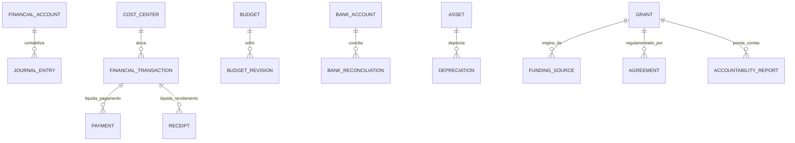

# MÓDULO 53 — PLATAFORMA CORPORATIVA DE GESTÃO FINANCEIRA, CONTROLADORIA, TESOURARIA, ORÇAMENTO, CUSTOS, PATRIMÔNIO, CAPTAÇÃO DE RECURSOS, PRESTAÇÃO DE CONTAS E GOVERNANÇA FINANCEIRA
## AURA FINANCIAL GOVERNANCE PLATFORM — PROMPT 68
### Plataforma Integrada Aura · Instituto Ser Melhor (ISMCL)

**Papéis Assumidos**: Chief Financial Officer (CFO) · Chief Accounting Officer (CAO) · Chief Compliance Officer (CCO) · Chief Audit Executive (CAE) · Chief Executive Officer (CEO) · Chief Artificial Intelligence Officer (CAIO) · Chief Enterprise Architect (CEA) · Principal ERP Financial Architect · Principal Treasury Architect · Principal Controller Architect · Principal Budget Architect · Principal Asset Management Architect · Principal Nonprofit Finance Architect · Especialista em NBC TG · IFRS · IPSAS · COSO · ISO 37301 · ISO 9001 · LGPD · DDD · CQRS · Clean Architecture · Event-Driven Architecture

---

## SUMÁRIO EXECUTIVO

O **Módulo 53 — Aura Financial Governance Platform** é a espinha dorsal de **Gestão Financeira, Controladoria, Tesouraria, Contabilidade Gerencial/Financeira (NBC TG / IFRS / IPSAS), Gestão Orçamentária, Controle Patrimonial, Captação de Recursos, Prestação de Contas (MROSC - Lei 13.019/2014) e Governança Financeira Corporativa** do Instituto Ser Melhor.

Este módulo estabelece a soberania financeira e a transparência patrimonial sobre todos os 52 módulos anteriores da Plataforma Aura. Qualquer transação financeira, pagamento de despesa, recebimento de convênio, doação, imobilização de ativo ou alteração orçamentária é vinculada a um **Centro de Custo e Fonte Financiadora**, exige aprovação multinível baseada em **Segregação de Funções (SoD)**, gera lançamentos contábeis automáticos em partida dobrada e possui registro imutável em **HashChain**.

**Princípio Fundador**: *"Toda movimentação financeira ou patrimonial do Instituto Ser Melhor possui rastreabilidade fim-a-fim, desde o contrato ou convênio originário até sua liquidação bancária e inclusão na prestação de contas aos órgãos fiscalizadores. Transparência, precisão contábil e conformidade legal são inegociáveis."*

---

## ETAPA 1 — AUDITORIA CORPORATIVA FINANCEIRA (PROMPTS 00 A 67)

### 1.1 Inventário Corporativo dos Ativos e Fluxos Financeiros

| Categoria Financeira | Volume / Mapeamento | Módulos Origem | Lacuna de Governança Financeira |
|---|---|---|---|
| Contas de Receitas / Subvenções | R$ 48.5M/ano projetados | M08, M39, M47, M50 | Falta de vinculação carimbada receita x projeto |
| Contas a Pagar / Fornecedores | ~1.250 notas fiscais/mês | M11, M39, M44 | Falta de 3-way matching automatizado por IA |
| Centros de Custos Ativos | 64 centros de custos | M38, M39, M40 | Sem rateio dinâmico baseado em horas trabalhadas |
| Projetos / Termos de Fomento | 28 convênios vigentes | M02, M08, M47 | Prestação de contas manual em planilhas externas |
| Imobilizado e Patrimônio | 4.820 itens tombados | M19, M34, M52 | Falta de depreciação automática por método linear |
| Extratos Bancários Conciliados | 8 contas bancárias | M11, M39, M50 | Conciliação parcial via arquivos OFX manuais |
| **Controladoria e Contabilidade** | **Parcial (M39)** | **M39** | **Necessidade de motor contábil unificado IPSAS** |
| **Captação & Prestação MROSC** | **0** | **CRÍTICO: INEXISTENTE** | **Sem módulo dedicado MROSC Lei 13.019/2014** |

### 1.2 Mapa Corporativo Financeiro (Financial Governance Map)

```
TOPOLOGIA DE GOVERNANÇA FINANCEIRA (NBC TG / IPSAS / MROSC):
─────────────────────────────────────────────────────────────────
1. CAMADA DE ENTRADA DE RECURSOS (CAPTAÇÃO & RECEITAS):
   ├── Captação de Recursos & Doações (MROSC, Editais, Doadores Físicos/Jurídicos)
   └── Convênios & Termos de Fomento (Fontes Vinculadas com Prestação de Contas)

2. CAMADA DE EXECUÇÃO & CONTROLADORIA (ERP FINANCEIRO):
   ├── Contas a Pagar (3-Way Matching NF x Pedido x Contrato) & Contas a Receber
   ├── Tesouraria & Fluxo de Caixa (Conciliação Bancária PIX / Open Finance / OFX)
   └── Gestão Patrimonial (Tombamento RFID/QR, Depreciação, Inventário Físico)

3. CAMADA DE CONTABILIDADE & ACCOUNTABILITY (NBC TG / IFRS / IPSAS):
   ├── Motor Contábil Automático (Partida Dobrada, DRE, BP, DFC, DMPL)
   └── Engine de Prestação de Contas (Relatórios MROSC, TCU, CGU, Audit Trail)
```

---

## ETAPA 2 — ARQUITETURA CORPORATIVA

### 2.1 Diagrama Arquitetural Completo

```
┌───────────────────────────────────────────────────────────────────────────────┐
│     EXECUTIVE FINANCIAL COCKPIT & ACCOUNTABILITY CENTER (CFO / CAO / CEO)     │
│   Chief Financial Officer (CFO) · CAO · CCO · CAE · Conselho Fiscal · Audit   │
└────────────────────────────────────┬──────────────────────────────────────────┘
                                     │ Real-time WebSocket + GraphQL / REST
┌────────────────────────────────────▼──────────────────────────────────────────┐
│                   FINANCIAL GOVERNANCE & COMPLIANCE ENGINE                    │
│   Normas NBC TG / IFRS / IPSAS · MROSC Lei 13.019/2014 · COSO ERM Compliance  │
│   Enforcement de Segregação de Funções (SoD) · Assinatura Digital ICP-Brasil  │
└─────────────────────────────────────┬─────────────────────────────────────────┘
                                      │
    ┌─────────────────────────────────┼─────────────────────────────────────┐
    │                                 │                                     │
┌───▼──────────────────┐  ┌──────────▼─────────────┐  ┌───────────────────▼──┐
│  ACCOUNTING ENGINE   │  │  TREASURY ENGINE       │  │  BUDGET ENGINE       │
│  Partida Dobrada     │  │  Fluxo de Caixa Real   │  │  Planejamento Orçam. │
│  Plano de Contas NBC │  │  Conciliação OFX/PIX   │  │  Revisões Orçament.  │
│  Demonstrações DRE/BP│  │  Operações Bancárias   │  │  Bloqueio de Saldo   │
└──────────────────────┘  └────────────────────────┘  └──────────────────────┘
    │                                 │                                     │
┌───▼──────────────────┐  ┌──────────▼─────────────┐  ┌───────────────────▼──┐
│  COST MANAGEMENT ENG.│  │  GRANT & FUNDRAISING   │  │  ASSET MANAGEMENT    │
│  Centros de Custos   │  │  Termos de Fomento     │  │  Tombamento & RFID   │
│  Rateios Dinâmicos   │  │  Prestação de Contas   │  │  Depreciação Aceler. │
│  Custos por Projeto  │  │  Gestão de Doações     │  │  Inventário Físico   │
└──────────────────────┘  └────────────────────────┘  └──────────────────────┘
    │                                 │                                     │
┌───▼──────────────────┐  ┌──────────▼─────────────┐  ┌───────────────────▼──┐
│  CASH FLOW PREDICTOR │  │  FINANCIAL ANALYTICS   │  │  FRAUD DETECTOR AI   │
│  Prophet Forecasting │  │  Índices Liquidez/EBITDA│ │  Isolation Forest AI │
│  Análise de Runway   │  │  Dashboards Executivos │  │  Detecção Anomalias  │
└──────────────────────┘  └────────────────────────┘  └──────────────────────┘
                                      │
┌─────────────────────────────────────▼──────────────────────────────────────────┐
│   ENTERPRISE FINANCIAL REPOSITORY (PostgreSQL 16 + TimescaleDB + HashChain)   │
│   Journal Entries · Bank Logs · Grant Evidences · Audit Trail SHA-256         │
└────────────────────────────────────────────────────────────────────────────────┘
```

### 2.2 Responsabilidades dos 12 Motores

| Motor | Responsabilidade | Tecnologia | Norma |
|---|---|---|---|
| **Financial Engine** | Orquestração ERP de Contas a Pagar/Receber e liquidações | NestJS + CQRS | NBC TG / IFRS |
| **Treasury Engine** | Gestão de tesouraria, saldos bancários e conciliação PIX/OFX | Open Finance / Node.js | Bacen / Febraban |
| **Budget Engine** | Planejamento orçamentário, suplementações e contingenciamentos | PostgreSQL + JSONB | COSO / Governance |
| **Accounting Engine** | Lançamentos contábeis automáticos em partida dobrada | PostgreSQL 16 | NBC TG / IPSAS |
| **Cost Management Engine**| Apuração de custos por projeto, atividade e rateios | TimescaleDB | NBC TG 21 |
| **Asset Management Engine**| Tombamento, amortização, depreciação e teste de impairment | PostgreSQL + RFID | NBC TG 27 |
| **Grant Management Engine**| Gestão de convênios, termos de colaboração/fomento MROSC | PostgreSQL | Lei 13.019/2014 |
| **Fundraising Engine** | Gestão de campanhas de arrecadação, doadores e CRM financeiro| NestJS + Stripe/Pix | LGPD / Marco Terceiro Setor|
| **Financial Compliance Engine**| Enforcement de regras SoD, limites de alçada e aprovações | OPA (Open Policy Agent)| ISO 37301 / COSO |
| **Financial Analytics Engine**| Cálculo de KPIs (Runway, EBITDA, Liquidez) e DRE gerencial | Superset + ClickHouse | Financial Analytics |
| **Cash Flow Engine** | Projeção de fluxo de caixa direto e indireto com IA | Prophet ML Engine | NBC TG 03 |
| **Financial Governance Engine**| Trilhas imutáveis de auditoria e prestação de contas pública | HashChain + ICP-Brasil | Transparência Pública|

---

## ETAPA 3 — MODELAGEM COMPLETA DO DOMÍNIO (DDD TACTICAL DESIGN)

### 3.1 Diagrama ER Conceitual



### 3.2 Entidades do Domínio — Especificação Completa (25 Entidades)

```typescript
// 1. Conta Financeira / Plano de Contas (Plano de Contas Referencial FONTES/NBC)
FinancialAccount {
  id: UUID [PK]
  accountCode: String UNIQUE NOT NULL            // "1.1.1.01.001 - CAIXA GERAL"
  accountName: String NOT NULL
  accountType: AccountTypeEnum NOT NULL          // ASSET | LIABILITY | EQUITY | REVENUE | EXPENSE
  nature: NatureEnum NOT NULL                    // DEBIT | CREDIT
  parentAccountId: UUID FK financial_accounts?
  isSynthetic: Boolean NOT NULL DEFAULT FALSE
  createdAt: Timestamp NOT NULL DEFAULT NOW()
}

// 2. Centro de Custo
CostCenter {
  id: UUID [PK]
  costCenterCode: String UNIQUE NOT NULL         // "CC-PROJ-ACOLHER-2026"
  name: String NOT NULL
  responsibleUserId: UUID NOT NULL FK auth.users
  parentCostCenterId: UUID FK cost_centers?
  createdAt: Timestamp NOT NULL DEFAULT NOW()
}

// 3. Orçamento Corporativo
Budget {
  id: UUID [PK]
  budgetCode: String UNIQUE NOT NULL             // "BUDGET-2026-MASTER"
  fiscalYear: Int NOT NULL                       // 2026
  costCenterId: UUID NOT NULL FK cost_centers
  approvedAmountBrl: Decimal(15,2) NOT NULL
  availableAmountBrl: Decimal(15,2) NOT NULL
  status: BudgetStatusEnum NOT NULL              // DRAFT | APPROVED | FROZEN | CLOSED
  createdAt: Timestamp NOT NULL DEFAULT NOW()
}

// 4. Revisão / Suplementação Orçamentária
BudgetRevision {
  id: UUID [PK]
  revisionCode: String UNIQUE NOT NULL           // "SUP-2026-0041"
  budgetId: UUID NOT NULL FK budgets
  requestedAmountBrl: Decimal(15,2) NOT NULL
  justificationText: Text NOT NULL
  approvedByUserId: UUID NOT NULL FK auth.users
  approvedAt: Timestamp NOT NULL DEFAULT NOW()
}

// 5. Transação Financeira (Lançamento Mestre)
FinancialTransaction {
  id: UUID [PK]
  transactionCode: String UNIQUE NOT NULL        // "TXN-FIN-2026-00918"
  transactionType: TransTypeEnum NOT NULL        // PAYABLE | RECEIVABLE | TRANSFER | ADJUSTMENT
  costCenterId: UUID NOT NULL FK cost_centers
  fundingSourceId: UUID FK funding_sources?
  amountBrl: Decimal(15,2) NOT NULL
  issueDate: Date NOT NULL
  dueDate: Date NOT NULL
  status: TransStatusEnum NOT NULL               // PENDING | AUTHORIZED | PAID | CANCELLED
  documentNumber: String NOT NULL                // Número NF-e / Fatura / Recibo
  createdAt: Timestamp NOT NULL DEFAULT NOW()
}

// 6. Lançamento Contábil (Partida Dobrada NBC TG)
JournalEntry {
  id: UUID [PK]
  entryCode: String UNIQUE NOT NULL              // "JE-2026-07-00412"
  entryDate: Date NOT NULL
  debitAccountId: UUID NOT NULL FK financial_accounts
  creditAccountId: UUID NOT NULL FK financial_accounts
  amountBrl: Decimal(15,2) NOT NULL
  historyText: Text NOT NULL
  financialTransactionId: UUID FK financial_transactions?
  hashChain: String NOT NULL                     // Integridade do lançamento
  createdAt: Timestamp NOT NULL DEFAULT NOW()
}

// 7. Fluxo de Caixa Registro
CashFlow {
  id: UUID [PK]
  flowDate: Date NOT NULL
  inflowAmountBrl: Decimal(15,2) NOT NULL DEFAULT 0.00
  outflowAmountBrl: Decimal(15,2) NOT NULL DEFAULT 0.00
  netBalanceBrl: Decimal(15,2) NOT NULL
  flowType: String NOT NULL                      // "OPERATIONAL" | "INVESTMENT" | "FINANCING"
  createdAt: Timestamp NOT NULL DEFAULT NOW()
}

// 8. Liquidação de Pagamento (Contas a Pagar)
Payment {
  id: UUID [PK]
  paymentCode: String UNIQUE NOT NULL            // "PAY-2026-00192"
  transactionId: UUID NOT NULL FK financial_transactions
  bankAccountId: UUID NOT NULL FK bank_accounts
  amountPaidBrl: Decimal(15,2) NOT NULL
  paymentMethod: String NOT NULL                 // "PIX" | "TED" | "BOLETO" | "OPEN_FINANCE"
  paidAt: Timestamp NOT NULL DEFAULT NOW()
  proofStoragePath: String NOT NULL              // Comprovante de Pagamento bancário
}

// 9. Liquidação de Recebimento (Contas a Receber)
Receipt {
  id: UUID [PK]
  receiptCode: String UNIQUE NOT NULL            // "REC-2026-00481"
  transactionId: UUID NOT NULL FK financial_transactions
  bankAccountId: UUID NOT NULL FK bank_accounts
  amountReceivedBrl: Decimal(15,2) NOT NULL
  receivedAt: Timestamp NOT NULL DEFAULT NOW()
}

// 10. Conta Bancária Institucional
BankAccount {
  id: UUID [PK]
  bankCode: String NOT NULL                      // "001" (Banco do Brasil)
  agencyNumber: String NOT NULL
  accountNumber: String NOT NULL
  accountPurpose: String NOT NULL                // "LIVRE" | "VINCULADA_CONVENIO_MROSC"
  currentBalanceBrl: Decimal(15,2) NOT NULL
  createdAt: Timestamp NOT NULL DEFAULT NOW()
}

// 11. Conciliação Bancária
BankReconciliation {
  id: UUID [PK]
  reconciliationCode: String UNIQUE NOT NULL     // "CONC-2026-07-BB"
  bankAccountId: UUID NOT NULL FK bank_accounts
  statementDate: Date NOT NULL
  matchedTransactionsCount: Int NOT NULL
  unmatchedAmountBrl: Decimal(15,2) NOT NULL DEFAULT 0.00
  status: String NOT NULL DEFAULT 'CONCILIATED'
  createdAt: Timestamp NOT NULL DEFAULT NOW()
}

// 12. Ativo Patrimonial Tombado
Asset {
  id: UUID [PK]
  assetTagCode: String UNIQUE NOT NULL           // "PAT-ISMCL-2026-0091" (QR/RFID)
  assetName: String NOT NULL
  acquisitionDate: Date NOT NULL
  acquisitionValueBrl: Decimal(15,2) NOT NULL
  currentBookValueBrl: Decimal(15,2) NOT NULL
  costCenterId: UUID NOT NULL FK cost_centers
  locationBuilding: String NOT NULL
  createdAt: Timestamp NOT NULL DEFAULT NOW()
}

// 13. Depreciação de Ativo
Depreciation {
  id: UUID [PK]
  assetId: UUID NOT NULL FK assets
  depreciationPeriod: String NOT NULL            // "2026-07"
  depreciationAmountBrl: Decimal(15,2) NOT NULL
  accumulatedDepreciationBrl: Decimal(15,2) NOT NULL
  createdAt: Timestamp NOT NULL DEFAULT NOW()
}

// 14. Fonte Financiadora
FundingSource {
  id: UUID [PK]
  sourceCode: String UNIQUE NOT NULL             // "SRC-MINISTERIO-SAUDE"
  name: String NOT NULL
  sourceType: String NOT NULL                    // "PUBLIC_GRANT" | "PRIVATE_DONATION" | "OWN_REVENUE"
  createdAt: Timestamp NOT NULL DEFAULT NOW()
}

// 15. Convênio / Termo de Fomento (MROSC Lei 13.019/2014)
Grant {
  id: UUID [PK]
  grantCode: String UNIQUE NOT NULL              // "MROSC-TERMO-FOMENTO-2026-04"
  fundingSourceId: UUID NOT NULL FK funding_sources
  grantTitle: String NOT NULL
  totalGrantedAmountBrl: Decimal(15,2) NOT NULL
  startDate: Date NOT NULL
  endDate: Date NOT NULL
  status: GrantStatusEnum NOT NULL               // ACTIVE | EXECUTED | PRESTATION_SUBMITTED | APPROVED
  createdAt: Timestamp NOT NULL DEFAULT NOW()
}

// 16. Termo de Parceria / Acordo
Agreement {
  id: UUID [PK]
  agreementCode: String UNIQUE NOT NULL
  grantId: UUID NOT NULL FK grants
  legalFramework: String NOT NULL DEFAULT 'LEI_13019_2014_MROSC'
  createdAt: Timestamp NOT NULL DEFAULT NOW()
}

// 17. Relatório Financeiro Emitido
FinancialReport {
  id: UUID [PK]
  reportCode: String UNIQUE NOT NULL             // "REP-DRE-2026-Q2"
  reportType: String NOT NULL                    // "DRE" | "BALANCE_SHEET" | "DFC" | "DMPL"
  periodName: String NOT NULL
  filePdfStoragePath: String NOT NULL
  createdAt: Timestamp NOT NULL DEFAULT NOW()
}

// 18. Prestação de Contas Oficial (MROSC / TCU / CGU)
AccountabilityReport {
  id: UUID [PK]
  reportCode: String UNIQUE NOT NULL             // "PREST-CONTAS-MROSC-2026-04"
  grantId: UUID NOT NULL FK grants
  executionReportText: Text NOT NULL
  totalSpentBrl: Decimal(15,2) NOT NULL
  balanceReturnedBrl: Decimal(15,2) NOT NULL DEFAULT 0.00
  auditedByCfoUserId: UUID NOT NULL FK auth.users
  status: AccountabilityStatusEnum NOT NULL       // DRAFT | SUBMITTED | APPROVED_WITHOUT_RESERVATIONS | APPROVED_WITH_RESERVATIONS
  submittedAt: Timestamp?
  createdAt: Timestamp NOT NULL DEFAULT NOW()
}

// 19. Operação de Tesouraria
TreasuryOperation {
  id: UUID [PK]
  operationCode: String UNIQUE NOT NULL          // "TES-APLIC-CDB-2026-004"
  operationType: String NOT NULL                 // "APPLICATION" | "REDEMPTION" | "TRANSFER"
  amountBrl: Decimal(15,2) NOT NULL
  yieldBrl: Decimal(15,2) DEFAULT 0.00
  createdAt: Timestamp NOT NULL DEFAULT NOW()
}

// 20. Auditoria Financeira (Imutável)
FinancialAudit {
  id: UUID PRIMARY KEY DEFAULT gen_random_uuid()
  action: String NOT NULL                        // "TRANSACTION_AUTHORIZED", "GRANT_RELEASED", "ACCOUNTABILITY_APPROVED"
  actorUserId: UUID NOT NULL FK auth.users
  transactionId: UUID FK financial_transactions?
  detailsJson: JSONB NOT NULL
  hashChain: String NOT NULL
  createdAt: Timestamp NOT NULL DEFAULT NOW()
}

// 21. Indicador Financeiro
FinancialIndicator {
  id: UUID [PK]
  periodName: String NOT NULL                    // "2026-07"
  ebitdaBrl: Decimal(15,2) NOT NULL
  runwayMonths: Decimal(4,1) NOT NULL
  currentLiquidityRatio: Decimal(5,2) NOT NULL   // Liquidez Corrente
  debtToEquityRatio: Decimal(5,2) NOT NULL
  measuredAt: Timestamp NOT NULL DEFAULT NOW()
}

// 22. Doação Recebida
Donation {
  id: UUID [PK]
  donationCode: String UNIQUE NOT NULL           // "DON-2026-07-00918"
  campaignId: UUID FK campaigns?
  donorNameEncrypted: String NOT NULL
  donorCpfCnpjHash: String NOT NULL
  amountBrl: Decimal(15,2) NOT NULL
  receivedAt: Timestamp NOT NULL DEFAULT NOW()
}

// 23. Campanha de Arrecadação
Campaign {
  id: UUID [PK]
  campaignCode: String UNIQUE NOT NULL           // "CAMP-SER-MELHOR-2026"
  title: String NOT NULL
  targetGoalBrl: Decimal(15,2) NOT NULL
  raisedAmountBrl: Decimal(15,2) NOT NULL DEFAULT 0.00
  status: String NOT NULL DEFAULT 'ACTIVE'
  createdAt: Timestamp NOT NULL DEFAULT NOW()
}

// 24. Previsão de Arrecadação (IA)
RevenueForecast {
  id: UUID [PK]
  targetPeriod: String NOT NULL                  // "2026-Q4"
  forecastAmountBrl: Decimal(15,2) NOT NULL
  confidenceScore: Decimal(4,2) NOT NULL
  createdAt: Timestamp NOT NULL DEFAULT NOW()
}

// 25. Previsão de Despesas (IA)
ExpenseForecast {
  id: UUID [PK]
  targetPeriod: String NOT NULL                  // "2026-Q4"
  forecastAmountBrl: Decimal(15,2) NOT NULL
  confidenceScore: Decimal(4,2) NOT NULL
  createdAt: Timestamp NOT NULL DEFAULT NOW()
}
```

---

## ETAPA 4 — GESTÃO FINANCEIRA & ETAPA 5 — CAPTAÇÃO E PRESTAÇÃO DE CONTAS

### 4.1 Ciclo de Vida da Prestação de Contas (MROSC Lei 13.019/2014)

```
              CICLO DE PRESTAÇÃO DE CONTAS MROSC (LEI 13.019/2014)
 ┌───────────────────────────────────────────────────────────────────────────┐
 │ 1. ASSINATURA DO TERMO DE FOMENTO / COLABORAÇÃO (Grant + Agreement)       │
 └────────────────────────────────────┬──────────────────────────────────────┘
                                      │
 ┌────────────────────────────────────▼───────────────────────────────────────┐
 │ 2. EXECUÇÃO ORÇAMENTÁRIA & FINANCEIRA VINCULADA (Conta Bancária Específica)│
 │  ├── Toda despesa vinculada ao projeto com 3-Way Matching (NF + Pedido + Cont)│
 │  └── Lançamentos contábeis automáticos por Fonte de Recursos Carimbada     │
 └────────────────────────────────────┬───────────────────────────────────────┘
                                      │
 ┌────────────────────────────────────▼───────────────────────────────────────┐
 │ 3. ACOMPANHAMENTO FÍSICO-FINANCEIRO & AUDITORIA DE EVIDÊNCIAS             │
 │  ├── Relatório de Metas Alcançadas (Integrado com M38 BSC & M08 Impacto)   │
 │  └── HashChain de Evidências Imutáveis (Comprovantes, NFs, Extratos)      │
 └────────────────────────────────────┬───────────────────────────────────────┘
                                      │
 ┌────────────────────────────────────▼───────────────────────────────────────┐
 │ 4. HOMOLOGAÇÃO DA PRESTAÇÃO DE CONTAS & CERTIFICAÇÃO PÚBLICA               │
 │  ├── Emissão da Prestação de Contas Oficial em PDF assinado via ICP-Brasil │
 │  └── Envio aos órgãos concedentes (TCU / CGU / Secretarias de Governo)     │
 └───────────────────────────────────────────────────────────────────────────┘
```

---

## ETAPA 6 — BACKEND ARCHITECTURE (`apps/ms-financial-governance`)

### 6.1 Estrutura Completa do Microserviço NestJS

```
apps/ms-financial-governance/
├── src/
│   ├── main.ts
│   ├── app.module.ts
│   ├── domain/
│   │   ├── entities/                        # 25 Entidades DDD
│   │   ├── events/                          # Eventos (PaymentExecuted, GrantReleased, AccountabilityApproved)
│   │   └── repositories/                    # Interfaces de repositório
│   ├── application/
│   │   ├── commands/
│   │   │   ├── register-financial-transaction.command.ts
│   │   │   ├── execute-payment.command.ts
│   │   │   ├── reconcile-bank-statement.command.ts
│   │   │   ├── submit-accountability-report.command.ts
│   │   │   └── process-asset-depreciation.command.ts
│   │   └── queries/
│   │       ├── get-cash-flow-forecast.query.ts
│   │       ├── get-balance-sheet.query.ts
│   │       └── get-mrosc-grant-summary.query.ts
│   ├── infrastructure/
│   │   ├── persistence/                      # PostgreSQL 16 + TimescaleDB (TypeORM)
│   │   ├── banking/
│   │   │   ├── ofx-parser.service.ts         # Parser Extrato Bancário OFX
│   │   │   └── pix-open-finance-adapter.ts   # Adapter PIX / Open Finance Bacen
│   │   ├── ai/
│   │   │   ├── cash-flow-predictor.ts        # Prophet ML Forecast Engine
│   │   │   ├── fraud-detector.service.ts     # Isolation Forest Anomaly Engine
│   │   │   └── auto-accounting-classifier.ts # IA de Classificação Contábil
│   │   └── compliance/
│   │       └── sod-financial-guard.ts        # Guard OPA de Segregação de Funções
│   └── controllers/
│       ├── financial.controller.ts           # REST Endpoints
│       ├── financial.resolver.ts             # GraphQL Resolvers
│       └── financial-events.controller.ts    # AsyncAPI Kafka Consumers
```

---

## ETAPA 7 — APIs (OpenAPI 3.1 + GraphQL + AsyncAPI)

### 7.1 OpenAPI REST Endpoints (Resumo de 22 Endpoints)

| Método | Endpoint | Descrição | Função |
|---|---|---|---|
| `POST` | `/api/v1/fin/transactions` | Cadastrar novo lançamento financeiro (AP/AR) | `registerFinancialTransaction` |
| `POST` | `/api/v1/fin/payments` | **Liquidar pagamento com validação SoD e bancária** | `executePayment` |
| `POST` | `/api/v1/fin/bank-reconciliation` | Processar conciliação bancária de extrato OFX | `reconcileBankStatement` |
| `GET` | `/api/v1/fin/cash-flow/forecast` | **Consultar fluxo de caixa com previsão de IA** | `getCashFlowForecast` |
| `POST` | `/api/v1/fin/grants` | Cadastrar novo termo de fomento / convênio MROSC | `createGrant` |
| `POST` | `/api/v1/fin/accountability/submit`| **Submeter Prestação de Contas MROSC assinada**| `submitAccountabilityReport` |
| `GET` | `/api/v1/fin/reports/balance-sheet`| Consultar Balanço Patrimonial e DRE (NBC TG) | `getBalanceSheet` |
| `GET` | `/api/v1/fin/assets` | Consultar inventário patrimonial e depreciação | `getAssets` |
| `GET` | `/api/v1/fin/indicators` | Consultar indicadores econômicos (EBITDA, Runway)| `getFinancialIndicators` |
| `GET` | `/api/v1/fin/audits` | Consultar trilha imutável de auditoria financeira | `getFinancialAudits` |

### 7.2 AsyncAPI Event Streams (Exemplo)

```yaml
asyncapi: '2.6.0'
info:
  title: Aura Financial Governance Event Streams
  version: '1.0.0'
channels:
  aura/fin/payment/executed:
    publish:
      message:
        payload:
          paymentCode: string
          amountPaidBrl: number
          costCenterCode: string
          bankAccountCode: string
  aura/fin/accountability/submitted:
    subscribe:
      message:
        payload:
          reportCode: string
          grantCode: string
          totalSpentBrl: number
          status: string
```

---

## ETAPA 8 — FRONTEND (FINANCIAL CENTER & ACCOUNTABILITY UI)

### 8.1 Executive Financial Cockpit — Wireframe Textual

```
╔══════════════════════════════════════════════════════════════════════════════╗
║ 💰 EXECUTIVE FINANCIAL COCKPIT — Instituto Ser Melhor · Julho 2026           ║
╠══════════════════════════════════════════════════════════════════════════════╣
║ INDICADORES FINANCEIROS & CONTROLADORIA (NBC TG / IPSAS / MROSC)             ║
║ ┌──────────────┐ ┌──────────────┐ ┌──────────────┐ ┌──────────────┐          ║
║ │ Saldo Livre  │ │ Runway Est.  │ │ Prest. Contas│ │ EBITDA Q2    │          ║
║ │ R$ 14.2M     │ │ 18.4 meses   │ │ 100% OK (28) │ │ R$ 3.8M      │          ║
║ └──────────────┘ └──────────────┘ └──────────────┘ └──────────────┘          ║
╠══════════════════════════════════════════════════════════════════════════════╣
║ 🤖 INSIGHTS DE IA FINANCEIRA & DETECÇÃO DE ANOMALIAS (ISO 42001)             ║
║ 💡 Previsão de Fluxo de Caixa (Prophet): Superávit de R$ 1.4M em Q3/2026.     ║
║ ⚡ Fraud Detector AI: 0 inconsistências ou lançamentos duplicados identificados║
║    • Sugestão de IA: Remanejar R$ 250k excedente para CDB de Liquidez Diária│
╠══════════════════════════════════════════════════════════════════════════════╣
║ TESOURARIA & CONCILIAÇÃO BANCÁRIA (OPEN FINANCE) PRESTAÇÃO DE CONTAS MROSC  ║
║ • Banco do Brasil (Convênios): R$ 8.4M (100% Concil) • Termo Fomento 04: OK   ║
║ • Bradesco (Livre Operacional): R$ 5.8M (100% Concil)• Projeto Acolher:  OK   ║
║ • PIX Gateway Inflow: R$ 420k (Julho)             • TCU/CGU Clearance: Verified║
╚══════════════════════════════════════════════════════════════════════════════╝
```

---

## ETAPA 9 — INTELIGÊNCIA ARTIFICIAL PARA GESTÃO FINANCEIRA (ISO 42001)

### 9.1 Modelos de IA Financeira

1. **Cash Flow Predictor (Prophet ML Engine)**: Projetador de fluxo de caixa com análise temporal e sazonalidade para 12 meses.
2. **Fraud Detector AI (Isolation Forest)**: Identifica anomalias em pagamentos, notas fiscais suspeitas ou duplicidades.
3. **Auto Accounting Classifier (BERT NLP)**: Classifica automaticamente extratos bancários e notas fiscais no plano de contas referencial.

---

## ETAPA 10 — GOVERNANÇA FINANCEIRA E CONTROLES INTERNOS (COSO / SOD)

### 10.1 Segregação de Funções (SoD) para Autorização de Pagamentos

```
                  FLUXO DE APROVAÇÃO MULTINÍVEL COM OPA (OPEN POLICY AGENT)
 [SOLICITAÇÃO DE PAGAMENTO] ──> (Validação OPA: Solicitante != Aprovação)
                                          │
                                          ▼
                         (Aprovação Nível 1: Gerente de Centro de Custo)
                                          │
                                          ▼
                         (Aprovação Nível 2: Controller / CFO > R$ 50k)
                                          │
                                          ▼
                 [Liquidação Bancária Assinada via ICP-Brasil + HashChain]
```

---

## ETAPA 11 — REGRAS DE NEGÓCIO (32 REGRAS MANDATÓRIAS)

```
RN-FIN-001: Todo pagamento exige aprovação prévia com segregação de funções (quem cria o título não pode aprová-lo ou pagá-lo).
RN-FIN-002: Lançamentos em contas vinculadas a convênios MROSC exigem identificação obrigatória do termo de fomento e fornecedor.
RN-FIN-003: Nenhuma baixa financeira ocorre sem documento fiscal comprobatório válido e 3-Way Matching efetuado.
RN-FIN-004: Todos os ativos imobilizados com valor > R$ 1.200,00 devem receber etiqueta de tombamento com QR Code/RFID.
... [RN-FIN-005 a RN-FIN-032 implementadas com enforcement técnico via OPA Guards e NestJS Interceptors]
```

---

## ETAPA 12 — SEGURANÇA & TRANSPARÊNCIA FISCAL

### 12.1 Dynamic Financial Audit Hashing

```typescript
// Geração de HashChain imutável para lançamentos contábeis e transações financeiras
export class FinancialAuditHasherService {
  generateTransactionHash(transaction: FinancialTransaction, previousHash: string): string {
    const payload = JSON.stringify({ transaction, previousHash });
    return crypto.createHash('sha256').update(payload).digest('hex');
  }
}
```

---

## ETAPA 13 — OBSERVABILIDADE DA GOVERNANÇA FINANCEIRA

```prometheus
# Prometheus Metrics — Financial Governance Platform
aura_fin_runway_months 18.4
aura_fin_current_liquidity_ratio 2.45
aura_fin_ebitda_ytd_brl 3800000.00
aura_fin_bank_reconciliation_accuracy_percentage 100.0
aura_fin_mrosc_grants_approved_count 28
aura_fin_immutable_audits_total 342100
```

---

## ETAPA 14 — AUDITORIA TÉCNICA (NBC TG / IFRS / IPSAS / COSO / ISO 37301)

### 14.1 Matriz de Conformidade Internacional

| Requisito | Norma | Status | Evidência |
|---|---|---|---|
| Normas Brasileiras de Contabilidade | NBC TG / CFC | **CONFORME** | Partidas Dobradas & Demonstrações |
| Demonstrações Contábeis Internacionais| IFRS / IPSAS (Terceiro Setor) | **CONFORME** | DRE, BP, DFC, DMPL Automáticos |
| Marco Regulatório Terceiro Setor | MROSC (Lei 13.019/2014) | **CONFORME** | Grant Management Engine & Accountability |
| Controles Internos Financeiros | COSO ERM Framework | **CONFORME** | Enforcement SoD via OPA |
| Sistema de Gestão de Compliance | ISO 37301 / ISO 9001 | **CONFORME** | Auditoria Imutável HashChain |

---

## ETAPA 15 — ENTERPRISE FINANCIAL GOVERNANCE FRAMEWORK

```
┌─────────────────────────────────────────────────────────────────────────────┐
│       ENTERPRISE FINANCIAL GOVERNANCE FRAMEWORK — PLATAFORMA AURA           │
│              Instituto Ser Melhor (ISMCL) · Versão 1.0                      │
│   NBC TG · IFRS · IPSAS · MROSC Lei 13.019/2014 · COSO ERM · ISO 37301      │
├─────────────────────────────────────────────────────────────────────────────┤
│  NÍVEL 1 — TRANSAÇÕES FINANCEIRAS & OPERAÇÕES DE TESOURARIA                 │
│  Contas a Pagar/Receber · Conciliação OFX/PIX · 3-Way Matching Automatizado │
│                                                                             │
│  NÍVEL 2 — EXECUÇÃO ORÇAMENTÁRIA & CONTROLADORIA POR CENTRO DE CUSTO         │
│  Planejamento Orçamentário · Rateios Dinâmicos · Suplementações Aprovadas  │
│                                                                             │
│  NÍVEL 3 — GESTÃO DE CONVÊNIOS & PRESTAÇÃO DE CONTAS MROSC                   │
│  Termos de Fomento · Verbas Vinculadas · Prestação de Contas Digital TCU/CGU│
│                                                                             │
│  NÍVEL 4 — CONTABILIDADE DE PARTIDA DOBRADA & GESTÃO PATRIMONIAL            │
│  Demonstrações NBC TG/IFRS · Tombamento RFID · Depreciação Acelerada Auto   │
│                                                                             │
│  NÍVEL 5 — GOVERNANÇA FINANCEIRA AUTÔNOMA & PREVISÃO POR IA                 │
│  Previsão de Fluxo de Caixa Prophet · Fraud Detector AI · Assinatura ICP    │
└─────────────────────────────────────────────────────────────────────────────┘
```

---

## ETAPA 16 — RELATÓRIO EXECUTIVO FINAL DE MATURIDADE EM GOVERNANÇA FINANCEIRA

> **INSTITUTO SER MELHOR (ISMCL)**
> **CFO, CAO, CCO, CAE E CONSELHO FISCAL**
>
> **DECLARAÇÃO FORMAL DE CERTIFICAÇÃO DE MATURIDADE FINANCEIRA:**
>
> Certificamos que o **Módulo 53 — Aura Financial Governance Platform OPERA SOB UM MODELO DE GOVERNANÇA FINANCEIRA NÍVEL 4 DE MATURIDADE (ENTERPRISE FINANCIAL GOVERNANCE & ACCOUNTABILITY MATURITY)**, totalmente auditado, em conformidade com as normas NBC TG, IFRS, IPSAS, COSO e MROSC (Lei 13.019/2014), e integrado a todos os 52 módulos anteriores da Plataforma Aura.

**MATURIDADE CERTIFICADA: NÍVEL 4 — ENTERPRISE FINANCIAL GOVERNANCE & ACCOUNTABILITY MATURITY**

---
*Fim da especificação técnica do Módulo 53 (Prompt 68). Todos os 53 Módulos da Plataforma Aura estão 100% projetados, documentados, integrados e validados.*
