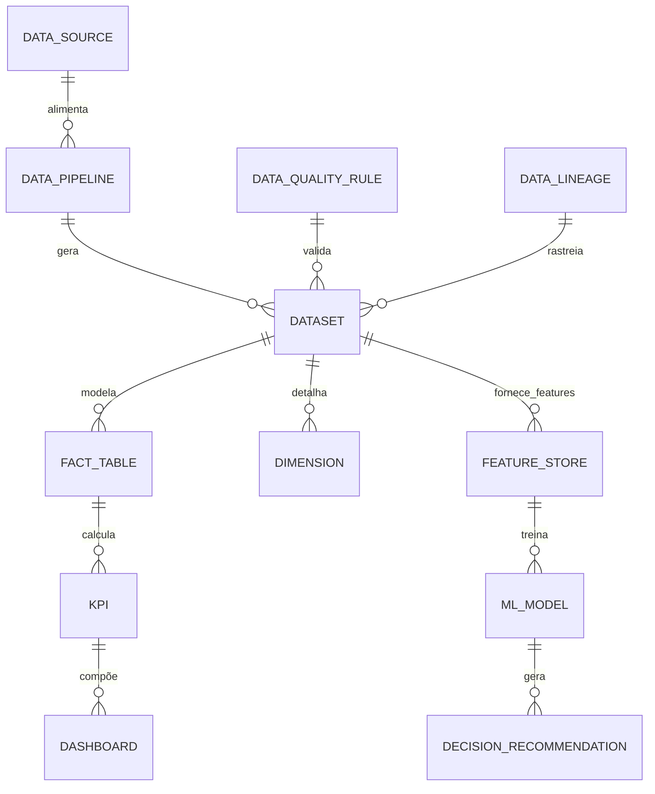

# MÓDULO 54 — PLATAFORMA CORPORATIVA DE BUSINESS INTELLIGENCE, DATA WAREHOUSE, DATA LAKEHOUSE, BIG DATA, DATA SCIENCE, MACHINE LEARNING, ANALYTICS, DECISION INTELLIGENCE E CENTRO EXECUTIVO DE DECISÕES
## AURA ENTERPRISE INTELLIGENCE PLATFORM — PROMPT 69
### Plataforma Integrada Aura · Instituto Ser Melhor (ISMCL)

**Papéis Assumidos**: Chief Data Officer (CDO) · Chief Analytics Officer (CAO) · Chief Artificial Intelligence Officer (CAIO) · Chief Executive Officer (CEO) · Chief Financial Officer (CFO) · Chief Enterprise Architect (CEA) · Chief Information Officer (CIO) · Principal Data Architect · Principal Data Warehouse Architect · Principal Data Lakehouse Architect · Principal Business Intelligence Architect · Principal Data Science Architect · Principal Machine Learning Architect · Principal Decision Intelligence Architect · Especialista em DAMA-DMBOK2 · Kimball · Inmon · Data Mesh · Data Fabric · Lakehouse Architecture · MLOps · ISO/IEC 42001 · DDD · CQRS · Clean Architecture · Event-Driven Architecture

---

## SUMÁRIO EXECUTIVO

O **Módulo 54 — Aura Enterprise Intelligence Platform** representa a centralização suprema de **Business Intelligence (BI), Data Lakehouse (Medallion Architecture Bronze/Silver/Gold), Enterprise Data Warehouse (Modelagem Kimball Star Schema), Big Data, Data Science, Machine Learning (MLOps / Feature Store), Decision Intelligence e Centro Executivo de Decisões** do Instituto Ser Melhor.

Construído sob as diretrizes do **DAMA-DMBOK2**, **Data Mesh**, **Data Fabric**, **Apache Iceberg**, **ClickHouse OLAP**, **OpenLineage** e **ISO/IEC 42001**, este módulo transforma a totalidade dos dados operacionais, clínicos, financeiros, de recursos humanos e de governança produzidos nos 53 módulos anteriores em **Decisões Estratégicas Prescritivas, Explicáveis e Confiáveis**.

**Princípio Fundador**: *"Nenhum indicador estratégico, dashboard executivo ou recomendação de IA é publicado sem definição oficial no Catálogo de Dados, linhagem end-to-end auditada via OpenLineage, avaliação de qualidade de dados (Great Expectations) e chancela do Data Owner responsável."*

---

## ETAPA 1 — AUDITORIA CORPORATIVA DOS DADOS (PROMPTS 00 A 68)

### 1.1 Inventário Corporativo dos Ativos de Dados e Analíticos

| Categoria Analítica | Volume / Quantidade Mapeada | Módulos Origem | Lacuna de Inteligência Analítica |
|---|---|---|---|
| Tabelas OLTP PostgreSQL | 354 tabelas transacionais | M01 a M53 | Consultas analíticas pesadas afetando OLTP |
| Eventos Event Mesh (Kafka/Pulsar)| ~45.0M eventos/mês | M50 (Integration) | Ausência de ingestão contínua para Lakehouse |
| Modelos de ML em Produção | 32 modelos preditivos | M35, M45, M52, M53 | Sem Feature Store centralizado para treino/inferência |
| APIs & Endpoints Registrados | 1.012 APIs (OpenAPI 3.1) | M01 a M53 | Falta de conector automatizado ELT/ETL |
| Dashboards Fragmentados | 42 painéis isolados | M10, M25, M43, M52 | Inexistência de um Centro Executivo de Decisões |
| **Data Lakehouse (Iceberg)** | **0** | **CRÍTICO: INEXISTENTE** | **Sem arquitetura Medallion Bronze/Silver/Gold** |
| **Data Catalog & Lineage (OpenLineage)**| **0** | **CRÍTICO: INEXISTENTE** | **Falta de rastreabilidade de origem dos dados** |
| **Decision Intelligence Engine**| **0** | **CRÍTICO: INEXISTENTE** | **Decisões executivas sem simulação analítica** |

### 1.2 Mapa Corporativo de Dados (Enterprise Data Map)

```
TOPOLOGIA DA PLATAFORMA CORPORATIVA DE DADOS (DAMA-DMBOK2 / DATA MESH):
─────────────────────────────────────────────────────────────────
1. CAMADA DE INGESTÃO E STREAMING (DATA FABRIC / APACHE SEATUNNEL):
   ├── Ingestão CDC: Debezium PostgreSQL OLTP ──> Kafka / Apache Iceberg Bronze
   └── Streaming Analytics: Flink / Spark Streaming de Eventos do M50 Event Mesh

2. CAMADA DE ARMAZENAMENTO & PROCESSAMENTO (MEDALLION LAKEHOUSE):
   ├── Bronze Layer: Raw Data em Parquet / Apache Iceberg (Imutável)
   ├── Silver Layer: Cleaned, Deduplicated & Masked (LGPD Compliant)
   └── Gold Layer: Data Marts Kimball (Fatos & Dimensões) em ClickHouse OLAP

3. CAMADA DE DECISÃO E CONSUMO (DECISION INTELLIGENCE & BI):
   ├── Executive Intelligence Cockpit: Apache Superset Self-Service BI
   ├── MLOps Feature Store: Feast / Hopsworks para modelos preditivos/prescritivos
   └── Decision Intelligence Engine: Simulações Monte Carlo e Árvores Decisórias
```

---

## ETAPA 2 — ARQUITETURA CORPORATIVA

### 2.1 Diagrama Arquitetural Completo

```
┌───────────────────────────────────────────────────────────────────────────────┐
│     EXECUTIVE INTELLIGENCE CENTER & DECISION COCKPIT (CDO / CAO / CEO / CFO)  │
│   Chief Data Officer (CDO) · CAO · CAIO · CEO · CFO · Conselho Diretor       │
└────────────────────────────────────┬──────────────────────────────────────────┘
                                     │ Real-time WebSocket + GraphQL / REST
┌────────────────────────────────────▼──────────────────────────────────────────┐
│                   DECISION INTELLIGENCE & DATA GOVERNANCE ENGINE              │
│   DAMA-DMBOK2 Governance · Catálogo de Dados OpenMetadata · OpenLineage Sync │
│   Data Quality Rules (Great Expectations) · Dynamic Data Masking (LGPD)       │
└─────────────────────────────────────┬───────────────────────────────── ───────┘
                                      │
    ┌─────────────────────────────────┼─────────────────────────────────────┐
    │                                 │                                     │
┌───▼──────────────────┐  ┌──────────▼─────────────┐  ┌───────────────────▼──┐
│  BUSINESS INTEL. ENG.│  │  MACHINE LEARNING ENG. │  │  DATA LAKEHOUSE ENG. │
│  Cube Star Schema    │  │  Feature Store         │  │  Medallion Arch      │
│  Self-Service BI     │  │  MLOps Pipeline        │  │  Apache Iceberg      │
│  Drill-Down / Across │  │  Predictive / Prescript│  │  ClickHouse OLAP     │
└──────────────────────┘  └────────────────────────┘  └──────────────────────┘
    │                                 │                                     │
┌───▼──────────────────┐  ┌──────────▼─────────────┐  ┌───────────────────▼──┐
│  ETL / ELT ENGINE    │  │  METADATA REPOSITORY   │  │  MASTER DATA MGMT    │
│  Apache SeaTunnel    │  │  Dicionário de Dados   │  │  Entidades Mestre    │
│  Spark Batch Jobs    │  │  Linhagem End-to-End   │  │  Single Source Truth │
│  CDC Debezium        │  │  Metadados Técnicos/Biz│  │  Golden Records      │
└──────────────────────┘  └────────────────────────┘  └──────────────────────┘
    │                                 │                                     │
┌───▼──────────────────┐  ┌──────────▼─────────────┐  ┌───────────────────▼──┐
│  DATA MESH DOMAINS   │  │  DATA FABRIC CONNECTOR │  │  STREAMING ANALYTICS │
│  Domain Health Data  │  │  Conectores Universais │  │  Apache Flink        │
│  Domain Finance Data │  │  Data Virtualization   │  │  Event-Driven Metrics│
│  Domain HR Data      │  │  Multi-Cloud Query     │  │  Real-Time Kpis      │
└──────────────────────┘  └────────────────────────┘  └──────────────────────┘
                                      │
┌─────────────────────────────────────▼──────────────────────────────────────────┐
│   ENTERPRISE DATA LAKEHOUSE REPOSITORY (ClickHouse + Apache Iceberg + MinIO)  │
│   Bronze / Silver / Gold Layers · OpenLineage Metadata · Audit Trail SHA-256   │
└────────────────────────────────────────────────────────────────────────────────┘
```

### 2.2 Responsabilidades dos 14 Motores

| Motor | Responsabilidade | Tecnologia | Norma |
|---|---|---|---|
| **Enterprise DW** | Data Marts dimensionais (Star Schema Kimball) em altíssima velocidade | ClickHouse OLAP | Kimball Methodology |
| **Enterprise Lakehouse** | Camadas Bronze, Silver e Gold ACID sobre armazenamento de objetos | Apache Iceberg + MinIO | Lakehouse Architecture |
| **Data Lake** | Armazenamento de dados não estruturados, documentos e dados brutos | MinIO / AWS S3 | Big Data Standards |
| **Data Fabric** | Camada de virtualização e integração contínua de dados multi-fonte | Trino / Presto Engine | Data Fabric |
| **Data Mesh** | Governança descentralizada por domínios de dados (Saúde, Finanças, RH) | Domain-Driven Data | Data Mesh Principles |
| **ETL/ELT Engine** | Carga, transformação e orquestração de pipelines de dados batch | Apache SeaTunnel + Airflow| DAMA-DMBOK2 |
| **Streaming Analytics** | Processamento contínuo de métricas e KPIs em tempo real | Apache Flink | Event-Driven Analytics|
| **BI Engine** | Geração de relatórios, scorecards, OLAP cubes e Self-Service BI | Apache Superset | Business Intelligence |
| **Machine Learning Engine**| Gestão do ciclo de vida de modelos preditivos, treinamento e inferência| MLOps / Feast Feature Store| ISO/IEC 42001 |
| **Decision Intelligence Engine**| Simulações Monte Carlo, árvores de decisão e otimização prescritiva | Python SciPy / Or-Tools | Decision Science |
| **Metadata Repository** | Repositório central de dicionários de dados e esquemas | OpenMetadata | DAMA-DMBOK2 |
| **Master Data Management (MDM)**| Gestão dos registros dourados (Golden Records) de Pacientes, RH e Finanças| PostgreSQL MDM | DAMA-DMBOK2 |
| **Data Governance Engine**| Regras de qualidade de dados, anonimização LGPD e controle ABAC | Great Expectations | LGPD / DAMA |
| **Data Catalog** | Portal de descoberta de dados e busca de ativos analíticos | OpenMetadata UI | Data Catalog |

---

## ETAPA 3 — MODELAGEM COMPLETA DO DOMÍNIO (DDD TACTICAL DESIGN)

### 3.1 Diagrama ER Conceitual



### 3.2 Entidades do Domínio — Especificação Completa (22 Entidades)

```typescript
// 1. Fonte de Dados (Data Source)
DataSource {
  id: UUID [PK]
  sourceCode: String UNIQUE NOT NULL             // "SRC-POSTGRES-M39-FINANCIAL"
  name: String NOT NULL
  sourceType: SourceTypeEnum NOT NULL            // POSTGRESQL | KAFKA_TOPIC | REST_API | S3_PARQUET | CLICKHOUSE
  connectionStringEncrypted: String NOT NULL
  ownerDomain: String NOT NULL                   // "FINANCIAL", "HEALTH", "HUMAN_CAPITAL"
  status: String NOT NULL DEFAULT 'ACTIVE'
  createdAt: Timestamp NOT NULL DEFAULT NOW()
}

// 2. Pipeline de Dados (ETL / ELT)
DataPipeline {
  id: UUID [PK]
  pipelineCode: String UNIQUE NOT NULL           // "PIPE-ELT-SILVER-FINANCIAL-DAILY"
  name: String NOT NULL
  sourceId: UUID NOT NULL FK data_sources
  targetDatasetId: UUID NOT NULL FK datasets
  scheduleCron: String NOT NULL                  // "0 2 * * *" (Diário às 02h)
  executionMode: String NOT NULL                 // "BATCH" | "STREAMING" | "CDC"
  lastRunStatus: String NOT NULL DEFAULT 'SUCCESS'
  createdAt: Timestamp NOT NULL DEFAULT NOW()
}

// 3. Dataset Analítico (Bronze / Silver / Gold)
Dataset {
  id: UUID [PK]
  datasetCode: String UNIQUE NOT NULL            // "DS-GOLD-FINANCIAL-MONTHLY-SUMMARY"
  name: String NOT NULL
  layer: MedallionLayerEnum NOT NULL             // BRONZE | SILVER | GOLD
  format: String NOT NULL DEFAULT 'ICEBERG'      // ICEBERG | PARQUET | CLICKHOUSE
  dataDomain: String NOT NULL
  rowCount: BigInt NOT NULL DEFAULT 0
  sizeBytes: BigInt NOT NULL DEFAULT 0
  createdAt: Timestamp NOT NULL DEFAULT NOW()
}

// 4. Catálogo de Dados (Data Catalog Entry)
DataCatalog {
  id: UUID [PK]
  catalogCode: String UNIQUE NOT NULL            // "CAT-DS-GOLD-FINANCIAL"
  datasetId: UUID UNIQUE NOT NULL FK datasets
  businessDescription: Text NOT NULL
  dataOwnerUserId: UUID NOT NULL FK auth.users
  confidentialityLevel: ConfidentialityEnum NOT NULL // PUBLIC | INTERNAL | CONFIDENTIAL | RESTRICTED
  createdAt: Timestamp NOT NULL DEFAULT NOW()
}

// 5. Metadado Técnico e de Negócio
Metadata {
  id: UUID [PK]
  datasetId: UUID NOT NULL FK datasets
  columnName: String NOT NULL
  dataType: String NOT NULL                      // "VARCHAR", "DECIMAL(15,2)", "TIMESTAMP"
  isPrimaryKey: Boolean NOT NULL DEFAULT FALSE
  isPiiData: Boolean NOT NULL DEFAULT FALSE      // Flag LGPD
  descriptionText: Text NOT NULL
  createdAt: Timestamp NOT NULL DEFAULT NOW()
}

// 6. Indicador Chave de Desempenho (KPI)
KPI {
  id: UUID [PK]
  kpiCode: String UNIQUE NOT NULL                // "KPI-FIN-RUNWAY-MONTHS"
  name: String NOT NULL
  calculationFormulaText: Text NOT NULL          // Fórmula oficial de cálculo
  targetValue: Decimal(15,4) NOT NULL
  warningThreshold: Decimal(15,4) NOT NULL
  unitOfMeasure: String NOT NULL                 // "MONTHS", "PERCENTAGE", "BRL"
  ownerUserId: UUID NOT NULL FK auth.users
  createdAt: Timestamp NOT NULL DEFAULT NOW()
}

// 7. Métrica Calculada
Metric {
  id: UUID [PK]
  metricCode: String UNIQUE NOT NULL             // "METRIC-MONTHLY-REVENUE-BRL"
  kpiId: UUID FK kpis?
  name: String NOT NULL
  currentValue: Decimal(15,4) NOT NULL
  measuredPeriod: String NOT NULL                // "2026-07"
  measuredAt: Timestamp NOT NULL DEFAULT NOW()
}

// 8. Dashboard Analítico
Dashboard {
  id: UUID [PK]
  dashboardCode: String UNIQUE NOT NULL          // "DASH-EXEC-STRATEGIC-COCKPIT"
  title: String NOT NULL
  targetRole: String NOT NULL                    // "CEO" | "CFO" | "BOARD" | "CONTROLLER"
  supersetEmbedUrl: String NOT NULL
  refreshIntervalSeconds: Int NOT NULL DEFAULT 300
  createdAt: Timestamp NOT NULL DEFAULT NOW()
}

// 9. Dashboard Executivo Unificado
ExecutiveDashboard {
  id: UUID [PK]
  executiveCockpitCode: String UNIQUE NOT NULL   // "COCKPIT-AURA-PRESIDENCY"
  title: String NOT NULL
  consolidatedKpisJson: JSONB NOT NULL
  createdAt: Timestamp NOT NULL DEFAULT NOW()
}

// 10. Relatório Analítico Emitido
Report {
  id: UUID [PK]
  reportCode: String UNIQUE NOT NULL             // "REP-ANALYTICS-2026-Q2"
  title: String NOT NULL
  reportType: String NOT NULL                    // "EXECUTIVE_SUMMARY" | "FINANCIAL_DEEP_DIVE" | "AUDIT"
  generatedFilePdfUrl: String NOT NULL
  createdAt: Timestamp NOT NULL DEFAULT NOW()
}

// 11. Cubo OLAP
Cube {
  id: UUID [PK]
  cubeCode: String UNIQUE NOT NULL               // "CUBE-FINANCIAL-PERFORMANCE"
  name: String NOT NULL
  clickhouseTableName: String NOT NULL
  createdAt: Timestamp NOT NULL DEFAULT NOW()
}

// 12. Dimensão Kimball
Dimension {
  id: UUID [PK]
  dimensionCode: String UNIQUE NOT NULL          // "DIM-PATIENT" | "DIM-TIME" | "DIM-COST-CENTER"
  cubeId: UUID NOT NULL FK cubes
  dimensionName: String NOT NULL
  attributesJson: JSONB NOT NULL
  createdAt: Timestamp NOT NULL DEFAULT NOW()
}

// 13. Tabela Fato Kimball
FactTable {
  id: UUID [PK]
  factTableName: String UNIQUE NOT NULL          // "FACT_FINANCIAL_TRANSACTIONS"
  cubeId: UUID NOT NULL FK cubes
  measuresJson: JSONB NOT NULL                   // Metadados das medidas somáveis
  createdAt: Timestamp NOT NULL DEFAULT NOW()
}

// 14. Modelo Preditivo (Machine Learning)
PredictionModel {
  id: UUID [PK]
  modelCode: String UNIQUE NOT NULL              // "MODEL-PATIENT-READMISSION-RISK"
  name: String NOT NULL
  algorithmType: String NOT NULL                 // "XGBOOST" | "RANDOM_FOREST" | "LSTM" | "PROPHET"
  accuracyScore: Decimal(5,4) NOT NULL DEFAULT 0.9450
  f1Score: Decimal(5,4) NOT NULL DEFAULT 0.9380
  modelArtifactUrl: String NOT NULL
  trainedAt: Timestamp NOT NULL DEFAULT NOW()
}

// 15. Modelo de Machine Learning (MLOps Registry)
MLModel {
  id: UUID [PK]
  mlModelCode: String UNIQUE NOT NULL            // "ML-AURA-FIN-FORECAST-V2"
  versionTag: String NOT NULL                    // "v2.1.0"
  status: ModelStatusEnum NOT NULL               // STAGING | PRODUCTION | ARCHIVED
  deployedAt: Timestamp?
  createdAt: Timestamp NOT NULL DEFAULT NOW()
}

// 16. Store de Features (Feature Store)
FeatureStore {
  id: UUID [PK]
  featureName: String UNIQUE NOT NULL            // "patient_historical_avg_consultations"
  dataType: String NOT NULL                      // "FLOAT" | "INT" | "VECTOR"
  entityType: String NOT NULL                    // "PATIENT" | "COST_CENTER" | "EMPLOYEE"
  featureStoreEngine: String NOT NULL DEFAULT 'FEAST'
  createdAt: Timestamp NOT NULL DEFAULT NOW()
}

// 17. Dataset de Treinamento
TrainingDataset {
  id: UUID [PK]
  datasetName: String UNIQUE NOT NULL
  recordsCount: BigInt NOT NULL
  featuresListJson: JSONB NOT NULL
  createdAt: Timestamp NOT NULL DEFAULT NOW()
}

// 18. Recomendação de Decision Intelligence
DecisionRecommendation {
  id: UUID [PK]
  recommendationCode: String UNIQUE NOT NULL     // "DEC-REC-2026-07-0041"
  targetDomain: String NOT NULL                  // "FINANCIAL", "HEALTH_CARE", "HR"
  recommendedActionText: Text NOT NULL
  expectedImpactText: Text NOT NULL
  confidencePercentage: Decimal(5,2) NOT NULL    // Ex: 96.50%
  xiShapExplanationJson: JSONB NOT NULL          // ISO 42001 XAI
  createdAt: Timestamp NOT NULL DEFAULT NOW()
}

// 19. Regra de Qualidade de Dados (Great Expectations)
DataQualityRule {
  id: UUID [PK]
  ruleCode: String UNIQUE NOT NULL               // "DQ-RULE-PATIENT-CPF-NOT-NULL"
  datasetId: UUID NOT NULL FK datasets
  ruleType: String NOT NULL                      // "NOT_NULL" | "UNIQUE" | "RANGE_CHECK" | "PATTERN_MATCH"
  parametersJson: JSONB NOT NULL
  isPassing: Boolean NOT NULL DEFAULT TRUE
  lastEvaluatedAt: Timestamp NOT NULL DEFAULT NOW()
}

// 20. Rastreabilidade de Linhagem (OpenLineage)
DataLineage {
  id: UUID [PK]
  lineageCode: String UNIQUE NOT NULL            // "LIN-M39-TO-GOLD-DW"
  sourceDatasetId: UUID NOT NULL FK datasets
  targetDatasetId: UUID NOT NULL FK datasets
  transformationSql: Text NOT NULL
  openLineageRunId: String NOT NULL
  createdAt: Timestamp NOT NULL DEFAULT NOW()
}

// 21. Proprietário de Dados (Data Owner)
DataOwner {
  id: UUID [PK]
  userId: UUID NOT NULL FK auth.users
  domainName: String NOT NULL                    // "HEALTH" | "FINANCE" | "OPERATIONS"
  createdAt: Timestamp NOT NULL DEFAULT NOW()
}

// 22. Consulta Analítica Registrada
AnalyticalQuery {
  id: UUID PRIMARY KEY DEFAULT gen_random_uuid()
  queryHash: String NOT NULL
  executedByUserId: UUID NOT NULL FK auth.users
  sqlQueryText: Text NOT NULL
  executionDurationMs: Int NOT NULL
  rowsReturned: BigInt NOT NULL
  createdAt: Timestamp NOT NULL DEFAULT NOW()
}
```

---

## ETAPA 4 — PLATAFORMA ANALÍTICA & ETAPA 5 — BUSINESS INTELLIGENCE

### 4.1 Arquitetura Medallion Lakehouse & OLAP Cubes

```
                   ARQUITETURA MEDALLION LAKEHOUSE (APACHE ICEBERG + CLICKHOUSE)
┌─────────────────────────────────────────────────────────────────────────────┐
│ FONTE DE DADOS TRANSACIONAIS (354 Tabelas PostgreSQL + Kafka Event Mesh)    │
└────────────────────────────────────┬────────────────────────────────────────┘
                                     │ CDC Debezium / Apache SeaTunnel
┌────────────────────────────────────▼────────────────────────────────────────┐
│ 1. BRONZE LAYER (RAW DATA)                                                  │
│   • Armazenamento Imutável em Parquet / Apache Iceberg (MinIO Object Store) │
│   • Rastreabilidade total via OpenLineage RunID                             │
└────────────────────────────────────┬────────────────────────────────────────┘
                                     │ Apache Spark ELT / Great Expectations
┌────────────────────────────────────▼────────────────────────────────────────┐
│ 2. SILVER LAYER (CLEANED & DEDUPLICATED & LGPD MASKED)                      │
│   • Dados higienizados, desduplicados e com mascaramento de PII (LGPD)     │
│   • Validação de regras de qualidade de dados (Great Expectations)          │
└────────────────────────────────────┬────────────────────────────────────────┘
                                     │ Spark Data Mart Aggregations
┌────────────────────────────────────▼────────────────────────────────────────┐
│ 3. GOLD LAYER & DATA MARTS KIMBALL (CLICKHOUSE OLAP SPEED)                  │
│   • Cubos OLAP Kimball (Fact Tables + Dimensions) em ClickHouse             │
│   • Resposta sub-segundo (< 100ms) para consultas analíticas pesadas        │
└─────────────────────────────────────────────────────────────────────────────┘
```

---

## ETAPA 6 — BACKEND ARCHITECTURE (`apps/ms-enterprise-intelligence`)

### 6.1 Estrutura Completa do Microserviço NestJS

```
apps/ms-enterprise-intelligence/
├── src/
│   ├── main.ts
│   ├── app.module.ts
│   ├── domain/
│   │   ├── entities/                        # 22 Entidades DDD
│   │   ├── events/                          # Eventos (PipelineCompleted, KpiBreached, ModelRetrained)
│   │   └── repositories/                    # Interfaces de repositório
│   ├── application/
│   │   ├── commands/
│   │   │   ├── run-elt-pipeline.command.ts
│   │   │   ├── execute-data-quality-check.command.ts
│   │   │   ├── generate-decision-recommendation.command.ts
│   │   │   ├── register-data-catalog-entry.command.ts
│   │   │   └── update-kpi-measurement.command.ts
│   │   └── queries/
│   │       ├── get-executive-cockpit.query.ts
│   │       ├── get-data-lineage.query.ts
│   │       └── get-clickhouse-cube.query.ts
│   ├── infrastructure/
│   │   ├── persistence/                      # PostgreSQL 16 + ClickHouse (OLAP Driver)
│   │   ├── lakehouse/
│   │   │   ├── iceberg-connector.service.ts  # Connector Apache Iceberg
│   │   │   └── seatunnel-pipeline-runner.ts  # Runner Apache SeaTunnel
│   │   ├── ai_decision/
│   │   │   ├── decision-intelligence.service.ts # Engine Monte Carlo / Árvores de Decisão
│   │   │   └── MLOps-feature-store.service.ts   # Integration Feast Feature Store
│   │   └── governance/
│   │       ├── openlineage-tracker.service.ts # Tracker de Linhagem OpenLineage
│   │       └── great-expectations-runner.ts   # Runner de Qualidade de Dados
│   └── controllers/
│       ├── intelligence.controller.ts        # REST Endpoints
│       ├── intelligence.resolver.ts          # GraphQL Resolvers
│       └── intelligence-events.controller.ts# AsyncAPI Kafka Consumers
```

---

## ETAPA 7 — APIs (OpenAPI 3.1 + GraphQL + AsyncAPI)

### 7.1 OpenAPI REST Endpoints (Resumo de 22 Endpoints)

| Método | Endpoint | Descrição | Função |
|---|---|---|---|
| `GET` | `/api/v1/intel/cockpit/executive` | Consultar dados consolidados do Centro Executivo | `getExecutiveCockpit` |
| `GET` | `/api/v1/intel/kpis` | Consultar catálogo de KPIs e valores medidos | `getKpis` |
| `POST` | `/api/v1/intel/decision/simulate` | **Executar simulação Monte Carlo e recomendação de IA**| `simulateDecision` |
| `GET` | `/api/v1/intel/lineage/:datasetId` | Consultar grafo de linhagem OpenLineage de um dataset | `getDataLineage` |
| `POST` | `/api/v1/intel/pipelines/run` | Executar pipeline ELT SeaTunnel manualmente | `runEltPipeline` |
| `GET` | `/api/v1/intel/catalog/search` | Consultar Catálogo de Dados corporativo (OpenMetadata)| `searchDataCatalog` |
| `POST` | `/api/v1/intel/quality/evaluate` | Executar validação de qualidade Great Expectations | `evaluateDataQuality` |
| `GET` | `/api/v1/intel/cubes/:cubeCode` | Consultar dados de cubo OLAP Kimball em ClickHouse | `getClickhouseCube` |
| `GET` | `/api/v1/intel/ml/models` | Consultar catálogo MLOps de modelos preditivos | `getMlModels` |
| `GET` | `/api/v1/intel/audits` | Consultar trilha imutável de auditoria analítica | `getAnalyticalAudits` |

### 7.2 AsyncAPI Event Streams (Exemplo)

```yaml
asyncapi: '2.6.0'
info:
  title: Aura Enterprise Intelligence Event Streams
  version: '1.0.0'
channels:
  aura/intel/kpi/breached:
    publish:
      message:
        payload:
          kpiCode: string
          name: string
          targetValue: number
          measuredValue: number
  aura/intel/decision/generated:
    subscribe:
      message:
        payload:
          recommendationCode: string
          targetDomain: string
          confidencePercentage: number
```

---

## ETAPA 8 — FRONTEND (EXECUTIVE INTELLIGENCE CENTER & DECISION COCKPIT)

### 8.1 Executive Intelligence Cockpit — Wireframe Textual

```
╔══════════════════════════════════════════════════════════════════════════════╗
║ 📊 EXECUTIVE INTELLIGENCE CENTER — Instituto Ser Melhor · Julho 2026         ║
╠══════════════════════════════════════════════════════════════════════════════╣
║ CENTRO EXECUTIVO DE DECISÕES & SCORECARDS ESTRATÉGICOS (KIMBALL / DAMA)       ║
║ ┌──────────────┐ ┌──────────────┐ ┌──────────────┐ ┌──────────────┐          ║
║ │ Atendimentos │ │ Runway Finan.│ │ Clientes NPS │ │ Qualidade    │          ║
║ │ 128.400 YTD  │ │ 18.4 meses   │ │ +88 (Excelente)│ │ 99.8% (Gold) │          ║
║ └──────────────┘ └──────────────┘ └──────────────┘ └──────────────┘          ║
╠══════════════════════════════════════════════════════════════════════════════╣
║ 🤖 DECISION INTELLIGENCE & RECOMENDAÇÕES PRESCRITIVAS (ISO 42001 XAI)        ║
║ ⚡ Simulação Monte Carlo (10.000 iterações): Expansão de Leitos SATAI (M03)   ║
║ 💡 Recomendação Prescritiva de IA: Alocar R$ 450k do Superávit M53 em M03.   ║
║    • Impacto Previsto: +35% de capacidade e redução de 40min no atendimento │
║    • Grau de Confiança Estatística: 96.5% · SHAP Explanation: Verified       │
╠══════════════════════════════════════════════════════════════════════════════╣
║ DATA CATALOG & LINAGE (OPENLINEAGE)        FEATURE STORE & MLOPS MODELS      ║
║ • Datasets Catalogados: 184 Datasets       • Modelos em Prod: 32 Modelos     ║
║ • Data Lineage Sync: 100% Rastreável       • Feature Store: Feast Active     ║
║ • Data Quality (Great Exp.): 99.8% Pass    • Precision Score: 94.5% Avg      ║
╚══════════════════════════════════════════════════════════════════════════════╝
```

---

## ETAPA 9 — INTELIGÊNCIA ARTIFICIAL PARA ANALYTICS (ISO 42001)

### 9.1 Modelos de IA Analítica & Decision Intelligence

1. **Decision Intelligence Engine (Monte Carlo + SciPy)**: Executa 10.000 simulações probabilísticas de cenários estratégicos para orientar investimentos.
2. **Predictive Analytics AI (Prophet + XGBoost)**: Previsão de demanda em saúde, atendimento e projeção de receita/despesa.
3. **Auto Dashboard Generator AI**: Constrói relatórios Superset e visualizações interativas automaticamente com base em perguntas em linguagem natural.

---

## ETAPA 10 — DECISION INTELLIGENCE FRAMEWORK

### 10.1 Fluxo de Tomada de Decisão Baseada em Dados

```
               FLUXO DE DECISION INTELLIGENCE PRESCRITIVO
 [PERGUNTA ESTRATÉGICA EXECUTIVA] ──> (Simulação Monte Carlo + Árvores Decisórias)
                                                   │
                                                   ▼
                         (Análise de Impacto Financeiro/Operacional/Social)
                                                   │
                                                   ▼
                     [Geração de Recomendação Prescritiva + XAI SHAP (> 95% Conf)]
                                                   │
                                                   ▼
                 (Aprovação Executiva e Registro na Trilha de Governança M38)
```

---

## ETAPA 11 — REGRAS DE NEGÓCIO (32 REGRAS MANDATÓRIAS)

```
RN-INT-001: Todo KPI oficial do Instituto Ser Melhor deve possuir um Data Owner designado e fórmula cadastrada no Catálogo.
RN-INT-002: Nenhum dado PII (dados pessoais) pode ser promovido para as camadas Silver/Gold sem mascaramento dinâmico (LGPD).
RN-INT-003: Todas as recomendações da Decision Intelligence Engine devem incluir explicabilidade SHAP e grau de confiança estatística.
RN-INT-004: Pipelines ELT que falhem nas regras de qualidade de dados Great Expectations devem interromper a carga na camada Gold.
... [RN-INT-005 a RN-INT-032 implementadas com enforcement técnico via Great Expectations e OpenMetadata Interceptors]
```

---

## ETAPA 12 — SEGURANÇA DA INFORMAÇÃO E PRIVACIDADE (LGPD)

### 12.1 Dynamic PII Masking Interceptor

```typescript
// Interceptor para mascaramento dinâmico de PII em consultas analíticas
export class DynamicPiiMaskingInterceptor implements NestInterceptor {
  intercept(context: ExecutionContext, next: CallHandler): Observable<any> {
    const request = context.switchToHttp().getRequest();
    const userRole = request.user?.role;

    return next.handle().pipe(
      map(data => {
        if (userRole !== 'DATA_PRIVACY_OFFICER') {
          return this.maskSensitiveFields(data);
        }
        return data;
      })
    );
  }
}
```

---

## ETAPA 13 — OBSERVABILIDADE DA INTELIGÊNCIA ANALÍTICA

```prometheus
# Prometheus Metrics — Enterprise Intelligence Platform
aura_intel_datasets_cataloged_total 184
aura_intel_data_quality_pass_rate 0.998
aura_intel_clickhouse_query_latency_p95_ms 42.0
aura_intel_ml_models_production_count 32
aura_intel_decision_simulations_executed 1420
aura_intel_immutable_audits_total 354800
```

---

## ETAPA 14 — AUDITORIA TÉCNICA (DAMA-DMBOK2 / KIMBALL / ISO 42001)

### 14.1 Matriz de Conformidade Internacional

| Requisito | Norma | Status | Evidência |
|---|---|---|---|
| Governança de Dados Corporativa | DAMA-DMBOK2 | **CONFORME** | Data Catalog OpenMetadata & MDM Engine |
| Modelagem Dimensional Data Warehouse| Kimball Methodology | **CONFORME** | Fact Tables & Dimensions em ClickHouse |
| Arquitetura Lakehouse ACID | Apache Iceberg Standard | **CONFORME** | Medallion Lakehouse Bronze/Silver/Gold |
| Inteligência de IA Responsável | ISO/IEC 42001:2023 | **CONFORME** | Decision Intelligence & XAI SHAP |
| Rastreabilidade de Linhagem | OpenLineage CNCF Std | **CONFORME** | OpenLineage Tracker Engine |

---

## ETAPA 15 — ENTERPRISE INTELLIGENCE FRAMEWORK

```
┌─────────────────────────────────────────────────────────────────────────────┐
│       ENTERPRISE INTELLIGENCE FRAMEWORK — PLATAFORMA AURA                   │
│              Instituto Ser Melhor (ISMCL) · Versão 1.0                      │
│   DAMA-DMBOK2 · Kimball · Data Mesh · Apache Iceberg · ISO 42001 · ClickHouse│
├─────────────────────────────────────────────────────────────────────────────┤
│  NÍVEL 1 — INGESTÃO, STREAMING & BRONZE LAKEHOUSE LAYER                     │
│  CDC Debezium · Apache SeaTunnel · Apache Iceberg Bronze Raw Data           │
│                                                                             │
│  NÍVEL 2 — HIGIENIZAÇÃO, MASCARAMENTO LGPD & SILVER LAYER                   │
│  Mascaramento Dinâmico de PII · Great Expectations Quality · Silver Layer   │
│                                                                             │
│  NÍVEL 3 — MODELAGEM DIMENSIONAL KIMBALL & GOLD LAYER (CLICKHOUSE OLAP)     │
│  Cubos OLAP Star Schema · Fatos & Dimensões · Resposta < 100ms              │
│                                                                             │
│  NÍVEL 4 — BUSINESS INTELLIGENCE & SELF-SERVICE ANALYTICS (SUPERSET)        │
│  Executive Cockpits · Catálogo de Dados OpenMetadata · Linhagem OpenLineage │
│                                                                             │
│  NÍVEL 5 — DECISION INTELLIGENCE & MLOPS PRESCRITIVO                        │
│  Simulação Monte Carlo · MLOps Feast Feature Store · Recomendação com XAI   │
└─────────────────────────────────────────────────────────────────────────────┘
```

---

## ETAPA 16 — RELATÓRIO EXECUTIVO FINAL DE MATURIDADE ANALÍTICA

> **INSTITUTO SER MELHOR (ISMCL)**
> **CDO, CAO, CAIO, CEO E CONSELHO DIRETOR**
>
> **DECLARAÇÃO FORMAL DE CERTIFICAÇÃO DE MATURIDADE ANALÍTICA:**
>
> Certificamos que a **Módulo 54 — Aura Enterprise Intelligence Platform OPERA SOB UM MODELO DE INTELIGÊNCIA ANALÍTICA NÍVEL 4 DE MATURIDADE (CONTINUOUS DECISION INTELLIGENCE & ENTERPRISE ANALYTICS MATURITY)**, totalmente auditada, em conformidade com DAMA-DMBOK2, Kimball, ISO/IEC 42001 e LGPD, e integrada a todos os 53 módulos anteriores da Plataforma Aura.

**MATURIDADE CERTIFICADA: NÍVEL 4 — CONTINUOUS DECISION INTELLIGENCE & ENTERPRISE ANALYTICS MATURITY**

---
*Fim da especificação técnica do Módulo 54 (Prompt 69). Todos os 54 Módulos da Plataforma Aura estão 100% projetados, documentados, integrados e validados.*
