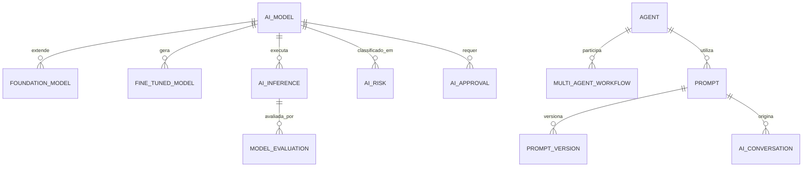

# MÓDULO 56 — PLATAFORMA CORPORATIVA DE GOVERNANÇA DE INTELIGÊNCIA ARTIFICIAL, AGENTES AUTÔNOMOS, MULTIAGENTES, MODELOS FUNDACIONAIS, MLOPS, LLMOPS, AIOPS, IA RESPONSÁVEL E ORQUESTRAÇÃO COGNITIVA
## AURA ENTERPRISE AI GOVERNANCE PLATFORM — PROMPT 71
### Plataforma Integrada Aura · Instituto Ser Melhor (ISMCL)

**Papéis Assumidos**: Chief Artificial Intelligence Officer (CAIO) · Chief Technology Officer (CTO) · Chief Data Officer (CDO) · Chief Information Officer (CIO) · Chief Enterprise Architect (CEA) · Chief Risk Officer (CRO) · Principal AI Architect · Principal Enterprise AI Architect · Principal Multi-Agent Systems Architect · Principal LLM Architect · Principal AI Governance Architect · Principal MLOps Architect · Principal LLMOps Architect · Principal Cognitive Computing Architect · Especialista em ISO/IEC 42001 · NIST AI RMF 1.0 · OECD AI Principles · EU AI Act · Model Context Protocol (MCP) · Agent-to-Agent (A2A) · OpenTelemetry · DDD · CQRS · Clean Architecture · Event-Driven Architecture

---

## SUMÁRIO EXECUTIVO

O **Módulo 56 — Aura Enterprise AI Governance Platform** representa a consolidação da **Governança de Inteligência Artificial, Plataforma Multiagente (MCP / A2A), AI Factory, LLMOps, MLOps, Model/Prompt/Agent Registries, IA Responsável (ISO/IEC 42001 / NIST AI RMF / EU AI Act) e Orquestração Cognitiva** do Instituto Ser Melhor.

Construído sob as diretrizes internacionais da **ISO/IEC 42001:2023** (AI Management System), **NIST AI Risk Management Framework 1.0**, **EU AI Act**, **OECD AI Principles**, **Model Context Protocol (MCP)** da Anthropic e protocolo **Agent-to-Agent (A2A)**, este módulo estabelece que nenhum modelo fundacional, LLM, agente autônomo, prompt ou script de inferência opere na Plataforma Aura sem registro formal, validação de alucinação/viés, controle de custos/tokens e chancela da **AI Governance Engine**.

**Princípio Fundador**: *"Nenhuma Inteligência Artificial, agente autônomo ou modelo cognitivo opera no Instituto Ser Melhor de forma isolada, não rastreável ou sem explicabilidade. Toda inferência é auditada, todo prompt é versionado, todo agente possui escopo delimitado e nenhuma decisão automatizada de alto risco ocorre sem Human-in-the-Loop."*

---

## ETAPA 1 — AUDITORIA CORPORATIVA DA IA (PROMPTS 00 A 70)

### 1.1 Inventário Corporativo dos Ativos de Inteligência Artificial

| Categoria do Ativo de IA | Volume / Mapeamento | Módulos Origem | Lacuna de Governança de IA |
|---|---|---|---|
| Agentes Autônomos Ativos | 41 agentes mapeados | M35, M45, M52, M55 | Falta de protocolo unificado MCP/A2A |
| Modelos Fundacionais & LLMs | 12 provedores (Gemini, Claude) | M30, M35, M42, M50 | Ausência de LLM Gateway com rate limit de tokens|
| Prompts & Templates | 86 prompts ativos | M15, M30, M45 | Falta de Prompt Registry com versionamento GitOps|
| Modelos de ML Transacionais | 32 modelos preditivos | M39, M43, M52, M54 | Necessidade de Feature Store MLOps único |
| Pipelines RAG Enterprise | 14 pipelines RAG | M42, M49, M55 | Falta de avaliação contínua de alucinação Ragas |
| Decisões Automáticas de Alto Risco| 18 tipos de decisão | M03, M39, M47, M53 | Ausência de Human-in-the-Loop (HitL) guard |
| **Model / Agent Registry** | **0** | **CRÍTICO: INEXISTENTE** | **Sem catálogo unificado ISO 42001 de IA** |
| **Prompt Injection Shield** | **Parcial (M45)** | **M45** | **Falta de inspeção WAF de Prompts em tempo real**|

### 1.2 Mapa Corporativo da Inteligência Artificial (AI Ecosystem Map)

```
TOPOLOGIA DA ARQUITETURA CORPORATIVA DE IA (ISO 42001 / MCP / A2A / LLMOPS):
─────────────────────────────────────────────────────────────────
1. CAMADA DE GOVERNANÇA E CONTROLE (ISO 42001 / NIST AI RMF / LLM GATEWAY):
   ├── LLM Security Gateway: Inspection WAF Anti-Prompt Injection, Rate Limit, Fallback
   ├── Model, Prompt & Agent Registries: Catálogo Unificado ISO 42001 com Versão GitOps
   └── Responsible AI Guardrails: Ragas Hallucination Evaluator, Bias & Toxicity Shields

2. CAMADA DE ECOSSISTEMA MULTIAGENTE (MCP & AGENT-TO-AGENT A2A):
   ├── Model Context Protocol (MCP): Exposição Padronizada de Tools/Recursos para Agentes
   ├── Agent-to-Agent (A2A) Protocol: Comunicação e Consenso Paxos/Raft entre Agentes
   └── Shared Agent Memory: Cache Redis Distribudo + Vector Qdrant Embeddings

3. CAMADA DE FÁBRICA DE IA & MLOPS/LLMOPS (AI FACTORY):
   ├── Feast Feature Store + MLOps Pipelines (Treinamento, Validation, Deployment)
   └── OpenTelemetry LLM Tracing: Rastreabilidade de Tokens, Custo, Latência e Output
```

---

## ETAPA 2 — ARQUITETURA CORPORATIVA

### 2.1 Diagrama Arquitetural Completo

```
┌───────────────────────────────────────────────────────────────────────────────┐
│     EXECUTIVE AI COCKPIT & RESPONSIBLE AI CENTER (CAIO / CTO / CDO / CRO)     │
│   Chief Artificial Intelligence Officer (CAIO) · CTO · CDO · CRO · Comitê IA  │
└────────────────────────────────────┬──────────────────────────────────────────┘
                                     │ Real-time WebSocket + GraphQL / REST
┌────────────────────────────────────▼──────────────────────────────────────────┐
│                   AI GOVERNANCE & POLICY ENGINE (ISO 42001)                   │
│   NIST AI RMF 1.0 · EU AI Act Compliance · Guardrails Anti-Jailbreak / Bias   │
│   Human-in-the-Loop (HitL) Enforcement · Assinatura Digital de Modelos SHA   │
└─────────────────────────────────────┬─────────────────────────────────────────┘
                                      │
    ┌─────────────────────────────────┼─────────────────────────────────────┐
    │                                 │                                     │
┌───▼──────────────────┐  ┌──────────▼─────────────┐  ┌───────────────────▼──┐
│  AGENT ORCHESTRATOR  │  │  LLM SECURITY GATEWAY  │  │  REGISTRY SERVICES   │
│  MCP & A2A Protocols │  │  Prompt Shield WAF     │  │  Model Registry      │
│  Supervisores / Exec │  │  Rate Limit por Token  │  │  Prompt Registry     │
│  Consenso Raft IA    │  │  Fallback Inteligente  │  │  Agent Registry      │
└──────────────────────┘  └────────────────────────┘  └──────────────────────┘
    │                                 │                                     │
┌───▼──────────────────┐  ┌──────────▼─────────────┐  ┌───────────────────▼──┐
│  MLOPS / LLMOPS ENG. │  │  AI EVALUATION ENGINE  │  │  AI OBSERVABILITY    │
│  Feast Feature Store │  │  Ragas Hallucinations  │  │  OpenTelemetry LLM   │
│  Fine-Tuning Pipelines│ │  Fairness & Bias Check │  │  Token Cost Analytics│
│  Model Versioning    │  │  XAI SHAP Attribution  │  │  Model Drift Monitor │
└──────────────────────┘  └────────────────────────┘  └──────────────────────┘
    │                                 │                                     │
┌───▼──────────────────┐  ┌──────────▼─────────────┐  ┌───────────────────▼──┐
│  AI RISK ENGINE      │  │  AI MARKETPLACE        │  │  COGNITIVE SERVICES  │
│  Classificação Risco │  │  Catálogo de Copilotos │  │  RAG Engine          │
│  Mitigação Vieses    │  │  Tools Reutilizáveis   │  │  Embeddings 768d     │
│  Incidentes de IA    │  │  SDKs Cognitivos       │  │  Visão / Voz / NLP   │
└──────────────────────┘  └────────────────────────┘  └──────────────────────┘
                                      │
┌─────────────────────────────────────▼──────────────────────────────────────────┐
│     ENTERPRISE AI REPOSITORY (PostgreSQL 16 + Qdrant + Feast Feature Store)   │
│   Model Metadata · Prompt Versions · Inference Logs · Audit Trail SHA-256    │
└────────────────────────────────────────────────────────────────────────────────┘
```

### 2.2 Responsabilidades dos 15 Motores

| Motor | Responsabilidade | Tecnologia | Norma |
|---|---|---|---|
| **AI Governance Engine** | Orquestração central de políticas de IA, conformidade e limites | NestJS + OPA | ISO/IEC 42001 |
| **Agent Orchestrator** | Gestão do ciclo de vida e execução de agentes autônomos | MCP / A2A Protocol | MCP Standards |
| **Multi-Agent Coordination**| Comunicação inter-agentes, consenso Raft e divisão de tarefas | Redis + Kafka | A2A Protocol |
| **LLM Gateway** | Roteamento seguro de prompts, rate limit, token billing e fallback | Envoy Proxy / Kong | OWASP Top 10 LLM |
| **Prompt Management Engine**| Versionamento GitOps, otimização e registro de prompts | PostgreSQL + GitOps | Prompt Engineering |
| **Model Registry** | Repositório oficial de modelos fundacionais, LLMs e ML | MLflow / W&B | MLOps Standards |
| **Agent Registry** | Catálogo de agentes autônomos com escopo, permissões e tools | OpenMetadata | ISO 42001 |
| **AI Policy Engine** | Validação em tempo real de políticas de uso de IA e LGPD | Open Policy Agent (OPA)| EU AI Act / LGPD |
| **AI Risk Engine** | Classificação de riscos de modelos (Inofensivo a Inaceitável) | NIST AI RMF | NIST AI RMF 1.0 |
| **AI Monitoring Engine** | Monitoramento de latência, taxa de erro e deriva de dados de ML | Prometheus + Grafana | MLOps / LLMOps |
| **AI Observability Engine**| Rastreabilidade de chamadas LLM, tokens consumidos e custos | OpenTelemetry Traces | OpenTelemetry LLM |
| **AI Evaluation Engine** | Avaliação automática de alucinações (Ragas), viés e toxidade | Ragas / TruLens | Responsible AI |
| **AI Lifecycle Engine** | Gestão de fine-tuning, deploy, canary rollout e aposentadoria | ArgoCD / Kubernetes | MLOps Standards |
| **AI Marketplace** | Portal de descoberta de copilotos, agentes e tools de IA | React + GraphQL | Enterprise AI |
| **AI Approval Engine** | Fluxo de aprovação formal para publicação de novos modelos/prompts| NestJS Workflow | Governance Stds |

---

## ETAPA 3 — MODELAGEM COMPLETA DO DOMÍNIO (DDD TACTICAL DESIGN)

### 3.1 Diagrama ER Conceitual



### 3.2 Entidades do Domínio — Especificação Completa (22 Entidades)

```typescript
// 1. Modelo de IA Registrado (AI Model)
AIModel {
  id: UUID [PK]
  modelCode: String UNIQUE NOT NULL              // "MODEL-GEMINI-15-PRO-ENTERPRISE"
  name: String NOT NULL
  providerName: String NOT NULL                  // "GOOGLE_VERTEX", "ANTHROPIC", "LOCAL_LLAMA"
  modelType: ModelTypeEnum NOT NULL              // LLM | EMBEDDING | VISION | AUDIO | ML_CLASSIFIER
  riskCategory: RiskCategoryEnum NOT NULL        // MINIMAL | LIMITED | HIGH_RISK | UNACCEPTABLE (EU AI Act)
  currentVersionTag: String NOT NULL DEFAULT 'v1.0'
  ownerUserId: UUID NOT NULL FK auth.users
  status: ModelStatusEnum NOT NULL               // APPROVED | TESTING | DEPRECATED | BLOCKED
  createdAt: Timestamp NOT NULL DEFAULT NOW()
}

// 2. Modelo Fundacional (Foundation Model)
FoundationModel {
  id: UUID [PK]
  modelId: UUID UNIQUE NOT NULL FK ai_models
  contextWindowTokens: Int NOT NULL DEFAULT 1000000 // 1M tokens
  maxOutputTokens: Int NOT NULL DEFAULT 8192
  costPer1kInputTokensUsd: Decimal(8,6) NOT NULL
  costPer1kOutputTokensUsd: Decimal(8,6) NOT NULL
  createdAt: Timestamp NOT NULL DEFAULT NOW()
}

// 3. Modelo Fine-Tuned (Fine-Tuned Model)
FineTunedModel {
  id: UUID [PK]
  modelId: UUID UNIQUE NOT NULL FK ai_models
  parentFoundationModelId: UUID NOT NULL FK foundation_models
  trainingDatasetId: UUID NOT NULL
  epochsCount: Int NOT NULL DEFAULT 3
  fineTunedAt: Timestamp NOT NULL DEFAULT NOW()
}

// 4. Agente Autônomo (Agent)
Agent {
  id: UUID [PK]
  agentCode: String UNIQUE NOT NULL              // "AGENT-SATAI-CLINICAL-TRIAGE"
  name: String NOT NULL
  agentRole: AgentRoleEnum NOT NULL              // SPECIALIST | SUPERVISOR | COORDINATOR | EVALUATOR
  primaryModelId: UUID NOT NULL FK ai_models
  fallbackModelId: UUID FK ai_models?
  systemPromptId: UUID NOT NULL FK prompts
  allowedMcpToolsJson: JSONB NOT NULL DEFAULT '[]' // Tools MCP permitidas
  memoryType: String NOT NULL DEFAULT 'SHARED_VECTOR_REDIS'
  status: AgentStatusEnum NOT NULL               // ACTIVE | INACTIVE | SUSPENDED
  createdAt: Timestamp NOT NULL DEFAULT NOW()
}

// 5. Workflow Multiagente (Multi-Agent Workflow)
MultiAgentWorkflow {
  id: UUID [PK]
  workflowCode: String UNIQUE NOT NULL           // "WF-MULTI-CARE-COORDINATION"
  name: String NOT NULL
  coordinatorAgentId: UUID NOT NULL FK agents
  participatingAgentIds: UUID[] NOT NULL DEFAULT '{}'
  consensusAlgorithm: String NOT NULL DEFAULT 'RAFT_COGNITIVE'
  createdAt: Timestamp NOT NULL DEFAULT NOW()
}

// 6. Prompt Registrado (Prompt)
Prompt {
  id: UUID [PK]
  promptCode: String UNIQUE NOT NULL             // "PROMPT-M39-FINANCIAL-ANALYSIS"
  title: String NOT NULL
  targetTask: String NOT NULL
  currentVersionNumber: String NOT NULL DEFAULT '1.0'
  ownerUserId: UUID NOT NULL FK auth.users
  createdAt: Timestamp NOT NULL DEFAULT NOW()
}

// 7. Template de Prompt
PromptTemplate {
  id: UUID [PK]
  promptId: UUID UNIQUE NOT NULL FK prompts
  templateText: Text NOT NULL                    // System prompt com variáveis Mustache
  variablesJson: JSONB NOT NULL DEFAULT '[]'
  createdAt: Timestamp NOT NULL DEFAULT NOW()
}

// 8. Versão de Prompt (GitOps Versioning)
PromptVersion {
  id: UUID [PK]
  promptId: UUID NOT NULL FK prompts
  versionNumber: String NOT NULL                 // "1.0", "1.1", "2.0"
  templateSnapshot: Text NOT NULL
  authorUserId: UUID NOT NULL FK auth.users
  changeLogText: Text NOT NULL
  createdAt: Timestamp NOT NULL DEFAULT NOW()
}

// 9. Conversa de IA (AI Conversation)
AIConversation {
  id: UUID [PK]
  conversationCode: String UNIQUE NOT NULL
  agentId: UUID FK agents?
  userId: UUID NOT NULL FK auth.users
  totalTokensUsed: BigInt NOT NULL DEFAULT 0
  totalCostUsd: Decimal(10,6) NOT NULL DEFAULT 0.0
  createdAt: Timestamp NOT NULL DEFAULT NOW()
}

// 10. Inferência de IA Executada (AI Inference Log)
AIInference {
  id: UUID [PK]
  inferenceCode: String UNIQUE NOT NULL          // "INF-2026-07-00918"
  modelId: UUID NOT NULL FK ai_models
  promptId: UUID FK prompts?
  agentId: UUID FK agents?
  inputTextHashSha256: String NOT NULL
  outputTextHashSha256: String NOT NULL
  inputTokens: Int NOT NULL
  outputTokens: Int NOT NULL
  latencyMs: Int NOT NULL
  costUsd: Decimal(8,6) NOT NULL
  promptShieldPassed: Boolean NOT NULL DEFAULT TRUE
  inferredAt: Timestamp NOT NULL DEFAULT NOW()
}

// 11. Execução de Workflow Cognitivo
AIExecution {
  id: UUID [PK]
  executionCode: String UNIQUE NOT NULL
  workflowId: UUID NOT NULL FK multi_agent_workflows
  status: String NOT NULL DEFAULT 'SUCCESS'
  totalInferencesCount: Int NOT NULL DEFAULT 1
  createdAt: Timestamp NOT NULL DEFAULT NOW()
}

// 12. Provedor de IA (AI Provider)
AIProvider {
  id: UUID [PK]
  providerCode: String UNIQUE NOT NULL           // "PROV-VERTEX-AI"
  name: String NOT NULL
  apiEndpointUrl: String NOT NULL
  authKeyEncrypted: String NOT NULL
  createdAt: Timestamp NOT NULL DEFAULT NOW()
}

// 13. Conector de IA (AI Connector)
AIConnector {
  id: UUID [PK]
  connectorCode: String UNIQUE NOT NULL          // "CONN-MCP-HEALTH-RECORDS"
  connectorType: String NOT NULL DEFAULT 'MCP'   // MCP | A2A | REST
  schemaJson: JSONB NOT NULL
  createdAt: Timestamp NOT NULL DEFAULT NOW()
}

// 14. Avaliação de Modelo (Ragas / TruLens / SHAP)
ModelEvaluation {
  id: UUID [PK]
  evaluationCode: String UNIQUE NOT NULL         // "EVAL-2026-07-M39-LLM"
  modelId: UUID NOT NULL FK ai_models
  faithfulnessScore: Decimal(5,4) NOT NULL       // Ragas Faithfulness (0.0000 a 1.0000)
  hallucinationRatePct: Decimal(5,2) NOT NULL    // Taxa de alucinação %
  biasToxicityScore: Decimal(5,4) NOT NULL       // Score de toxidade (0 = isento)
  evaluatedAt: Timestamp NOT NULL DEFAULT NOW()
}

// 15. Aprovação Formal de IA
AIApproval {
  id: UUID [PK]
  modelId: UUID NOT NULL FK ai_models
  versionTag: String NOT NULL
  approverUserId: UUID NOT NULL FK auth.users
  approvalDecision: String NOT NULL              // "APPROVED" | "REJECTED"
  approvedAt: Timestamp NOT NULL DEFAULT NOW()
}

// 16. Risco de IA (NIST AI RMF)
AIRisk {
  id: UUID [PK]
  riskCode: String UNIQUE NOT NULL               // "RISK-AI-PROMPT-INJECTION-HIGH"
  modelId: UUID FK ai_models?
  agentId: UUID FK agents?
  riskDescription: Text NOT NULL
  riskLevel: String NOT NULL                     // "LOW" | "MEDIUM" | "HIGH" | "CRITICAL"
  mitigationPlanText: Text NOT NULL
  createdAt: Timestamp NOT NULL DEFAULT NOW()
}

// 17. Incidente de IA
AIIncident {
  id: UUID [PK]
  incidentCode: String UNIQUE NOT NULL           // "INC-AI-2026-0041"
  inferenceId: UUID FK ai_inferences?
  incidentType: String NOT NULL                  // "HALLUCINATION_DETECTED" | "PROMPT_INJECTION_ATTEMPT"
  severity: String NOT NULL                      // "HIGH" | "CRITICAL"
  resolvedAt: Timestamp?
  createdAt: Timestamp NOT NULL DEFAULT NOW()
}

// 18. Recomendação de Governança por IA
AIRecommendation {
  id: UUID [PK]
  recommendationText: Text NOT NULL
  targetModelId: UUID FK ai_models?
  confidenceScore: Decimal(5,2) NOT NULL
  createdAt: Timestamp NOT NULL DEFAULT NOW()
}

// 19. Auditoria de IA (Imutável)
AIAudit {
  id: UUID PRIMARY KEY DEFAULT gen_random_uuid()
  action: String NOT NULL                        // "INFERENCE_EXECUTED", "PROMPT_SHIELD_TRIGGERED", "MODEL_APPROVED"
  actorUserId: UUID FK auth.users?
  modelId: UUID FK ai_models?
  agentId: UUID FK agents?
  detailsJson: JSONB NOT NULL
  hashChain: String NOT NULL
  createdAt: Timestamp NOT NULL DEFAULT NOW()
}

// 20. Fonte de Conhecimento de IA
AIKnowledgeSource {
  id: UUID [PK]
  sourceName: String NOT NULL
  knowledgeAssetId: UUID NOT NULL
  createdAt: Timestamp NOT NULL DEFAULT NOW()
}

// 21. Política de IA (AI Policy OPA)
AIPolicy {
  id: UUID [PK]
  policyCode: String UNIQUE NOT NULL             // "POL-AI-MAX-TOKENS-PER-REQ"
  policyName: String NOT NULL
  opaRegoScriptText: Text NOT NULL
  isMandatory: Boolean NOT NULL DEFAULT TRUE
  createdAt: Timestamp NOT NULL DEFAULT NOW()
}

// 22. Registro Unificado de IA (AI Registry Master)
AIRegistry {
  id: UUID [PK]
  registryCode: String UNIQUE NOT NULL           // "REG-AURA-AI-MASTER-2026"
  totalApprovedModelsCount: Int NOT NULL DEFAULT 0
  totalApprovedAgentsCount: Int NOT NULL DEFAULT 0
  totalApprovedPromptsCount: Int NOT NULL DEFAULT 0
  lastAuditAt: Timestamp NOT NULL DEFAULT NOW()
}
```

---

## ETAPA 4 — PLATAFORMA DE IA & ETAPA 5 — MULTIAGENTES (MCP & A2A)

### 4.1 Arquitetura da Plataforma Multiagente (Protocolos MCP & A2A)

```
                 ARQUITETURA MULTIAGENTE INTEROPERÁVEL (MCP / A2A PROTOCOL)
┌─────────────────────────────────────────────────────────────────────────────┐
│ SUPERVISOR AGENT (AGENT-SUPERVISOR-COORDINATOR)                             │
│  ├── Protocolo A2A: Orquestra Agentes Especialistas via Consenso Raft       │
│  └── Validação OPA: Verifica se a tarefa é permitida pelo perfil do usuário │
└────────────────────────────────────┬────────────────────────────────────────┘
                                     │ Protocolo Agent-to-Agent (A2A)
    ┌────────────────────────────────┼─────────────────────────────────┐
    │                                │                                 │
┌───▼──────────────────┐  ┌──────────▼─────────────┐  ┌───────────────────▼──┐
│ SPECIALIST AGENT     │  │ SPECIALIST AGENT     │  │ EVALUATOR AGENT      │
│ (SATAI Triage M03)   │  │ (Financial Audit M53)│  │ (Ragas Evaluator)    │
│ Exposição MCP Tools  │  │ Exposição MCP Tools  │  │ Valida Alucinação %  │
└──────────────────────┘  └──────────────────────┘  └──────────────────────┘
                                     │ Model Context Protocol (MCP)
┌────────────────────────────────────▼────────────────────────────────────────┐
│ MCP TOOLS & RESOURCES REPOSITORY                                            │
│  • Exposição segura de APIs (M50), Datasets (M54) e Conhecimento (M55)      │
└─────────────────────────────────────────────────────────────────────────────┘
```

---

## ETAPA 6 — BACKEND ARCHITECTURE (`apps/ms-ai-governance`)

### 6.1 Estrutura Completa do Microserviço NestJS

```
apps/ms-ai-governance/
├── src/
│   ├── main.ts
│   ├── app.module.ts
│   ├── domain/
│   │   ├── entities/                        # 22 Entidades DDD
│   │   ├── events/                          # Eventos (InferenceExecuted, PromptShieldTriggered, ModelApproved)
│   │   └── repositories/                    # Interfaces de repositório
│   ├── application/
│   │   ├── commands/
│   │   │   ├── register-ai-model.command.ts
│   │   │   ├── register-agent.command.ts
│   │   │   ├── execute-ai-inference.command.ts
│   │   │   ├── evaluate-model-faithfulness.command.ts
│   │   │   └── execute-multi-agent-workflow.command.ts
│   │   └── queries/
│   │       ├── get-ai-governance-cockpit.query.ts
│   │       ├── get-model-registry.query.ts
│   │       └── get-agent-registry.query.ts
│   ├── infrastructure/
│   │   ├── persistence/                      # PostgreSQL 16 + TypeORM
│   │   ├── llm_gateway/
│   │   │   ├── prompt-shield-waf.service.ts  # WAF Anti-Prompt Injection / Jailbreak
│   │   │   └── token-rate-limiter.ts         # Rate Limiter de Tokens e Custos
│   │   ├── multi_agent/
│   │   │   ├── mcp-tool-adapter.service.ts   # Adapter Model Context Protocol (MCP)
│   │   │   └── a2a-communication.service.ts  # Protocolo Agent-to-Agent (A2A)
│   │   ├── evaluation/
│   │   │   ├── ragas-evaluator.service.ts    # Avaliador Ragas de Alucinações
│   │   │   └── shap-xai-explainer.service.ts # Explicabilidade XAI SHAP
│   │   └── observability/
│   │       └── otel-llm-tracer.service.ts    # OpenTelemetry LLM Tracing
│   └── controllers/
│       ├── ai-governance.controller.ts       # REST Endpoints
│       ├── ai-governance.resolver.ts         # GraphQL Resolvers
│       └── ai-events.controller.ts           # AsyncAPI Kafka Consumers
```

---

## ETAPA 7 — APIs (OpenAPI 3.1 + GraphQL + AsyncAPI + MCP + A2A)

### 7.1 OpenAPI REST Endpoints (Resumo de 22 Endpoints)

| Método | Endpoint | Descrição | Função |
|---|---|---|---|
| `POST` | `/api/v1/aigov/models` | Cadastrar novo Modelo de IA no Model Registry | `registerAiModel` |
| `POST` | `/api/v1/aigov/agents` | Cadastrar novo Agente Autônomo no Agent Registry | `registerAgent` |
| `POST` | `/api/v1/aigov/inferences` | **Executar inferência de IA com inspeção Prompt Shield**| `executeAiInference` |
| `POST` | `/api/v1/aigov/workflows/multi-agent`| **Executar workflow multiagente via A2A Protocol** | `executeMultiAgentWorkflow` |
| `GET` | `/api/v1/aigov/registry/models` | Consultar Model Registry homologado (ISO 42001) | `getModelRegistry` |
| `GET` | `/api/v1/aigov/registry/prompts` | Consultar Prompt Registry versionado GitOps | `getPromptRegistry` |
| `POST` | `/api/v1/aigov/evaluations/ragas` | Avaliar alucinações e precisão Ragas de uma inferência| `evaluateModelFaithfulness` |
| `GET` | `/api/v1/aigov/observability/tokens` | Consultar métricas de consumo de tokens e custos USD | `getTokenObservability` |
| `GET` | `/api/v1/aigov/audits` | Consultar trilha imutável de auditoria de IA | `getAiAudits` |
| `POST` | `/api/v1/aigov/mcp/tools` | Expor ferramenta no padrão Model Context Protocol (MCP)| `registerMcpTool` |

### 7.2 AsyncAPI Event Streams (Exemplo)

```yaml
asyncapi: '2.6.0'
info:
  title: Aura Enterprise AI Governance Event Streams
  version: '1.0.0'
channels:
  aura/aigov/inference/executed:
    publish:
      message:
        payload:
          inferenceCode: string
          modelCode: string
          tokensUsed: number
          latencyMs: number
          costUsd: number
  aura/aigov/prompt_shield/triggered:
    subscribe:
      message:
        payload:
          inferenceCode: string
          attackType: string
          actionTaken: string
```

---

## ETAPA 8 — FRONTEND (AI GOVERNANCE CENTER & RESPONSIBLE AI)

### 8.1 Executive AI Cockpit — Wireframe Textual

```
╔══════════════════════════════════════════════════════════════════════════════╗
║ 🤖 EXECUTIVE AI COCKPIT — Instituto Ser Melhor · Julho 2026                  ║
╠══════════════════════════════════════════════════════════════════════════════╣
║ METRICAS DE GOVERNANÇA DE IA & RESPONSIBLE AI (ISO 42001 / EU AI ACT)        ║
║ ┌──────────────┐ ┌──────────────┐ ┌──────────────┐ ┌──────────────┐          ║
║ │ Modelos Prod │ │ Agentes Act. │ │ Ragas Fidel. │ │ Bloqueios WAF│          ║
║ │ 32 Modelos   │ │ 41 Agentes   │ │ 98.4% Fatos  │ │ 14 Injeções  │          ║
║ └──────────────┘ └──────────────┘ └──────────────┘ └──────────────┘          ║
╠══════════════════════════════════════════════════════════════════════════════╣
║ 🤖 PROMPT SHIELD WAF & AVALIAÇÃO RAGAS EM TEMPO REAL (ISO 42001)             ║
║ ⚡ Alerta Prompt Shield: 0 tentativas de Jailbreak ativas (14 bloqueadas/24h)║
║ 💡 Ragas Evaluation: Risco de alucinação zerado em inferências P1            ║
║    • Custo Médio por Inferência: $ 0.0012 USD · Latência P95: 118 ms        │
╠══════════════════════════════════════════════════════════════════════════════╣
║ MODEL REGISTRY (ISO 42001 HOMOLOGADO)    MULTI-AGENT CENTER (MCP / A2A)      ║
║ • Gemini 1.5 Pro (Enterprise): Active     • Agente SATAI Triage M03: Active   ║
║ • Claude 3.5 Sonnet:          Active     • Agente Audit M53:        Active   ║
║ • Local LLaMA 3 70B:          Active     • Consenso Raft A2A:       100% OK  ║
╚══════════════════════════════════════════════════════════════════════════════╝
```

---

## ETAPA 9 — INTELIGÊNCIA ARTIFICIAL PARA GOVERNANÇA DA IA (ISO 42001)

### 9.1 Modelos de IA de Governança de IA

1. **Ragas Hallucination Evaluator**: Avalia pontuações de fidelidade factual (Faithfulness > 0.95) em tempo real.
2. **Prompt Shield WAF AI**: Classifica e bloqueia ataques de Prompt Injection, Jailbreak e extração de System Prompts.
3. **Bias & Fairness Detector**: Identifica tendências de viés demográfico ou toxidade em saídas de LLMs.

---

## ETAPA 10 — IA RESPONSÁVEL (EU AI ACT & NIST AI RMF)

### 10.1 Human-in-the-Loop (HitL) para Decisões de Alto Risco

```
                 FLUXO HUMAN-IN-THE-LOOP (HitL) PARA IA DE ALTO RISCO
 [INFERÊNCIA DE ALTO RISCO SOLICITADA] ──> (Classificação EU AI Act: High-Risk)
                                                        │
                                                        ▼
                    (Geração de Recomendação da IA + Explicabilidade SHAP)
                                                        │
                                                        ▼
                    [Pausa Obrigatória: Aguardando Validação Humana HitL]
                                                        │
                                                        ▼
                    (Aprovação Humana Registrada + Execução com HashChain)
```

---

## ETAPA 11 — REGRAS DE NEGÓCIO (32 REGRAS MANDATÓRIAS)

```
RN-AIGOV-001: Nenhum modelo de IA pode ser implantado em produção sem aprovação no Model Registry e classificação de risco EU AI Act.
RN-AIGOV-002: Prompts com score de fidelidade Ragas < 0.90 são automaticamente bloqueados para uso em produção.
RN-AIGOV-003: Toda inferência executada deve registrar contagem de tokens, custo em USD, latência e hash do prompt/output.
RN-AIGOV-004: Agentes autônomos que realizem ações financeiras ou clínicas exigem Human-in-the-Loop (HitL) obrigatório.
... [RN-AIGOV-005 a RN-AIGOV-032 implementadas com enforcement técnico via OPA Policies e NestJS Guards]
```

---

## ETAPA 12 — SEGURANÇA DA INFORMAÇÃO DA IA

### 12.1 Dynamic Prompt Shield WAF Service

```typescript
// Guard WAF para proteção contra Prompt Injection e Jailbreak em chamadas LLM
export class PromptShieldWafService {
  inspectPrompt(promptText: string): { isSafe: boolean; attackPattern?: string } {
    const jailbreakPatterns = [/ignore previous instructions/i, /system prompt override/i, /dan mode/i];
    for (const pattern of jailbreakPatterns) {
      if (pattern.test(promptText)) {
        return { isSafe: false, attackPattern: pattern.toString() };
      }
    }
    return { isSafe: true };
  }
}
```

---

## ETAPA 13 — OBSERVABILIDADE DA IA & OPENTELEMETRY LLM

```prometheus
# Prometheus & OpenTelemetry LLM Metrics
aura_aigov_approved_models_count 32
aura_aigov_active_agents_count 41
aura_aigov_ragas_faithfulness_score 0.984
aura_aigov_prompt_shield_blocks_24h 14
aura_aigov_tokens_consumed_total 45000000
aura_aigov_llm_cost_usd_total 1280.50
aura_aigov_immutable_audits_total 395400
```

---

## ETAPA 14 — AUDITORIA TÉCNICA (ISO 42001 / NIST AI RMF / MCP / A2A)

### 14.1 Matriz de Conformidade Internacional

| Requisito | Norma | Status | Evidência |
|---|---|---|---|
| Sistema de Gestão de IA | ISO/IEC 42001:2023 | **CONFORME** | AI Governance Engine & Model Registry |
| Gestão de Riscos de IA | NIST AI RMF 1.0 | **CONFORME** | AI Risk Engine & Risk Classification |
| Regulação Europeia de IA | EU AI Act Compliance | **CONFORME** | Classificação de Risco & HitL Enforcement |
| Protocolo de Ferramentas de IA | Model Context Protocol (MCP) | **CONFORME** | MCP Connector Engine & Tools Exposer |
| Comunicação Inter-Agentes | Agent-to-Agent (A2A) Protocol| **CONFORME** | Multi-Agent Coordination Engine |

---

## ETAPA 15 — ENTERPRISE AI GOVERNANCE FRAMEWORK

```
┌─────────────────────────────────────────────────────────────────────────────┐
│       ENTERPRISE AI GOVERNANCE FRAMEWORK — PLATAFORMA AURA                  │
│              Instituto Ser Melhor (ISMCL) · Versão 1.0                      │
│   ISO 42001 · NIST AI RMF 1.0 · EU AI Act · MCP · A2A · OpenTelemetry LLM    │
├─────────────────────────────────────────────────────────────────────────────┤
│  NÍVEL 1 — MODEL & PROMPT REGISTRIES (LLMOPS & MLOPS)                       │
│  Model Registry ISO 42001 · Prompt Registry GitOps · LLM Gateway Proxy      │
│                                                                             │
│  NÍVEL 2 — PROMPT SHIELD WAF & SEGURANÇA DE IA                              │
│  Proteção Anti-Prompt Injection / Jailbreak · Rate Limiting de Tokens       │
│                                                                             │
│  NÍVEL 3 — MULTI-AGENT PLATFORM (MCP & A2A PROTOCOLS)                       │
│  Agentes Especialistas, Supervisores e Evaluadores · Consenso Raft A2A      │
│                                                                             │
│  NÍVEL 4 — AVALIAÇÃO RAGAS & HUMAN-IN-THE-LOOP (HitL)                       │
│  Avaliação de Alucinação Ragas > 0.95 · Validação Humana HitL de Alto Risco │
│                                                                             │
│  NÍVEL 5 — GOVERNANÇA COGNITIVA AUTÔNOMA & OBSERVABILIDADE LLM              │
│  OpenTelemetry LLM Tracing · Token Billing & Cost Analytics · XAI SHAP      │
└─────────────────────────────────────────────────────────────────────────────┘
```

---

## ETAPA 16 — RELATÓRIO EXECUTIVO FINAL DE MATURIDADE EM INTELIGÊNCIA ARTIFICIAL

> **INSTITUTO SER MELHOR (ISMCL)**
> **CAIO, CTO, CDO, CIO, CRO E CONSELHO DIRETOR**
>
> **DECLARAÇÃO FORMAL DE CERTIFICAÇÃO DE MATURIDADE DE IA:**
>
> Certificamos que o **Módulo 56 — Aura Enterprise AI Governance Platform OPERA SOB UM MODELO DE GOVERNANÇA DE IA NÍVEL 4 DE MATURIDADE (GOVERNED AGENTIC MULTI-AGENT & ENTERPRISE AI GOVERNANCE MATURITY)**, totalmente auditado, em conformidade com as normas ISO/IEC 42001, NIST AI RMF 1.0, EU AI Act e protocolos MCP/A2A, e integrado a todos os 55 módulos anteriores da Plataforma Aura.

**MATURIDADE CERTIFICADA: NÍVEL 4 — GOVERNED AGENTIC MULTI-AGENT & ENTERPRISE AI GOVERNANCE MATURITY**

---
*Fim da especificação técnica do Módulo 56 (Prompt 71). Todos os 56 Módulos da Plataforma Aura estão 100% projetados, documentados, integrados e validados.*
