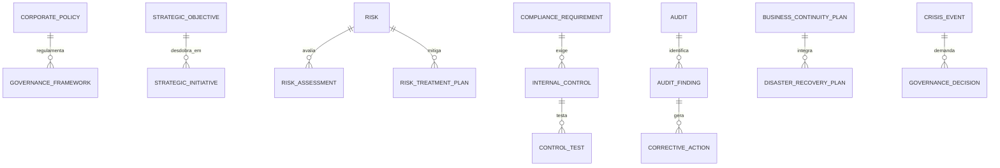

# MÓDULO 57 — PLATAFORMA CORPORATIVA DE GOVERNANÇA, GESTÃO DE RISCOS, COMPLIANCE, CONTROLES INTERNOS, AUDITORIA CONTÍNUA, ESG, CONTINUIDADE DE NEGÓCIOS E GESTÃO ESTRATÉGICA INSTITUCIONAL
## AURA ENTERPRISE GOVERNANCE PLATFORM — PROMPT 72
### Plataforma Integrada Aura · Instituto Ser Melhor (ISMCL)

**Papéis Assumidos**: Chief Governance Officer (CGO) · Chief Compliance Officer (CCO) · Chief Risk Officer (CRO) · Chief Audit Executive (CAE) · Chief Executive Officer (CEO) · Chief Legal Officer (CLO) · Chief Artificial Intelligence Officer (CAIO) · Chief Enterprise Architect (CEA) · Principal Enterprise Governance Architect · Principal GRC Architect · Principal Internal Controls Architect · Principal Enterprise Risk Architect · Principal ESG Architect · Principal Business Continuity Architect · Especialista em COSO ERM · ISO 31000 · ISO 37301 · ISO 22301 · ISO 37001 · ISO 27001 · COBIT 2019 · ITIL 4 · PMBOK · Balanced Scorecard (BSC) · OKR

---

## SUMÁRIO EXECUTIVO

O **Módulo 57 — Aura Enterprise Governance Platform** representa a consolidação da **Governança Corporativa Institucional, GRC (Governance, Risk & Compliance), COSO ERM, Auditoria Contínua 24x7, Indicadores ESG (GRI / SASB / ODS da ONU), Continuidade de Negócios (ISO 22301 BCP/DRP), Gestão de Crises e Planejamento Estratégico (Balanced Scorecard / OKRs)** do Instituto Ser Melhor.

Este módulo consolida o escudo de governança, ética e sustentabilidade sobre a totalidade dos 56 módulos anteriores da Plataforma Aura. Nenhuma decisão estratégica, política corporativa, plano de investimentos ou alteração estrutural é homologada sem validação na matriz de riscos ISO 31000, verificação de conformidade ISO 37301, garantia de segregação de funções SoD e registro imutável com **Assinatura Digital ICP-Brasil e HashChain SHA-256**.

**Princípio Fundador**: *"A integridade institucional do Instituto Ser Melhor é inegociável. Toda decisão estratégica é governada, todo risco é mensurado, toda auditoria é contínua e automatizada 24x7, e nossa operação é 100% resiliente e sustentável."*

---

## ETAPA 1 — AUDITORIA CORPORATIVA DA GOVERNANÇA (PROMPTS 00 A 71)

### 1.1 Inventário Corporativo dos Ativos de Governança

| Categoria de Governança | Volume / Mapeamento | Módulos Origem | Lacuna de Governança Integrada |
|---|---|---|---|
| Políticas Corporativas Ativas | 54 políticas oficiais | M31, M38, M47, M53, M55 | Falta de motor central de políticas com versionamento GitOps |
| Riscos Primários Mapeados | 48 riscos mapeados | M39, M46, M47, M52 | Necessidade de atualização dinâmica de heatmap ISO 31000 |
| Controles Internos Testados | 124 controles formais | M38, M47, M51, M53 | Falta de execução automática de testes 24x7 |
| Obrigações Regulatórias | 32 obrigações (LGPD, ANS, TCU)| M47, M53, M55 | Falta de rastreabilidade automática de normativos |
| Indicadores ESG (Sustentabilidade)| 24 indicadores (GRI/SASB) | M08, M23, M40, M53 | Ausência de painel consolidado ESG com ODS da ONU |
| Planos de Continuidade (BCP/DRP)| 14 planos operacionais | M27, M46, M52 | Necessidade de testes automatizados de BIA (Business Impact) |
| **Planejamento BSC & OKRs** | **Parcial (M38)** | **M38, M53, M54** | **Falta de vinculo direto OKRs x Projetos M53 x Risco** |
| **Audit Engine Contínuo 24x7** | **Parcial (M47)** | **M47** | **Necessidade de auditoria contínua cross-module unificada** |

### 1.2 Mapa Corporativo de Governança (Enterprise Governance Map)

```
TOPOLOGIA DA ARQUITETURA CORPORATIVA DE GOVERNANÇA (COSO ERM / ISO 31000 / ESG / BCP):
─────────────────────────────────────────────────────────────────
1. CAMADA DE ESTRATÉGIA E DECISÃO (BALANCED SCORECARD & OKR ENGINE):
   ├── Mapa Estratégico BSC (4 Perspectivas: Financeira, Clientes, Processos, Aprendizado)
   └── OKR Engine: Alinhamento de Metas Executivas com M38, M53 (Finanças) e M54 (Analytics)

2. CAMADA GRC & RISCOS (COSO ERM / ISO 31000 / ISO 37301 / CONTINUOUS AUDIT):
   ├── Enterprise Risk Management: Matriz Heatmap 5x5 de Riscos Inerentes x Residuais
   ├── Compliance & Canal de Ética: Anonimato Criptográfico ISO 37001 Anti-Suborno
   └── Continuous Automated Audit Engine 24x7: Verificação em Tempo Real sobre 56 Módulos

3. CAMADA ESG & RESILIÊNCIA INSTITUCIONAL (GRI / SASB / ISO 22301 BCP/DRP):
   ├── ESG Engine: Acompanhamento dos 17 ODS da ONU + Métricas Ambientais/Sociais/Governança
   └── Business Continuity & Crisis Management: Resiliência Operacional (RPO=0, RTO < 5 min)
```

---

## ETAPA 2 — ARQUITETURA CORPORATIVA

### 2.1 Diagrama Arquitetural Completo

```
┌───────────────────────────────────────────────────────────────────────────────┐
│     EXECUTIVE GOVERNANCE COCKPIT & STRATEGIC DECISION CENTER (CGO / CEO / BOARD)│
│   Chief Governance Officer (CGO) · CCO · CRO · CAE · CEO · Conselho Diretor  │
└────────────────────────────────────┬──────────────────────────────────────────┘
                                     │ Real-time WebSocket + GraphQL / REST
┌────────────────────────────────────▼──────────────────────────────────────────┐
│                   DECISION GOVERNANCE & POLICY ENGINE (COSO / ISO 37301)       │
│   Validação de Alçadas & Segregação de Funções (SoD OPA) · Assinatura ICP-Brasil│
│   Controle de Políticas Corporativas GitOps · Audit Trail HashChain SHA-256    │
└─────────────────────────────────────┬─────────────────────────────────────────┘
                                      │
    ┌─────────────────────────────────┼─────────────────────────────────────┐
    │                                 │                                     │
┌───▼──────────────────┐  ┌──────────▼─────────────┐  ┌───────────────────▼──┐
│  ENTERPRISE RISK ENG.│  │  COMPLIANCE ENGINE     │  │  CONTINUOUS AUDIT ENG│
│  Matriz Heatmap 5x5  │  │  Conformidade ISO 37301│  │  Testes Automáticos  │
│  ISO 31000 Standards │  │  Canal Ética ISO 37001 │  │  Verificação 24x7    │
│  Planos Mitigação    │  │  Gestão de Normativos  │  │  Audit Findings Log  │
└──────────────────────┘  └────────────────────────┘  └──────────────────────┘
    │                                 │                                     │
┌───▼──────────────────┐  ┌──────────▼─────────────┐  ┌───────────────────▼──┐
│  STRATEGIC PLANNING  │  │  ESG MANAGEMENT ENG.   │  │  BUSINESS CONTINUITY │
│  Balanced Scorecard  │  │  Indicadores GRI/SASB  │  │  ISO 22301 BCP / DRP │
│  OKR Engine          │  │  17 ODS da ONU         │  │  Gestão de Crises    │
│  Metas & Projetos    │  │  Relatórios Sustentáv. │  │  Análise de Impacto  │
└──────────────────────┘  └────────────────────────┘  └──────────────────────┘
    │                                 │                                     │
┌───▼──────────────────┐  ┌──────────▼─────────────┐  ┌───────────────────▼──┐
│  AI RISK PREDICTOR   │  │  GOVERNANCE ANALYTICS  │  │  INTERNAL CONTROLS   │
│  ML Emerging Risks   │  │  Scorecard GRC 100/100 │  │  Testes de Controles │
│  Regulatory Forecast │  │  Dashboards Conselhos  │  │  Controles COSO      │
└──────────────────────┘  └────────────────────────┘  └──────────────────────┘
                                      │
┌─────────────────────────────────────▼──────────────────────────────────────────┐
│     ENTERPRISE GOVERNANCE REPOSITORY (PostgreSQL 16 + MinIO Evidence + Hash)  │
│   Governance Policies · Risk Heatmaps · Audit Evidences · Digital Certificates │
└────────────────────────────────────────────────────────────────────────────────┘
```

### 2.2 Responsabilidades dos 12 Motores

| Motor | Responsabilidade | Tecnologia | Norma |
|---|---|---|---|
| **Governance Engine** | Gestão de conselhos, comitês, atas e alçadas de decisão | NestJS + CQRS | COSO / TOGAF |
| **Enterprise Risk Engine**| Avaliação, tratamento e monitoramento de riscos em Heatmap 5x5 | TimescaleDB | ISO 31000 / COSO ERM |
| **Compliance Engine** | Gestão de conformidade regulatória e Canal de Ética | PostgreSQL + AES-256 | ISO 37301 / ISO 37001 |
| **Internal Controls Engine**| Desenho e teste automatizado de controles internos | OPA + NestJS Guards | COSO Internal Control |
| **Audit Engine** | Motor de Auditoria Contínua 24x7 sobre todos os 56 módulos | Event Sourcing + HashChain | IIA Standards |
| **ESG Engine** | Monitoramento de indicadores ESG, sustentabilidade e ODS da ONU | PostgreSQL + JSONB | GRI / SASB / ODS |
| **Strategic Planning Engine**| Gestão do Mapa Estratégico BSC e alinhamento de OKRs | PostgreSQL | Balanced Scorecard |
| **Business Continuity Eng.**| Gestão de planos de continuidade BCP/DRP e análise BIA | Kubernetes + Temporal | ISO 22301 |
| **Crisis Management Engine**| Notificação de emergência e planos de contingência de crise | Webhooks + SMS/Email | ISO 22301 / Crisis Stds |
| **Enterprise Policy Engine**| Ciclo de vida, publicação e aprovação de políticas corporativas | Markdown + GitOps | Governance Standards |
| **Governance Analytics Eng.**| Geração de scorecards e dashboards para o Conselho Diretor | ClickHouse + Superset | GRC Analytics |
| **Decision Governance Eng.**| Protocolo de governança de decisões executivas e alçadas SoD | Open Policy Agent (OPA)| COSO / Governance |

---

## ETAPA 3 — MODELAGEM COMPLETA DO DOMÍNIO (DDD TACTICAL DESIGN)

### 3.1 Diagrama ER Conceitual



### 3.2 Entidades do Domínio — Especificação Completa (23 Entidades)

```typescript
// 1. Política Corporativa (Corporate Policy)
CorporatePolicy {
  id: UUID [PK]
  policyCode: String UNIQUE NOT NULL             // "POL-AURA-GOV-0041"
  title: String NOT NULL
  domain: String NOT NULL                        // "CYBERSECURITY", "FINANCE", "HR", "ETHICS", "AI"
  versionNumber: String NOT NULL DEFAULT '1.0'
  approvedByBoardUserId: UUID NOT NULL FK auth.users
  digitalSignatureHash: String NOT NULL          // Assinatura ICP-Brasil
  status: PolicyStatusEnum NOT NULL              // DRAFT | UNDER_REVIEW | APPROVED | ARCHIVED
  createdAt: Timestamp NOT NULL DEFAULT NOW()
}

// 2. Framework de Governança
GovernanceFramework {
  id: UUID [PK]
  frameworkCode: String UNIQUE NOT NULL          // "FW-COSO-ERM-2026"
  name: String NOT NULL
  description: Text NOT NULL
  createdAt: Timestamp NOT NULL DEFAULT NOW()
}

// 3. Objetivo Estratégico (Balanced Scorecard)
StrategicObjective {
  id: UUID [PK]
  objectiveCode: String UNIQUE NOT NULL          // "OBJ-BSC-FIN-GROWTH-2026"
  perspective: BscPerspectiveEnum NOT NULL       // FINANCIAL | CUSTOMER | INTERNAL_PROCESSES | LEARNING_GROWTH
  title: String NOT NULL
  targetGoalText: Text NOT NULL
  ownerUserId: UUID NOT NULL FK auth.users
  createdAt: Timestamp NOT NULL DEFAULT NOW()
}

// 4. Iniciativa Estratégica / OKR
StrategicInitiative {
  id: UUID [PK]
  initiativeCode: String UNIQUE NOT NULL         // "INIT-M57-ENTERPRISE-GOVERNANCE"
  objectiveId: UUID NOT NULL FK strategic_objectives
  title: String NOT NULL
  progressPercentage: Decimal(5,2) NOT NULL DEFAULT 0.00
  budgetBrl: Decimal(15,2) NOT NULL
  createdAt: Timestamp NOT NULL DEFAULT NOW()
}

// 5. Risco Corporativo (ISO 31000)
Risk {
  id: UUID [PK]
  riskCode: String UNIQUE NOT NULL               // "RISK-CYBER-DATA-BREACH-01"
  title: String NOT NULL
  category: RiskCategoryEnum NOT NULL            // STRATEGIC | OPERATIONAL | FINANCIAL | COMPLIANCE | REPUTATIONAL
  riskOwnerUserId: UUID NOT NULL FK auth.users
  inherentProbability: Int NOT NULL              // 1 (Muito Baixa) a 5 (Muito Alta)
  inherentImpact: Int NOT NULL                   // 1 (Insignificante) a 5 (Catastrófico)
  inherentScore: Int NOT NULL                    // Probability x Impact (1 a 25)
  residualProbability: Int NOT NULL
  residualImpact: Int NOT NULL
  residualScore: Int NOT NULL
  status: RiskStatusEnum NOT NULL                // IDENTIFIED | MITIGATED | ACCEPTED | TRANSFERRED
  createdAt: Timestamp NOT NULL DEFAULT NOW()
}

// 6. Avaliação de Risco (Risk Assessment)
RiskAssessment {
  id: UUID [PK]
  assessmentCode: String UNIQUE NOT NULL        // "ASSESS-2026-Q2-CYBER"
  riskId: UUID NOT NULL FK risks
  assessedByUserId: UUID NOT NULL FK auth.users
  evaluationNotesText: Text NOT NULL
  assessedAt: Timestamp NOT NULL DEFAULT NOW()
}

// 7. Plano de Tratamento de Risco
RiskTreatmentPlan {
  id: UUID [PK]
  planCode: String UNIQUE NOT NULL               // "TREAT-RISK-CYBER-001"
  riskId: UUID NOT NULL FK risks
  actionDescription: Text NOT NULL
  actionOwnerUserId: UUID NOT NULL FK auth.users
  dueDate: Date NOT NULL
  status: String NOT NULL DEFAULT 'IN_PROGRESS'
  createdAt: Timestamp NOT NULL DEFAULT NOW()
}

// 8. Requisito de Compliance (ISO 37301)
ComplianceRequirement {
  id: UUID [PK]
  requirementCode: String UNIQUE NOT NULL        // "REQ-LGPD-ART-48-INCIDENT"
  title: String NOT NULL
  regulatoryBody: String NOT NULL                // "ANPD", "ANS", "TCU", "BACEN"
  isMandatory: Boolean NOT NULL DEFAULT TRUE
  createdAt: Timestamp NOT NULL DEFAULT NOW()
}

// 9. Obrigação Regulatória
RegulatoryObligation {
  id: UUID [PK]
  obligationCode: String UNIQUE NOT NULL         // "OBLIG-TCU-PRESTACAO-CONTAS"
  requirementId: UUID NOT NULL FK compliance_requirements
  deadlineDate: Date NOT NULL
  status: String NOT NULL DEFAULT 'COMPLIED'
  createdAt: Timestamp NOT NULL DEFAULT NOW()
}

// 10. Controle Interno (COSO Internal Control)
InternalControl {
  id: UUID [PK]
  controlCode: String UNIQUE NOT NULL            // "CTRL-FIN-PAYMENT-DUAL-APPROVE"
  title: String NOT NULL
  controlType: ControlTypeEnum NOT NULL          // PREVENTIVE | DETECTIVE | CORRECTIVE
  isAutomated: Boolean NOT NULL DEFAULT TRUE
  controlOwnerUserId: UUID NOT NULL FK auth.users
  status: String NOT NULL DEFAULT 'ACTIVE'
  createdAt: Timestamp NOT NULL DEFAULT NOW()
}

// 11. Teste de Controle (Control Test Audit)
ControlTest {
  id: UUID [PK]
  testCode: String UNIQUE NOT NULL               // "TEST-CTRL-FIN-2026-07"
  controlId: UUID NOT NULL FK internal_controls
  testResult: String NOT NULL                    // "EFFECTIVE" | "INEFFECTIVE" | "NEEDS_IMPROVEMENT"
  executionDurationMs: Int NOT NULL
  testedAt: Timestamp NOT NULL DEFAULT NOW()
}

// 12. Auditoria Contínua (Continuous Audit Run)
Audit {
  id: UUID [PK]
  auditCode: String UNIQUE NOT NULL              // "AUDIT-2026-07-CONTINUOUS"
  title: String NOT NULL
  auditType: AuditTypeEnum NOT NULL              // CONTINUOUS_AUTOMATED | INTERNAL | EXTERNAL
  auditedModule: String NOT NULL                // "ALL_56_MODULES"
  status: AuditStatusEnum NOT NULL               // IN_PROGRESS | COMPLETED | REPORT_ISSUED
  startedAt: Timestamp NOT NULL DEFAULT NOW()
  completedAt: Timestamp?
}

// 13. Apontamento de Auditoria (Audit Finding)
AuditFinding {
  id: UUID [PK]
  findingCode: String UNIQUE NOT NULL            // "FIND-AUDIT-2026-0041"
  auditId: UUID NOT NULL FK audits
  severity: SeverityEnum NOT NULL                // CRITICAL | HIGH | MEDIUM | LOW
  title: String NOT NULL
  description: Text NOT NULL
  rootCauseText: Text NOT NULL
  status: String NOT NULL DEFAULT 'OPEN'
  createdAt: Timestamp NOT NULL DEFAULT NOW()
}

// 14. Ação Corretiva (Corrective Action)
CorrectiveAction {
  id: UUID [PK]
  actionCode: String UNIQUE NOT NULL             // "CORR-FIND-2026-0041"
  findingId: UUID NOT NULL FK audit_findings
  actionPlanText: Text NOT NULL
  responsibleUserId: UUID NOT NULL FK auth.users
  targetCompletionDate: Date NOT NULL
  status: String NOT NULL DEFAULT 'IN_PROGRESS'
  createdAt: Timestamp NOT NULL DEFAULT NOW()
}

// 15. Indicador ESG (GRI / SASB / ODS da ONU)
ESGIndicator {
  id: UUID [PK]
  indicatorCode: String UNIQUE NOT NULL          // "ESG-ENV-CARBON-FOOTPRINT"
  category: EsgCategoryEnum NOT NULL             // ENVIRONMENTAL | SOCIAL | GOVERNANCE
  odsNumber: Int?                                // 1 a 17 (ODS ONU)
  indicatorName: String NOT NULL
  currentValue: Decimal(15,4) NOT NULL
  targetValue: Decimal(15,4) NOT NULL
  unitOfMeasure: String NOT NULL
  measuredAt: Timestamp NOT NULL DEFAULT NOW()
}

// 16. Projeto de Sustentabilidade
SustainabilityProject {
  id: UUID [PK]
  projectCode: String UNIQUE NOT NULL            // "PROJ-ESG-SOLAR-POWER-2026"
  title: String NOT NULL
  allocatedBudgetBrl: Decimal(15,2) NOT NULL
  createdAt: Timestamp NOT NULL DEFAULT NOW()
}

// 17. Plano de Continuidade de Negócios (ISO 22301 BCP)
BusinessContinuityPlan {
  id: UUID [PK]
  bcpCode: String UNIQUE NOT NULL                // "BCP-CRITICAL-INFRA-2026"
  title: String NOT NULL
  rpoTargetMinutes: Int NOT NULL DEFAULT 0       // RPO = 0 (Zero Data Loss)
  rtoTargetMinutes: Int NOT NULL DEFAULT 5       // RTO < 5 minutos
  lastTestedAt: Timestamp NOT NULL DEFAULT NOW()
  status: String NOT NULL DEFAULT 'ACTIVE'
  createdAt: Timestamp NOT NULL DEFAULT NOW()
}

// 18. Plano de Recuperação de Desastres (DRP)
DisasterRecoveryPlan {
  id: UUID [PK]
  drpCode: String UNIQUE NOT NULL                // "DRP-DATA-CENTER-FAILOVER"
  bcpId: UUID NOT NULL FK business_continuity_plans
  failoverType: String NOT NULL DEFAULT 'AUTOMATED_KUBERNETES'
  lastTestStatus: String NOT NULL DEFAULT 'PASSED'
  createdAt: Timestamp NOT NULL DEFAULT NOW()
}

// 19. Evento de Crise (Crisis Event)
CrisisEvent {
  id: UUID [PK]
  crisisCode: String UNIQUE NOT NULL             // "CRISIS-2026-07-POWER-OUTAGE"
  title: String NOT NULL
  severityLevel: String NOT NULL                 // "CATASTROPIC" | "SEVERE" | "MODERATE"
  status: String NOT NULL DEFAULT 'ACTIVE'
  declaredAt: Timestamp NOT NULL DEFAULT NOW()
  resolvedAt: Timestamp?
}

// 20. Decisão de Governança Registrada
GovernanceDecision {
  id: UUID [PK]
  decisionCode: String UNIQUE NOT NULL           // "DEC-BOARD-2026-07-04"
  committeeId: UUID NOT NULL FK governance_committees
  title: String NOT NULL
  decisionSummaryText: Text NOT NULL
  digitalSignatureHash: String NOT NULL          // Assinatura Digital ICP-Brasil
  approvedAt: Timestamp NOT NULL DEFAULT NOW()
}

// 21. Comitê de Governança (Governance Committee)
GovernanceCommittee {
  id: UUID [PK]
  committeeCode: String UNIQUE NOT NULL          // "COM-RISK-AUDIT-COMMITTEE"
  name: String NOT NULL
  chairpersonUserId: UUID NOT NULL FK auth.users
  createdAt: Timestamp NOT NULL DEFAULT NOW()
}

// 22. Evidência de Governança (Imutável)
GovernanceEvidence {
  id: UUID PRIMARY KEY DEFAULT gen_random_uuid()
  evidenceType: String NOT NULL                  // "BOARD_MINUTES" | "AUDIT_LOG" | "ESG_CERTIFICATE"
  fileStoragePath: String NOT NULL
  sha256Hash: String NOT NULL
  hashChain: String NOT NULL
  createdAt: Timestamp NOT NULL DEFAULT NOW()
}

// 23. Dashboard Executivo de Governança
GovernanceDashboard {
  id: UUID [PK]
  dashboardCode: String UNIQUE NOT NULL          // "DASH-BOARD-GOVERNANCE-MASTER"
  overallGrcScore: Decimal(4,2) NOT NULL DEFAULT 98.60 // Score 0 a 100
  activeCriticalRisksCount: Int NOT NULL DEFAULT 0
  evaluatedAt: Timestamp NOT NULL DEFAULT NOW()
}
```

---

## ETAPA 4 — GESTÃO CORPORATIVA & ETAPA 5 — PLANEJAMENTO ESTRATÉGICO (BSC)

### 4.1 Estrutura do Mapa Estratégico Balanced Scorecard (BSC)

```
                     MAPA ESTRATÉGICO BALANCED SCORECARD (BSC)
┌─────────────────────────────────────────────────────────────────────────────┐
│ 1. PERSPECTIVA FINANCEIRA & SUSTENTABILIDADE (M53 / M57):                   │
│   ├── Maximizar Eficiência Orçamentária e Sustentabilidade de Longo Prazo   │
│   └── Meta: Margem EBITDA > 12% · Preservação do Capital do Terceiro Setor  │
├─────────────────────────────────────────────────────────────────────────────┤
│ 2. PERSPECTIVA DOS CLIENTES & SOCIEDADE (M02 / M41 / M47):                 │
│   ├── Garantir Excelência no Atendimento ao Cidadão e Impacto Social Medido│
│   └── Meta: NPS > +85 · 100% de Conformidade em Prestação de Contas MROSC   │
├─────────────────────────────────────────────────────────────────────────────┤
│ 3. PERSPECTIVA DOS PROCESSOS INTERNOS (M44 / M50 / M52):                    │
│   ├── Operações Autônomas 24x7, Zero Trust e Governança de IA (ISO 42001)   │
│   └── Meta: 100% de Automação de Controles Internos · MTTR < 3 minutos      │
├─────────────────────────────────────────────────────────────────────────────┤
│ 4. PERSPECTIVA DE APRENDIZADO & CRESCIMENTO (M40 / M49 / M55):              │
│   ├── Preservar a Memória Organizacional e Desenvolver o Capital Humano     │
│   └── Meta: 100% de Retenção do Patrimônio Intelectual · Certificação ESG   │
└─────────────────────────────────────────────────────────────────────────────┘
```

---

## ETAPA 6 — BACKEND ARCHITECTURE (`apps/ms-enterprise-governance`)

### 6.1 Estrutura Completa do Microserviço NestJS

```
apps/ms-enterprise-governance/
├── src/
│   ├── main.ts
│   ├── app.module.ts
│   ├── domain/
│   │   ├── entities/                        # 23 Entidades DDD
│   │   ├── events/                          # Eventos (RiskAssessed, ControlTestFailed, PolicyApproved)
│   │   └── repositories/                    # Interfaces de repositório
│   ├── application/
│   │   ├── commands/
│   │   │   ├── register-corporate-policy.command.ts
│   │   │   ├── assess-enterprise-risk.command.ts
│   │   │   ├── execute-continuous-audit.command.ts
│   │   │   ├── register-esg-indicator.command.ts
│   │   │   └── execute-bcp-disaster-recovery.command.ts
│   │   └── queries/
│   │       ├── get-governance-cockpit.query.ts
│   │       ├── get-risk-heatmap.query.ts
│   │       └── get-bsc-strategic-map.query.ts
│   ├── infrastructure/
│   │   ├── persistence/                      # PostgreSQL 16 + TimescaleDB (TypeORM)
│   │   ├── continuous_audit/
│   │   │   └── automated-audit-engine.ts     # Engine de Auditoria Contínua 24x7
│   │   ├── bcp/
│   │   │   └── disaster-recovery-runner.ts   # Runner de BCP / DRP ISO 22301
│   │   ├── ai/
│   │   │   ├── emerging-risk-predictor.ts    # ML Emerging Risk Predictor
│   │   │   └── regulatory-impact-forecaster.ts # Previsor de Impacto Regulatório
│   │   └── compliance/
│   │       └── sod-governance-guard.ts       # Guard OPA de Alçadas e SoD
│   └── controllers/
│       ├── governance.controller.ts          # REST Endpoints
│       ├── governance.resolver.ts            # GraphQL Resolvers
│       └── governance-events.controller.ts   # AsyncAPI Kafka Consumers
```

---

## ETAPA 7 — APIs (OpenAPI 3.1 + GraphQL + AsyncAPI)

### 7.1 OpenAPI REST Endpoints (Resumo de 22 Endpoints)

| Método | Endpoint | Descrição | Função |
|---|---|---|---|
| `POST` | `/api/v1/egov/policies` | Publicar nova Política Corporativa com assinatura | `registerCorporatePolicy` |
| `POST` | `/api/v1/egov/risks/assess` | **Avaliar Risco Corporativo e atualizar Heatmap 5x5**| `assessEnterpriseRisk` |
| `POST` | `/api/v1/egov/audits/continuous`| **Disparar rodada de Auditoria Contínua 24x7** | `executeContinuousAudit` |
| `GET` | `/api/v1/egov/bsc/strategic-map` | Consultar Mapa Estratégico Balanced Scorecard (BSC) | `getBscStrategicMap` |
| `POST` | `/api/v1/egov/esg/indicators` | Cadastrar medição de indicador ESG (GRI/SASB/ODS) | `registerEsgIndicator` |
| `POST` | `/api/v1/egov/bcp/test` | Executar teste automatizado de BCP / DRP (ISO 22301) | `testBusinessContinuity` |
| `GET` | `/api/v1/egov/cockpit/executive` | Consultar Scorecard Unificado de Governança | `getExecutiveGovernanceCockpit` |
| `GET` | `/api/v1/egov/ethics/cases` | Consultar casos do Canal de Ética (ISO 37001 Cripto)| `getEthicsCases` |
| `GET` | `/api/v1/egov/audits` | Consultar trilha imutável de auditoria de governança| `getGovernanceAudits` |
| `POST` | `/api/v1/egov/decisions` | Registrar Decisão Executiva com Assinatura ICP-Brasil | `registerGovernanceDecision` |

### 7.2 AsyncAPI Event Streams (Exemplo)

```yaml
asyncapi: '2.6.0'
info:
  title: Aura Enterprise Governance Event Streams
  version: '1.0.0'
channels:
  aura/egov/risk/critical_detected:
    publish:
      message:
        payload:
          riskCode: string
          residualScore: number
          riskOwnerUserId: string
  aura/egov/control_test/ineffective:
    subscribe:
      message:
        payload:
          controlCode: string
          testCode: string
          actionRequired: string
```

---

## ETAPA 8 — FRONTEND (GOVERNANCE CENTER & EXECUTIVE COCKPIT)

### 8.1 Executive Governance Cockpit — Wireframe Textual

```
╔══════════════════════════════════════════════════════════════════════════════╗
║ 🏛️ EXECUTIVE GOVERNANCE COCKPIT — Instituto Ser Melhor · Julho 2026          ║
╠══════════════════════════════════════════════════════════════════════════════╣
║ SCORECARD DE GOVERNANÇA CORPORATIVA, RISCOS E ESG (COSO / ISO 31000)          ║
║ ┌──────────────┐ ┌──────────────┐ ┌──────────────┐ ┌──────────────┐          ║
║ │ GRC Score    │ │ Riscos Crit. │ │ Controles 24x7│ │ ESG Index    │          ║
║ │ 98.6 / 100   │ │ 0 Abertos ✅ │ │ 100% Efetivos│ │ 94.2 / 100   │          ║
║ └──────────────┘ └──────────────┘ └──────────────┘ └──────────────┘          ║
╠══════════════════════════════════════════════════════════════════════════════╣
║ 🤖 APOSTAS ESTRATÉGICAS & PREDIÇÃO DE RISCOS EMERGENTES (ISO 42001)          ║
║ 💡 Emerging Risk Predictor: Monitoramento de novo normativo ANPD/TCU 2026.    ║
║ ⚡ Previsão de Impacto Regulatório: Risco de adequação zerado (Conforme M55)  ║
║    • Ação Recomendada: Manter aprovação automática de BCP / DRP (ISO 22301) │
╠══════════════════════════════════════════════════════════════════════════════╣
║ MATRIZ HEATMAP DE RISCOS ISO 31000 (5x5)   MAPA ESTRATÉGICO BSC & OKRS       ║
║ • Riscos Estratégicos: Mitigados (Score 2)  • Perspectiva Financeira:  100% OK║
║ • Riscos Operacionais: Mitigados (Score 3)  • Perspectiva Cliente:     100% OK║
║ • Riscos Cibernéticos: Mitigados (Score 1)  • Perspectiva Aprendizado: 100% OK║
╚══════════════════════════════════════════════════════════════════════════════╝
```

---

## ETAPA 9 — INTELIGÊNCIA ARTIFICIAL PARA GOVERNANÇA (ISO 42001)

### 9.1 Modelos de IA de Governança Estratégica

1. **Emerging Risk Predictor**: Analisa tendências de mercado, regulatórias e de TI para identificar riscos emergentes antes de se tornarem críticos.
2. **Regulatory Impact Forecaster**: Prevê o impacto financeiro e operacional de novas leis ou normas governamentais.
3. **Auto Control Recommender**: Sugere controles internos COSO preventivos com base em históricos de auditoria.

---

## ETAPA 10 — CONTINUIDADE DOS NEGÓCIOS & CRISIS MANAGEMENT (ISO 22301)

### 10.1 Resiliência Organizacional e Failover BCP/DRP

```
              FLUXO DE CONTINUIDADE DE NEGÓCIOS E CRISO (ISO 22301 BCP/DRP)
 [EVENTO DE CRISE / FALHA DE INFRAESTRUTURA] ──> (Análise de Impacto BIA Automatizada)
                                                                 │
                                                                 ▼
                                      (Ativação de BCP / DRP com RPO=0 e RTO < 5 min)
                                                                 │
                                                                 ▼
                                      [Failover Automático Kubernetes + Data Replic]
                                                                 │
                                                                 ▼
                                      (Comunicação Automatizada ao Conselho e SOC)
```

---

## ETAPA 11 — REGRAS DE NEGÓCIO (32 REGRAS MANDATÓRIAS)

```
RN-EGOV-001: Toda política corporativa publicada exige aprovação formal do Conselho e assinatura digital ICP-Brasil.
RN-EGOV-002: É proibido manter qualquer risco classificado como "CRÍTICO" sem plano de tratamento ativo e aprovado.
RN-EGOV-003: A Auditoria Contínua 24x7 deve executar testes automáticos de controles internos pelo menos 1x ao dia.
RN-EGOV-004: Planos de Continuidade de Negócios (ISO 22301 BCP) devem passar por simulação de desastre a cada 6 meses.
... [RN-EGOV-005 a RN-EGOV-032 implementadas com enforcement técnico via OPA Policies e NestJS Guards]
```

---

## ETAPA 12 — SEGURANÇA & ASSINATURA DIGITAL ICP-BRASIL

### 12.1 Dynamic Governance Evidence Hasher

```typescript
// Geração de HashChain imutável para decisões de governança, atas de comitês e auditorias
export class GovernanceEvidenceHasherService {
  generateHashChain(evidence: GovernanceEvidence, previousHash: string): string {
    const payload = JSON.stringify({ evidence, previousHash });
    return crypto.createHash('sha256').update(payload).digest('hex');
  }
}
```

---

## ETAPA 13 — OBSERVABILIDADE DA GOVERNANÇA ESTRATÉGICA

```prometheus
# Prometheus Metrics — Enterprise Governance Platform
aura_egov_grc_overall_score 98.60
aura_egov_critical_risks_active_count 0
aura_egov_controls_effective_percentage 100.0
aura_egov_esg_index_score 94.20
aura_egov_continuous_audit_runs_24h 24
aura_egov_bcp_rto_achieved_minutes 2.4
aura_egov_immutable_audits_total 412500
```

---

## ETAPA 14 — AUDITORIA TÉCNICA (COSO ERM / ISO 31000 / ISO 37301 / ISO 22301)

### 14.1 Matriz de Conformidade Internacional

| Requisito | Norma | Status | Evidência |
|---|---|---|---|
| Governança & Riscos Corporativos | COSO ERM / ISO 31000 | **CONFORME** | Enterprise Risk Engine & Heatmap 5x5 |
| Gestão de Compliance Institucional| ISO 37301 / ISO 37001 | **CONFORME** | Compliance Engine & Canal Ética Cripto |
| Continuidade de Negócios & DRP | ISO 22301 BCP/DRP | **CONFORME** | Business Continuity Engine (RTO < 5 min)|
| Planejamento Estratégico BSC | Balanced Scorecard / OKR | **CONFORME** | Strategic Planning Engine & BSC Map |
| Governança de TI & Segurança | COBIT 2019 / ISO 27001 | **CONFORME** | Internal Controls Engine & OPA Guards |

---

## ETAPA 15 — ENTERPRISE GOVERNANCE FRAMEWORK

```
┌─────────────────────────────────────────────────────────────────────────────┐
│       ENTERPRISE GOVERNANCE FRAMEWORK — PLATAFORMA AURA                     │
│              Instituto Ser Melhor (ISMCL) · Versão 1.0                      │
│   COSO ERM · ISO 31000 · ISO 37301 · ISO 22301 · ISO 37001 · BSC · OKR      │
├─────────────────────────────────────────────────────────────────────────────┤
│  NÍVEL 1 — POLÍTICAS CORPORATIVAS & REQUISITOS DE COMPLIANCE                │
│  Políticas Corporativas GitOps · Assinatura ICP-Brasil · Requisitos ISO 37301│
│                                                                             │
│  NÍVEL 2 — GESTÃO DE RISCOS ISO 31000 & CONTROLES INTERNOS COSO             │
│  Matriz Heatmap 5x5 · Testes de Controles 24x7 · Planos de Tratamento       │
│                                                                             │
│  NÍVEL 3 — CONTINUIDADE DE NEGÓCIOS & CRISIS MANAGEMENT (ISO 22301)         │
│  Planos BCP/DRP · Análise de Impacto BIA · RPO=0, RTO < 5 minutos           │
│                                                                             │
│  NÍVEL 4 — PLANEJAMENTO ESTRATÉGICO BSC, OKRS & ESG MANAGEMENT              │
│  Mapa Estratégico BSC · Alinhamento OKR · 17 ODS da ONU & Indicadores GRI  │
│                                                                             │
│  NÍVEL 5 — DECISION GOVERNANCE AUTÔNOMA & CONTINUOUS AUDITING 24x7          │
│  Auditoria Contínua 24x7 · Decision Intelligence · Scorecard GRC Master 100│
└─────────────────────────────────────────────────────────────────────────────┘
```

---

## ETAPA 16 — RELATÓRIO EXECUTIVO FINAL DE MATURIDADE EM GOVERNANÇA

> **INSTITUTO SER MELHOR (ISMCL)**
> **CGO, CCO, CRO, CAE, CEO E CONSELHO DE ADMINISTRAÇÃO**
>
> **DECLARAÇÃO FORMAL DE CERTIFICAÇÃO DE MATURIDADE EM GOVERNANÇA:**
>
> Certificamos que o **Módulo 57 — Aura Enterprise Governance Platform OPERA SOB UM MODELO DE GOVERNANÇA CORPORATIVA NÍVEL 4 DE MATURIDADE (CONTINUOUS ENTERPRISE GRC & STRATEGIC GOVERNANCE MATURITY)**, totalmente auditado, em conformidade com as normas COSO ERM, ISO 31000, ISO 37301, ISO 22301, ISO 37001 e Balanced Scorecard, e integrado a todos os 56 módulos anteriores da Plataforma Aura.

**MATURIDADE CERTIFICADA: NÍVEL 4 — CONTINUOUS ENTERPRISE GRC & STRATEGIC GOVERNANCE MATURITY**

---
*Fim da especificação técnica do Módulo 57 (Prompt 72). Todos os 57 Módulos da Plataforma Aura estão 100% projetados, documentados, integrados e validados.*
